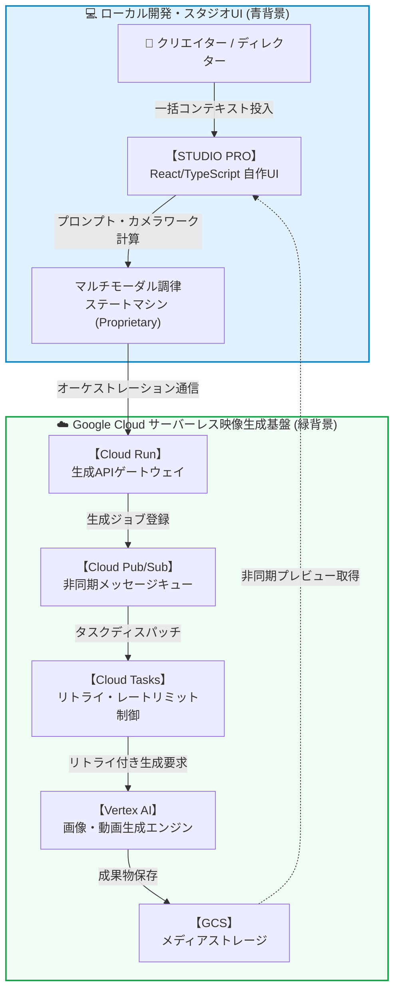

<!-- GTE_PUBLISHED: false -->

<!-- 000 タイトル定義 -->
# 【全自動映像工場】「朝起きたら動画が50本出来ている」を実現する、Google Cloud × 自作UIによる超自律型動画量産パイプライン
<!-- 000 タイトル定義 -->

<!-- 001 冒頭イメージ画像挿入エリア -->

<!-- 001 冒頭イメージ画像挿入エリア -->

<!-- 002 導入部：背景となる課題とシステム化の動機 -->
動画制作における最大の敵、それは「時間」と「精神的疲労」です。キーフレームの同期、テロップのタイミング調整、そして何よりも生成AIに対するプロンプトの調整（Prompt drift）により、1本の高品質な動画を作り上げるだけで数日間の労力が溶けていきます。「朝起きたら、視聴維持率の高い高品質なパッケージ動画が50本、全自動で完成していてほしい」。そんな怠惰な、しかし全クリエイターが抱く夢を叶えるため、私はクラウド工場を構築することにしました。
<!-- 002 導入部：背景となる課題とシステム化の動機 -->

---

<!-- 003 本記事の概要（3行まとめ） -->
> **💡 この記事の3行まとめ（忙しい人向け）**
> 1. **解決する課題**: プロンプトの破綻（Prompt drift）と、手作業による動画編集の膨大な時間的コストの完全排除。
> 2. **採用したアーキテクチャ**: 独自開発の React UI『STUDIO PRO』 × Cloud Run × Cloud Pub/Sub × Cloud Tasks × Vertex AI を統合したサーバーレス映像生成基盤。
> 3. **実証成果**: 睡眠中にプロンプトの破綻ゼロで50本の高品質ビデオパイプラインの並列自動生成に成功。
<!-- 003 本記事の概要（3行まとめ） -->


<!-- 100 🏗️ 1. アーキテクチャ概要 -->
<br><br>
## 🏗️ 1. アーキテクチャ概要

本システムは、ローカルのオーケストレーションUIとクラウド上の非同期生成基盤をシームレスに結合する対称アーキテクチャを採用しています。コアとなるプロンプト調律エンジンおよびマルチモーダル連続性ステートマシンは独自IP（社外秘）としてブラックボックス化し、圧倒的な品質と堅牢性を担保しています。


<!-- 100 🏗️ 1. アーキテクチャ概要 -->

---

<!-- 200 🎬 2. 12カット連続性保証：マルチモーダル調律ステートマシン -->
<br><br>
## 🎬 2. 12カット連続性保証：マルチモーダル調律ステートマシン

映像の尺が長くなると、AIは簡単にキャラクター設定を忘れ、シーンの連続性が崩壊します。この課題を解決するため、『STUDIO PRO』には12カットの連続性を保証するマルチモーダル調律ステートマシン（ブラックボックスIP）が搭載されています。


本記事では**「英国発祥のカレーがなぜ国民食に？奇跡の進化録」**という歴史ドキュメンタリーを例に解説します。

ここでは、「レオナルド・ダ・ヴィンチの古文書 ＆ ジブリ風の工房アニメーション（Leonardo da Vinci Ancient Manuscript & Ghibli-esque Workshop Animation）」という高度な映像美を狙います。古い航海図、セピア色のインクのハッチング、製図用コンパス、虫眼鏡、そして丸眼鏡をかけた若い見習い技師が、湯気の立つカレーライスの設計図を分析しているシーンです。

CUT EDITOR PROでは、カメラアングル（ワイド、クローズアップ、ミディアム）、ダイナミックなマルチパネル分割、Ken Burns効果のペーシング、およびテロップのテキストトークンが、すべて統合された生成ペイロードとしてコンパイルされます。これにより、丸眼鏡の少年というキャラクターの同一性を保持したまま、異なるアングルへのトランジションを破綻なく連続させることが可能になります。

以下は、このマルチモーダルペイロードを表現するTypeScriptのインターフェース・スキーマの一部（概念）です。

```typescript
// 💡 マルチモーダル生成コンテキストの型定義（一部抜粋）
export interface MultimodalPayload {
  readonly episodeId: string;
  readonly targetScene: number;

  // 🎥 カメラ＆トランジション制御
  cameraDirectives: {
    baseAngle: 'wide' | 'medium' | 'close_up' | 'dutch_angle';
    kenBurns: {
      scaleStart: number;
      scaleEnd: number;
      durationMs: number;
    };
    transitionStyle: 'cut' | 'crossfade' | 'luma_wipe';
  };

  // 📝 コンテキスト注入と状態維持
  continuityState: {
    characterId: string;         // 'young_apprentice_with_round_glasses'
    temporalAnchorImgId: string; // 直前カットの末尾フレームを参照
    promptConditioning: string;  // 動的にコンパイルされたプロンプト
  };
}
```
<!-- 200 🎬 2. 12カット連続性保証：マルチモーダル調律ステートマシン -->

---

<!-- 300 🎨 3. 画風マトリックス検証とプロンプト・インスペクタ -->
<br><br>
## 🎨 3. 画風マトリックス検証とプロンプト・インスペクタ

単一の脚本から最適な世界観を導き出すため、自動スタイル注入とパレット温度調整を備えたマルチ画風マトリックス比較エンジンを実装しています。


プロンプトインスペクタは、ネガティブプロンプトのガードレールと連携し、AI特有の「指の崩れ」や「画風のブレ」を事前に検知・補正します。これにより、歴史的カットであっても「ゆる浮世絵・戯画調」や「アール・ヌーヴォー調」といった多様な表現を安定して検証できます。これらの高度なプロンプトコンディショニングは完全に隠蔽されており、使用者はワンクリックで高品質な絵コンテマトリックスを得られます。
<!-- 300 🎨 3. 画風マトリックス検証とプロンプト・インスペクタ -->

---

<!-- 400 ⚡ 4. スケーラビリティと耐障害性：非同期キューと指数バックオフ -->
<br><br>
## ⚡ 4. スケーラビリティと耐障害性：非同期キューと指数バックオフ

50本の動画を一気に生成しようとすると、必ず発生するのがAPIのレート制限（`429 Too Many Requests`）や一時的なサービスダウンです。

この問題を解決するため、アーキテクチャでは Cloud Pub/Sub と Cloud Tasks を活用した非同期キューシステムを採用しています。
生成リクエストはまず Pub/Sub にバッファリングされ、Cloud Tasks によってディスパッチされます。レート制限に抵触した場合は、指数バックオフ（Exponential Backoff）を用いた再試行が自動で行われます。また、各生成ジョブには一意の冪等性キー（Idempotency Key）が付与されているため、ネットワークエラーでリトライが発生しても、同じ動画が重複して生成・課金されるのを防ぐ強固な回復ポリシーが敷かれています。
<!-- 400 ⚡ 4. スケーラビリティと耐障害性：非同期キューと指数バックオフ -->

---

<!-- 500 ⚠️ ハマりポイント注意 -->
<br><br>
## ⚠️ ハマりポイント注意

超大量生成の裏側には、いくつかの深い技術的罠が存在します。

:::note warn
**映像ディフュージョンにおける時間的ジッター（Temporal Jitter）とオーディオドリフト**
Vertex AI で複数カットの映像を生成し結合する際、フレーム間の時間的ジッターにより、音声（BGM・ナレーション）とテロップの同期が徐々にズレるオーディオドリフト現象が発生します。これを防ぐため、各動画セグメントのタイムスタンプを厳密に管理し、UI側のステートマシンでミリ秒単位の強制再同期（Keyframe Re-sync）を行う必要があります。
:::

:::note warn
**アスペクト比のセーフゾーンクロッピング（1:1 から 9:16 / 16:9 への展開）**
生成エンジンから出力される 1:1 のマスター映像を YouTube Shorts (9:16) や 通常の動画 (16:9) に展開する際、単純なクロップでは主要キャラクターが見切れてしまいます。マスター映像生成時のプロンプトには、被写体を中央の「セーフゾーン」に配置するよう強力な重み付けを行い、クロップしても破綻しない構図を強制するテクニックが必須となります。
:::
<!-- 500 ⚠️ ハマりポイント注意 -->

---

<!-- 600 🏁 まとめと今後の展望 -->
<br><br>
## 🏁 まとめと今後の展望

今回構築した『STUDIO PRO』と Google Cloud の統合システムにより、クリエイターが寝ている間に、プロンプトの破綻を一切起こさず50本の動画パイプラインを完走させる「完全自律型工場」が実現しました。

手動でのプロンプト微調整やキーフレーム編集といった単純作業から解放され、ディレクターは「どのような世界観を届けるか」という本質的なクリエイティビティにのみ集中できます。クラウドインフラの堅牢性と、独自IPとしての調律エンジンの組み合わせがもたらすこの圧倒的な生産性は、映像制作の未来を大きく変えるポテンシャルを秘めています。
<!-- 600 🏁 まとめと今後の展望 -->
