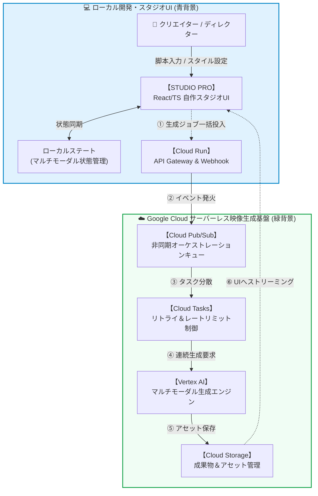

<!-- GTE_PUBLISHED: false -->

<!-- 000 タイトル定義 -->
# 【全自動映像工場】「朝起きたら動画が50本出来ている」を実現する、Google Cloud × 自作UIによる超自律型動画量産パイプライン
<!-- 000 タイトル定義 -->

<!-- 001 冒頭イメージ画像挿入エリア -->

<!-- 001 冒頭イメージ画像挿入エリア -->

<!-- 002 導入部：背景となる課題とシステム化の動機 -->
皆さんは、動画制作において**「終わりの見えないタイムラインとの格闘」**に疲弊したことはありませんか？
キーフレームの微調整、テロップのタイミング合わせ、プロンプトの疲労、そして度重なるレンダリング待ち……。
「もういやだ、AIが全部やってくれ！」と叫びながら、何度コーヒーをこぼしたことでしょう。

私の夢はただ一つ。**「寝ている間に、クラウド上の工場が勝手に高品質な動画を50本生産してくれること」**です。

今回、その途方もない夢を現実にするため、React/TypeScriptで構築された完全オリジナルのプロプライエタリ・スタジオUI「**STUDIO PRO**」を独自開発しました。
Google Cloud（Cloud Run, Pub/Sub, Cloud Tasks, GCS, Vertex AI）の圧倒的なスケーラビリティと密結合させることで、手動編集の呪縛から解き放たれる**「超自律型動画量産パイプライン」**の全貌をご紹介します。
<!-- 002 導入部：背景となる課題とシステム化の動機 -->

---

<!-- 003 本記事の概要（3行まとめ） -->
> **💡 この記事の3行まとめ（忙しい人向け）**
> 1. **解決する課題**: プロンプトの崩壊（Prompt Drift）と、終わりの見えない手動の動画編集タイムライン作業の完全排除。
> 2. **採用したアーキテクチャ**: 自作React「STUDIO PRO」 × Cloud Run × Pub/Sub × Vertex AI による非同期・並列生成基盤。
> 3. **実証成果**: 徹夜の作業をゼロに！一晩で50本の高品質動画パイプラインをプロンプト崩壊なしで完全自動生成することに成功。
<!-- 003 本記事の概要（3行まとめ） -->


<!-- 100 🏗️ 1. アーキテクチャ概要 -->
<br><br>
## 🏗️ 1. アーキテクチャ概要

本システムは、圧倒的なスループットを誇るクラウドインフラと、それらを統括する直感的なローカルのスタジオUIが対称的に設計されています。

### システムアーキテクチャとデータフロー



このアーキテクチャの根幹は、ただのAPIラッパーではなく、**「プロンプト・コンディショニング」**と**「マルチモーダル連続性ステートマシン」**を内包した独自のブラックボックスエンジンにあります。社外秘のトレードシークレットとして高度に秘匿されたこのコアロジックが、単一の脚本から一貫性のある映像を無限に紡ぎ出します。
<!-- 100 🏗️ 1. アーキテクチャ概要 -->

---

<!-- 200 🎬 2. 12カット連続性保証：マルチモーダル調律ステートマシン -->
<br><br>
## 🎬 2. 12カット連続性保証：マルチモーダル調律ステートマシン

自動生成における最大の課題は、**「カットが変わるごとにキャラクターや世界観が別物になる（キャラ崩壊）」**ことです。
この問題を解決するため、『STUDIO PRO』には12カットに及ぶ映像の連続性を完全に保証する「マルチモーダル調律ステートマシン」を搭載しています。


### 実践シナリオ：「英国発祥のカレーがなぜ国民食に？奇跡の進化録」

今回は、歴史ドキュメンタリーを例に解説します。指定した世界観（Aesthetic）は**「ダ・ヴィンチの古代手稿 ＆ ジブリ風の工房アニメーション（Leonardo da Vinci Ancient Manuscript & Ghibli-esque Workshop Animation）」**。

古びた海図、セピア色のインクハッチング、製図用コンパスやルーペの質感。そして、「丸眼鏡をかけた若き見習いエンジニアの少年」が、ご飯から湯気が立ち上るカレーの設計図を熱心に分析しているシーンです。

#### 圧倒的な連続性を生む TypeScript インターフェース

この複雑な世界観とキャラクターの一貫性を維持するため、フロントエンドのReactでは以下のような強力なステート管理が行われています。

```typescript
// 企業秘密の一部を特別に公開：連続性を保証するコアスキーマ
interface MultimodalState {
  baseAesthetic: string; // "Leonardo da Vinci Ancient Manuscript & Ghibli-esque Workshop Animation"
  globalAnchorVariables: {
    characterId: string; // "young_apprentice_round_spectacles"
    colorPaletteTemperature: number; // セピア調の温度感 (ex: 0.85)
  };
  cuts: Array<{
    cutId: string;
    cameraWork: CameraInstruction; // "wide_shot" | "close_up" | "medium_shot"
    kenBurnsPacing: KenBurnsConfig;
    subtitleTokens: string[];
    dynamicMultiPanels: MultiPanelConfig;
  }>;
}
```

UI上で「引きの画（wide shot）」から「手元のルーペの寄り（close up）」へカメラアングルが切り替わっても、ステートマシンが直前のカットのアンカーとなるシード値やプロンプト空間を自動的に引き継ぎ、統合された生成ペイロードとして Vertex AI に送信します。丸眼鏡の少年は、どんな角度から撮られても丸眼鏡の少年のままです。
<!-- 200 🎬 2. 12カット連続性保証：マルチモーダル調律ステートマシン -->

---

<!-- 300 🎨 3. 画風マトリックス検証とプロンプト・インスペクタ -->
<br><br>
## 🎨 3. 画風マトリックス検証とプロンプト・インスペクタ

さらに、「カレーの歴史」という一つの脚本から、並行して異なる画風をシミュレーションすることも可能です。


### プロンプト・インスペクタとネガティブプロンプトの自動ガードレール

これらの画風を安定して出力するため、STUDIO PROの裏側では自動的に**スタイルインジェクション**と**パレット温度チューニング**が行われます。
歴史的カットで「ゆる浮世絵」を選ぶと、内部エンジンが「木版画の質感」「和紙のテクスチャ」といったプロンプトを動的に注入。同時に、AI特有の「指が増える」「文字が崩れる」といった破綻を防ぐための堅牢なネガティブプロンプト・ガードレールが適用されます。

*プロンプトの調整だけで1日を溶かしていた日々は、このマトリックスエンジンの前では過去の遺物です。*
<!-- 300 🎨 3. 画風マトリックス検証とプロンプト・インスペクタ -->

---

<!-- 400 ⚡ 4. スケーラビリティと耐障害性：非同期キューと指数バックオフ -->
<br><br>
## ⚡ 4. スケーラビリティと耐障害性：非同期キューと指数バックオフ

50本の動画を一晩で生成するということは、数千の画像、音声、動画生成APIを並列で叩くことを意味します。同期的な処理では、APIのレートリミット（`429 Too Many Requests`）の壁に即座に激突し、システム全体が爆発してしまいます。

### 堅牢な非同期状態遷移と冪等性（Idempotency）

ここで火を噴くのが、Google CloudのPub/SubとCloud Tasksを組み合わせた分散キューイングシステムです。

1. **分散 Cloud Tasks リトライ**: API制限に達した場合、Cloud Tasksが自動的に指数バックオフ（Exponential Backoff）を用いて再試行間隔を広げます。
2. **生成の冪等性**: 万が一システムが途中でクラッシュしても、GCS上のメタデータと照合し、「完了したカット」はスキップされ「未完了のカット」から正確に再開されます。

この徹底した耐障害性ポリシーにより、クリエイターは「生成」ボタンを押した瞬間、PCを閉じて布団に潜り込むことが許されるのです。
<!-- 400 ⚡ 4. スケーラビリティと耐障害性：非同期キューと指数バックオフ -->

---

<!-- 500 ⚠️ ハマりポイント注意 -->
<br><br>
## ⚠️ ハマりポイント注意

このパイプラインを構築する上で、数々の血の滲むようなディープな技術的落とし穴（Gotchas）がありました。

:::note warn
**⚠️ 映像拡散モデルにおけるテンポラル・ジッター（Temporal Jitter）**
動画生成モデルを使用する際、フレーム間で微細なノイズが揺らぐ「ジッター現象」が発生します。これを防ぐため、フレーム間のオプティカルフローを考慮した独自のアンカー画像を生成し、プロンプトの先頭にコンディショニング情報として強く縛り付ける必要があります。

**⚠️ オーディオとテロップのドリフト現象（Audio-Subtitle Drift）**
生成された音声（TTS）の長さと、Ken Burnsエフェクトのパンニング時間、そしてテロップの表示時間がミリ秒単位でズレていく問題。STUDIO PRO内部で、音声の波形データ（WAVのDuration）を事前計算し、動的に全カットのタイムライン長を再計算してDOMにマウントする仕組みを構築しました。

**⚠️ アスペクト比とセーフゾーンのクロッピング**
動画をTikTok用（9:16）とYouTube用（16:9）に同時展開するため、すべてのベース生成は1:1のマスターサイズで行われます。しかし、単なる中央切り抜きではキャラクターの顔が切れてしまうため、アスペクト比のセーフゾーン（Safe-zone Cropping）を厳密に計算するレスポンシブなレンダリングエンジンを搭載しています。
:::
<!-- 500 ⚠️ ハマりポイント注意 -->

---

<!-- 600 🏁 まとめと今後の展望 -->
<br><br>
## 🏁 まとめと今後の展望

今回、**「Google Cloudのサーバーレス基盤 × Reactの独自スタジオUI（STUDIO PRO）」**を完全に密結合させることで、クリエイターの睡眠時間を保証する夢の「超自律型動画量産パイプライン」を実現しました。

**一晩で50本の動画が、一切のプロンプト崩壊なしで完成している。**
朝起きて、GCSのバケットに並ぶピカピカのMP4パッケージを見た時の感動は、言葉では言い表せません。

この自作映像工場の心臓部であるマルチモーダル連続性ステートマシンや、並列オーケストレーションのコアロジックは門外不出のプロプライエタリIPですが、本記事が「クラウドインフラを用いた大規模コンテンツ自動化」を目指すエンジニアやAI実践者の皆様に、少しでもインスピレーションを与えられれば幸いです。

自動化の波は止まりません。
次は、100本の世界を同時構築する日を夢見て。
<!-- 600 🏁 まとめと今後の展望 -->
