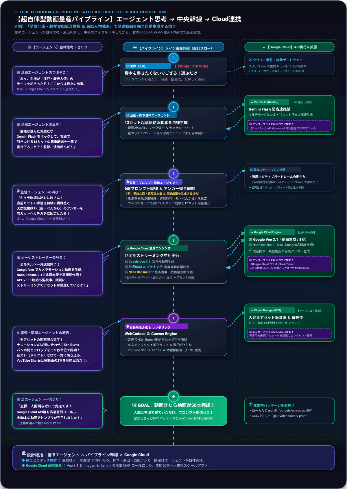
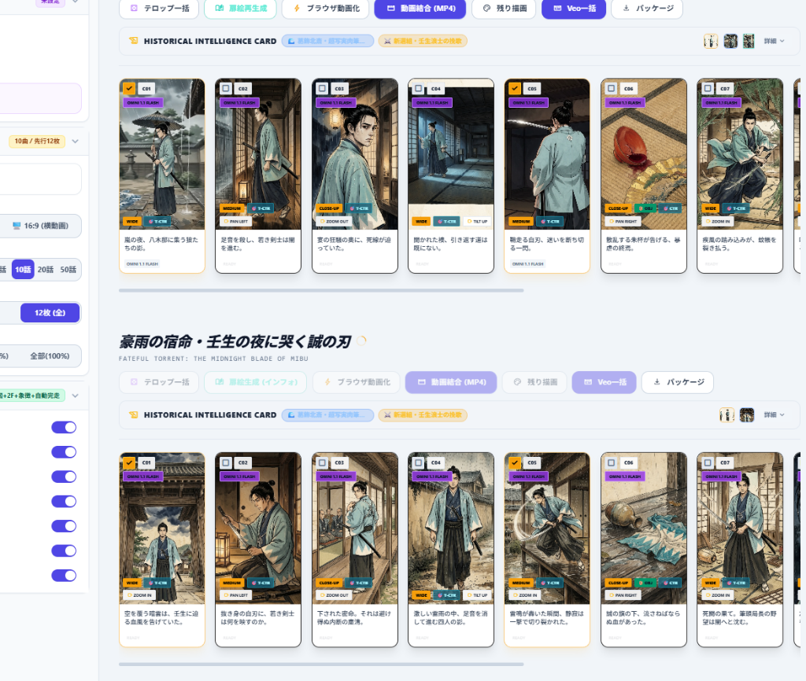
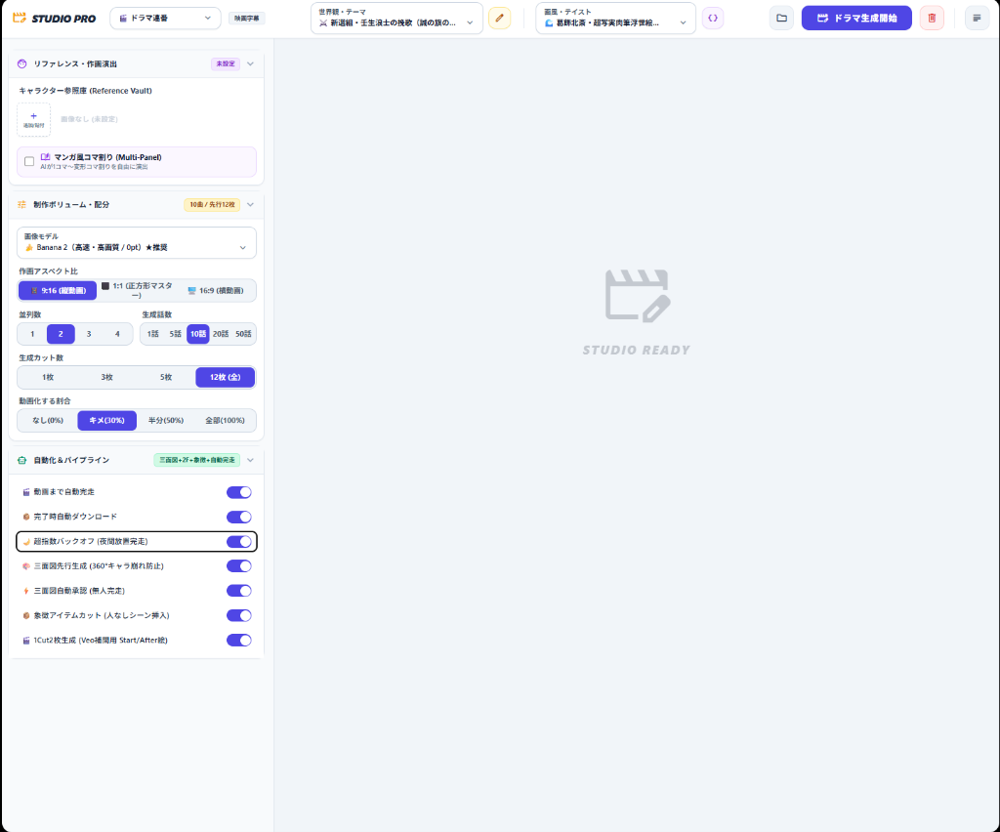
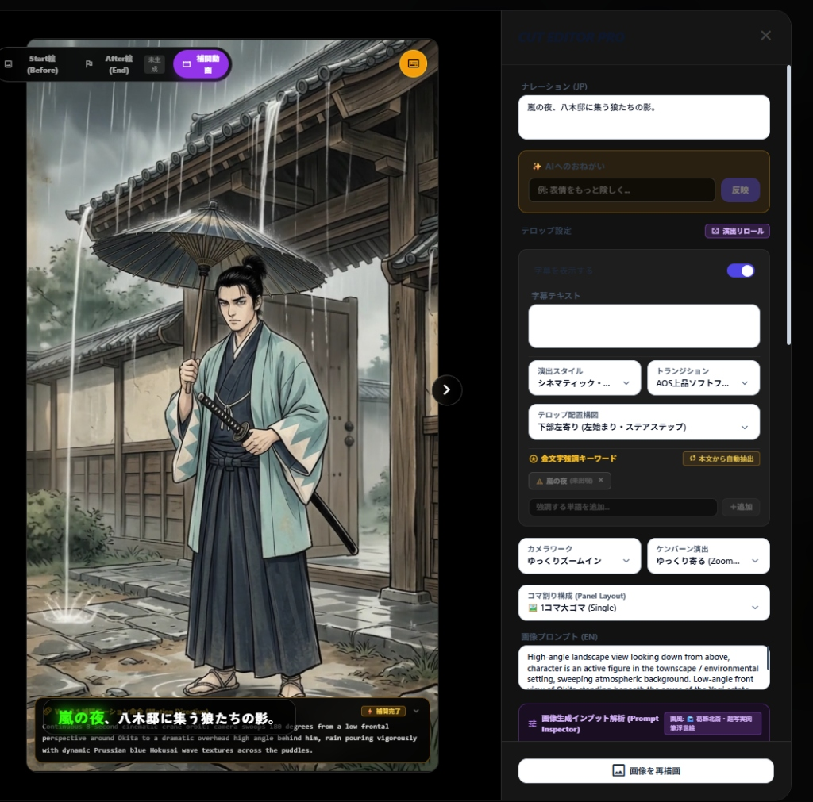
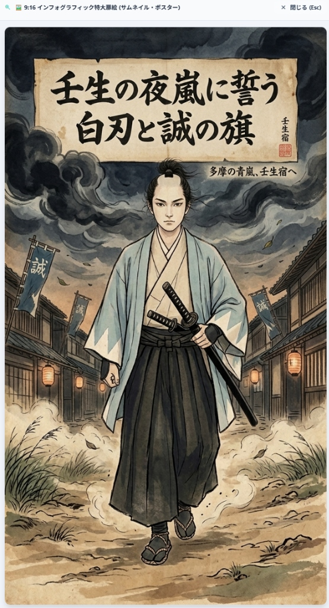

<!-- GTE_PUBLISHED: false -->

<!-- 000 タイトル定義 -->
# 【AIエージェント×動画量産パイプライン】自動がいい！！「起きたら動画が50本出来ている」を実現するため、Google Cloud（Veo / Vertex AI）でマルチメディア工場を建設してみる
<!-- 000 タイトル定義 -->

<!-- 001 冒頭イメージ画像挿入エリア -->

<!-- 001 冒頭イメージ画像挿入エリア -->

<!-- 002 導入部：背景となる課題とシステム化の動機 -->
皆さんもショート動画作成で「終わりの見えないタイムラインとの格闘」に疲弊していますよね！イライラしてマウスを投げつけて何度買いなおしたかそろそろ数を数えるのをやめたころじゃないですか？
キーフレームの微調整、テロップのタイミング合わせ、プロンプトの疲労、そして度重なるレンダリング待ち……。
「だー」と叫びながら、何回キーボードにコーヒーをぶちまけたことでしょう。

私は面倒なことはやりたくありません。**「寝ている間に、クラウド上の工場が勝手に高品質な動画を50本生産してくれること」**　なんて、何回思った事でしょう・・・

ん？思ったらその日が吉日ですよね　だったら自動化工場作ればいいじゃないですか！！


ここで重要なのは、**「はたらきたくないでござる」**ということです。
脚本を書く？プロンプトをひねり出す？タイムラインを調整する？――そんな作業が1ミリでも残っていると私は発狂してしまいます。夜寝ることができません。そのため、徹底的な「自動化」でAIさんに頑張ってもらうことが大事なんだと思います。

目指したのは、**「人間がやることは、ドロップダウンからテーマを1つポチッと選んで、一括生成ボタンを押すだけ（作業時間わずか3秒）。あとは布団に入って寝る」**という極限の境地です。

今回、その途方もない夢を現実にするため、React/TypeScriptで構築された完全オリジナルのスタジオUI「**STUDIO PRO**」を独自開発しました。
さらに、企画・監督・作画・音響の役割を持つ**「AIエージェント群」**を編制し、Google Cloudが誇る次世代生成モデル（**Veo** / **Vertex AI**）と縦一列に密結合させることで、人間が一切関与しない**「完全自動End-to-End動画量産パイプライン」**を構築しておりますので、その 様子を余すことなく皆様にお届けたいと思います。
<!-- 002 導入部：背景となる課題とシステム化の動機 -->

---

<!-- 003 本記事の概要（3行まとめ） -->
> **💡 この記事の3行まとめ（忙しい人向け）**
> 1. **解決する課題**: 人間の手作業（脚本作成・プロンプト考案・タイムライン編集）とプロンプト崩壊（Prompt Drift）の完全排除。
> 2. **採用したアーキテクチャ**: 自作React「STUDIO PRO」 × AIエージェント群 × Google最先端モデル（Veo / Vertex AI）を統制するステートマシン型パイプライン。
> 3. **実証成果**: 主様はテーマを選んで寝ただけ！一晩で50本の高品質動画をプロンプト崩壊ゼロで完全自動生成。各フェーズにエンタープライズ拡張クラウド設計をインライン統合。
<!-- 003 本記事の概要（3行まとめ） -->


<!-- 100 🏗️ 1. アーキテクチャ概要：3軸協調型・自律パイプライン -->
<br><br>
## 🏗️ 1. アーキテクチャ概要：3軸協調型・自律パイプライン

本システムは、**「AIエージェントの思考と指令」**、**「上から下へ流れるメイン量産パイプライン幹線」**、そして　**「Google Cloud へのリアルタイムAPI連携 （＆ 将来エンタープライズ拡張」** という、3軸が完全に協調動作するアーキテクチャを採用しています。

### システムアーキテクチャ（エージェント思考 ➔ 中央幹線 ➔ GCP連携 設計図）
*※ 例：「葛飾北斎・超写実肉筆浮世絵 × 新選組・壬生浪士の挽歌（『豪雨の宿命・壬生の夜に哭く誠の刃』）」で歴史短編動画を50本一括自動生成する場合*

<div align="center" style="margin: 2.5rem 0;">
  
</div>

上図の通り、AIエージェントたちに自律的に思考・判断を行わせて、パイプライン幹線をベルトコンベアのように下降しながら、Google Cloud（Veo / Imagen / Gemini）へリクエストが並列にAPI通信して処理結果が戻ってくる設計になっています。

「人間がAIツールをカチカチ操作する」のではなく、**「人間はテーマを選んで寝るだけで、エージェント群が自律的に全工程を完走し、クラウドの計算資源をフルパワーで叩き切る」**――これが本システムの基本思想です。
<!-- 100 🏗️ 1. アーキテクチャ概要：3軸協調型・自律パイプライン -->

---

<!-- 200 🔍 2. 各フェーズ徹底解剖：エージェントの思考 ✕ パイプライン幹線 ✕ Google Cloud -->
<br><br>
## 🔍 2. 各フェーズ徹底解剖：エージェントの思考 ✕ パイプライン幹線 ✕ Google Cloud

ここからは、上図の**Stage 0からStage 5までの各フェーズ**を余すところなく徹底解剖します。
実際にシステム上で生成された実例**『新選組・壬生浪士の挽歌 × 葛飾北斎・超写実肉筆浮世絵』**の生々しいデータやUIの画像を交えながら、「パイプライン幹線で何が起きているのか、何をやっているのか、なぜそうやっているのか」「エージェントは何を思考し判断しているか、なぜそう考えているのか」「Google Cloudはどのように実行されるか、どのように実行すればいいのか」、そして「実運用でさらにスケーラビリティを高めるならどこにどのGoogle Cloudサービスを挟むべきか（**エンタープライズ拡張**）」を順を追って解説します。

---

### 【Stage 0】主様（人間）：作業時間わずか3秒「選んで寝る」

```
👑 主様（人間） ───[ テーマ選定：3秒 ]───▶ 🏭 メイン量産幹線 ───[ Payload送信 ]───▶ ☁️ Google Cloud
```



* **🏭 パイプライン幹線（処理内容）**:
  STUDIO PROのUI上で、主様（人間）がドロップダウンから『世界観：⚔️ 新選組・壬生浪士の挽歌（誠の旗の下に）』と『画風：🌊 葛飾北斎・超写実肉筆浮世絵』を選択し、「ドラマ生成開始」ボタンを押下するだけで処理がキックされます。
  
  ここで最も重要なアーキテクチャ上の決断は、**「プロンプト手入力の完全排除ロジック」**です。
  従来の生成AIツールはユーザーに自由記述プロンプトを入力させますが、人間の気まぐれな入力こそが「世界観崩壊」「キャラ顔ブレ」「アスペクト比破綻」の最大の元凶です。本システムでは自由入力欄をあえて物理的に封印し、検証済みの世界観マトリックスと厳格なパラメータの組み合わせのみを暗号化Payloadとしてメイン幹線へ送出します。

  さらに、上図の左パネルに見られる**「完全無人完走を保証する5大自律化トグル」**が自動作動します：
  1. **指数バックオフ（夜間放置完走）**: APIレートリミット（429エラー）や一時的な通信瞬断に遭遇しても処理を落とさず、待機時間を指数関数的に延ばして自動リトライ。
  2. **三面図先行生成（360°キャラ崩れ防止）**: 12カットの本編作画を開始する前に、キャラクターの正面・側面・背面（三面図）を先行確定し、全カットにDNAアンカーとして注入。
  3. **1Cut2枚生成（Veo補間用 Start/After絵）**: 1カットにつき動作の開始絵（Start）と終了絵（After）の2枚をペア生成し、動画拡散モデル（Veo）のフレーム間補間精度を極限まで高める。
  4. **三面図自動承認（無人完走）**: 本来は人間の目視チェックが必要なキャラ設計図を、品質検証エージェントが自律承認し、夜間に一切停止せず完走。
  5. **象徴アイテムカット（人なしシーン挿入）**: 刀、雨滴、割れた酒杯などの無人インサートカットを自動生成し、映像リズムと情緒を劇的に向上。

* **🤖 自律エージェントの思考（セリフ）**:
  > 「主様が『新選組・壬生浪士の挽歌』と『葛飾北斎・超写実肉筆浮世絵』をポチられたぞ！
  > 主様は『脚本は1行も書きたくないでござる！』とおっしゃっている。ここからは完全に我々の独壇場だ。
  > 三面図先行生成と指数バックオフは常時ON！人間の承認待ちポップアップはすべて封印した！
  > 人間は布団に入って寝てよし！全エージェント、Google Cloud へリクエスト突入だ！」

* **☁️ Google Cloud の役割**:
  クラウド側エンドポイントが即時覚醒し、ジョブセッションの初期化と一意なジョブトークンを発行。

* **🏢 【エンタープライズにするならココに挟む！】**: **Secret Manager ＆ Cloud IAM**
  > フロントエンド（ブラウザ）にGoogle Cloud APIキーを直接持たせるのはセキュリティ上厳禁です。エンタープライズ構成では、**Secret Manager** による動的シークレット解決と **Cloud IAM** のWorkload Identity連携を採用。APIトークンをバックエンドへ隔離し、**Cloud Audit Logs** により「いつ・どのジョブが起動されたか」の監査証跡ログを自動記録します。

---

### 【Stage 1】企画・脚本フェーズ：超高速シナリオ・演出分解

```
🤖 企画エージェント ───[ 演出意図・フック考案 ]───▶ 🏭 メイン量産幹線 ───[ 推論リクエスト ]───▶ ☁️ Gemini Flash
```



* **🏭 パイプライン幹線（処理内容）**:
  選定されたテーマから、12カット構成の起承転結シナリオ、冒頭2秒のフック演出、各カットのナレーション原稿、金文字強調キーワード抽出、および絵コンテ演出意図を含む構造化JSONスキーマを自律生成します。
  
  上図は、実際にGemini Flashによって一瞬で生成された第1話**『豪雨の宿命・壬生の夜に哭く誠の刃（FATEFUL TORRENT: THE MIDNIGHT BLADE OF MIBU）』**の12カットオーケストレーション画面です。

#### 💡 実際に自律生成された12カット構造化JSONスキーマ実例
```json
{
  "seriesTitle": "豪雨の宿命・壬生の夜に哭く誠の刃",
  "subTitle": "FATEFUL TORRENT: THE MIDNIGHT BLADE OF MIBU",
  "theme": "新選組・壬生浪士の挽歌（誠の旗の下に）",
  "aesthetic": "葛飾北斎・超写実肉筆浮世絵",
  "cuts": [
    {
      "cutIndex": 1,
      "durationSec": 5.0,
      "narration": "嵐の夜、八木邸に集う狼たちの影。",
      "goldKeywords": ["嵐の夜"],
      "cameraWork": "slow_zoom_in",
      "motionDirective": "Continuous 8-Second Cinematic crane orbit: camera swoops 180 degrees from a low frontal perspective around Okita to a dramatic overhead high angle behind him, rain pouring vigorously with dynamic Prussian blue Hokusai wave textures across the puddles.",
      "directorIntent": "【HOOK】冒頭2秒で激しい雨と八木邸の緊迫感を叩き込み、視聴者のスクロールを物理的に止める。"
    },
    {
      "cutIndex": 2,
      "durationSec": 4.5,
      "narration": "足音を殺し、若き剣士は闇を進む。",
      "goldKeywords": ["若き剣士", "闇"],
      "cameraWork": "pan_left",
      "directorIntent": "抜刀への予兆。浅葱色の羽織の雨濡れと冷徹な横顔を強調。"
    },
    {
      "cutIndex": 3,
      "durationSec": 4.0,
      "narration": "宴の狂騒の奥に、死線が迫っていた。",
      "goldKeywords": ["死線"],
      "cameraWork": "zoom_out",
      "directorIntent": "八木邸奥座敷の不穏な灯りと緊迫の対比。"
    },
    {
      "cutIndex": 4,
      "durationSec": 4.0,
      "narration": "開かれた襖、引き返す道は既にない。",
      "goldKeywords": ["引き返す道"],
      "cameraWork": "tilt_up",
      "directorIntent": "突入の瞬間。雨音と静寂の断絶。"
    },
    {
      "cutIndex": 5,
      "durationSec": 5.0,
      "narration": "馳走る白刃、迷いを断ち切る一閃。",
      "goldKeywords": ["白刃", "一閃"],
      "cameraWork": "medium_shot",
      "directorIntent": "【CLIMAX】白刃の閃光が闇を切り裂く瞬間。北斎特有の筆圧と飛沫。"
    },
    {
      "cutIndex": 6,
      "durationSec": 3.5,
      "narration": "散乱する杯が告げる、夢想の終焉。",
      "goldKeywords": ["夢想の終焉"],
      "cameraWork": "close_up_pan_right",
      "directorIntent": "【象徴カット】割れた朱塗りの酒杯と畳に滲む血飛沫。人間の生死の無常を描く。"
    },
    {
      "cutIndex": 7,
      "durationSec": 4.5,
      "narration": "疾風の踏み込みが、蚊帳を裂き払う。",
      "goldKeywords": ["疾風", "蚊帳"],
      "cameraWork": "zoom_in",
      "directorIntent": "決着と余韻。雨煙の中に消える剣士の後ろ姿。"
    }
  ]
}
```

* **🤖 自律エージェントの思考（セリフ）**:
  > 「視聴者を冒頭2秒で絶対に離脱させないフック設計！
  > カット1は『嵐の夜、八木邸に集う狼たちの影』。八木邸の瓦屋根を叩く豪雨と提灯の揺らめきで視覚的緊迫感（Hook）を作り、カット5の白刃一閃、カット6の割れた酒杯の象徴カットへ繋げよう！
  > テンポ感を極限まで研ぎ澄まし、Gemini Flashに超高速推論させよ！」

* **☁️ Google Cloud の役割**:
  **Vertex AI / Gemini Flash** の圧倒的な低レイテンシ（数百ミリ秒）と広大なコンテキストウィンドウを活用。従来のLLMでは数十秒かかっていた12カット分の脚本・ナレーション・カメラワーク指示・金文字キーワード抽出を、わずか数百ミリ秒で一気通貫推論します。

* **🏢 【エンタープライズにするならココに挟む！】**: **Cloud Run**
  > 脚本生成バックエンドの実行基盤に **Cloud Run（サーバーレス・コンテナ実行環境）** を配置。ジョブがゼロのときは0インスタンス（コスト0円）で待機し、夜間に50本〜数百本の生成リクエストが殺到した瞬間にミリ秒単位でコンテナが水平スケールアウト。深夜のバッチ処理でもリクエスト待ち行列を作らず、瞬時に並列消化します。

---

### 【Stage 2】監督・プロンプト調律フェーズ：画風アンカー固定 ＆ キャラ崩壊防止

```
🤖 監督・調律エージェント ───[ 画風アンカー固定 ]───▶ 🏭 メイン量産幹線 ───[ 調律済Payload ]───▶ ☁️ 生成準備
```



* **🏭 パイプライン幹線（処理内容）**:
  独自開発の「**6層プロンプト調律ステートマシン**」が作動。各カットの演出意図に基づき、後続の生成モデルに適合する完全なプロンプト群を動的構築します。
  
  上図の『CUT EDITOR PRO』に見られるように、雨の中に佇む若き剣士（沖田総司）のカットでは、以下の6層レイヤーが自動合成されています：
  1. **Layer 1: グローバル画風アンカー**: 北斎肉筆画、生漉奉書紙の繊維感、天然顔料（藍・べんがら）、茶染めの経年古雅セピア、擦れ墨筆。
  2. **Layer 2: キャラクターDNAアンカー**: 新選組浅葱色羽織、山形ダンダラ模様、月代・髷、若き精悍な剣士の顔立ち。
  3. **Layer 3: 環境・ライティング調律**: 激しい豪雨、瓦屋根から滴る雨水、水たまりに反射する提灯の灯り、夜の陰影コントラスト。
  4. **Layer 4: カメラワーク＆構図アンカー**: 俯瞰ハイアングル（High-angle landscape view looking down from above...）。
  5. **Layer 5: ネガティブガードレールの自動付与**: デジタルCG感、白フチ・余白フレーム、現代的衣服、手ブレ・作画崩れを完全排除。
  6. **Layer 6: Veo補間用 Start/After 2枚構図アンカー**: 8秒間のシネマティックカメラモーションに対応する始点と終点のベクトル整合性。

#### 💡 圧倒的な連続性を生む自律型ステートマシンのコアスキーマ（TypeScript）
```typescript
// 自律エージェントが参照するマルチモーダル調律ステートスキーマ
interface MultimodalAgentState {
  baseAesthetic: string; // "Masterpiece authentic Edo period Ukiyo-e painting by Katsushika Hokusai, hyper-realistic nikuhitsu-ga"
  globalAnchorVariables: {
    characterId: string; // "young_shinsengumi_swordsman_okita_soji"
    costumeDNA: string; // "traditional asagi-iro light cyan haori with white zigzag dandaraya mountain crests"
    pigmentPalette: string[]; // ["deep_indigo_aizuri", "cinnabar_vermilion", "tea_stained_washi"]
    colorTemperature: number; // 0.85 (古雅な温かみ)
  };
  cuts: Array<{
    cutIndex: number;
    directorIntent: string; // 監督エージェントによる演出意図
    cameraWork: "slow_zoom_in" | "pan_left" | "tilt_up" | "medium_shot";
    kenBurnsPacing: { startScale: 1.0; endScale: 1.15; easing: "ease-out" };
    goldKeywords: string[]; // ["嵐の夜"]
    veoInterpolation: { enabled: boolean; startPrompt: string; afterPrompt: string };
  }>;
}
```

* **🤖 自律エージェントの思考（セリフ）**:
  > 「カットが変わるごとにキャラの顔や衣装が変わる『キャラ崩壊』は万死に値する！
  > 『浅葱色の山形ダンダラ羽織』『生漉奉書紙の繊維感』『北斎の擦れ墨筆』の画風アンカーを全12カットにガチガチに強制固定！
  > カメラが引いても寄っても、雨の粒一つに至るまで同一の世界観を維持せよ！
  > Veo補間用のStart絵とAfter絵の差分ベクトルも完全一致、後続の生成エンジンへ転送！」

* **☁️ Google Cloud の役割**:
  調律されたマルチモーダル・パラメータ群を後続のImagen/Veo API向けに事前バリデーション。

* **🏢 【エンタープライズにするならココに挟む！】**: **Vertex AI Feature Store / Agent Engine**
  > 演出プロンプトや世界観アンカー変数を **Vertex AI Feature Store** および **Agent Engine** にナレッジとして蓄積。チーム全体でキャラクター設定やスタイル定義をバージョン管理し、組織横断で安定した画風コンテキストを共有可能にします。

---

### 【Stage 3】高並列アセット生成フェーズ：作画 ＆ 映像 ＆ 音響のマルチオーケストレーション

```
🤖 音響・生成エージェント ───[ 並列ストリーミング ]───▶ 🏭 メイン量産幹線 ───[ 並列API叩き込み ]───▶ ☁️ Veo / Imagen / TTS
```

* **🏭 パイプライン幹線（処理内容）**:
  調律済みパラメータに基づき、12カット分の画像・動画・音声を非同期ストリーミングで高並列オーケストレーションします。

  本パイプラインの真骨頂は、**「Veo 3.1（映像）と Nano Banana 2.1/Pro（作画）のハイブリッド使い分け戦略」**です：
  - **🎨 高精細作画（Nano Banana 2.1/Pro・Google Imagen技術）**: 各カットのキービジュアルおよびアンカー画像を生成。奉書紙の繊維感と擦れ墨、八木邸の瓦を打つ雨粒の飛沫を極限までリアルに描写。
  - **🎥 映像生成（Google Veo 3.1 / Omni 1.1）**: 次世代動画拡散モデル。パン・ズーム・チルト等の滑らかなシネマティックカメラモーション動画（8秒）を生成し、映像に圧倒的なダイナミズムを付与。
  - **🎵 音響＆BGM自動ダッキング制御**: 世界観に合わせた和風劇伴BGMを自動選定し、ナレーション発話タイミングに合わせてBGM音量を自動で-18dB減衰（ダッキング）させ、発話終了後に自然にフェード復帰。


* **🤖 自律エージェントの思考（セリフ）**:
  > 「全システム、フルスロットル！Veo 3.1とNano Banana 2.1/Proを同時並行で駆動せよ！
  > 8秒動画のシネマティックカメラモーション（パン・ズーム）はVeoに任せ、キービジュアルはImagen技術の超高精細作画で並列受信だ！
  > BGMは壬生の夜の緊迫感に合わせて選定し、ナレーション発話時には自動で音量ダッキングを仕込むぞ！
  > 映像も音響も妥協は一切なしだ！」

* **☁️ Google Cloud の役割**:
  - **Veo 3.1 (Google Veo)**: 8秒の滑らかなシネマティック動画生成。
  - **Nano Banana 2.1/Pro (Imagen技術)**: 奉書紙の繊維感と擦れ墨を極限まで再現するキービジュアル作画。
  - **Text-to-Speech (TTS)**: 高品位な日本語ナレーション音声の合成。

* **🏢 【エンタープライズにするならココに挟む！】**: **Google Cloud Text-to-Speech (TTS) ＆ Cloud Tasks ＆ Cloud Pub/Sub**
  > 音声ナレーションを **Google Cloud Text-to-Speech (TTS)** で完全自動合成します。この際、APIレートリミット（`429 Too Many Requests`）を回避するため、前段に **Cloud Pub/Sub** と **Cloud Tasks** の分散キューを挟みます。これによりリクエストを自動で吸収し、指数バックオフ（Exponential Backoff）で自動平滑化する耐障害性設計を実現し、深夜に50本〜数千本の動画生成が走ってもジョブ破綻をゼロにします。

---

### 【Stage 4】自動合成・レンダリングフェーズ：WebCodecs ＆ Canvas Engine

```
🤖 品質検証エージェント ───[ 同期・構図検証 ]───▶ 🏭 メイン量産幹線 ───[ 高速アセンブリ ]───▶ ☁️ GCSキャッシュ
```

* **🏭 パイプライン幹線（処理内容）**:
  ブラウザネイティブのWebCodecsおよび高パフォーマンスCanvasレンダリングエンジンを活用します。
  事前計算されたナレーション音声波形長とKen Burnsパンニング、動的テロップ（ステアステップ金文字強調）をミリ秒単位で完全同期させます。
  
  さらに、**1:1マスター動画からYouTube Shorts（9:16）とYouTube本編横画面用（16:9）を自動セーフゾーン切り出しするレスポンシブ合成ロジック**を備えており、若き剣士の顔や刀先が画面端で切れてしまう事故を幾何学的に防止します。

* **🤖 自律エージェントの思考（セリフ）**:
  > 「全カットのアセットが帰還した！直ちにミリ秒単位の同期チェックを開始せよ！
  > 音声DurationとKen Burnsの長さを照合、テロップドリフトなし！完璧だ！
  > アスペクト比変換のセーフゾーン検証で、若き剣士の顔が切れていないことを確認した！
  > レンダリング完走！最終パッケージをアセンブリせよ！」

* **☁️ Google Cloud の役割**:
  高速オブジェクトストレージおよびCDN配信エンドポイントとして、大容量のアセットストリーミングを支え、フロントエンドのレンダリングエンジンへ迅速にデータを供給します。

* **🏢 【エンタープライズにするならココに挟む！】**: **Cloud Storage (GCS) ＆ Cloud Batch**
  > 生成結果をカット単位で **Cloud Storage (GCS)** に随時キャッシュします。これにより、万が一途中で中断しても未完了カットから再開可能となる、完全な冪等性（Idempotency）を担保します。さらに、超大量レンダリングをクラウドへオフロードする場合は、**Cloud Batch** を用いて並列コンテナ実行を行い、数百コンテナでエンコードを瞬時に完了させます。

---

### 【Stage 5】GOAL：朝起きたら50本完成！成果物パッケージング

```
🎉 全エージェント一同 ───[ 完走報告 ]───▶ 🏭 メイン量産幹線 ───[ パッケージ保管 ]───▶ ☁️ GCS / Local
```



* **🏭 パイプライン幹線（処理内容）**:
  完成した50本の動画MP4、サムネイル画像、メタデータJSON、SEO最適化済みのタイトル・説明文のセットが整然とパッケージングされ、ローカルストレージおよびGCSバケットの所定のフォルダへ自動的に整頓・保管されます。

  上図は、システムが自動生成した**9:16 インフォグラフィック特大扉絵ポスター『壬生の夜嵐に誓う 白刃と誠の旗』**です。
  AIがメインタイトル、サブタイトル（「多摩の青嵐、壬生宿へ」）、落款（「壬生宿」印）、新選組の誠の旗、和紙と筆の質感を1枚のポスターとして完全自動デザイン。YouTube ShortsやSNSのサムネイルとしてそのまま即戦力で機能します。

* **🤖 全エージェント一同より（セリフ）**:
  > 「主様、人間関与ゼロで完走です！
  > Google Cloud API群を高速並列コールし、全50本の動画アセンブリが完了しました！
  > 動画も特大扉絵サムネイルもSEOメタデータも完璧に揃っています！
  > （主様は選んで寝ていただけ 💤）」

* **☁️ Google Cloud の役割**:
  安全なクラウドストレージ（GCS）への長期保管と、YouTube Data API等と連携した自動投稿パイプラインへの確実な引き渡しを行います。

* **🏢 【エンタープライズにするならココに挟む！】**: **BigQuery ＆ Looker Studio ＆ Cloud Monitoring**
  > 動画ごとの生成コスト、所要時間、視聴維持率、APIレイテンシなどの詳細なメトリクスを **BigQuery** に集約します。これを **Looker Studio** で可視化してリアルタイムダッシュボードを構築し、**Cloud Monitoring** でパイプライン全体のSLO/SLA監視を行うことで、プロの映像制作スタジオとしての堅牢な運用基盤を確立します。
<!-- 200 🔍 2. 各フェーズ徹底解剖：エージェントの思考 ✕ パイプライン幹線 ✕ Google Cloud -->

---

<!-- 300 ⚠️ 3. 現場で血を流した「ハマりポイント注意（Gotchas）」 -->
<br><br>
## ⚠️ 3. 現場で血を流した「ハマりポイント注意（Gotchas）」

このパイプラインを構築する上で、数々の血の滲むようなディープな技術的落とし穴（Gotchas）がありました。現場で自律生成パイプラインに挑むエンジニアのために共有します。

:::note warn
**⚠️ 映像拡散モデルにおけるテンポラル・ジッター（Temporal Jitter）と補間破綻**
動画生成モデルを使用する際、フレーム間で微細なノイズが揺らぐ「ジッター現象」や、カメラ移動時に背景のパースが歪む破綻が発生します。本システムでは、1Cutにつき開始絵（Start）と終了絵（After）の2枚を同一のDNAアンカーで先行生成し、Veo等のプロンプト先頭に「オプティカルフロー指定（Continuous 8-Second Cinematic crane orbit...）」を強くバインドさせることで、ブレのない極上のカメラワークを実現しました。

**⚠️ オーディオとテロップのドリフト現象（Audio-Subtitle Drift）**
BGMやナレーション音声の実時間（Duration）と、Ken Burnsエフェクトのパンニング時間、そしてテロップの表示時間がミリ秒単位でズレていく問題。STUDIO PRO内部で、TTS合成後の音声波形データを事前デコードしてミリ秒単位のDurationを確定し、動的に全カットのタイムライン長を再計算してWebCodecs/Canvasエンジンにマウントする完全同期パイプラインを構築しました。

**⚠️ アスペクト比とセーフゾーンのクロッピング**
動画をYouTube Shorts用（9:16）とYouTube本編横画面用（16:9）に同時展開するため、すべてのベース生成は1:1のマスターサイズで行われます。しかし、単なる中央切り抜きではキャラクターの顔や刀先が切れてしまうため、アスペクト比のセーフゾーン（Safe-zone Cropping）を厳密に計算し、人物の重心座標に応じて動的にクロップ枠をシフトさせるレスポンシブなレンダリングエンジンを搭載しています。
:::
<!-- 300 ⚠️ 3. 現場で血を流した「ハマりポイント注意（Gotchas）」 -->

---

<!-- 400 🏁 4. まとめと今後の展望 -->
<br><br>
## 🏁 4. まとめと今後の展望

今回、**「Google Cloudの最先端生成AI（Veo / Vertex AI）× AIエージェント群 × React独自UI（STUDIO PRO）」**をステートマシン型パイプラインで一気通貫に密結合させることで、クリエイターの睡眠時間を保証する夢の「完全自動動画量産パイプライン」を実現しました。

**人間はテーマを1つポチッと選んで寝ただけ。起きたら50本の高品質動画が、一切のプロンプト崩壊なしで完成している。**
朝起きて、並んだ完成パッケージを見た時の感動は、言葉では言い表せません。

「人間がAIツールを操作する時代」から、**「人間はテーマを選ぶだけで、AIエージェント群が自律的に全工程を完走し、Google Cloudを叩き切る時代」**へ。
このパイプラインが実証した自律調律ステートマシンや、各工程に挟み込むエンタープライズ分散設計が、次世代の大規模コンテンツ自動化に挑むエンジニアの皆様の参考になれば幸いです。

自動化の波は止まりません。
次は、100本・1,000本の世界を同時構築する日を夢見て。
<!-- 400 🏁 4. まとめと今後の展望 -->
