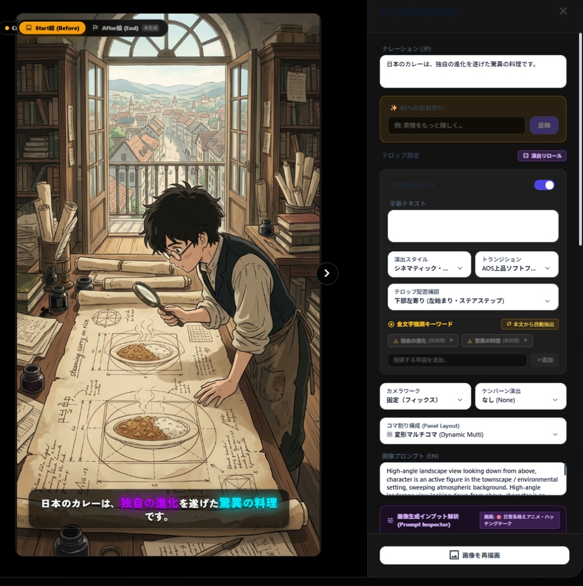
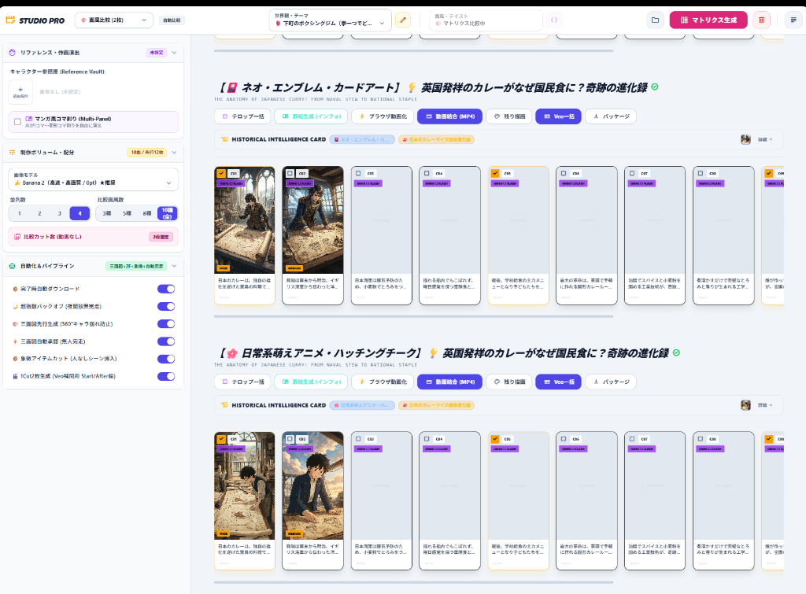
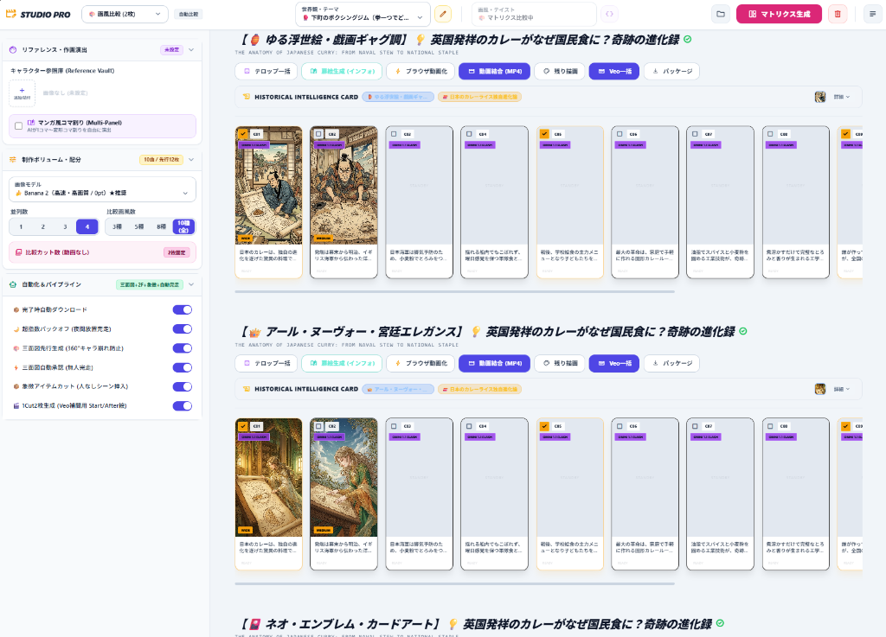

<!-- GTE_PUBLISHED: false -->

<!-- 000 タイトル定義 -->
# 【自律型マルチエージェント×動画量産パイプライン】「朝起きたら動画が50本出来ている」を実現する、Google Cloud（Veo / Vertex AI）× 自作UIによる超自律型映像工場
<!-- 000 タイトル定義 -->

<!-- 001 冒頭イメージ画像挿入エリア -->

<!-- 001 冒頭イメージ画像挿入エリア -->

<!-- 002 導入部：背景となる課題とシステム化の動機 -->
皆さんは、動画制作において**「終わりの見えないタイムラインとの格闘」**に疲弊したことはありませんか？
キーフレームの微調整、テロップのタイミング合わせ、プロンプトの疲労、そして度重なるレンダリング待ち……。
「もういやだ、AIが全部やってくれ！」と叫びながら、何度コーヒーをこぼしたことでしょう。

私の夢はただ一つ。**「寝ている間に、クラウド上の工場が勝手に高品質な動画を50本生産してくれること」**です。

ここで重要なのは、**「人間は何かを作っている気になってはいけない」**ということです。
脚本を書く？プロンプトをひねり出す？タイムラインを調整する？――そんな作業が1ミリでも残っているなら、それは「自動化」ではなくただの「手作業の内職」です。

目指したのは、**「人間がやることは、ドロップダウンからテーマを1つポチッと選んで、一括生成ボタンを押すだけ（作業時間わずか3秒）。あとは布団に入って寝る」**という極限の境地です。

今回、その途方もない夢を現実にするため、React/TypeScriptで構築された完全オリジナルのスタジオUI「**STUDIO PRO**」を独自開発しました。
さらに、監督・作画・音響の役割を持つ**「自律型マルチエージェント」**を編制し、Google Cloudが誇る次世代生成モデル（**Veo** / **Vertex AI**）と縦一列に密結合させることで、人間が一切関与しない**「超自律型End-to-End動画量産パイプライン」**を構築しました。その全貌と設計思想をご紹介します。
<!-- 002 導入部：背景となる課題とシステム化の動機 -->

---

<!-- 003 本記事の概要（3行まとめ） -->
> **💡 この記事の3行まとめ（忙しい人向け）**
> 1. **解決する課題**: 人間の手作業（脚本作成・プロンプト考案・タイムライン編集）とプロンプト崩壊（Prompt Drift）の完全排除。
> 2. **採用したアーキテクチャ**: 自作React「STUDIO PRO」 × 自律型マルチエージェント × Google最先端モデル（Veo / Vertex AI）の縦断パイプライン。
> 3. **実証成果**: 主様はテーマを選んで寝ただけ！一晩で50本の高品質動画をプロンプト崩壊ゼロで完全自動生成。各フェーズにエンタープライズ拡張クラウド設計をインライン統合。
<!-- 003 本記事の概要（3行まとめ） -->


<!-- 100 🏗️ 1. アーキテクチャ概要：3軸協調型・自律パイプライン -->
<br><br>
## 🏗️ 1. アーキテクチャ概要：3軸協調型・自律パイプライン

本システムは、**「左側：自律AIエージェントの思考と指令」**、**「中央：上から下へ流れるメイン量産パイプライン幹線」**、そして**「右側：Google Cloud へのリアルタイムAPI連携 ＆ エンタープライズ拡張」**という、3軸が完全に協調動作するアーキテクチャを採用しています。

### システムアーキテクチャ（エージェント思考 ➔ 中央幹線 ➔ GCP連携 設計図）
*※ 例：「葛飾北斎・超写実肉筆浮世絵 ＆ 鳥獣人物戯画」で歴史動画を50本一括自動生成する場合*

<div align="center" style="margin: 2.5rem 0;">
  
</div>

上図の通り、左側でAIエージェントたちが自律的に思考・判断を下し、中央のパイプライン幹線をベルトコンベアのように下降しながら、右側のGoogle Cloud（Veo / Imagen / Gemini）へリクエストが並列にAPI通信して処理結果が戻ってくる設計になっています。

「人間がAIツールをカチカチ操作する」のではなく、**「人間はテーマを選んで寝るだけで、エージェント群が自律的に全工程を完走し、クラウドの計算資源をフルパワーで叩き切る」**――これが本システムの基本思想です。
<!-- 100 🏗️ 1. アーキテクチャ概要：3軸協調型・自律パイプライン -->

---

<!-- 200 🔍 2. 各フェーズ徹底解剖：エージェントの思考 ✕ パイプライン幹線 ✕ Google Cloud -->
<br><br>
## 🔍 2. 各フェーズ徹底解剖：エージェントの思考 ✕ パイプライン幹線 ✕ Google Cloud

ここからは、上図の**Stage 0からStage 5までの各フェーズ**を深掘りします。
「パイプライン幹線で何が起きているか」「エージェントは何を思考し判断しているか」「Google Cloudはどのように実行されるか」、そして「実運用でさらにスケーラビリティを高めるならどこにどのGoogle Cloudサービスを挟むべきか（**エンタープライズ拡張**）」を順を追って解説します。
全体を通して「人間は寝るだけ」「自律エージェントの高度な協調」「Google Cloudのリソースを極限まで引き出す」設計思想が貫かれています。

---

### 【Stage 0】主様（人間）：作業時間わずか3秒「選んで寝る」

```
👑 主様（人間） ───[ テーマ選定：3秒 ]───▶ 🏭 メイン量産幹線 ───[ Payload送信 ]───▶ ☁️ Google Cloud
```

* **🏭 パイプライン幹線（処理内容）**:
  STUDIO PROのUI上で、大枠のテーマ（例：『葛飾北斎・超写実肉筆浮世絵 ＆ 鳥獣人物戯画で描く、江戸・歴史人情カレーの歴史ドキュメンタリー』）が選択され、「夜間一括生成」ボタンが押下されると、テーマ選定Payloadを暗号化生成してメイン幹線へ送出します。
  ここで特筆すべきは、**プロンプト手入力の完全排除ロジック**です。自由記述プロンプト入力欄をあえて封印することで、人間の思いつきによる世界観の破綻を物理的に防ぐ設計哲学が貫かれています。UIからの入力値は、あらかじめ厳格に定義された安全なパラメータの組み合わせのみを許容します。
* **🤖 自律エージェントの思考（セリフ）**:
  > 「おっ、主様が『江戸・歴史人情』のテーマをポチったぞ！
  > 主様は『脚本を書きたくないでござる！』とおっしゃっている。ここからは完全に我々の出番。
  > 自由入力欄などという危険な代物は見せてはならん。主様がうっかり現代の用語を混ぜて世界観が崩壊するリスクを断ち切るのだ！
  > 完璧な12カットの絵コンテを組み上げるための準備は整った。
  > 人間は布団に入って寝てよし！さあ、Google Cloud へリクエスト送信だ！」
* **☁️ Google Cloud の役割**:
  クラウド側エンドポイントが即時覚醒し、生成ジョブセッションの初期化を受理します。安全なジョブトークンを発行し、後続のAPIリクエストがセキュアなコンテキスト内で実行されることを担保します。
* **🏢 【エンタープライズにするならココに挟む！】**: **Secret Manager ＆ Cloud IAM**
  > 大規模運用においては、フロントエンドやクライアント側にAPIキーを一切持たせず、**Secret Manager** による動的シークレット解決と **Cloud IAM** のきめ細やかな権限管理を適用します。さらに **Workload Identity連携** を用いて、特定のリソース間通信のみを許可するゼロトラスト認証を実現します。ジョブ投入時の監査ログ（Cloud Audit Logs）も自動記録し、誰が・いつ・どのテーマで生成を開始したかをトレース可能にし、セキュアなパイプライン起動を担保します。

---

### 【Stage 1】企画・脚本フェーズ：超高速シナリオ・演出分解

```
🤖 企画エージェント ───[ 演出意図・フック考案 ]───▶ 🏭 メイン量産幹線 ───[ 推論リクエスト ]───▶ ☁️ Gemini Flash
```

* **🏭 パイプライン幹線（処理内容）**:
  選定されたテーマから、12カット構成の起承転結シナリオ、冒頭2秒のフック演出、各カットのナレーション原稿、金文字強調キーワード抽出、および絵コンテ演出意図を含む構造化JSONスキーマを自律生成します。
  このスキーマは、単なるテキストではなく、「画面のどこに何を配置するか」「カメラはどう動くか」「BGMのテンポはどう変化するか」といったメタデータを包含する極めてリッチなデータ構造を持っています。
* **🤖 自律エージェントの思考（セリフ）**:
  > 「視聴者を冒頭2秒で掴むフック設計がすべてだ！ここで離脱されては困る。
  > カット1は『湯気立ち上るカレーの配合図を囲む蛙の学者』から入り、視覚的違和感（Hook）を作り出そう！
  > そこからカット2〜4で江戸町人たちとの激しい論争へと展開させ、視聴者の関心を惹きつけるのだ。
  > 各カットのナレーションとテロップの金文字キーワードも完璧に設計した。
  > テンポ感を落とさず、12カットの起承転結を一気に構築するぞ。Gemini Flash、超高速推論を頼む！」
* **☁️ Google Cloud の役割**:
  **Vertex AI / Gemini Flash** の圧倒的な低レイテンシと広大なコンテキストウィンドウを活用します。数十秒かかるはずの複雑な脚本・演出構成、さらにはJSONスキーマへの構造化までをわずか数百ミリ秒で一気通貫推論し、圧倒的なスループットを実現します。
* **🏢 【エンタープライズにするならココに挟む！】**: **Cloud Run**
  > 生成バックエンドの実行基盤に **Cloud Run（サーバーレス・コンテナ実行環境）** を配置します。フロントと生成バックエンドの間に配置されることで、リクエストがゼロのときは0インスタンスで待機しコストを0円に抑えます。一方、夜間に50本〜数千本の生成ジョブが殺到した瞬間には、ミリ秒単位でコンテナが水平スケールアウトし、すべてのリクエストを捌き切るオートスケーリング構成を実現します。これにより負荷スパイクによる遅延を物理的に根絶します。

---

### 【Stage 2】監督・プロンプト調律フェーズ：画風アンカー固定 ＆ キャラ崩壊防止

```
🤖 監督・調律エージェント ───[ 画風アンカー固定 ]───▶ 🏭 メイン量産幹線 ───[ 調律済Payload ]───▶ ☁️ 生成準備
```

* **🏭 パイプライン幹線（処理内容）**:
  独自開発の「6層プロンプト調律ステートマシン」が作動します。12カット全体のキャラクターID、色彩温度、背景マテリアル、カメラワーク（Wide / Close-up / Pan）を解析し、後続の生成モデルに適合する完全なプロンプト群を動的構築します。
  特に重要なのは、和紙テクスチャ、古雅なセピア調、天然顔料の擦れ筆などの「画風アンカー変数」を12カット全域に動的インジェクションするメカニズムです。同時に、現代的CG感や手ブレ、作画崩れを排除するためのネガティブガードレールも自動付与されます。
* **🤖 自律エージェントの思考（セリフ）**:
  > 「カットが変わるごとにキャラの顔や世界観が変わる『キャラ崩壊』は万死に値する！絶対に許さん！
  > 直前カットの蛙学者の衣装アンカーと背景の和紙繊維を抽出し、次カットのカメラワーク（Wide ➔ Close-up）に合成せよ！
  > 『生漉奉書紙の繊維感』『古雅なセピア調』『天然鉱物顔料（藍・べんがら）の擦れ』の画風アンカーを全カットにガチガチに固定！
  > デジタルCG感や不自然な崩れを排除するネガティブガードレールも自動注入完了だ。これで完璧な連続性が担保される！」
* **☁️ Google Cloud の役割**:
  調律されたマルチモーダル・パラメータ群を後続の生成API向けに事前バリデーションします。パラメータの不整合や制約違反がないかを高速にチェックし、エラーを未然に防ぎます。
* **🏢 【エンタープライズにするならココに挟む！】**: **Vertex AI Feature Store / Agent Engine**
  > 演出プロンプトや世界観アンカー変数を **Vertex AI Feature Store** および **Agent Engine** にナレッジとして蓄積します。これにより、チーム全体でキャラクター設定やスタイル定義をバージョン管理し、組織横断で安定した画風コンテキストを再利用可能にするナレッジガバナンス設計を実現します。

#### 💡 圧倒的な連続性を生む自律型ステートマシンのコアスキーマ（TypeScript）

この複雑な世界観とキャラクターの一貫性を維持するため、STUDIO PROの内部では以下のようなマルチモーダル・ステートマシンが自律駆動しています。

```typescript
// 自律エージェントが参照するマルチモーダル調律ステートスキーマ
interface MultimodalAgentState {
  baseAesthetic: string; // "Masterpiece authentic Edo period Ukiyo-e by Katsushika Hokusai & Chōjū-giga"
  globalAnchorVariables: {
    characterId: string; // "anthropomorphic_kaeru_scholar_edo_merchant"
    pigmentPalette: string[]; // ["deep_indigo_aizuri", "cinnabar_vermilion", "tea_stained_washi"]
    colorTemperature: number; // 0.85 (古雅な温かみ)
  };
  cuts: Array<{
    cutId: string;
    directorIntent: string; // 監督エージェントによる演出意図
    cameraWork: CameraInstruction; // "wide_shot" | "close_up" | "pan_left"
    kenBurnsPacing: KenBurnsConfig;
    subtitleTokens: string[];
    dynamicMultiPanels: MultiPanelConfig;
  }>;
}
```



UI上で「全体の引きの画（Wide）」から「手元の古文書への寄り（Close-up）」へカメラアングルが切り替わっても、調律エージェントが直前カットのアンカー変数を自動抽出し、生成ペイロードへ動的にインジェクションします。これにより、カメラが寄っても引いても同一の世界観・同一のキャラクターが破綻なく維持されます。

---

### 【Stage 3】高並列アセット生成フェーズ：作画 ＆ 映像 ＆ 音響のマルチオーケストレーション

```
🤖 音響・生成エージェント ───[ 並列ストリーミング ]───▶ 🏭 メイン量産幹線 ───[ 並列API叩き込み ]───▶ ☁️ Veo / Imagen
```

* **🏭 パイプライン幹線（処理内容）**:
  調律済みパラメータに基づき、12カット分の画像・動画・音声を非同期ストリーミングで高並列オーケストレーションします。このパイプライン制御ロジックは、BGMの自動選定と、ナレーション発話タイミングに合わせた自動音量ダッキング（減衰）制御も統合して行い、生成完了したアセットを順次バッファへ格納します。
* **🤖 自律エージェントの思考（セリフ）**:
  > 「全システム、フルスロットル！Veo 3.1とNano Banana 2.1/Proを同時並行で駆動せよ！
  > 8秒動画のシネマティックカメラモーション（パン・ズーム）はVeoに任せ、キービジュアルはImagen技術の超高精細作画で並列受信だ。
  > BGMは江戸の情緒に合わせて選定し、ナレーション発話時には自動で音量ダッキングを仕込むぞ！
  > 映像も音響も妥協は一切なしだ！」
* **☁️ Google Cloud の役割**:
  - **🎥 映像生成（Google Veo 3.1 / Omni 1.1）**: 次世代動画拡散モデル。パン・ズーム・チルト等の滑らかなシネマティックカメラモーション動画（8秒）を生成し、映像に圧倒的なダイナミズムを与えます。
  - **🎨 高精細作画（Nano Banana 2.1/Pro・Google Imagen技術）**: 各カットのキービジュアルおよびアンカー画像を生成。奉書紙の繊維感と擦れ墨を極限まで再現するキービジュアル作画を担います。
* **🏢 【エンタープライズにするならココに挟む！】**: **Google Cloud Text-to-Speech (TTS) ＆ Cloud Tasks ＆ Cloud Pub/Sub**
  > 音声ナレーションを **Google Cloud Text-to-Speech (TTS)** で完全自動合成します。この際、APIレートリミット（`429 Too Many Requests`）を回避するため、前段に **Cloud Pub/Sub** と **Cloud Tasks** の分散キューを挟みます。これによりリクエストを自動で吸収し、指数バックオフ（Exponential Backoff）で自動平滑化する耐障害性設計を実現し、大量生成時でもジョブ破綻をゼロにします。





---

### 【Stage 4】自動合成・レンダリングフェーズ：WebCodecs ＆ Canvas Engine

```
🤖 品質検証エージェント ───[ 同期・構図検証 ]───▶ 🏭 メイン量産幹線 ───[ 高速アセンブリ ]───▶ ☁️ GCSキャッシュ
```

* **🏭 パイプライン幹線（処理内容）**:
  ブラウザネイティブのWebCodecsおよび高パフォーマンスCanvasレンダリングエンジンを活用します。事前計算されたナレーション音声波形長とKen Burnsパンニング、動的テロップをミリ秒単位で完全同期させます。さらに、1:1マスター動画からYouTube Shorts（9:16）とYouTube本編横画面用（16:9）を自動セーフゾーン切り出しするレスポンシブ合成ロジックを備えています。
* **🤖 自律エージェントの思考（セリフ）**:
  > 「全カットのアセットが帰還した！直ちにミリ秒単位の同期チェックを開始せよ！
  > 音声DurationとKen Burnsの長さを照合、テロップドリフトなし！完璧だ！
  > アスペクト比変換のセーフゾーン検証で、蛙学者の顔が切れていないことを確認した！
  > レンダリング完走！最終パッケージをアセンブリせよ！」
* **☁️ Google Cloud の役割**:
  高速オブジェクトストレージおよびCDN配信エンドポイントとして、大容量のアセットストリーミングを支え、フロントエンドのレンダリングエンジンへ迅速にデータを供給します。
* **🏢 【エンタープライズにするならココに挟む！】**: **Cloud Storage (GCS) ＆ Cloud Batch**
  > 生成結果をカット単位で **Cloud Storage (GCS)** に随時キャッシュします。これにより、万が一途中で中断しても未完了カットから再開可能となる、完全な冪等性（Idempotency）を担保します。さらに、超大量レンダリングをクラウドへオフロードする場合は、**Cloud Batch** を用いて並列コンテナ実行を行い、数百コンテナでエンコードを瞬時に完了させます。

---

### 【Stage 5】GOAL：朝起きたら50本完成！成果物パッケージング

```
🎉 全エージェント一同 ───[ 完走報告 ]───▶ 🏭 メイン量産幹線 ───[ パッケージ保管 ]───▶ ☁️ GCS / Local
```

* **🏭 パイプライン幹線（処理内容）**:
  完成した50本の動画MP4、サムネイル画像、メタデータJSON、SEO最適化済みのタイトル・説明文のセットが整然とパッケージングされ、ローカルストレージおよびGCSバケットの所定のフォルダへ自動的に整頓・保管されます。
* **🤖 全エージェント一同より（セリフ）**:
  > 「主様、人間関与ゼロで完走です！
  > Google Cloud API群を高速並列コールし、全50本の動画アセンブリが完了しました！
  > 動画もサムネイルもSEOメタデータも完璧に揃っています！
  > （主様は選んで寝ていただけ 💤）」
* **☁️ Google Cloud の役割**:
  安全なクラウドストレージ（GCS）への長期保管と、YouTube Data API等と連携した自動投稿パイプラインへの確実な引き渡しを行います。
* **🏢 【エンタープライズにするならココに挟む！】**: **BigQuery ＆ Looker Studio ＆ Cloud Monitoring**
  > 動画ごとの生成コスト、所要時間、視聴維持率、APIレイテンシなどの詳細なメトリクスを **BigQuery** に集約します。これを **Looker Studio** で可視化してリアルタイムダッシュボードを構築し、**Cloud Monitoring** でパイプライン全体のSLO/SLA監視を行うことで、プロの映像制作スタジオとしての堅牢な運用基盤を確立します。
<!-- 200 🔍 2. 各フェーズ徹底解剖：エージェントの思考 ✕ パイプライン幹線 ✕ Google Cloud -->

---

<!-- 300 ⚠️ 3. 現場で血を流した「ハマりポイント注意（Gotchas）」 -->
<br><br>
## ⚠️ 3. 現場で血を流した「ハマりポイント注意（Gotchas）」

このパイプラインを構築する上で、数々の血の滲むようなディープな技術的落とし穴（Gotchas）がありました。現場で自律生成パイプラインに挑むエンジニアのために共有します。

:::note warn
**⚠️ 映像拡散モデルにおけるテンポラル・ジッター（Temporal Jitter）**
動画生成モデルを使用する際、フレーム間で微細なノイズが揺らぐ「ジッター現象」が発生します。これを防ぐため、フレーム間のオプティカルフローを考慮したキーフレームアンカー画像を生成し、Veo等のプロンプト先頭にコンディショニング情報として強くバインドさせる必要があります。

**⚠️ オーディオとテロップのドリフト現象（Audio-Subtitle Drift）**
BGMやナレーション音声の長さと、Ken Burnsエフェクトのパンニング時間、そしてテロップの表示時間がミリ秒単位でズレていく問題。STUDIO PRO内部で、音声の波形データ（Duration）を事前計算し、動的に全カットのタイムライン長を再計算してWebCodecs/Canvasエンジンにマウントする仕組みを構築しました。

**⚠️ アスペクト比とセーフゾーンのクロッピング**
動画をYouTube Shorts用（9:16）とYouTube本編横画面用（16:9）に同時展開するため、すべてのベース生成は1:1のマスターサイズで行われます。しかし、単なる中央切り抜きではキャラクターの顔が切れてしまうため、アスペクト比のセーフゾーン（Safe-zone Cropping）を厳密に計算するレスポンシブなレンダリングエンジンを搭載しています。
:::
<!-- 300 ⚠️ 3. 現場で血を流した「ハマりポイント注意（Gotchas）」 -->

---

<!-- 400 🏁 4. まとめと今後の展望 -->
<br><br>
## 🏁 4. まとめと今後の展望

今回、**「Google Cloudの最先端生成AI（Veo / Vertex AI）× 自律型マルチエージェント × React独自UI（STUDIO PRO）」**を一気通貫で密結合させることで、クリエイターの睡眠時間を保証する夢の「超自律型動画量産パイプライン」を実現しました。

**人間はテーマを1つポチッと選んで寝ただけ。起きたら50本の高品質動画が、一切のプロンプト崩壊なしで完成している。**
朝起きて、並んだ完成パッケージを見た時の感動は、言葉では言い表せません。

「人間がAIツールを操作する時代」から、**「人間はテーマを選ぶだけで、AIエージェント群が自律的に全工程を完走し、Google Cloudを叩き切る時代」**へ。
このパイプラインが実証した自律調律ステートマシンや、各工程に挟み込むエンタープライズ分散設計が、次世代の大規模コンテンツ自動化に挑むエンジニアの皆様の参考になれば幸いです。

自動化の波は止まりません。
次は、100本・1,000本の世界を同時構築する日を夢見て。
<!-- 400 🏁 4. まとめと今後の展望 -->
