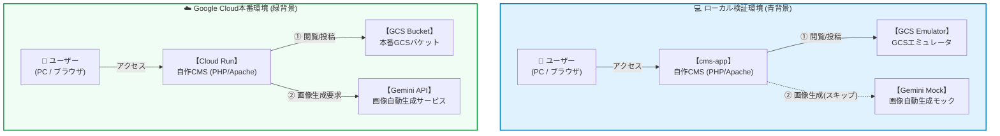

<!-- GTE_PUBLISHED: true -->

<!-- 000 タイトル定義 -->
# 【お財布にやさしい💛】Cloud Run × GCSで作る「ほぼ月額完全0円」のサーバーレスCMS ＆ Gemini自動画像生成
<!-- 000 タイトル定義 -->

<!-- 001 冒頭イメージ画像挿入エリア -->

<!-- 001 冒頭イメージ画像挿入エリア -->

<!-- 002 導入部：背景となる課題とシステム化の動機 -->
アクセスが月に１，２件しかない私のポエムブログの運営において、最も頭を悩ませるのが「データベース（Cloud SQLなど）の固定費」です。アクセスがほとんどなく、常に閑古鳥がセッションを奏でているのに、月額約1,500円程度の固定費が私の懐を悩ませ続けます。

そのため、この「データベース代金の捻出」課題を解決するため、データベース自体を完全に排除し、**「Cloud Run × Google Cloud Storage (GCS) 直結型 JSON/Markdown自作CMS」**を導入することで、インフラ維持コストを「ほぼ月額０円」に抑え込む超モダンなサーバーレスブログを実現したいと思います。
<!-- 002 導入部：背景となる課題とシステム化の動機 -->

---

<!-- 003 本記事の概要（3行まとめ） -->
> **💡 この記事の3行まとめ（忙しい人向け）**
> 1. **解決する課題**: アイドル時間であっても発生し続ける高価なデータベース固定費の削減。
> 2. **採用したアーキテクチャ**: GCS SDKを用いてJSONとMarkdownを直接読み書きする超軽量な自作フラットファイルCMS、および Gemini によるアイキャッチ自動生成（約6円/枚）。
> 3. **実証成果**: ローカル環境（エミュレータ）でのバケット自動初期化およびテスト投稿を即座にパス。
<!-- 003 本記事の概要（3行まとめ） -->


<!-- 100 🏗️ 1. アーキテクチャ概要 -->
<br><br>
## 🏗️ アーキテクチャ概要
<!-- 100 🏗️ 1. アーキテクチャ概要 -->


<!-- 102 システム全体構成の解説 -->
### システム構成図（データフローと対称設計）

「ローカル検証環境（青）」と「Google Cloud本番環境（緑）」を、同じコードで動くようにしています。
<!-- 102 システム全体構成の解説 -->

<!-- 103 システムアーキテクチャ図（Mermaid） -->



<!-- 103 システムアーキテクチャ図（Mermaid） -->

---

<!-- 104 コアロジックの抜粋と解説 -->
### 💫 GCS直接保存とGemini自動画像生成のコアロジック

このブログではデータベースを使わず、全記事の管理用インデックス（投稿日時・タイトル・画像パス等のリスト）を **GCS上の単一ファイル（`posts.json`）** として保存・管理しています。

執筆者は私1人のため、同時書き込みの競合などを心配する必要性は通常不要ですが、複数デバイスからの同時ログインや、**「万が一このポエムブログが超絶大バズりして100人のライターを雇用するような緊急事態に陥った場合など」** 、後から保存した人のデータで前のアクションが上書き消去される事故（ロストアップデート）が発生してしまうことを懸念しないわけにもいきません。

これを防ぐため、GCSが持つ世代番号（generation）チェック機能を活用した「楽観的ロック（412 Precondition Failed検知と自動リトライ・再マージ）」を組み込んでいきます。

また、投稿時にはGeminiの画像生成モデル **`gemini-3.1-flash-lite-image` (Gemini Enterprise Agent Platform / 旧称 Vertex AI)** APIを呼び出し、アイキャッチ画像を自動生成する仕掛けも同梱しています。（※テキスト解析・翻訳には最新の `gemini-3.7-flash`、画像自動生成には `gemini-3.1-flash-lite-image` をそれぞれ役割分担して活用します）

:::note warn
**⚠️ ハマりポイント注意：`gemini-3.1-flash-lite-image` (Gemini Enterprise Agent Platform / 旧称 Vertex AI) の呼び出し仕様**
*(※本仕様は執筆時点・現時点の提供形態に基づくものです。将来的に `us-central1` や `asia-northeast1` 等のリージョンエンドポイントへ展開される可能性があります)*

現時点で Gemini Enterprise Agent Platform (旧称 Vertex AI) 上の画像生成モデル `gemini-3.1-flash-lite-image` を呼び出す際、`locations/us-central1` などのリージョンエンドポイントを指定すると `404 NOT_FOUND` エラーになる場合があります。
現時点の仕様では **`locations/global` (グローバルエンドポイント)** 限定で提供されているため、APIキー不要な Google Cloud サービスアカウント認証で呼び出す際は、エンドポイントの場所指定を `global` に設定してください：

```bash
# ⭕ 成功するグローバルエンドポイントの記述例
https://aiplatform.googleapis.com/v1/projects/${PROJECT_ID}/locations/global/publishers/google/models/gemini-3.1-flash-lite-image:generateContent
```
:::

<!-- 104 コアロジックの抜粋と解説 -->

---
<!-- 104.5 セクション1導入課題・動機解説 -->
### ちなみに今回、SQLiteを捨ててGCS直結フラットファイル構成にしております。※なぜLitestreamを諦めたか

当初は流行のSQLiteをGCSにデプロイしてバックグラウンドレプリケーション（Litestream等）させる構成を考えていたのですが、大きな課題が内在していることに気付いて断念いたしました。。。

1. **SQLite+Litestreamの限界**: ファイルDB+バックグラウンドレプリケーションで行けるやろ！！！と、世間一般でもこの考え方が紹介されており、私も当初そのノリで考えていたのですが、作っている途中で、書き込み後にLitestreamがGCSへWAL（ログ）をバックグラウンド同期する必要があり、リクエスト終了後もCPUを維持する「CPU常時割り当て（`--no-cpu-throttling`）」が必要になることに気付きました。
Noスロットリングを設定しないと、レスポンス返却と同時にコンテナのCPUがフリーズし、同期が中断してデータ消失リスクがあります。しかし、記事保存のためCPU常時割り当てにすると、Cloud Runの仕様上リクエスト完了後も約15分間コンテナが稼働し続け、**わずか数秒の処理に対して約15分間もの不要なCPU課金が発生し続けてしまう**という本末転倒な結論になってしまったのです😢。（いくら無料枠で収まるとはいえ、この課金構造は美しくありません）

2. **スケーラビリティの制限**: 単一ファイルのSQLiteに書き込みが発生する以上、データ破壊を防ぐには最大インスタンス数を `max-instances=1` に固定せざるを得ず、Cloud Run本来の強みである「自動水平スケールアウト」を完全に放棄することになり、ダサいにもほどがあります。

そのため、この記事ではデータベース前提の構成を完全に排除し、データを個別ファイルとして保存する**「疎結合アプローチ」**に変えています。
これによりバックグラウンド同期が不要となり、Cloud Run本来の「CPUスロットリング有効（リクエスト中のみCPU課金）」の恩恵を100%享受でき、不要なアイドリング維持コストをほぼ0秒に抑えこむことができるようになります。

<!-- 104.5 セクション1導入課題・動機解説 -->

---
<!-- 105 データベース等の技術比較の解説 -->
### データベース選定とアーキテクチャの比較検証

WordPressなどの従来の構成と、今回構築したGCS直結型自作CMSのアーキテクチャ特性の比較です。

| 評価軸 | MySQL VM (Compute Engine) | Cloud SQL (最安構成) | GCS直結型自作CMS (本構成) |
| :--- | :--- | :--- | :--- |
| **基本データモデル** | リレーショナル（VMローカル） | フルマネージドRDB | 疎結合フラットファイル（JSON/MD） |
| **コスト伸縮性 (FinOps)** | 低（VMの常時起動による固定費：約1,500円〜） | 低（DBの常時起動による固定費：約2,000円〜） | **極高（0 ⇄ N の超高速な水平スケール、アイドル時完全0円）** |
| **データ永続化 / 同期** | 手動（rsyncやcronバックアップ） | 自動（マネージド自動バックアップ） | 即時直接保存（GCS SDKによるリクエスト内書き込み） |
| **ランニングコスト** | 中（VMの定額月額料金：約1,500円〜） | 高（DB常時起動の定額料金：約2,000円〜） | **極小（定額固定費0円、GCSの無料枠〜数十円のみ）** |
| **安全対策 / メンテナンスフリー度** | 低（OSアップデートやDB障害復旧の手動保守が必要） | 高（Googleによるフルマネージドバックアップ） | **極高（DB障害ゼロ、SQLインジェクション脆弱性自体を原理的に排除）** |

<!-- 105 データベース等の技術比較の解説 -->

---

<!-- 106 GitHubリポジトリへのリンク -->

<br><br>
## 💻 ローカル環境での検証 ＆ 稼働手順

:::note info
📂 すべての設定ファイルと完全なコードはこちらのGitHubリポジトリで公開しています

👉 [**github.com/kuiswin/170-serverless-cms**](https://github.com/kuiswin/170-serverless-cms)
*(※本リポジトリのソースコードおよびスクリプトは個人・学習・検証目的でご活用いただけます。商用本番環境での利用は自己責任でお願いします。)*
:::

> ※本リポジトリのコードおよび記事のロジック構築には**生成AIを活用**しています。動作確認は行っておりますが、AI特有の誤ったコード生成（ハルシネーション）や仕様変更、意図しない不具合等が含まれる可能性があります。本番環境へ適用される場合は、セキュリティやクラウド費用（FinOps）をご自身でご確認の上、**自己責任**にてご運用ください。

* **筆者の自動公開デモ環境:**
  - 筆者のプライベートクラウド環境では、コンテナを立ち上げるだけで自動的にドメインとSSLが割り当てられる検証環境を用意しており、以下のURLから動作検証ができる状態になっています。
  - **自作ブログ・管理画面**: [https://cms-p8080-170.kuis.win/](https://cms-p8080-170.kuis.win/)
  - コンテナ環境は常に立ち上げているわけではないため、アクセス時につながらない可能性があります。

デプロイに成功すると、以下の画像のような自作ブログサービス（Serverless Journal）が立ち上がります：


<!-- 204 開発環境へのアクセス情報 -->

---

<!-- 205 コンテナ内部の構成 -->
### 📦 システム全体構成 ＆ ローカルコンテナの役割

本システムの全体データフローおよびコンテナ構成は以下の通りです。ローカル検証環境（Docker）では、本番の Cloud Run や GCS の挙動を再現するため、以下2つのコンテナが協調して動作しています。

1. **`gcs-emulator` 【サードパーティ製定番イメージ / 無改造】**:
   - **イメージ**: `fsouza/fake-gcs-server:latest`
   - **役割**: Google Cloud Storage の挙動をローカルでシミュレートするエミュレータ。
2. **`cms-app` 【独自開発 / アプリ・Web UI本体】**:
   - **イメージ**: `Dockerfile` よりローカルビルド
   - **役割**: PHP-Apache上で動作する超軽量な自作CMS。

> **💡 余談：神様との「管理画面いらんやん」論争**
> 先日参加した 催し物で、神クラスエンジニアの方と雑談した際、作成途中の記事を見てもらって感想聞いたら、**「PCから直接 `gcloud storage cp` で GCS へファイル転送すれば、管理画面（Web UI）自体を物理削除できて攻撃面ゼロ・最高にセキュアになりますよ！」** という正論でぶん殴る至極まっとうなフィードバックをいただきました。
> たしかに管理画面を捨てた「完全静的運用」にすればセキュリティは最強になります。
ええ。なりますとも。
……しかし、
スマホやブラウザからログインしてポエムを投稿し、Gemini APIがリアルタイムでアイキャッチ画像を自動生成してくれる「Web CMSとしての体験とエンジニアのロマン」があってこそ技術は面白いのです！
「神様。その案却下です！」
<!-- 205 コンテナ内部の構成 -->


<!-- 207 次のステップ（クラウド本番展開への案内）
### 🚀 次のステップ：試験環境と本番環境に展開

それでは、GoogleCloud環境にもデプロイメントを実施してみましょう。

設計思想や、一発自動デプロイスクリプトの実装方法などについては、以下の個人ブログで公開していますのでアクセスしてみてください！

👉 [**【後編：Google Cloud本番デプロイ編】本番一発自動デプロイとFinOpsコスト防衛手順はこちら（ブログ記事リンク）**](https://kuis.win/170/)
-->


<!-- 208 メディア境界線：Qiita（ローカル検証）／ 独自ブログ（本番展開） -->
<!-- このセクション以降の内容は、個人技術ブログ（kuis.win）に掲載されます -->
<!-- 208 メディア境界線：Qiita（ローカル検証）／ 独自ブログ（本番展開） -->


---

### 📂 検証用ソースコードの一括取得（事前準備）

ここまででまだデプロイが終わっていない方は、以下のコマンドを実行することで、依存ツールのインストールから検証に必要な設定ファイル群のGit取得、Docker起動まで一括でローカルに構築できますのでぜひ試してみてください。※Linux環境であれば問題なく動くと思います。

```bash
# 依存ツールのインストール (未導入の場合)
sudo apt-get update && sudo apt-get install -y docker.io docker-compose-v2 git

# 一時領域 (/tmp) へ移動してリポジトリをクローンし、作業ディレクトリへ移動
cd /tmp
git clone https://github.com/kuiswin/170-serverless-cms.git
cd 170-serverless-cms

# コンテナのビルドとバックグラウンド起動
docker compose up -d --build
```

**【実際のビルド ＆ コンテナ起動ログ画面】**  
コマンドを実行すると、Docker BuildKit により依存パッケージの自動取得、PHP-Apache コンテナイメージのビルド、および `gcs-emulator` ＋ `cms-app` の起動が全自動で進行し、数秒で緑色の `✔ Container cms-app Started` ログが表示されて完了します！


<!-- 301 ローカル検証環境の一括セットアップ -->

---


<!-- 300 🛠️ 3. 本番環境における設計基準 -->
<br><br>
## 🛠️ 本番環境における設計基準
<!-- 300 🛠️ 3. 本番環境における設計基準 -->

<!-- 301 ローカル検証環境の一括セットアップ -->
<!-- 302 本番環境における設計基準の解説 -->
本番環境で安定してCMSを稼働させ続けるためにはいろいろクリアしなければならない課題があります。

### データの配置とセキュリティ対策
従来のWebアプリケーションでは、データベースファイルを公開ディレクトリに配置する？どうする？みたいな、権限設定等でハラハラする場面が多々ありました。
しかし、今回の仕組みは、そもそもRDB（リレーショナルデータベース）を使用しないため、SQLインジェクション脆弱性の話など、どこ吹く風です。
すべてのファイル読み書きはGCS API経由でのみ安全に行われます。


### 🔑 ゼロ・クレデンシャル設計（ローカル〜本番で一切の秘密鍵を持たない設計）
このあと本番で行う、Google Cloud上でのデプロイでは、**「鍵（JSON）を作成・設定せずに本番（Cloud Run）へデプロイして動く」**構成にしています。
※エミュレーター環境では認証自体をスキップします。

- **本番環境（Cloud Run）**: アプリ側に秘密鍵コードを一切書かず（`new StorageClient([])`）、Cloud Runが連携するGoogle Cloudインフラ基盤の標準認証機構（ADC: Application Default Credentials）および内部メタデータサーバー（**`http://169.254.169.254`**）を介して、実行時に一時的なアクセス権限（1時間限定のOAuthアクセストークン）を自動取得します。

> **💡 補足：現代クラウドの「キーレス認証（ADC）」とメタデータサーバー（`169.254.169.254`）**
> 「サービスアカウントキー（JSONファイル）」をダウンロードしてサーバーに配置して・・・・と、何度もやった記憶がありますが、現在はGoogle Cloud公式でも**「長寿命なJSON鍵キーの作成自体を非推奨・禁止とする」**のがセキュリティのグローバル標準みたいです。
> 
> SDKの引数を空（`new StorageClient([])`）にして呼び出すと、Google公式SDKが①`GOOGLE_APPLICATION_CREDENTIALS`環境変数 ➔ ②ローカル認証 ➔ ③コンテナ内部の専用メタデータサーバー（**`http://169.254.169.254`**）の順で自動的に探索してくれるみたいです。
> Cloud Run上では③にヒットし、コンテナ内に秘密鍵JSONを配置することなく、Google Cloudインフラから1時間限定の短期アクセストークン（通行証）が安全に自動発行されます。これこそがいまどきのセキュリティ設計です。

### 🔒 管理者ログインのOAuth 2.0/OIDC（OpenID Connect）保護 (Googleログイン)
一般的な簡易パスワード入力フォームが公開状態だと、脆弱性スキャナーやBotの総当たり（Brute Force）攻撃の格好の餌食です。
また、Cloud RunはリクエストのたびにコールドスタートしてCPU時間を消費するため、攻撃の試行だけで財布が痛みます。

本システムでは、管理者ログインを  Google Sign-in (OpenID Connect)  方式に委ね、特定の管理者のみを受け入れるセキュリティ設計にしています。

今回いい方法を思いついたので、**「生のメールアドレス（個人情報）」はコードにも、Cloud Runの環境変数にも、ログにも、ストレージにも一切存在しないゼロトラスト設計** に成功しました。

- **GitHubソースコード**: 生のメールアドレスは1文字も書かれていません（ハードコードゼロ）。
- **デプロイ時（シェルワンライナー）**: デプロイコマンドの実行時に端末のメモリ上でハッシュ化し、ハッシュ値（`ADMIN_EMAIL_HASH`）だけを直接 Cloud Run の環境変数へ注入します。ファイルや設定への直書きは一切発生しません！

```bash
# 💡 現在のgcloudログインアカウントからメアドを自動取得し、キーボードからの手入力すらゼロで直接SHA-256ハッシュ化！
MY_EMAIL=$(gcloud config get-value account)
ADMIN_HASH=$(echo -n "${MY_EMAIL}" | tr '[:upper:]' '[:lower:]' | sha256sum | awk '{print $1}')

gcloud run deploy 170-serverless-cms \
  --image gcr.io/${PROJECT_ID}/170-serverless-cms \
  --set-env-vars "ADMIN_EMAIL_HASH=${ADMIN_HASH}" \
  --region us-central1
```

- **実行時の認証処理**: Googleログイン成功時、Googleから渡されたメールアドレスをPHPのメモリ上で瞬時に `hash('sha256', $email)` 変換し、ハッシュ値同士のみを比較判定（`hash_equals`）します。生のメールアドレスは検証の瞬間にメモリ上で破棄され、ログにもストレージにも一切残りません！

本構成では、開発者の利便性とセキュリティを両立させるため、環境変数に応じた2段階の認証モードを備えています。ローカルお試し環境では事前準備なしで即座に動作するテスト用簡易ログイン（`ADMIN_PASSWORD`）を提供し、Google Cloud環境（またはOAuth設定時）ではGoogleが暗号署名したIDトークン（JWT）の改ざん検証およびSHA-256ハッシュ照合による完全な保護へと自動で昇格する設計となっています。


ローカル開発環境ではログインボタンを押すと、簡易フォームパスワード認証画面を表示させ、


認証が成功すると、以下の管理者ダッシュボード画面になり、新規記事の投稿（AIアイキャッチ画像自動生成機能付き）および公開済み記事の削除・管理が行えるようになります。


> **💡 サーバーレス環境における「ゼロスケール ✕ ステートレス認証」の設計**
> Cloud Runはリクエストが途絶えると自動でコンテナ数を「0」にスリープ（ゼロスケール）するため、従来のサーバー側PHPファイルセッションだけに頼るとスリープのたびにログインが切れてしまいます。
> 本構成では、Google Cloud本番環境において**Googleが暗号署名したIDトークン（OIDC/JWT）を検証・保持するステートレスCookie認証**を採用し、コンテナが何度消滅・スリープ・再起動してもログイン状態をパーフェクトに維持します。
> ※補足：Cloud Runのゼロスケール（スリープ）後もHMACステートレスCookieにより7日間ログイン状態が保持されますが、Googleアカウント側の認証セッション期限（IDトークン有効期限1時間）を考慮し、長文の執筆時はこまめに保存してください。

#### 💡 認証システムの環境別詳細比較（ローカル vs 本番 Cloud Run）

開発時の利便性と本番でのセキュリティを両立するため、環境変数に応じて認証方式・セッション保持・判定ロジックが自動的に切り替わる2段階設計を採用しています。

| 比較項目 | 💻 ローカル開発環境 (Docker) | ☁️ 本番環境 (Cloud Run) |
| :--- | :--- | :--- |
| **認証方式** | 簡易フォームパスワード認証 | Googleアカウント認証 (OIDC) |
| **セッション保持場所** | **PHP標準セッション (`$_SESSION`)**<br>※`PHPSESSID` Cookie | **HMAC署名付きステートレスCookie**<br>※`cms_auth_token` Cookie |
| **管理者判定を行う場所** | **PHPサーバー側** | **PHPサーバー側** |
| **照合（比較）対象** | フォーム入力値 ⇄ 環境変数 `ADMIN_PASSWORD` | ログインしたメアドのハッシュ値 ⇄ 事前設定した管理者ハッシュ値 (`ADMIN_EMAIL_HASH`) |
| **ゼロスケール（スリープ）耐性** | ✕（1台常駐前提） | **◯（コンテナ消滅後も7日間維持 / HMAC Cookie）** |
| **個人情報の保護** | ローカル専用 | **生メアド露出ゼロ（ハッシュ値のみ保存・比較）** |

---

#### 🔹 1. ローカル開発環境（Docker）の動作
* **認証・セッション**: 事前準備なしで即座に検証できるよう、PHP標準の `$_SESSION`（`PHPSESSID` Cookie）を使用します。
* **判定ロジック**: PHPサーバー側で、入力されたパスワードと `docker-compose.yml` に設定された `ADMIN_PASSWORD`（デフォルト: `admin`）を照合します。

#### 🔹 2. 本番環境（Cloud Run）の動作
* **認証・セッション**: Cloud Run の 0件スリープ（ゼロスケール）でセッションが切れないよう、HMAC暗号署名付きのステートレスCookie（`cms_auth_token`）をブラウザへ発行・保持します。
* **判定ロジック**: Googleログインに成功すると、Googleから返されたメールアドレスをPHPがその場でハッシュ化し、デプロイ時に設定しておいた管理者のハッシュ値（`ADMIN_EMAIL_HASH`）と一致するかを照合します。生のメールアドレスはその場の判定だけで即座に破棄され、ログやファイルには一切残りません。


#### メリット：
1. 総当たり攻撃や認証バイパスの余地をインフラレベルで遮断し、Botスキャンによる無駄なCloud Run課金（FinOps上の弱点）を防ぎます。
2. 管理者自身が余分なパスワードを覚える・管理する必要がなくなり、Googleアカウント側のMFA（多要素認証）の恩恵をそのまま享受できます。


> 💡 **補足**: アプリの標準出力ログは Cloud Logging（月間50GB無料枠）へ自動集約されるため、ログ管理費用もほとんど発生しません。


<br><br>
---

### 🚨 ローカル検証の限界と、本番環境（Google Cloud）へのステップアップ

ここまでの手順で、ローカルDocker環境（エミュレータ）を使った動作検証は完了です！

ただし、ローカル環境はあくまでPC上のモック（エミュレータ）です。本物の Google Cloud API（Gemini Enterprise Agent Platform (旧称 Vertex AI)でのAI画像生成や翻訳API、本物のクラウドマネージドデータベース等）と連携した完全な動作は、実際のクラウド環境へデプロイして初めて本領を発揮します。

**ここから先は、いよいよ本物の Google Cloud 環境へデプロイしていきます！**

:::note alert
⚠️ 厳重注意 ＆ 免責事項（商用・会社の共有アカウントでの実行は絶対禁止！）

本連載で提供するデプロイおよび「クリーンアップ・自己破壊スクリプト」は、**「不要な課金を防ぐためにリソースを即座に完全更地（削除）にする」** ことを最優先で設計されています。

もし既存の商用環境や、会社・チーム共有の Google Cloud アカウント/プロジェクトで本手順を実行した場合、**既存の重要なインフラやプロダクションデータまで一括で巻き添え削除され、復旧不可能な大惨事となる危険性があります。**

- **個人専用の隔離環境で実行せよ**: 本ハンズオンを試す場合は、既存環境や会社のインフラとは **「Google Cloud アカウント（環境）自体を完全に切り離した個人専用の独立検証アカウント（Sandbox / Playground）」** を作成した上で実行してください。
- **ライセンス（完全MIT）**: 本連載のソースコードおよび構築スクリプトは、すべて **MITライセンス** です。商用・非商用問わず自由にご活用いただけます。
- **完全自己責任の原則**: 会社や本番環境で本スクリプトを流用・実行した結果、データ損失、システム障害、課金損害が発生した場合でも、**筆者（投稿者）は一切の責任を負いかねます。** すべてご自身の責任において安全設計・ご利用を行ってください。
:::


:::note warn
⚠️ クラウド破産予防：サーバーレス型以外の「常時起動型リソース」放置にご注意ください！

本連載では「アクセスが無ければ完全無料」となるよう Cloud Run 等のサーバーレス型サービスを徹底意識して設計していますが、**記事のテーマによってはサーバーレスではない常時起動型サービス（Cloud Spanner / Bigtable / AlloyDB などのデータベースインスタンス）を扱う場合もあります。**

サーバーレス型と異なり、**常時起動型サービスはアクセスがゼロでも「起動したまま放置」しているだけで時間単位で課金が発生し続けます。** 本番デプロイを試した後は、必ず各記事の最後にある「🧹 クリーンアップ・自己破壊手順」を実行し、**ご自身の責任においてリソースの削除徹底をお願いいたします！**（※万が一のクラウド破産の責任は負いかねますので、各自で予算アラートを設定するなど自己防衛してください）
:::

## 🚀 Google Cloud 共通プロビジョニング編

本番運用のベースとなるGoogle Cloudプロジェクトの設定、Artifact Registry（コンテナ保管庫）、および専用サービスアカウントの作成と最小権限の付与を自動化します。

### 共通環境変数の設定 ＆ 基本プロジェクトIDの組み立ても兼ねる
自身のアカウント環境に合わせて設定を定義し、基本プロジェクトIDを組み立てます。（※ `KEYWORD`・`APP_PREFIX`・`ARTICLE_ID` の合計長は15文字以内にしてください）

```bash
echo ""
echo ""
echo ""

# 共通環境変数の定義 (KEYWORD、APP_PREFIX、ARTICLE_IDは半角小文字英数字で、合計15文字以内 ※例:6+6+3=15文字以内)
KEYWORD="abcde"
APP_PREFIX="qm-app"
ARTICLE_ID="170"
PROJECT_NAME="Serverless CMS - ${KEYWORD}"

# プロジェクトプレフィックスと基本プロジェクトIDの自動組み立て（全自動小文字化）
PROJECT_PREFIX=$(echo "${APP_PREFIX}-${KEYWORD}-${ARTICLE_ID}" | tr '[:upper:]' '[:lower:]')
PROJECT_ID="${PROJECT_PREFIX}"

# 使用予定プロジェクトIDの表示
echo ""
echo "----------------------------------------"
echo "📌 使用予定プロジェクトID: ${PROJECT_ID}"
echo "----------------------------------------"
echo ""

# 現在存在する関連プロジェクト一覧の目視確認
echo "🔍 事前チェック：現在の既存プロジェクト一覧 ('${KEYWORD}' 関連):"
gcloud projects list --filter="projectId ~ '${KEYWORD}' OR name ~ '${KEYWORD}' OR projectId='${PROJECT_ID}'"
```

> **💡 使い回したくない・完全作り替え（新規作成）を行いたい場合**
> 
> 完全に真っ新な新しい環境で検証を行いたい場合のみ、上記の代わりに以下の行を実行して `PROJECT_ID` をタイムスタンプ付きで上書きしてください。
> 
> ```bash
> # タイムスタンプ付与でPROJECT_IDを上書き
> PROJECT_ID="${PROJECT_PREFIX}-$(date +%Y%m%d%H%M)"
> ```
> 
> *(※注意: Google Cloudの仕様上、プロジェクトを何度も新規作成・削除すると「30日間の削除保留期間」によりプロジェクト作成枠上限に達して作成不能になるリスクがあります。普段の検証は上記標準手順の既存プロジェクト使い回しを強く推奨します)*

> **💡 手持ちの特定既存プロジェクトを固定指定して使い回したい場合**
> 
> すでに作成枠上限（Quota）に達している場合や、特定の既存プロジェクト（例: `ferrous-iridium-286000` やデフォルトプロジェクト）を直接固定指定して使用したい場合は、以下の行で `PROJECT_ID` を直接上書きしてください。
> 
> ```bash
> # 手持ちの特定既存プロジェクトIDを直接固定指定
> PROJECT_ID="ferrous-iridium-286000"
> ```

> **🚨 プロジェクト作成枠上限（Quota）オーバー時のエラー表示例**
> 
> 新規プロジェクト作成時にアカウントの作成枠上限を超えている場合、以下のようなエラーメッセージが表示されます。
> 
> ```text
> ERROR: (gcloud.projects.create) Operation [create_project.global.xxx] failed: 8: The project cannot be created because you have exceeded your allotted project quota.
> - '@type': type.googleapis.com/google.rpc.QuotaFailure
>   violations:
>   - description: The project cannot be created because you have exceeded your allotted project quota.
> ```
> 
> *(※このエラーが表示された場合は、上記 Note に記載の手持ち特定既存プロジェクト指定に切り替えて実行してください)*

### Google Cloud環境の事前準備 ＆ 課金有効化（全自動ワンライナー）
直前のステップで組み立てた環境変数 `${PROJECT_ID}` を引き継ぎ、以下のワンライナーコマンドをターミナルで実行してください。
（※標準の `qm-app-abcde-170` 、タイムスタンプ付き新規プロジェクト、または特定既存プロジェクト `ferrous-iridium-286000` のいずれに設定した場合でも全自動で判定・適用されます）

```bash
bash <(curl -sSL -H 'Cache-Control: no-cache, no-store' https://raw.githubusercontent.com/kuiswin/gcp-common-tools/main/pre_flight.sh) ${PROJECT_ID}
```


💡 **実行完了時のログ出力例（正常動作時）:**

```text
----------------------------------------
⚡ 5. 課金アカウントの有効化（Link）
----------------------------------------
billingAccountName: billingAccounts/01FC3F-5320FD-B35044
billingEnabled: true
name: projects/qm-app-abcde-170/billingInfo
projectId: qm-app-abcde-170

```

### API・データアクセス監査ログの有効化 ＆ 共通リソース構築
選択したプロジェクト環境に対し、必要な Google Cloud API の有効化、GCSバケット、サービスアカウントの作成と最小権限付与を一括実行します。

```bash
# gcloud コマンドの実行パス自動読み込み
source /root/google-cloud-sdk/path.bash.inc 2>/dev/null || true

# プロジェクトIDの取得・確定
PROJECT_ID="${PROJECT_ID:-$(gcloud config get-value project 2>/dev/null)}"

# 0. 課金状態の事前チェック（休眠中の場合は自動で課金を起爆・有効化）
BILLING_ACTIVE=$(gcloud billing projects describe "${PROJECT_ID}" --format="value(billingEnabled)" 2>/dev/null | tr '[:upper:]' '[:lower:]')
if [ "${BILLING_ACTIVE}" != "true" ]; then
    echo "⚠️ 請求先アカウントが未有効（休眠状態）です。pre_flight.sh を呼び出して自動起爆します..."
    bash <(curl -sSL -H 'Cache-Control: no-cache, no-store' https://raw.githubusercontent.com/kuiswin/gcp-common-tools/main/pre_flight.sh) "${PROJECT_ID}" </dev/null
fi

# 共通環境変数の設定
# ※ 厳密に完全0円（Always Free）を死守し、GCSの無料枠適用リージョン（北米）とのクロスリージョンEgress課金を回避するため、GCS・Cloud Run双方を us-central1 に統一します。
REGION="us-central1"
SERVICE_NAME="serverless-cms"

# 名前重複を100%防止するタイムスタンプ生成
TS=$(date +%y%m%d%H%M)
BUCKET_NAME="${PROJECT_ID}-cms-data-${TS}"
MEDIA_BUCKET_NAME="${PROJECT_ID}-cms-media-${TS}"

# 現在 gcloud CLI にログインしている Google アカウントのメールアドレスを自動取得（手動入力不要）
MY_EMAIL=$(gcloud config get-value account)

# 必須APIをまとめて事前有効化（デプロイ時のY/nプロンプト回避）
gcloud services enable \
    pubsub.googleapis.com \
    run.googleapis.com \
    aiplatform.googleapis.com \
    cloudbuild.googleapis.com \
    artifactregistry.googleapis.com \
    iap.googleapis.com --quiet

# データアクセス監査ログの一括有効化（既存IAM権限を保持したまま安全にマージ・設定済み時は自動スキップ）
gcloud projects get-iam-policy "${PROJECT_ID}" --format="json" 2>/dev/null | grep -q "auditConfigs" || \
(gcloud projects get-iam-policy "${PROJECT_ID}" --format="json" | jq '.auditConfigs = [{"service":"allServices","auditLogConfigs":[{"logType":"ADMIN_READ"},{"logType":"DATA_READ"},{"logType":"DATA_WRITE"}]}]' > /tmp/iam_policy.json && \
 gcloud projects set-iam-policy "${PROJECT_ID}" /tmp/iam_policy.json --quiet >/dev/null 2>&1 || true)

# GCS バケットの作成（データ用・メディア用）
gcloud storage buckets create gs://${BUCKET_NAME} --location=${REGION} --uniform-bucket-level-access --quiet 2>/dev/null || true
# メディアバケットもUBLA（均一なアクセス制御）を有効にした状態で作成し、allUsersに閲覧認可を付与して公開します
gcloud storage buckets create gs://${MEDIA_BUCKET_NAME} --location=${REGION} --uniform-bucket-level-access --quiet 2>/dev/null || true
gcloud storage buckets add-iam-policy-binding gs://${MEDIA_BUCKET_NAME} \
    --member="allUsers" \
    --role="roles/storage.objectViewer" --quiet 2>/dev/null || true

# 専用サービスアカウントの作成と最小権限の付与 (認証の自動解決用・SA名は30文字以内)
SA_NAME="cms-sa-${TS}"
SA_EMAIL="${SA_NAME}@${PROJECT_ID}.iam.gserviceaccount.com"
gcloud iam service-accounts create ${SA_NAME} --display-name="Serverless CMS SA" --quiet 2>/dev/null || true

gcloud storage buckets add-iam-policy-binding gs://${BUCKET_NAME} --member="serviceAccount:${SA_EMAIL}" --role="roles/storage.objectAdmin" --quiet
gcloud storage buckets add-iam-policy-binding gs://${MEDIA_BUCKET_NAME} --member="serviceAccount:${SA_EMAIL}" --role="roles/storage.objectAdmin" --quiet
gcloud projects add-iam-policy-binding ${PROJECT_ID} --member="serviceAccount:${SA_EMAIL}" --role="roles/aiplatform.user" --quiet

# ビルド担当サービスアカウントへのGCS管理者権限付与（ソースコードビルド時の権限エラーを100%防止）
PROJECT_NUMBER=$(gcloud projects describe ${PROJECT_ID} --format="value(projectNumber)")
gcloud projects add-iam-policy-binding ${PROJECT_ID} --member="serviceAccount:${PROJECT_NUMBER}-compute@developer.gserviceaccount.com" --role="roles/storage.admin" --quiet || true

# OAuth 2.0 同意画面およびクライアントIDの完全自動生成（画面操作ゼロ）
# alphaコマンドの事前インストール（プロンプト回避）
gcloud components install alpha --quiet || true

# ※ 個人アカウント（@gmail.com等）の場合は Google Cloud の仕様制限により「Project must belong to an organization」
# 　 や非推奨警告が表示されますが、|| true により安全に通過します（想定通りの挙動です）。
gcloud alpha iap oauth-brands create \
    --support_email="${MY_EMAIL}" \
    --application_title="Serverless CMS" --quiet 2>/dev/null || true

gcloud alpha iap oauth-clients create \
    projects/${PROJECT_ID}/brands/${PROJECT_NUMBER} \
    --display_name="Serverless CMS Client" --quiet 2>/dev/null || true
```
<!-- 401 Google Cloud 共通プロビジョニングスクリプト -->

> **💡 セキュリティ ＆ クラウド実行基盤についての注意点**
> 
> 個人アカウント（`@gmail.com` 等）で作成したプロジェクトの場合、Google Cloudの仕様制限により以下のような非推奨警告や組織未所属エラーが表示されますが、スクリプトは `|| true` により止まることなく安全に通過します。
> 
> ```text
> WARNING: This command is deprecated and will be non-functional after the IAP OAuth Admin APIs are turned down...
> ERROR: (gcloud.alpha.iap.oauth-brands.create) INVALID_ARGUMENT: Project must belong to an organization.
> ```
> 
> 個人アカウントで構築される場合は、**上記の実行完了後に以下の簡単な Web コンソール操作（約 1分）** を行って Client ID を取得し、次のスクリプトの `GOOGLE_CLIENT_ID` 変数に入力してください。
> 
> ---
> 
> ##### 📱 個人アカウント向け OAuth クライアント ID 発行手順（最新 UI 対応）
> *(※この段階ではまだ Cloud Run の本番 URL が確定していないため、仮の URL `https://example.com` で Client ID を先行発行し、デプロイ完了後に確定した本番 URL へ更新します)*
> 
> 1. [Google Cloud Console - OAuth 同意画面](https://console.cloud.google.com/apis/credentials/consent) にアクセスし、画面の案内に沿って **「同意画面」** を作成します（アプリ名：`Serverless CMS`）。
> 2. **【重要】** OAuth同意画面の設定内にある **「テスト ユーザー」** 項目で、自身のGoogleアカウント（@gmail.com）を追加・保存します（※公開ステータスが「テスト中」の場合、テストユーザー未登録だとログイン時に `403 access_denied` エラーとなるため必須です）。
> 3. 概要画面の右上 **「OAuth クライアントを作成」** をクリックし、種類で **『ウェブ アプリケーション』** を選択します。
> 4. 『承認済みのリダイレクト URI』に一時的に仮の URL（`https://example.com`）を入力し、一番下の **「作成」** をクリックします。
> 5. 発行された **クライアント ID** と **クライアント シークレット** をコピーし、以下のコマンドで環境変数にセットして実行してください：
> 
> ```bash
> # 🔑 個人アカウント向け：取得した クライアント ID / シークレット の定義
> GOOGLE_CLIENT_ID="<YOUR_CLIENT_ID>"
> GOOGLE_CLIENT_SECRET="<YOUR_CLIENT_SECRET>"
> ```


<!-- 500 🚀 5. Google Cloud 個別リソース構築編 -->
<br><br>
## 🚀 Google Cloud 個別リソース構築編
<!-- 500 🚀 5. Google Cloud 個別リソース構築編 -->

### 📁 ソースコードの取得（リポジトリのクローン ＆ 移動）
まだリポジトリを取得していない場合や、新しいターミナルで実行する場合は、以下のコマンドを実行してソースコードを取得し、フォルダへ移動します（※前半で既にリポジトリを取得済みの場合は cd /tmp/170-serverless-cms 移動のみでOKです）：

```bash
# 一時領域 (/tmp) へ移動し、GitHubからソースコードを取得してプロジェクトフォルダへ移動
cd /tmp
git clone https://github.com/kuiswin/170-serverless-cms.git 170-serverless-cms 2>/dev/null || true
cd 170-serverless-cms 2>/dev/null || true
```

### ☁️ Cloud Run への一括ビルド ＆ デプロイ
プロジェクトフォルダの直下で以下のスクリプトを一括実行し、Cloud Run へデプロイします。

```bash
# gcloud コマンドのパス自動読み込み
source /root/google-cloud-sdk/path.bash.inc 2>/dev/null || true

# プロジェクトID・サービス名・リージョン・関連リソース名の定義
# ※ 直前で設定した環境変数を優先継承し、未定義の場合のみ gcloud CLI から自動取得
PROJECT_ID="${PROJECT_ID:-$(gcloud config get-value project 2>/dev/null)}"
SERVICE_NAME="serverless-cms"
REGION="us-central1"

# 直前で作成された最新のバケット名およびサービスアカウントを自動検出
BUCKET_NAME=$(gcloud storage buckets list --project=${PROJECT_ID} --format="value(name)" 2>/dev/null | grep cms-data | tail -n 1)
MEDIA_BUCKET_NAME=$(gcloud storage buckets list --project=${PROJECT_ID} --format="value(name)" 2>/dev/null | grep cms-media | tail -n 1)
SA_EMAIL=$(gcloud iam service-accounts list --project=${PROJECT_ID} --format="value(email)" 2>/dev/null | grep cms-sa | tail -n 1)

# ログイン中Googleアカウントのメールアドレスを自動取得（手動入力不要）
MY_EMAIL=$(gcloud config get-value account)

# メールアドレスのSHA-256ハッシュ値を自動生成（生メールアドレスの露出を防ぐセキュリティ手順）
ADMIN_EMAIL_HASH=$(echo -n "${MY_EMAIL}" | tr '[:upper:]' '[:lower:]' | sha256sum | awk '{print $1}')
# ※Mac環境の場合は shasum を使用: ADMIN_EMAIL_HASH=$(echo -n "${MY_EMAIL}" | tr '[:upper:]' '[:lower:]' | shasum -a 256 | awk '{print $1}')

# OAuth 2.0 クライアントIDの設定
# 組織アカウント等の場合はコマンドから自動取得、個人アカウント等の場合は直前で定義した変数をそのまま自動継承
PROJECT_NUMBER=$(gcloud projects describe ${PROJECT_ID} --format="value(projectNumber)" 2>/dev/null || true)
OAUTH_CLIENT_JSON=$(gcloud alpha iap oauth-clients list projects/${PROJECT_ID}/brands/${PROJECT_NUMBER} --format="json" 2>/dev/null || true)
AUTO_CLIENT_ID=$(echo "${OAUTH_CLIENT_JSON}" | jq -r '.[0].name' 2>/dev/null | awk -F'/' '{print $NF}' || true)

if [ -n "${AUTO_CLIENT_ID}" ] && [ "${AUTO_CLIENT_ID}" != "null" ]; then
    GOOGLE_CLIENT_ID="${AUTO_CLIENT_ID}"
    GOOGLE_CLIENT_SECRET=""
fi

# 作業ディレクトリへの移動 ＆ 最新コードの自動同期（未移動防止・最新デザイン反映）
if [ -d "170-serverless-cms" ]; then
    cd 170-serverless-cms
elif [ -d "/tmp/170-serverless-cms" ]; then
    cd /tmp/170-serverless-cms
else
    cd /tmp && git clone https://github.com/kuiswin/170-serverless-cms.git 170-serverless-cms 2>/dev/null || true
    cd 170-serverless-cms
fi
git pull origin main --quiet 2>/dev/null || true

# Cloud Runへのデプロイ (完全ノータッチ自動完了のため --quiet フラグを適用)
gcloud run deploy ${SERVICE_NAME} \
    --source . \
    --region ${REGION} \
    --allow-unauthenticated \
    --service-account=${SA_EMAIL} \
    --set-env-vars="GCS_BUCKET=${BUCKET_NAME},GCS_MEDIA_BUCKET=${MEDIA_BUCKET_NAME},GOOGLE_CLIENT_ID=${GOOGLE_CLIENT_ID},GOOGLE_CLIENT_SECRET=${GOOGLE_CLIENT_SECRET},ADMIN_EMAIL_HASH=${ADMIN_EMAIL_HASH},ENABLE_IMAGE_GEN=true" \
    --max-instances 5 \
    --concurrency 1 \
    --cpu 0.08 \
    --memory 256Mi \
    --cpu-boost \
    --quiet
```

**【デプロイ完了時の出力結果例】**
デプロイが正常に完了すると、ログの最後に Cloud Run サービスのアクセス URL（`Service URL`）が表示されます：

```text
Building using Dockerfile and deploying container to Cloud Run service [serverless-cms] in project [your-project-id] region [us-central1]
✓ Building and deploying new service... Done.                                                                                                                             
  ✓ Validating configuration...                                                                                                                                           
  ✓ Uploading sources...                                                                                                                                                  
  ✓ Building Container...                                                                                                                                                 
  ✓ Creating Revision...                                                                                                                                                  
  ✓ Routing traffic...                                                                                                                                                    
  ✓ Setting IAM Policy...                                                                                                                                                 
Done.                                                                                                                                                                     
Service [serverless-cms] revision [serverless-cms-00001-xxx] has been deployed and is serving 100 percent of traffic.
Service URL: https://serverless-cms-133706517868.us-central1.run.app
```

**【デプロイ完了後のCloud Run本番画面】**  
ターミナルに表示された `Service URL` にアクセスすると、ローカル検証環境と100%同じ上品な白ペーパートーン（`#fcfbfa`）の自作CMS本番サイトが起動します！


**🔑 【仕上げ】仮 URL を本番 URL へ更新する（最後の 1 ステップ）**
デプロイが完了したため、先ほど仮入力（`https://example.com`）で作成した OAuth クライアント設定を、上記ログの末尾に表示された本番の **`Service URL`**（例: `https://xxxx.run.app`）へ上書き登録します。

1. [Google Auth Platform - クライアント](https://console.cloud.google.com/auth/clients) を開き、作成した `Serverless CMS Client` を選択します。
2. 以下の通り本番 URL を入力・更新して一番下の **「保存」** をクリックします：
   - **『承認済みの JavaScript 生成元』**: `https://xxxx.run.app` （※発行された Service URL を入力。末尾スラッシュなし）
   - **『承認済みのリダイレクト URI』**: `https://xxxx.run.app/` （※末尾スラッシュあり）および `https://xxxx.run.app` の両方を追加

*(※この本番 URL 登録により、Google ログイン認証が 100% 正常に動作するようになります)*


### 🎨 実際に記事を投稿してみる（Gemini 画像生成モデル (gemini-3.1-flash-lite-image) ✕ 本文、文脈AI解析のリアルテスト）

デプロイ完了後、実際に管理画面へログインし、以下のような感情豊かなポエム記事を投稿してみます：

* **記事タイトル**: `月夜の波紋と、届かない星屑のレクイエム`
* **本文 (Markdown形式)**:
  ```markdown
  深夜2時、静まり返った部屋でキーボードを叩く音だけが静かに響く。
  窓の外を見上げると、群青色の夜空に淡く輝く満月と、流れるような幾千の星屑が佇んでいた。

  誰にも読まれないポエムを綴る、この静寂なサーバーレスの夜。
  Cloud Runの静謐と、GCSの静かなストレージに私の言葉が刻まれていく。
  ```

**【投稿完了画面：Gemini API が本文の文脈を解析してアイキャッチ画像を自動生成】**  
ポエムを投稿すると、Gemini API (`gemini-3.1-flash-lite-image`) が本文の「月夜・星屑・群青色の夜空」という文脈を自動解析し、以下のような幻想的で美しいアイキャッチ画像が全自動で描画・挿入された本番記事が瞬時に生成されます！


<br>

---

#### 📊 gcloud logging read による Cloud Run ＆ Gemini AI 画像生成ログのリアルタイム確認
デプロイ完了後、実際にポエムを投稿し、裏側で Gemini 画像生成モデル (`gemini-3.1-flash-lite-image`) が自動画像生成を行った際の動作ログは、以下のノイズフィルタリングコマンドでリアルタイムに確認・検証できます：

```bash
# Cloud Run コンテナおよび Gemini Enterprise Agent Platform (旧称 Vertex AI) 画像生成ログの確認（アクセスログや失敗ログを除外し、成功ログのみスッキリ抽出）
gcloud logging read "resource.type=cloud_run_revision AND resource.labels.service_name=${SERVICE_NAME} AND \"Vertex AI Image Gen Success\"" \
    --limit=10 \
    --format="value(timestamp, textPayload)"
```

**【ログ確認の実行結果例】**
```text
2026-08-09T07:14:20.821355Z     [Sun Aug 09 07:14:20.822528 2026] [php:notice] [pid 16:tid 16] [client 169.254.169.126:4710] Vertex AI Image Gen Success (JPG): gemini-3.1-flash-lite-image, referer: https://serverless-cms-133706517868.us-central1.run.app/index.php?action=admin
```


### 📊 数理モデル解説：なぜ 0.08 vCPU / 256MiB に絞ると月間「400時間」完全無料なのか？
Cloud Run の Always Free（月間無料枠）は **「180,000 vCPU秒 / 月」** および **「360,000 GiB秒 / 月」** です。

| 設定項目 | Cloud Run デフォルト値 | 本CMSの極限チューニング値 | チューニングの狙い ＆ FinOps効果 |
| :--- | :--- | :--- | :--- |
| **CPU割り当て (`--cpu`)** | **`1.0 vCPU`** | **`0.08 vCPU`** (最小値) | 無料消費スピードを **1/12.5** に抑え、月間稼働可能時間を625時間へ拡張 |
| **メモリ容量 (`--memory`)** | **`512 MiB`** *(ソースデプロイ時 `1 GiB`)* | **`256 MiB`** (0.25 GiB) | 無料消費量を **1/2〜1/4** に抑制し、月間400時間の極大無料枠を確保 |
| **同時実行数 (`--concurrency`)** | **`80`** | **`1`** | `0.08 vCPU` の仕様制約。1コンテナ1処理に絞り極小メモリでのクラッシュを防止 |
| **最大スケール上限 (`run.googleapis.com/maxScale`)** | **`100`** | **`5`** | バズやDDoS攻撃時の無制限な自動増殖・過大請求（破産）を防ぐインフラ安全弁 |

- **CPU制限計算式**: `180,000 ÷ 0.08 = 2,250,000秒 = 625時間/月` *(※コールドスタート時の `--cpu-boost` が作動する起動直後数秒間のみブーストレートで消費されますが、個人のアクセス規模では無料枠内に余裕で収まります)*
- **メモリ制限計算式 (256MiB = 約0.25GiB)**: `360,000 ÷ 0.25 = 1,440,000秒 = 400時間/月`（1日あたり約 **13.3時間**）
デフォルト設定からメモリを 256MiB に絞り込んだことで、ボトルネックは「メモリ時間」の 400 時間（日平均約 13.3 時間）にシフトしますが、私のポエムで、これ以上のアクセスがある状況は考えられないので 13.3 時間/日のアクティブ処理時間は使い切ることが不可能なほど広大です。
*(※なお、0.08 vCPU などの 1 vCPU 未満設定は第1世代実行環境（Gen1）の仕様制約ですが、実行環境フラグ省略時は Cloud Run 側で自動的に Gen1 が選択されます)*

#### 💡 Concurrency（同時実行数 = 1）とスケールアウトの数理メカニズム
Cloud Run では **1 vCPU 未満（0.08 vCPU 等）を指定する場合、インフラの制約上、最大同時実行数（`--concurrency`）を「1」に設定する** 必要があります。
ここでいう Concurrency とは「ユーザーの人数」ではなく、サーバーに到達する **「同時HTTPリクエストの個数」** を指します。1人のユーザーがWebページを閲覧した際でも、画像・CSS・JavaScript等の並行読み込みによって複数のHTTPリクエストが同時に発生します。
本構成では、`--concurrency 1`（1リクエスト＝1処理）に設定することで、0.08 vCPUの極小リソース下におけるスレッド競合やOOM（Out of Memory）を物理的に防止しています。0.08 vCPUまで削り込んでいるため多少のモッサリ感はありますが、1台のコンテナが**1リクエストずつ確実かつ安全に直列消化**を行い、アクセス集中により待合室（キュー）へ溢れそうになった場合のみ、Cloud Runが裏で**最大インスタンス数（`run.googleapis.com/maxScale=5`）までパッと自動増設（スケールアウト）して並列処理する**二段構えの安全設計となっています。

> 💡 **実運用・プロダクション環境におけるパラメータ調整（チューニング）のポイント**  
> 本ハンズオンでは「個人の実験・0円最安運用（Always Free無料枠内）」を極限追求するために `--cpu 0.08` ✕ `--concurrency 1` を採用しています。  
> しかし、実際の業務システムやアクセスの多いプロダクション環境で運用する場合は、ワークロードに合わせて `1.0 vCPU` 以上を割り当て、`--concurrency`（同時実行数: デフォルト 80 など）の値を引き上げて並行スループットを高めるパラメータチューニングを行うのが推奨されます。各自のアクセス規模や要求パフォーマンスに応じて最適な値へ調整してください。

#### ⏱️ 課金に直結する「1リクエストあたりの処理時間（Latency）」のリアルタイム可視化
Cloud Run の課金対象となる時間は「コンテナの実際の稼働秒数」です。本CMS（0.08 vCPU / 256MiB の極限省リソース構成）における実際の1リクエストあたりの処理時間（Latency）の実測値は以下の通りです：

- **静的レスポンス (favicon等)**: **`0.002秒`（わずか 2 ミリ秒！）**
- **ログイン画面表示 (`action=login`)**: **`0.33秒`（約 330 ミリ秒）**
- **トップ画面閲覧 (`index.php`)**: **`1.14秒`**
- **管理画面表示 (`action=admin`)**: **`1.25秒`〜`1.30秒`**
- **ポエム記事のロード・個別表示 (`id=...`)**: **`1.42秒`〜`1.69秒`**
- **Gemini API AI自動画像生成・投稿 (`action=create`)**: **`6.12秒`**

自分のデプロイした環境で1リクエストごとの処理時間をリアルタイムで監視したい場合は、以下のコマンドでターミナルから一発で取得・確認できます：

```bash
# gcloud コマンドの実行パス自動読み込み
source /root/google-cloud-sdk/path.bash.inc 2>/dev/null || true

gcloud logging read 'resource.type="cloud_run_revision" AND resource.labels.service_name="serverless-cms" AND httpRequest.requestUrl:*' \
    --limit=10 \
    --format="value(timestamp, httpRequest.latency, httpRequest.status, httpRequest.requestUrl)"
```

**【リクエスト処理時間（Latency）のログ実測結果】**


<!-- 600 🐤 6. 無停止デザイン改修 ＆ カナリアリリース ✕ ブルー/グリーン切り替え実践編 -->
<br><br>
## 🐤 無停止デザイン改修 ＆ カナリアリリース → ブルー/グリーン切り替え実践編
<!-- 600 🐤 6. 無停止デザイン改修 ＆ カナリアリリース ✕ ブルー/グリーン切り替え実践編 -->

### 🚨 「背景色が明るすぎて気に食わない！！」
無事にデプロイ完了しポエムを投稿してみたものの、「何か色が気に食わない」。

> **「ポエムブログなのに、背景色が明るい紙のようなオフホワイト（`#fcfbfa`）なのは絶対に気に食わない！愛の切なさとパッションを引き立てるために、漆黒の夜空に包まれた『ミッドナイト・ラグジュアリーデザイン（`#0b0f19`）』へ変更すべきじゃないか！！！」**

月に1, 2回しかアクセスがない弱小ブログではありますが、**「万が一デザイン改修のまさにその瞬間に、奇跡的なバズ（アクセス集中）が発生したらどうする！？」**に備えるのがプロのインフラエンジニアの嗜みです。

閲覧中のユーザーに画面崩れやエラー（ダウンタイム）を一瞬たりとも見せないため、Cloud Run の **カナリアリリース（50% トラフィック分割による体験テスト）** と **ブルー/グリーン切り替え（0秒で100%完全移行）** をコマンド1本で実践してみましょう！

---

### 🎨 v2 新デザイン（ミッドナイト・ラグジュアリー）のコード改修
手元の `/tmp/170-serverless-cms/index.php` の `:root` カラー定義を、深い夜空とネオンオレンジのアクセントが映えるダークテーマ（v2）へ書き換えます。

以下のコマンドを実行すると、sed によるテーマコードの置換から、`--no-traffic`（本番アクセス0%維持）での新リビジョン再デプロイまでを一発で全自動実行できます：

```bash
cd /tmp/170-serverless-cms

# 動作環境変数の自動セット（※直前の環境変数を優先継承し、新規ターミナルの場合は gcloud CLI から自動取得）
PROJECT_ID="${PROJECT_ID:-$(gcloud config get-value project 2>/dev/null)}"
SERVICE_NAME="serverless-cms"
REGION="us-central1"

# 直前で作成された最新のバケット名およびサービスアカウントを自動検出
BUCKET_NAME=$(gcloud storage buckets list --project=${PROJECT_ID} --format="value(name)" 2>/dev/null | grep cms-data | tail -n 1)
MEDIA_BUCKET_NAME=$(gcloud storage buckets list --project=${PROJECT_ID} --format="value(name)" 2>/dev/null | grep cms-media | tail -n 1)
SA_EMAIL=$(gcloud iam service-accounts list --project=${PROJECT_ID} --format="value(email)" 2>/dev/null | grep cms-sa | tail -n 1)

# ログイン中Googleアカウントのメールアドレス・SHA256ハッシュの自動取得
MY_EMAIL=$(gcloud config get-value account)
ADMIN_EMAIL_HASH=$(echo -n "${MY_EMAIL}" | tr '[:upper:]' '[:lower:]' | sha256sum | awk '{print $1}')
# ※Mac環境の場合は shasum を使用: ADMIN_EMAIL_HASH=$(echo -n "${MY_EMAIL}" | tr '[:upper:]' '[:lower:]' | shasum -a 256 | awk '{print $1}')

# OAuth クライアントIDの自動取得
PROJECT_NUMBER=$(gcloud projects describe ${PROJECT_ID} --format="value(projectNumber)" 2>/dev/null || true)
OAUTH_CLIENT_JSON=$(gcloud alpha iap oauth-clients list projects/${PROJECT_ID}/brands/${PROJECT_NUMBER} --format="json" 2>/dev/null || true)
AUTO_CLIENT_ID=$(echo "${OAUTH_CLIENT_JSON}" | jq -r '.[0].name' 2>/dev/null | awk -F'/' '{print $NF}' || true)
if [ -n "${AUTO_CLIENT_ID}" ] && [ "${AUTO_CLIENT_ID}" != "null" ]; then
    GOOGLE_CLIENT_ID="${AUTO_CLIENT_ID}"
    GOOGLE_CLIENT_SECRET=""
fi

# index.php のカラー定義を v2 ミッドナイトテーマへ一発置換！
# (※Mac環境の場合は sed -i '' 's/...' と空文字を付与してください)
sed -i 's/#fcfbfa/#0b0f19/g' index.php
sed -i 's/#ffffff/#111827/g' index.php
sed -i 's/#efeae4/#1f2937/g' index.php
sed -i 's/#1c1d1f/#f3f4f6/g' index.php

# 再デプロイを実行（※ --no-traffic フラグを指定して本番アクセス0%のまま新リビジョンを作成！）
gcloud run deploy ${SERVICE_NAME} \
    --source . \
    --region ${REGION} \
    --allow-unauthenticated \
    --service-account=${SA_EMAIL} \
    --set-env-vars="GCS_BUCKET=${BUCKET_NAME},GCS_MEDIA_BUCKET=${MEDIA_BUCKET_NAME},GOOGLE_CLIENT_ID=${GOOGLE_CLIENT_ID},GOOGLE_CLIENT_SECRET=${GOOGLE_CLIENT_SECRET},ADMIN_EMAIL_HASH=${ADMIN_EMAIL_HASH},ENABLE_IMAGE_GEN=true" \
    --max-instances 5 \
    --concurrency 1 \
    --cpu 0.08 \
    --memory 256Mi \
    --cpu-boost \
    --no-traffic \
    --quiet
```
*(※ `--no-traffic` フラグを指定してデプロイすることで、新リビジョンを立ち上げつつ、本番アクセスはまだ 0% の状態に安全に保持できます！)*

**【デプロイ前の Cloud Run リビジョン画面（旧リビジョンに 100% ルーティング）】**

デプロイを実行する前の Google Cloud コンソール画面では、既存の最新リビジョン（`serverless-cms-00005-97m`）のラジオボタンが選ばれ「100%（最新にルーティング）」と表示されています：


**【`--no-traffic` 再デプロイ直後のリビジョン画面（新リビジョンは 0% で最新ではないものが選ばれたまま）】**

`--no-traffic` フラグを付けて再デプロイを行うと、新リビジョン（`serverless-cms-00006-d8z`）が「たった今」作成されますが、トラフィック割合は **`0%`** となり、**ラジオボタンは最新ではない旧リビジョン（`serverless-cms-00005-97m`）が選ばれたまま** 安全に維持されます！


**【デプロイ実行ログの確認】**
デプロイが成功すると、ターミナルログの最後に以下のように出力されます：

```text
Done.
Service [serverless-cms] revision [serverless-cms-00006-d8z] has been deployed and is serving 0 percent of traffic.
```

**💡 `is serving 0 percent of traffic.` の解説**
ログ末尾に `serving 0 percent of traffic` と表示されていれば大成功です！
これは `--no-traffic` フラグを指定したおかげで、新しい不変リビジョン（v2）を裏側で安全に立ち上げつつ、本番アクセスは `0%`（本番ユーザーへの影響ゼロ）に保持でき、最新ではない旧リビジョンにアクセスが安全に流れ続けている状態を証明しています。

---

### 🐤 【カナリアリリース】トラフィック 50% 分割テスト
> 💡 **補記・注意事項**: 本来の現場運用であればリスク最小化のため `10% / 90%` など小規模でスタートすべきですが、今回はハンズオン検証での動作確認を容易にするため、`50% / 50%` に設定し、ブラウザリロード2回に1回の確率で背景色が切り替わる様子を確認します！

以下のコマンド1本を実行し、新旧リビジョン間でトラフィックを半分ずつ分割します：

```bash
# 新リビジョン(LATEST)に50%、旧リビジョンに50%のトラフィックを自動分割！
gcloud run services update-traffic ${SERVICE_NAME} \
    --region ${REGION} \
    --to-revisions=LATEST=50
```

**【実行ログ結果例】**
```text
✓ Updating traffic... Done.                                                                                                                                               
  ✓ Routing traffic...                                                                                                                                                    
Done.                                                                                                                                                                     
URL: https://serverless-cms-133706517868.us-central1.run.app
Traffic:
  50% serverless-cms-00005-97m
  50% LATEST (currently serverless-cms-00006-d8z)
```

**【Cloud Run リビジョン管理画面（50% / 50% トラフィック分割完了状態）】**

`gcloud run services update-traffic` コマンドを実行すると、Google Cloud コンソール上でも即座に新リビジョン（`serverless-cms-00006-d8z`）と旧リビジョン（`serverless-cms-00005-97m`）間でトラフィックが **50% / 50%** に分割されます：


**💡 補足コラム：33%, 33%, 34% などの「3分割・多分割 A/B テスト」の実証実験**  
**100% 可能です！**  
`update-traffic` コマンドを使用し、以下のようにリビジョン名とパーセンテージ（合計100%）をカンマ区切りで指定するだけで、3リビジョン以上に自由にトラフィックを多分割できます：  
```bash
# 3つのリビジョンへ 33%, 33%, 34% でトラフィックを自動3分割！
gcloud run services update-traffic ${SERVICE_NAME} \
    --region ${REGION} \
    --to-revisions=serverless-cms-00006-d8z=33,serverless-cms-00005-97m=33,serverless-cms-00004-xtg=34
```

**【実行ログ出力結果】**
```text
✓ Updating traffic... Done.                                                                                                                                                        
  ✓ Routing traffic...                                                                                                                                                             
Done.                                                                                                                                                                              
URL: https://serverless-cms-133706517868.us-central1.run.app
Traffic:
  34% serverless-cms-00004-xtg
  33% serverless-cms-00005-97m
  33% serverless-cms-00006-d8z
```

**【Cloud Run コンソール上の 3分割（33% / 33% / 34%）画面】**


これによって、2パターンの新旧比較だけでなく「A案・B案・C案」などの複数デザインや新機能を同時にユーザーへランダム配信するカナリアリリース（段階的トラフィック移行）をインフラ層で直感的にコントロールできます！（※同一ユーザーに固定表示させて本格的な A/B テストを行う場合は `--session-affinity` を付与します）。

**【動作確認：50% カナリアリリースで交互にデザインが変わる様子】**
ブラウザで Cloud Run の URL をリロードすると、**50%（2回に1回）の確率で「深遠なミッドナイト新デザイン（左）」と「明るい旧デザイン（右）」が交互に表示**される完璧なカナリアリリースの状態が確認できます：


---

### 🟦🟩 【ブルー/グリーン切り替え】0秒で 100% 完全移行
カナリアテストで新デザインの表示に不具合がないことを確認できたら、トラフィックを **100% 一気に新デザイン（v2）へ一括切り替え** します：

```bash
# トラフィックの100%を最新リビジョン(LATEST)へ完全移行！
gcloud run services update-traffic ${SERVICE_NAME} \
    --region ${REGION} \
    --to-latest
```

**【実行ログ結果例】**
```text
✓ Updating traffic... Done.                                                                                                                                               
  ✓ Routing traffic...                                                                                                                                                    
Done.                                                                                                                                                                     
URL: https://serverless-cms-133706517868.us-central1.run.app
Traffic:
  100% LATEST (currently serverless-cms-00003-bxj)
```

これで、サービスを止めることなく、**ダウンタイム 0秒で全ユーザーがミッドナイト・ラグジュアリーな新デザインへ完全移行** 完了です！


<!-- 700 🔒 7. コスト最適化 ＆ 自己破壊（FinOps）アラート設計 -->
<br><br>
## 🔒 コスト最適化 ＆ 自己破壊（FinOps）アラート設計
<!-- 700 🔒 7. コスト最適化 ＆ 自己破壊（FinOps）アラート設計 -->

<!-- 601 コスト最適化 ＆ FinOpsアラート設計の解説 -->
本番運用のセキュリティ ＆ コスト防衛について解説します。

### 水平スケーラビリティの恩恵と安全弁の設定
本構成ではデータベース競合の制約がないため、Cloud Run本来の自動水平スケールアウトが有効です。ただし、アクセスが殺到しても最大5台までしかスケールしないため、処理しきれない過剰なアクセスにはあえてエラー（429 Too Many Requests）を返して切り捨てます。これにより、過剰なスケールアウトによるクラウド破産（DDoS破産）を防ぐ「インフラ安全弁」として機能し、コストの天井を物理的に保証するお財布ガードのアーキテクチャになっています（※本ハンズオンは個人ブログや低頻度更新に最適化した設計です。本製品で画像URLへのEgress下り転送量DDoS破産を防ぐ場合はCloud CDNの導入をご検討ください。またGCSの仕様上、単一インデックスファイルへの集中書き込みは世代チェックの競合・リトライが発生するため、多数のライターによる同時執筆や高頻度更新を行う運用の場合はCloud SQLやFirestore等のデータベース構成へ移行するのが推奨されます😄）。

### 予算アラートと自己破壊設計の推奨
実運用においてクラウド破産を確実に防ぐためには、Google Cloudの「予算とアラート」機能を有効にし、あらかじめ設定した月額上限値（例：500円など）を超過した際に Pub/Sub メッセージをトリガーさせて Cloud Run サービスへのアクセス権限を自動で非活性化（停止）させる自己破壊スクリプト（Cloud Functions等）を別途構築しておくことを強く推奨します。これによって、万が一のDDoS攻撃時でも「数円〜数百円の計画的撤退（自己破壊）」として、予期せぬ巨額請求を完全ブロックできるようになります。

### 全自動コスト試算ツール（Google Cloud Action Cost Profiler）と時系列多層プロファイリング

ハンズオンの消費量より Always Free（無料枠）の消化率を動的に把握するため、コストプロファイリングツール [**gcp-action-cost**](https://github.com/kuiswin/-gcp-action-cost) を公開しております。

1行のコマンドを実行するだけで、Google Cloud Monitoring API から有効化中の全サービス・最新単価・実際の稼働メトリクスを自動取得し、直近5分〜24時間の時系列多層マトリックスとして概算原価を可視化しております。

```bash
python3 <(curl -sSL -H 'Cache-Control: no-cache, no-store' "https://raw.githubusercontent.com/kuiswin/-gcp-action-cost/main/calc_cost.py?t=$(date +%s)")
```

> **💡 リアルタイム概算原価と時間枠マトリックス（直近 5分 / 30分 / 1時間 / 24時間）**  
> `calc_cost.py` を実行すると、デプロイや常時稼働系リソース（Spanner, Bigtable, AlloyDB, Compute Engine等）の実績稼働時間と、サーバーレス従量課金系（Cloud Run, Cloud Storage, Gemini API等）のリクエスト・転送量などをマッピングして表示します。
操作直後の増分（直近 5分 / 30分）と全日合計（直近 24時間）が横並びで可視化されるため、1回の操作（ポエム投稿や閲覧）で発生した概算原価を即座に確認できます。正確な値はWeb画面より確認してください。

**【実行結果画面（Google Cloud Action Cost 精密原価プロファイラ）】**


*(※上記の数値および画面出力は開発・検証時点のサンプル（参考画像）です。実際の利用料金や単価・無料枠の適用条件等はGoogle Cloudの仕様変更により変動する場合があるため、最終的な課金実績は必ず [Google Cloud Console - お支払い（Billing）画面](https://console.cloud.google.com/billing) からもご確認ください)*

> **🔥 Webコンソールでは隠される「1アクションの真実」をCLIで完全に解剖する**
> Google Cloud のコンソール画面では、無料枠適用によって単に「請求金額 0円」としか表示されず、裏側で具体的に何が起きているかは完全にブラックボックス化されます。
> 本ツール（CLI）を用いて 1アクション前後のメトリクスを可視化することで、Webコンソールでは決して見えない以下の**生々しいインフラ挙動**が解剖・露わになります：
> 
> 1. **「記事閲覧」の真実 (請求: ￥0)**
>    - ブラウザアクセス 1回で `Cloud Run Request: 2回`（HTML本体 ＋ `favicon.ico` 404）、`GCS Read: 2回`（ポエムJSON＋記事データ）、`CPU: 0.12 vCPU秒` を消費。インフラ枠内で100%完全0円で消化される様子が数値証明される。
> 2. **「ポエム投稿 ✕ AI画像自動生成」の真実 (請求: ￥6.0015)**
>    - Gemini API が本文の文脈を解析してアイキャッチ画像を創り出すのに **4.3秒のCPU処理時間** を消費。
>    - ポエムJSONとAI生成画像の2本を保存するため **`GCS Write: 2回`** が発生。
>    - インフラ側のリソース消費（CPU/Request/Read/Write）は全て無料枠内で完全に吸収され、**「純粋なGemini画像生成費用（1枚＝約6円）」のみがピンポイントで請求対象**となった構造が可視化される。

### 💥 検証完了後の完全環境破壊 ＆ プロジェクト上限（Quota）回避のプロ技

検証や動作確認が完了したら、無駄な課金やリソースの残骸を防ぐために環境をクリーンアップしましょう！お使いの Google Cloud アカウント環境に合わせて以下のいずれかの手法を選択してください。

---

#### 💥 パターンA：プロジェクト丸ごと完全一括破棄（新規プロジェクトが作成可能な方）
スクリプトの先頭で定義した変数 `${PROJECT_ID}` を使って、プロジェクトごと一瞬で完全一括削除します：

```bash
# 今回作成した検証プロジェクトと、内部の全リソース（Cloud Run, GCSバケットなど）を全自動で完全一括破棄！
gcloud projects delete ${PROJECT_ID} --quiet
```

> **💡 なぜこの「環境破壊」が最強なのか？**
> リソースを1つずつ手動で削除すると、削除漏れによる隠れ課金（孤立したIPアドレスや未使用ストレージなど）が発生するリスクがあります。
> `gcloud projects delete ${PROJECT_ID}` でプロジェクトごと環境破壊することにより、**関連リソースが1ミリも残らず完全消去**され、後腐れゼロで完璧な0円ガードが完成します！
ただし、作成可能プロジェクト上限数が -1 されます。多くても10個程度しか試さない人はこちらがお勧めです。

---

#### 🛡️ パターンB：プロジェクト作成上限（Quota）回避！全自動リソースお掃除 ＆ 請求解除（0円休眠化）
> ⚠️ **Google Cloudのプロジェクト作成上限（Project Creation Quota）の罠**  
> Google Cloud の個人・無料アカウントでは作成できるプロジェクト数に上限があります。プロジェクトを `gcloud projects delete` で削除しても、Google Cloud の仕様上 **30 日間の復元猶予期間（Soft Delete）** に入り、その間も Quota 枠を専有し続けます。そのため、連載で何度も削除・作成を繰り返すと「上限に達して新しいプロジェクトが作れない！」という壁にぶつかります。


**【実行ログ結果例】**

```text
========================================================
🧹 GCP リソース全自動お掃除 ＆ 休眠化チェックスタート
   対象プロジェクトID: YOUR_PROJECT_ID
========================================================

--------------------------------------------------------
🔍 1. 個別サービス・リソースのチェック ＆ 削除
--------------------------------------------------------
📌 本プログラムの走査・お掃除対象サービス一覧 (13項目):
   1. Cloud Run サービス
   2. Cloud Run ジョブ
   3. Pub/Sub (トピック / サブスクリプション)
   4. Cloud Storage (GCS バケット)
   5. BigQuery (データセット)
   6. Cloud Spanner (データベースインスタンス)
   7. AlloyDB (データベースクラスター)
   8. Cloud Bigtable (NoSQLデータベースインスタンス)
   9. Artifact Registry (コンテナリポジトリ)
   10. Secret Manager (シークレット・機密情報)
   11. Gemini Enterprise Agent Platform / 旧称 Vertex AI (Gemini / 機械学習常駐エンドポイント)
   12. データアクセス監査ログ設定 (auditConfigs)
   13. IAM (専用サービスアカウント)
--------------------------------------------------------
💡 (※削除漏れ防止とAPI停止処理を100%成功させるため、走査・お掃除中のみ一時的に請求先アカウントを有効化して完全チェックを行っています)
🔎 【1/13】Cloud Run サービス のチェックを行っています...
⚠️ 以下の残存リソースを検出しました:
   👉 Cloud Run サービス: serverless-cms
🗑️ 削除処理を並列実行します...
✅ 削除完了を確認しました！（Cloud Run サービス: 0件）

🔎 【4/13】Cloud Storage (GCS バケット) のチェックを行っています...
⚠️ 以下の残存リソースを検出しました:
   👉 GCS バケット: gs://poem-cms-bucket-YOUR_PROJECT_ID
   👉 GCS バケット: gs://poem-media-bucket-YOUR_PROJECT_ID
🗑️ 削除処理を並列実行します...
✅ 削除完了を確認しました！（GCS バケット: 0件）

🔎 【12/13】データアクセス監査ログ設定 (auditConfigs) のチェックを行っています...
⚠️ データアクセス監査ログ設定 (auditConfigs) の残存を検出しました
🗑️ 監査ログ設定を初期状態に削除・リセットしています...
✅ 監査ログ設定を初期状態にリセットしました！

🔎 【13/13】IAM 専用サービスアカウントのチェックを行っています...
⚠️ 以下の残存専用サービスアカウントを検出しました:
   👉 Service Account: cms-sa@YOUR_PROJECT_ID.iam.gserviceaccount.com
🗑️ 削除処理を並列実行します...
✅ 削除完了を確認しました！（専用サービスアカウント: 0件）

--------------------------------------------------------
🔍 2. 有効なAPIサービスのチェック ＆ 無効化
--------------------------------------------------------
📌 【定義】プロジェクト維持のため「残して良い基本API (ホワイトリスト)」(7件):
   🟢 cloudaicompanion.googleapis.com (Gemini for Google Cloud API)
   🟢 cloudbilling.googleapis.com (Cloud Billing API)
   🟢 cloudresourcemanager.googleapis.com (Cloud Resource Manager API)
   🟢 iam.googleapis.com (Identity and Access Management API)
   🟢 iamcredentials.googleapis.com (IAM Service Account Credentials API)
   🟢 logging.googleapis.com (Cloud Logging API)
   🟢 serviceusage.googleapis.com (Service Usage API)

🔎 現在有効化されているAPI一覧をチェックしています...
🗑️ 不要APIの無効化処理を並列一括実行します...
🔄 不要APIが無効化され完全消去されるまで同期検証中 (非同期一括高速モード)...

🔎 【切り分け判定】無効化後の残存APIチェック中...
✅ 【完璧】不要APIはすべて正常に停止されました！基本APIのみが維持されています（余分API: 0件）。

📌 最終的にプロジェクトに残っているAPI一覧 (7件 / 想定内):
   🟢 [維持OK] cloudaicompanion.googleapis.com (Gemini for Google Cloud API)
   🟢 [維持OK] cloudbilling.googleapis.com (Cloud Billing API)
   🟢 [維持OK] cloudresourcemanager.googleapis.com (Cloud Resource Manager API)
   🟢 [維持OK] iam.googleapis.com (Identity and Access Management API)
   🟢 [維持OK] iamcredentials.googleapis.com (IAM Service Account Credentials API)
   🟢 [維持OK] logging.googleapis.com (Cloud Logging API)
   🟢 [維持OK] serviceusage.googleapis.com (Service Usage API)

--------------------------------------------------------
🔍 3. 請求先アカウントのチェック ＆ 解除 (Unlink)
--------------------------------------------------------
🔎 現在の課金紐付け状態をチェックしています...
⚠️ 課金アカウントがリンクされています（有効状態）
⚡ 請求先アカウントの解除（Unlink）を実行します...
billingAccountName: ''
billingEnabled: false
name: projects/YOUR_PROJECT_ID/billingInfo
projectId: YOUR_PROJECT_ID
🔄 解除後の課金状態を再確認中...
✅ 【解除成功】課金アカウントの解除が完了しました！（課金OFF: false）

========================================================
🎉 すべてのチェック・お掃除・0円休眠化が正常に完了しました！
========================================================
```

手動で個別にリソースのお掃除やデータアクセス監査ログの設定クリアを行いたい場合は、以下のコマンドを実行します：

```bash
# 1. Cloud Run サービスの削除
gcloud run services delete ${SERVICE_NAME} --region=${REGION} --quiet 2>/dev/null || true

# 2. GCS バケットの完全削除
gcloud storage rm -r gs://${BUCKET_NAME} 2>/dev/null || true
gcloud storage rm -r gs://${MEDIA_BUCKET_NAME} 2>/dev/null || true
```

> **💡 なぜ `API全OFF` ＋ `gcloud billing projects unlink` が最強の裏技なのか？**
> プロジェクト本体や Quota 枠を残したまま、**Google Cloud からの請求が物理的に 1円も発生し得ない完全無効化状態（実質完全消去）** へ移行できます！
> 次回のハンズオンで同じプロジェクトを再利用したい時は、上記の事前準備ワンライナー (`pre_flight.sh`) を流すだけで瞬時に復活・使い回しが可能です！

<!-- 800 💡 8. 開発に効く！Docker ✕ Linux のお役立ち Tips -->
<br><br>
### 💡 おまけ：開発に効く！Docker ✕ Linux のお役立ち Tips
<!-- 800 💡 8. 開発に効く！Docker ✕ Linux のお役立ち Tips -->

開発効率を上げるための便利な小技やコマンドのまとめです。用途に合わせて活用してください。

#### 🔹 Tips 1：間違えてフォアグラウンド起動（-dなし）してしまった場合の回復術

もし `-d` を付け忘れて `docker compose up --build` を実行し、ログが画面上に垂れ流されてプロンプトが奪われてしまった場合、以下のLinux標準の「ジョブコントロール」機能を使うことで、**コンテナを停止（キャンセル）することなくバックグラウンドへ送る**ことができます。

1. ターミナル上で **`Ctrl + Z`** キーを押す
   - プロセスが一時的に「停止（Stopped）」状態になり、コマンドプロンプトに制御が戻ります。
2. 続けて **`bg`** と入力してエンターキーを押す
   - 一時停止していた Docker Compose が、バックグラウンド（Background）で再び稼働を開始します。
   - ※ただし、この操作を行っても標準出力（コンテナのログ）が現在のターミナル画面に垂れ流しになり続け、プロンプト操作が見づらくなる場合があります。その場合は、一度 `docker compose down`（または `stop`）でコンテナを停止し、`-d` を付けて起動し直すのが確実です。

> **⚠️ 実務や本番環境で「一時停止（サスペンド）」を行う場合の注意点**
> - **短時間の切り替え（数秒以内）なら安全です**。
> - **長時間放置した状態での再開は危険です**:
>   - リアルタイムでの状態監視、外部APIとのハートビート疎通、進行中のトランザクション処理などがある場合、数秒間のプロセス停止でもタイムアウトエラーやノードの異常検知、データ破損を招く恐れがあります。本番環境や時間に厳格なシステムではサスペンドを避け、一度クリーンに再起動するのが原則です。

#### 🔹 Tips 2：コンテナを「停止・再開」する正しいコマンドの使い分け

コンテナ環境を一度終了させたり、再開させたりする際の手順まとめです。用途に合わせて最適なコマンドを選択してください。

* **コードの変更などを反映して「再ビルドして起動」したい場合（変更反映）**
  ```bash
  docker compose down
  docker compose up -d --build
  ```
  *(※ アプリコードや設定ファイルを書き換えた後に、その変更をコンテナに反映させて再起動したいときはこれ！古いコンテナを完全に削除し、イメージをビルドし直して新品を立ち上げます。)*

* **特にソースコードは変えず「ただ一時的に停止して、また再開」したい場合（再開）**
  ```bash
  docker compose down
  docker compose up -d
  ```
  *(※ 検証作業を一時中断してコンテナを綺麗に片付け、後からビルドなしで同じ状態から再開したいときはこれ！コンテナは一度完全に削除し、既存のビルド済みイメージを使って高速起動します)*

* **完全に削除せず、電源のオン・オフだけで「超高速に再開」したい場合（最速再開）**
  ```bash
  # 一時停止（電源オフ）
  docker compose stop
  # 再開（電源オン）
  docker compose start
  ```
  *(※ 前回のコンテナ状態をそのまま保持して、とにかく1秒でも早く再開させたいときはこれ！)*

* **キャッシュを無視して「完全にゼロからクリーンビルド」したい場合（強制再ビルド）**
  ```bash
  docker compose build --no-cache
  docker compose up -d
  ```
  *(※ ビルドキャッシュを強制的に無視して、完全にゼロからクリーンビルドし直したいときはこれ！)*

<br>

---

無事に **アクセスゼロならほぼ完全0円で運用できるサーバーレス・ポエムブログ** が完成しました！

これでいつでも、自分のポエムを世界に発信できます！！