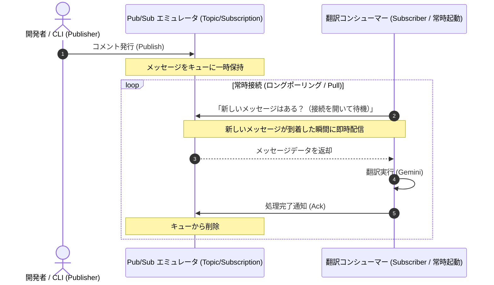
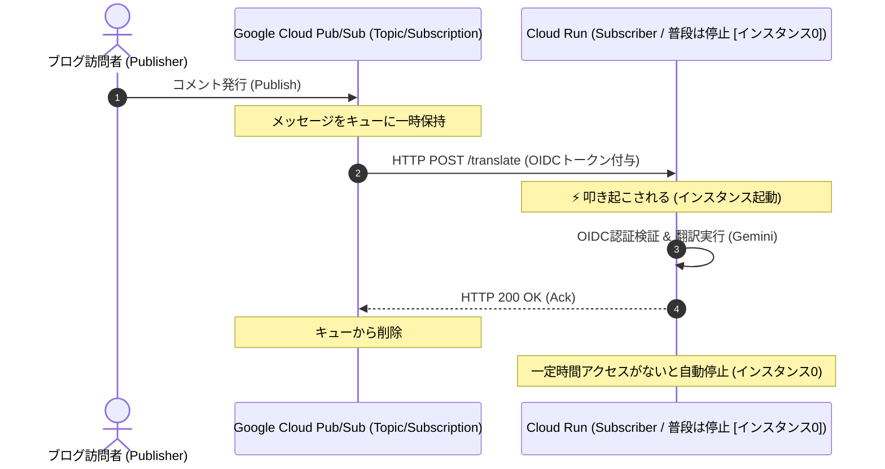

<!-- GTE_PUBLISHED: true -->

<!-- 000 タイトル定義 -->
# バズって海外から大量のコメントが届いても大丈夫！Pub/Sub × Cloud Run で鉄壁の非同期AI翻訳パイプラインを作る
<!-- 000 タイトル定義 -->

<!-- 001 冒頭イメージ画像挿入エリア -->

<!-- 001 冒頭イメージ画像挿入エリア -->

<!-- 002 導入部：背景となる課題とシステム化の動機 -->
私の弱小ポエムブログには、時折「SEO業者」や「ドメイン買いませんか？」といった海外からの英文スパムが届きます。

…しかし、待ってください。
もしある日突然、**私の魂のポエムが全米で大バズりし、「このポエムを映画化したい！」「ポエムの権利を1億円で買わせてくれ！」という海外プロデューサーからの熱烈なオファー**が、スパムに紛れて届いていたらどうするでしょうか？

同期処理でサーバーを落として億万長者のチャンスを逃すわけにはいきません。大量の海外コメントを1通も取りこぼさず、ミリ秒単位でGeminiに自動翻訳させて世界へ羽ばたくため、**鉄壁の非同期メッセージング基盤**を構築しました。
*(※今回はブログ本体との結合ではなく、裏で動く「AI翻訳パイプライン（Pub/Sub ✕ Cloud Run）」の仕組みをディープに解説します)*
<!-- 002 導入部：背景となる課題とシステム化の動機 -->

---

<!-- 003 本記事の概要（3行まとめ） -->
> **💡 この記事の3行まとめ（忙しい人向け）**
> 1. **解決する課題**: 外部API呼び出しを含むコメント翻訳機能の同期実行による、レスポンス遅延やスパム集中時のサーバーダウンリスクを解決。
> 2. **採用したアーキテクチャ**: Google Cloud Pub/Sub と Docker エミュレータを用いた非同期・イベント駆動型の安全な翻訳メッセージングパイプライン。
> 3. **実証成果**: 大量のコメント要求時もバックプレッシャーによりコンシューマーを保護し、システム全体の耐障害性とスケーラビリティを飛躍的に向上。
<!-- 003 本記事の概要（3行まとめ） -->


<!-- 100 🏗️ 1. アーキテクチャ概要 -->
<br><br>
## 🏗️ アーキテクチャ概要

### 🍜 直感理解！ラーメン屋で例えるバックプレッシャー ＆ 「一人二役」の仕組み

今回のアーキテクチャについて **「バックプレッシャー（背圧制御）」**と、作ってて、少しわかりづらいかな？と思った **「1台のCloud Runが受付と翻訳の2役をこなす構造」**を図解で解説します！

#### 1. バックプレッシャー（背圧制御）の有無による違い
大量のコメントが殺到した際、従来の同期処理ではシェフ（サーバー）が即座にパンクして炎上・クラッシュしますが、Pub/Sub + Cloud Run（本構成）では「券売機 兼 待合室」がクッションとなり、シェフが自分のキャパシティ（最大80並列の安全なペース）の範囲内で無理なく丁寧に調理できます。


#### 2. 1台のCloud Runで、「一人二役（送信 ＆ 受信）」のデータフロー
今回の構成では、同じ1つの Cloud Run コンテナが　**「受付（Publisher）」と「AI翻訳シェフ（Subscriber）」の2役**　を兼任する禁じ手を採用しています。

- **Step 1 【コメント受付】**: ブログ訪問者から海外コメントの投稿リクエストを受信します。
- **Step 2 【トピック投函 (Publish)】**: 「Pub/Sub 着ぐるみ」をまとった Cloud Run が、メッセージを Pub/Sub トピックへポンッと投函！
- **Step 3 【変身（同じ人！）】**: 投函完了後、着ぐるみをサッと脱ぎ捨てて役割チェンジ！（中の人は全く同じ1台のCloud Runコンテナ）
- **Step 4 【Push受取 (Subscribe)】**: Pub/Sub の Push Webhook (`POST /translate`) から通知が届き、同じ Cloud Run がメッセージをキャッチ！
- **Step 5 【AI翻訳実行】**: 受信したデータを「翻訳依頼」として Gemini 3.7 Flash ロボットに渡し、AI翻訳を完了させます。


> **💡 前作（170）との違い ＆ 今回あえて1台にまとめている理由**
> 
> * **前作（170）**: `0.08 vCPU` / `--concurrency 1` / `--max-instances 5`（スケールアウト型）
> * **本作（171）**: `1.0 vCPU` / **`--concurrency 80`** / **`--max-instances 1`**（背圧・1台固定型）
> 
> 本来であれば受取と処理は分離すべきですが、今回のハンズオンであえて「受付」と「処理」を1台のCloud Runサービス（エンドポイント）に同居させているのは、**受取時に起動・ウォームアップされたコンテナインスタンスが再利用される確率を高め、ワーカー側のコールドスタート（起動遅延）を最小化するハンズオン向けの最適化**です。
> 
> ※もちろん Cloud Run は完全なステートレス設計のため、仮にゼロスケール（0台休眠）やインスタンス入替が発生した場合でも、Pub/Sub 側がメッセージを最大7日間確実に保護・再配信するため、新旧どのインスタンスが立ち上がっても安全かつ独立して処理を完遂できます。
> ※ただし、1台同居では大規模スパイク時に同じ同時実行枠（80件）を奪い合う限界があります。**本番環境で大規模システムを構築・運用する際は、必ず「受付用」と「処理用」のCloud Runサービスを別々に分離して構築してください！**

---

### イベント駆動型非同期AI翻訳パイプラインの意義

API呼び出しを含む時間のかかる処理を、ユーザーのリクエストを受け付けるWebサーバー内で直接実行する場合、応答の遅延がユーザービリティーを損なう可能性があるため、避けるべきです。

メッセージブローカーを仲介させることで **「時間的デカップリング（時間的疎結合）」** を行う事により、メッセージのパブリッシュ（送信）とサブスクライブ（受信・処理）を完全に非同期化することができます。これにより、仮に後続の処理コンシューマーが停止していても、ユーザーへのレスポンスは即時完了し、メッセージはキューに安全にバッファリングされます。

---

### 従来の同期処理 vs Pub/Sub非同期パイプラインの比較

従来の「同期API呼び出し」と、今回の「Pub/Sub + Cloud Run（本構成）」の2つのアプローチを単純に比較してみました！

| 評価軸 | 同期API呼び出し (直列実行) | Pub/Sub + Cloud Run (本構成) |
| :--- | :--- | :--- |
| **基本データモデル** | HTTP同期リクエスト/レスポンス | 完全管理イベントメッセージング（Pub/Sub） |
| **スケーラビリティ** | 極めて低（API応答を待機するため接続が即時詰まる） | 極めて高（Pub/Subから複数コンシューマーへ動的配信） |
| **データ永続化 / キュー保証**| なし（呼び出し側のエラーでデータは即時消失） | 高（Pub/Sub内で最大7日間のメッセージ永続化・再試行） |
| **耐障害性 / 疎結合度** | 低（翻訳APIのダウンがメインシステムに直接波及） | 極めて高（メッセージバッファにより後続の障害時もデータ保護） |
| **ランニングコスト** | 0円（別途熱源コスト不要だがスロットリング損失大） | 極小（定額固定費0円、Pub/SubとCloud Runの無料枠内） |

同期API呼び出しは、一時的なアクセススパイクや翻訳APIの障害により、システム全体のダウンタイムやメッセージ消失を引き起こします。
メッセージをPub/Subで緩衝させ、イベント駆動でCloud Runを起動する **「Pub/Sub + Cloud Run（本構成）」** にしておけば、コストは多少発生する可能性がありますが、安心を買うことができます。
なお、私のポエムブログであれば課金が発生する程のアクセスがまずないので、そもそも通常時は死角無しです😿

---

> **🔄 ローカル（Pull）と本番（Push）のハイブリッド処理モデル**
> このコンシューマープログラムは、開発環境と本番環境で異なるPub/Subメッセージ受信モデルを自動判別します。
> * **ローカル（エミュレータ環境）**: `isLocal` が真の場合、`startConsumer()` により Pull 型（イベントをポーリングして購読する常駐ワーカー）で動作し、高速なデバッグと可視化を可能にします。
> * **本番環境（Cloud Run）**: `isLocal` が偽の場合、無駄なバックグラウンドポーリングによるCPUリソースの浪費（およびCloud Runでの受信凍結）を防ぐため、Pull リスナーを起動しません。代わりに、Pub/Subの Push サブスクリプションから `POST /translate` エンドポイントへ送信されるプッシュ通知を待機するステートレスな構成として動作し、Cloud Run のゼロスケール（完全従量課金）のメリットを最大化します。
> 
> **⚠️ ローカル（Pull）と本番（Push）でのデータの流れる向き（矢印）の違い**  
> * **ローカル開発（Pull型）**: 翻訳コンシューマー（App）が「新しいメッセージはある？」と自らエミュレータへ問い合わせに行くため、矢印の向きは **`App --> Emulator`** （引っ張り型）となります。
> * **本番環境（Google Cloud / Push型）**: メッセージが届いた瞬間に Pub/Sub が自動で Cloud Run のエンドポイント（`POST /translate`）へリクエストを送りつけるため、矢印の向きは **`PubSub --> Cloud Run`** （送りつけ型）と逆方向になります。

#### 💻 ローカル開発環境のデータフロー（Pullモデル）
ローカル環境では、コンシューマーが主体となって定期的にエミュレータへ新しいメッセージを問い合わせる「引っ張り（Pull）」方式をとります。ネットワーク設定が不要で、デモ画面から「受信の一時停止」などの制御が簡単に行えるデバッグ優先の構成です。



#### ☁️ 本番環境のデータフロー（Pushモデル）
本番環境では、Google CloudのPub/Subが主体となって、メッセージ受信時にCloud Runの特定のURL（`/translate`）を強制的に呼び出す「送りつけ（Push）」方式をとります。普段はサーバーを完全に停止（インスタンス数0）させてコストを浮かせ、リクエストが来た時だけ叩き起こすFinOps優先の構成です。



---

:::note info
📂 すべての設定ファイルと完全なコードはこちらのGitHubリポジトリで公開しています

👉 [**github.com/kuiswin/171-pubsub-pipeline**](https://github.com/kuiswin/171-pubsub-pipeline)
*(※本リポジトリのソースコードおよびスクリプトは個人・学習・検証目的でご活用いただけます。商用本番環境での利用は自己責任でお願いします。)*
:::

> ※本リポジトリのコードおよび記事のロジック構築には**生成AIを活用**しています。動作確認は行っておりますが、AI特有の誤ったコード生成（ハルシネーション）や仕様変更、意図しない誤翻訳等が含まれる可能性があります。本番環境へ適用される場合は、セキュリティやクラウド費用（FinOps）をご自身でご確認の上、**自己責任**にてご運用ください。

## 💻 ローカル環境での検証 ＆ 稼働手順
<!-- 200 💻 2. ローカル環境での検証 ＆ 稼働手順 -->

<!-- 201 フォルダ構成 -->
ローカルPCの環境に、以下の構成ファイルを配置して起動確認を行います。
検証に必要なソースコードはすべてGitHub上に公開されています。

* 📄 [**docker-compose.yml**](https://github.com/kuiswin/171-pubsub-pipeline/blob/main/docker-compose.yml) (エミュレータと翻訳コンシューマーコンテナの定義)
* 📄 [**package.json**](https://github.com/kuiswin/171-pubsub-pipeline/blob/main/consumer/package.json) (Node.js依存ライブラリ定義)
* 📄 [**index.js**](https://github.com/kuiswin/171-pubsub-pipeline/blob/main/consumer/index.js) (Pub/Subのポーリング、ダッシュボード配信、翻訳ロジック)
* 📄 [**Dockerfile**](https://github.com/kuiswin/171-pubsub-pipeline/blob/main/consumer/Dockerfile) (翻訳コンシューマー起動用コンテナビルド定義)
* 📄 [**dashboard.html**](https://github.com/kuiswin/171-pubsub-pipeline/blob/main/consumer/dashboard.html) (メッセージ送受信・滞留キュー可視化WebUI)

### 📁 フォルダ構成
```text
sandbox_171/
├── docker-compose.yml
└── consumer/
    ├── Dockerfile
    ├── dashboard.html
    ├── index.js
    └── package.json
```
<!-- 201 フォルダ構成 -->

<!-- 202 ローカル動作確認コマンド -->
### ローカルでの動作確認について

本システムでは、クラウドにデプロイする前に、ローカル環境で「ほぼ同等の挙動」を再現できるよう、Docker Composeを用いたコンテナ型のエミュレータ（Pub/Subエミュレータなど）を組み合わせて検証を行います。これにより、主要機能を安全にテストできます。

GitHub上に公開されているソースコードを一つずつコピーしてフォルダに配置し、Docker環境を手動で立ち上げることで動作確認自体は可能ですが、ファイル構成の作成や依存関係のインストール、環境変数のマッピング設定を手動で行うのは少々手間がかかります。

記事後半で紹介する私の技術ブログで、**これらの依存パッケージのインストール、リポジトリのクローン、そしてローカル環境でのコンテナ起動までを「一発」で自動完了させる、超便利なワンライナーコマンドと自動セットアップ手順**を公開しています！

より簡単かつスピーディーにローカルでの動作確認を行いたい方は、ぜひ私の個人ブログをご参照ください。
<!-- 202 ローカル動作確認コマンド -->

---

<!-- 204 開発環境へのアクセス情報 -->
### 開発環境へのアクセス情報

コンテナが起動したら、ブラウザから以下のURLへアクセスします。

* **ローカル環境（ご自身のPCなど）で動かす場合:**
  - **AI自動翻訳ダッシュボード**: [http://localhost:8080/](http://localhost:8080/)
  - *※ブラウザでアクセスすると、トピック送受信ステータスや翻訳結果がリアルタイムで一覧表示されるダッシュボード画面が表示されます。*
<br>
<br>

* **【検証用】筆者の自動公開デモ環境:**
  - 筆者のプライベート環境では、コンテナを立ち上げるだけで自動的にドメインとSSLが割り当てられる検証環境を用意しています。以下のURLから動作検証が可能です。
  - **AI自動翻訳ダッシュボード**: [https://translate-p8086-171.kuis.win/](https://translate-p8086-171.kuis.win/)
  
  - コンテナ環境は常に立ち上げているわけではないため、アクセス時につながらない可能性があります。
  
<!-- 204 開発環境へのアクセス情報 -->

---

<!-- 205 コンテナ構成の解説 -->
### 📦 コンテナ内部の構成

今回の構成（Docker環境）内では、以下の3つのDockerコンテナが協調して動作しています。

1. **`pubsub-emulator` 【公式イメージ / 無改造】**:
   - **イメージ**: `gcr.io/google.com/cloudsdktool/google-cloud-cli:emulators`
   - **役割**: Google Cloud SDKのPub/Subエミュレータ。ローカルでPub/Subメッセージのルーティングを行います。
2. **`pubsub-init` 【初期化用 (transient) / 完了後自動終了】**:
   - **イメージ**: `gcr.io/google.com/cloudsdktool/google-cloud-cli:emulators`
   - **役割**: エミュレータの起動を待ち、必要なトピック (`verify-topic`) とサブスクリプション (`verify-sub`) を自動で事前作成して終了するセットアップコンテナ。
3. **`consumer` 【独自開発 / アプリ・Web UI本体】**:
   - **イメージ**: `Dockerfile` よりローカルビルド
   - **役割**: メッセージを受信して自動双方向翻訳を実行し、可視化 Web ダッシュボードを提供するNode.jsアプリケーション本体（ポート 8080）。
<!-- 205 コンテナ構成の解説 -->

#### 💡 Pub/Subの基本概念：手紙の郵送システムで例えると
Pub/Sub（Publish / Subscribe）の仕組みは、手紙の郵送システムに例えると非常にイメージしやすくなります。

* **Publisher（パブリッシャー / 差出人）** 【ブラウザ / クライアント CLI】
  - 手紙（メッセージ）を書いて送る人です。
* **Topic（トピック / 郵便ポスト）** 【`pubsub-emulator` 内に作成】
  - 手紙の宛先となる場所です。
* **Subscription（サブスクリプション / 配達方法）** 【`pubsub-emulator` 内に作成】
  - 届いた手紙を、誰にどうやって届けるかという「配送ルール（ルート）」です。
* **Subscriber（サブスクライバー / 受取人）** 【`consumer`】
  - 最終的に手紙を受け取り、翻訳などの処理を行う人です。
---

<!-- 700 💡 コラム：ローカル開発環境（Docker）のコンテナ分離構成 -->
### 💡 コラム：ローカル開発環境で「エミュレータ・初期化・アプリ」の3コンテナに分離する理由

アプリ層（`consumer`）としては受付と翻訳を1つにまとめていますが、**ローカルのDocker環境としては「エミュレータ」「初期化処理」「アプリ本体」の3つのコンテナに明確に分離**しています。すべてを1つのコンテナに詰め込む「Fat Container」にせず分離しているのには、モダンなコンテナ設計における重要な思想があります。

1. **「1コンテナ＝1プロセス（単一責任の原則）」の徹底**
   Dockerは本来、1つのプロセスを隔離された環境で実行するために設計されています。1つのコンテナで複数のプロセスを同時に管理しようとすると、プロセスの監視やゾンビプロセスの回収が困難になり、コンテナの健全性（Health Check）を正しく判定できなくなります。
2. **リソース制御（CPU/メモリ）の最適化**
   メッセージブローカー（エミュレータ）とコンシューマー（アプリケーション）を分けることで、Docker Compose 上で各コンテナに対して個別に `deploy.resources.limits` を設定し、リソースの競合によるシステム全体のクラッシュを防ぐことができます。
3. **公式イメージの「無改造利用」による透明性とセキュリティの確保**
   公式イメージ（例：Google Cloud CLIのエミュレータ）は、開発元のコミュニティが最適化したものをそのまま使うのが鉄則です。初期化のためにシェルを埋め込んだり、ベースイメージをカスタマイズしたりすると、バージョンアップ時の追従が困難になり、セキュリティリスクも高まります。
4. **「冪等（べきとう）な初期化処理」の分離（Init Container パターン）**
   トピックやサブスクリプションの作成といった「起動時に1回だけ実行したい処理」をアプリケーションやブローカーの起動スクリプトに混ぜるのではなく、独立した軽量コンテナ (`pubsub-init`) として切り出しています。これらは**冪等（繰り返し実行しても同じ結果になる）**に作られており、必要なセットアップが完了すると即座に正常終了（Status 0でExit）します。データベースで言えば、テーブル作成 `CREATE TABLE` と同じで、最初に1回だけ箱を作れば十分な処理です。
<!-- 700 💡 コラム：なぜコンテナを疎結合に分割するのか -->

---

<!-- 207 次のステップ（クラウド本番展開への案内）
### 🚀 次のステップ：試験環境と本番環境に展開

ローカル環境での動作準備を完了させて、本番環境にもデプロイメントを実施させます。

設計思想や、一発自動デプロイスクリプトの実装方法については、記事の後半で紹介する個人ブログ側で公開していますのでアクセスしてみてください！

👉 [**【後編：Google Cloud本番デプロイ編】本番一発自動デプロイとFinOpsコスト防衛手順はこちら（ブログ記事リンク）**](https://kuis.win/171/)
-->


<!-- 300 🧪 3. 物理キューの挙動検証（ローカルディープダイブ） -->
<br><br>
## 🧪 物理キューの挙動検証（ローカルディープダイブ）
<!-- 300 🧪 3. 物理キューの挙動検証（ローカルディープダイブ） -->

<!-- 301 ローカル検証環境の一括セットアップ -->
### 📂 ローカル検証環境の一括セットアップ

ローカル環境が未構築の人、未デプロイの人は以下のコマンドを実行することで、依存ツールのインストールから検証に必要な設定ファイル群のGit取得、Docker起動まで一括でローカルに構築できます。

```bash
# 依存ツールのインストール (未導入の場合)
sudo apt-get update && sudo apt-get install -y docker.io docker-compose-v2 git

# リポジトリのクローンと作業ディレクトリへの移動
git clone https://github.com/kuiswin/171-pubsub-pipeline.git sandbox_171
cd sandbox_171

# コンテナのビルドとバックグラウンド起動
docker compose up -d --build
```

**▼ コンテナ起動中のターミナル実行画面イメージ**


> 💡 **動作確認ガイド**:
> コンテナのビルドと起動が正常に完了したら、ご自身の環境（ブラウザ）から以下のアクセスURLを開いて動作確認を行ってください。
> * **ご自身のローカルPC環境で起動した場合**: [http://localhost:8080/](http://localhost:8080/)
> * **【筆者検証用】自動公開デモ環境の場合**: [https://translate-p8086-171.kuis.win/](https://translate-p8086-171.kuis.win/)

<!-- 301 ローカル検証環境の一括セットアップ -->

---

<!-- 302 物理キューの挙動検証の解説 -->
ローカル環境で Pub/Sub キューの物理的な挙動やバックプレッシャーの仕組みをディープに検証します。


### 🧪 物理キューの滞留とバックプレッシャーの動作検証
このダッシュボードには、時間的デカップリングの物理的挙動をテストするための「一時停止」機能と「遅延スライダー（スロットリング）」機能が備わっています。

1. **メッセージ送信と一時停止**:
   - 画面上の「一時停止」ボタンを押します。これにより、コンシューマーの Pub/Sub 購読リスナーがクローズされます。
   - その後、ダッシュボードの「テンプレートからランダム生成」ボタンを数回クリックするか、テキストフォームに文字を入力して「送信」を押します。送信されたメッセージはコンシューマーが受け取らないため、メッセージは **Pub/Sub エミュレータ内に完全に滞留** します（滞留中のバッファ数が増加します）。
2. **CLI からの物理キュー確認**:
   - 実際に Pub/Sub エミュレータ内にメッセージが滞留しているかを、ターミナルから以下の API を直接叩いて確認できます。
     ```bash
     curl -s -X POST -H "Content-Type: application/json" -d '{"maxMessages": 10, "returnImmediately": true}' http://localhost:8085/v1/projects/local-project/subscriptions/verify-sub:pull
     ```
     **▼ 実際の実行結果（レスポンスJSON）の例**
     ```json
     {
       "receivedMessages": [
         {
           "ackId": "projects/local-project/subscriptions/verify-sub:49",
           "message": {
             "data": "eyJpZCI6MTAwNywidGV4dCI6IkNsb3VkIFJ1biBpcyBhIG1hbmFnZWQgY29tcHV0ZSBwbGF0Zm9ybSB0aGF0IGVuYWJsZXMgeW91IHRvIHJ1biBjb250YWluZXJzIHRoYXQgYXJlIGRlcGxveWFibGUgb24gR29vZ2xlIENsb3VkLiIsInRpbWVzdGFtcCI6IjIwMjYtMDctMTlUMjE6MTM6MjcuMDIxWiJ9",
             "messageId": "35",
             "publishTime": "2026-07-19T21:13:27.037Z"
           }
         },
         {
           "ackId": "projects/local-project/subscriptions/verify-sub:50",
           "message": {
             "data": "eyJpZCI6MTAwOCwidGV4dCI6IkNsb3VkIFN0b3JhZ2UgaXMgYSBnbG9iYWwsIHNlY3VyZSwgYW5kIHNjYWxhYmxlIG9iamVjdCBzdG9yZSBmb3IgdW5zdHJ1Y3R1cmVkIGRhdGEgc3VjaCBhcyBpbWFnZXMsIHZpZGVvcywgYW5kIGJhY2t1cHMuIiwidGltZXN0YW1wIjoiMjAyNi0wNy0xOVQyMToxMzoyOC4wNzRaIn0=",
             "messageId": "36",
             "publishTime": "2026-07-19T21:13:28.091Z"
           }
         },
         {
           "ackId": "projects/local-project/subscriptions/verify-sub:51",
           "message": {
             "data": "eyJpZCI6MTAwOSwidGV4dCI6Ikdvb2dsZSBDbG91ZCBTcGFubmVyIGlzIGEgZnVsbHkgbWFuYWdlZCwgbWlzc2lvbi1jcml0aWNhbCByZWxhdGlvbmFsIGRhdGFiYXNlIHNlcnZpY2UgdGhhdCBwcm92aWRlcyB0cmFuc2FjdGlvbmFsIGNvbnNpc3RlbmN5IGF0IGdsb2JhbCBzY2FsZS4iLCJ0aW1lc3RhbXAiOiIyMDI2LTA3LTE5VDIxOjEzOjkuMTI5WiJ9",
             "messageId": "37",
             "publishTime": "2026-07-19T21:13:29.147Z"
           }
         }
       ]
     }
     ```
     ※ `data` 属性値は Base64 エンコードされたメッセージのペイロード（JSON）です。
   - レスポンスとして、エミュレータがメッセージを保持していることを表す生の JSON データを直接確認できます。
3. **コンシューマーの再開**:
   - 画面上の「再開」ボタンを押します。
   - 購読が再開された瞬間、エミュレータ内に滞留していたメッセージ群が自動で吸い出され、順次並列処理（翻訳）されて画面にダダダッと流れます。
 4. **本番環境（Google Cloud）での検証注意点**:
    - **⚠️ Push型サブスクリプションにおけるメッセージ捕捉**:
      Push 型サブスクリプションに対しても `:pull` API 自体は発行可能ですが、Pub/Sub による自動 Push 配信が即座に行われるため、手動 Pull で未処理メッセージを捕捉することは極めて困難です。
    - **本番で手動引き出しテストを行う場合の手順**:
      もし本番環境でもキュー内のメッセージを手動で引き出して確認したい場合は、一時的にサブスクリプションの設定を **`Push` から `Pull` に切り替える** ことが推奨されます。Pull型に切り替えた後、以下の通り OAuth2 認証トークンを付与してリクエストを実行することで確実に確認できます：
      ```bash
      curl -s -X POST \
        -H "Authorization: Bearer $(gcloud auth print-access-token)" \
        -H "Content-Type: application/json" \
        -d '{"maxMessages": 10, "returnImmediately": true}' \
        https://pubsub.googleapis.com/v1/projects/YOUR_PROJECT_ID/subscriptions/YOUR_SUB_NAME:pull
      ```
      > **余談**:
      > 理論上はこのコマンドで本番の未処理メッセージを捕獲できると思いますが、私のEnter速度では、爆速で処理が完遂してしまうため、メッセージを捉えることができません。今回のハンズオン記事のために「本番の Cloud Run を故意に障害停止させてメッセージを溜め込む」というところまでは未確認のため、「多分動くじゃろう」　と思います。
      ｍ（_ _）ｍ

---


<!-- 208 メディア境界線：Qiita（ローカル検証）／ 独自ブログ（本番展開） -->
<!-- このセクション以降の内容は、個人技術ブログ（kuis.win）に掲載されます -->
<!-- 208 メディア境界線：Qiita（ローカル検証）／ 独自ブログ（本番展開） -->


<!-- 400 🚀 4. Google Cloud 共通プロビジョニング編 -->
<br><br>
---

## 🛠️ 本番環境における設計基準
<!-- 300 🛠️ 3. 本番環境における設計基準 -->

### 🚨 ローカル検証の限界と、本番環境（Google Cloud）へのステップアップ

ここまでの手順で、ローカルDocker環境（エミュレータ）を使った動作検証は完了です！

ただし、ローカル環境はあくまでPC上のモック（エミュレータ）です。本物の Google Cloud APIと連携した完全な動作は、実際のクラウド環境へデプロイして初めて本領を発揮します。

**ここから先は、いよいよ本物の Google Cloud 環境へデプロイしていきます！**

:::note alert
⚠️ 厳重注意 ＆ 免責事項（商用・会社の共有アカウントでの実行は絶対禁止！）

本連載で提供するデプロイおよび「クリーンアップ・自己破壊スクリプト」は、**「不要な課金を防ぐためにリソースを即座に完全更地（削除）にする」** ことを最優先で設計されています。

もし既存の商用環境や、会社・チーム共有の Google Cloud アカウント/プロジェクトで本手順を実行した場合、**既存の重要なインフラやプロダクションデータまで一括で巻き添え削除され、復旧不可能な大惨事となる危険性があります。**

- **個人専用の隔離環境で実行せよ**: 本ハンズオンを試す場合は、既存環境や会社のインフラとは **「Google Cloud アカウント（環境）自体を完全に切り離した個人専用の独立検証アカウント（Sandbox / Playground）」** を作成した上で実行してください。
- **ライセンス（完全MIT）**: 本連載のソースコードおよび構築スクリプトは、すべて **MITライセンス** です。商用・非商用問わず自由にご活用いただけます。
- **完全自己責任の原則**: 会社や本番環境で本スクリプトを流用・実行した結果、データ損失、システム障害、課金損害が発生した場合でも、**筆者（投稿者）は一切の責任を負いかねます。** すべてご自身の責任において安全設計・ご利用を行ってください。
:::


:::note warn
⚠️ クラウド破産予防：サーバーレス型以外の「常時起動型リソース」放置にご注意ください！

本連載では「アクセスが無ければ完全無料」となるよう Cloud Run 等のサーバーレス型サービスを徹底意識して設計していますが、**記事のテーマによってはサーバーレスではない常時起動型サービス（Cloud Spanner / Bigtable / AlloyDB などのデータベースインスタンス）を扱う場合もあります。**

サーバーレス型と異なり、**常時起動型サービスはアクセスがゼロでも「起動したまま放置」しているだけで時間単位で課金が発生し続けます。** 本番デプロイを試した後は、必ず各記事の最後にある「🧹 クリーンアップ・自己破壊手順」を実行し、**ご自身の責任においてリソースの削除徹底をお願いいたします！**（※万が一のクラウド破産の責任は負いかねますので、各自で予算アラートを設定するなど自己防衛してください）
:::


## 🚀 Google Cloud 共通プロビジョニング編

本番運用のベースとなるGoogle Cloudプロジェクトの設定、Artifact Registry（コンテナ保管庫）、および専用サービスアカウントの作成と最小権限の付与を自動化します。

### 共通環境変数の設定 ＆ 基本プロジェクトIDの組み立ても兼ねる
自身のアカウント環境に合わせて設定を定義し、基本プロジェクトIDを組み立てます。（※ `KEYWORD`・`APP_PREFIX`・`ARTICLE_ID` の合計長は15文字以内にしてください）

```bash
echo ""
echo ""
echo ""

# 共通環境変数の定義 (KEYWORD、APP_PREFIX、ARTICLE_IDは半角小文字英数字で、合計15文字以内 ※例:6+6+3=15文字以内)
KEYWORD="abcde"
APP_PREFIX="qm-app"
ARTICLE_ID="171"
PROJECT_NAME="PubSub Pipeline - ${KEYWORD}"

# プロジェクトプレフィックスと基本プロジェクトIDの自動組み立て（全自動小文字化）
PROJECT_PREFIX=$(echo "${APP_PREFIX}-${KEYWORD}-${ARTICLE_ID}" | tr '[:upper:]' '[:lower:]')
PROJECT_ID="${PROJECT_PREFIX}"

# 使用予定プロジェクトIDの表示
echo ""
echo "----------------------------------------"
echo "📌 使用予定プロジェクトID: ${PROJECT_ID}"
echo "----------------------------------------"
echo ""

# 現在存在する関連プロジェクト一覧の目視確認
echo "🔍 事前チェック：現在の既存プロジェクト一覧 ('${KEYWORD}' 関連):"
gcloud projects list --filter="projectId ~ '${KEYWORD}' OR name ~ '${KEYWORD}' OR projectId='${PROJECT_ID}'"
```

> **💡 使い回したくない・完全作り替え（新規作成）を行いたい場合**
> 
> 完全に真っ新な新しい環境で検証を行いたい場合のみ、上記の代わりに以下の行を実行して `PROJECT_ID` をタイムスタンプ付きで上書きしてください。
> 
> ```bash
> # タイムスタンプ付与でPROJECT_IDを上書き
> PROJECT_ID="${PROJECT_PREFIX}-$(date +%Y%m%d%H%M)"
> ```
> 
> *(※注意: Google Cloudの仕様上、プロジェクトを何度も新規作成・削除すると「30日間の削除保留期間」によりプロジェクト作成枠上限に達して作成不能になるリスクがあります。普段の検証は上記標準手順の既存プロジェクト使い回しを強く推奨します)*

> **💡 手持ちの特定既存プロジェクトを固定指定して使い回したい場合**
> 
> すでに作成枠上限（Quota）に達している場合や、特定の既存プロジェクト（例: `ferrous-iridium-286000` やデフォルトプロジェクト）を直接固定指定して使用したい場合は、以下の行で `PROJECT_ID` を直接上書きしてください。
> 
> ```bash
> # 手持ちの特定既存プロジェクトIDを直接固定指定
> PROJECT_ID="ferrous-iridium-286000"
> ```

> **🚨 プロジェクト作成枠上限（Quota）オーバー時のエラー表示例**
> 
> 新規プロジェクト作成時にアカウントの作成枠上限を超えている場合、以下のようなエラーメッセージが表示されます。
> 
> ```text
> ERROR: (gcloud.projects.create) Operation [create_project.global.xxx] failed: 8: The project cannot be created because you have exceeded your allotted project quota.
> - '@type': type.googleapis.com/google.rpc.QuotaFailure
>   violations:
>   - description: The project cannot be created because you have exceeded your allotted project quota.
> ```
> 
> *(※このエラーが表示された場合は、上記 Note に記載の手持ち特定既存プロジェクト指定に切り替えて実行してください)*

### Google Cloud環境の事前準備 ＆ 課金有効化（全自動ワンライナー）
直前のステップで組み立てた環境変数 `${PROJECT_ID}` を引き継ぎ、以下のワンライナーコマンドをターミナルで実行してください。
（※標準の `qm-app-abcde-171` 、タイムスタンプ付き新規プロジェクト、または特定既存プロジェクト `ferrous-iridium-286000` のいずれに設定した場合でも全自動で判定・適用されます）

```bash
bash <(curl -sSL -H 'Cache-Control: no-cache, no-store' https://raw.githubusercontent.com/kuiswin/gcp-common-tools/main/pre_flight.sh) ${PROJECT_ID}
```

### API・データアクセス監査ログの有効化 ＆ 共通リソース構築
選択したプロジェクト環境に対し、必要な Google Cloud API の有効化、Pub/Sub トピック・サブスクリプション、および専用サービスアカウントの作成と権限付与を一括実行します。

```bash
# gcloud コマンドの実行パス自動読み込み
source /root/google-cloud-sdk/path.bash.inc 2>/dev/null || true

# プロジェクトIDの取得・確定
PROJECT_ID="${PROJECT_ID:-$(gcloud config get-value project 2>/dev/null)}"

# 0. 課金状態の事前チェック（休眠中の場合は自動で課金を起爆・有効化）
BILLING_ACTIVE=$(gcloud billing projects describe "${PROJECT_ID}" --format="value(billingEnabled)" 2>/dev/null | tr '[:upper:]' '[:lower:]')
if [ "${BILLING_ACTIVE}" != "true" ]; then
    echo "⚠️ 請求先アカウントが未有効（休眠状態）です。pre_flight.sh を呼び出して自動起爆します..."
    bash <(curl -sSL -H 'Cache-Control: no-cache, no-store' https://raw.githubusercontent.com/kuiswin/gcp-common-tools/main/pre_flight.sh) "${PROJECT_ID}" </dev/null
fi

# 共通環境変数の設定
REGION="us-central1"
SERVICE_NAME="ai-translate-service"
TOPIC_NAME="translate-topic"
SUBSCRIPTION_NAME="translate-sub"

# 名前重複を100%防止するタイムスタンプ生成
TS=$(date +%y%m%d%H%M)

# 現在 gcloud CLI にログインしている Google アカウントのメールアドレスを自動取得（手動入力不要）
MY_EMAIL=$(gcloud config get-value account)

# 必須APIをまとめて事前有効化（デプロイ時のY/nプロンプト回避）
gcloud services enable \
    pubsub.googleapis.com \
    run.googleapis.com \
    aiplatform.googleapis.com \
    cloudbuild.googleapis.com \
    artifactregistry.googleapis.com --quiet

# データアクセス監査ログの一括有効化（既存IAM権限を保持したまま安全にマージ・設定済み時は自動スキップ）
gcloud projects get-iam-policy "${PROJECT_ID}" --format="json" 2>/dev/null | grep -q "auditConfigs" || \
(gcloud projects get-iam-policy "${PROJECT_ID}" --format="json" | jq '.auditConfigs = [{"service":"allServices","auditLogConfigs":[{"logType":"ADMIN_READ"},{"logType":"DATA_READ"},{"logType":"DATA_WRITE"}]}]' > /tmp/iam_policy.json && \
 gcloud projects set-iam-policy "${PROJECT_ID}" /tmp/iam_policy.json --quiet >/dev/null 2>&1 || true)

# 専用サービスアカウントの作成と最小権限の付与 (SA名は30文字以内)
SA_NAME="translate-sa-${TS}"
SA_EMAIL="${SA_NAME}@${PROJECT_ID}.iam.gserviceaccount.com"
gcloud iam service-accounts create ${SA_NAME} --display-name="PubSub AI Translate SA" --quiet 2>/dev/null || true

# サービスアカウント権限付与（※roles/pubsub.subscriber はローカル検証・CLIでのPull操作用）
gcloud projects add-iam-policy-binding ${PROJECT_ID} --member="serviceAccount:${SA_EMAIL}" --role="roles/aiplatform.user" --quiet
gcloud projects add-iam-policy-binding ${PROJECT_ID} --member="serviceAccount:${SA_EMAIL}" --role="roles/pubsub.publisher" --quiet
gcloud projects add-iam-policy-binding ${PROJECT_ID} --member="serviceAccount:${SA_EMAIL}" --role="roles/pubsub.subscriber" --quiet

# ビルド担当サービスアカウントへの権限付与（ソースコードビルド時の権限エラーを防止）
PROJECT_NUMBER=$(gcloud projects describe ${PROJECT_ID} --format="value(projectNumber)")
gcloud projects add-iam-policy-binding ${PROJECT_ID} --member="serviceAccount:${PROJECT_NUMBER}-compute@developer.gserviceaccount.com" --role="roles/storage.admin" --quiet || true

# Pub/Sub トピックおよび初期サブスクリプションの作成
gcloud pubsub topics create ${TOPIC_NAME} --quiet 2>/dev/null || true
gcloud pubsub subscriptions create ${SUBSCRIPTION_NAME} --topic=${TOPIC_NAME} --quiet 2>/dev/null || true

# Pub/Sub Service Agent への Token Creator 権限付与 (Push認証用)
PUBSUB_SERVICE_ACCOUNT="service-${PROJECT_NUMBER}@gcp-sa-pubsub.iam.gserviceaccount.com"
gcloud projects add-iam-policy-binding ${PROJECT_ID} \
    --member="serviceAccount:${PUBSUB_SERVICE_ACCOUNT}" \
    --role="roles/iam.serviceAccountTokenCreator" --quiet || true
```

## 🚀 Google Cloud 個別リソース構築編
<!-- 500 🚀 5. Google Cloud 個別リソース構築編 -->

<!-- 501 Google Cloud 個別リソース構築スクリプト -->
本アプリケーションの個別構成（コンテナビルド・デプロイと Cloud Run 固有の設定）をデプロイします。

```bash
# ソースコードの作業ディレクトリへ移動（未取得の場合は自動取得、アプリ本体の consumer フォルダへ移動）
[ -d "sandbox_171" ] && cd sandbox_171 || (git clone https://github.com/kuiswin/171-pubsub-pipeline.git sandbox_171 && cd sandbox_171)
[ -d "consumer" ] && cd consumer

# SA_EMAIL が未定義の場合の自動検出・フォールバック安全弁
if [ -z "${SA_EMAIL}" ]; then
  SA_EMAIL=$(gcloud iam service-accounts list --filter="name:translate-sa" --format="value(email)" 2>/dev/null | head -n 1)
fi

# Cloud Runへのデプロイ (--quiet を付与することで全自動実行し、API対話プロンプト等を防止)
# ※ Gemini 3.7 Flash 利用のため GCP_REGION=global を指定
gcloud run deploy ${SERVICE_NAME} \
    --source . \
    --region ${REGION} \
    --no-allow-unauthenticated \
    --service-account=${SA_EMAIL} \
    --set-env-vars="LLM_PROVIDER=gemini,GEMINI_MODEL=gemini-3.7-flash,GCP_REGION=global,TOPIC_NAME=${TOPIC_NAME}" \
    --max-instances 1 \
    --concurrency 80 \
    --cpu 1 \
    --memory 512Mi \
    --timeout 600s \
    --quiet

# 3. Cloud Run デプロイ後に、サブスクリプションをPush型（Webhook）に更新 (Ack Deadline 600s 設定 ＆ 指数バックオフ再試行ポリシーで Retry Storm を防衛)
SERVICE_URL=$(gcloud run services describe ${SERVICE_NAME} --region ${REGION} --format 'value(status.url)')

gcloud pubsub subscriptions update ${SUBSCRIPTION_NAME} \
    --push-endpoint="${SERVICE_URL}/translate" \
    --push-auth-service-account=${SA_EMAIL} \
    --push-auth-token-audience="${SERVICE_URL}" \
    --ack-deadline=600 \
    --min-retry-delay=10s \
    --max-retry-delay=600s

# 4. （任意）ブラウザから認証なしで直接 Web UI / ダッシュボードを閲覧・テスト可能にする設定
gcloud run services add-iam-policy-binding ${SERVICE_NAME} \
    --region ${REGION} \
    --member="allUsers" \
    --role="roles/run.invoker" \
    --quiet

# 5. 構築完了！アクセス用 Cloud Run サービス URL をターミナル画面内に強調表示
echo ""
echo "=========================================================="
echo "🎉 プロビジョニング＆デプロイが完了しました！"
echo "🌐 Web UI / Webhook アクセス用 Cloud Run サービス URL:"
echo "   ${SERVICE_URL}"
echo "=========================================================="
echo ""
```

**【出力結果例】**（プロビジョニング＆デプロイが成功すると、最終行にWeb UIアクセス用URLが表示されます）

```text
==========================================================
🎉 プロビジョニング＆デプロイが完了しました！
🌐 Web UI / Webhook アクセス用 Cloud Run サービス URL:
   https://ai-translate-service-3etmrjqmda-uc.a.run.app
==========================================================
```

### 📸 動作確認・本番ダッシュボード実行画面

デプロイ成功後、ターミナルに出力された URL をブラウザで開くと、以下のように Cloud Run 上で動作するダッシュボードおよび Gemini 3.7 Flash によるリアルタイム非同期 AI 翻訳パイプラインの動作を確認できます。

#### 1. 本番ダッシュボード全体画面（稼働中・メッセージ処理完了）


#### 2. Gemini 3.7 Flash による非同期AI翻訳結果（英語 ➔ 日本語）


#### 3. Gemini 3.7 Flash による非同期AI翻訳結果（日本語 ➔ 英語）


#### 📊 gcloud logging read による Pub/Sub ＆ AI 翻訳処理ログのリアルタイム確認
デプロイ完了後、実際に Pub/Sub からメッセージが届き、Cloud Run が Gemini Enterprise Agent Platform (旧称 Vertex AI) を呼び出して非同期翻訳を行った際の動作ログは、以下のコマンドでリアルタイムに確認・検証できます：

```bash
# Cloud Run コンテナおよび Gemini Enterprise Agent Platform (旧称 Vertex AI) 非同期翻訳の実行ログ確認（[Consumer] メッセージのみ極限絞り込み）
gcloud logging read 'resource.type="cloud_run_revision" AND resource.labels.service_name="'"${SERVICE_NAME}"'" AND textPayload:"Consumer"' \
    --limit=15 \
    --format="value(timestamp, textPayload)"
```

**【ログ確認の実行結果例】**
```text
2026-08-15T10:12:06.961393Z     [Consumer] Saving result to local store / GCS simulated path...
2026-08-15T10:12:06.961334Z     [Consumer] Pure Translation Duration: 3570ms
2026-08-15T10:12:06.961253Z     [Consumer] Translation: "It's so hot today. I want to go swimming in the ocean."
2026-08-15T10:12:03.391638Z     [Consumer] Connecting to Vertex AI (Gemini 3.7 Flash)...
2026-08-15T10:12:00.402164Z     [Consumer] Saving result to local store / GCS simulated path...
2026-08-15T10:12:00.402076Z     [Consumer] Pure Translation Duration: 6212ms
2026-08-15T10:12:00.401980Z     [Consumer] Translation: "Google Kubernetes Engineは、コンテナ化されたアプリケーションのデプロイ、管理、スケーリングを行うための、セキュアでマネージドなKubernetesサービスです。"
2026-08-15T10:12:00.390845Z     [Consumer] Throttling: sleeping for 3 seconds...
2026-08-15T10:12:00.390790Z     [Consumer] Input Text: "今日は暑いな　海に泳ぎに行きたい"
2026-08-15T10:12:00.390739Z     --- [Consumer] Received Event ID: 1005 ---
2026-08-15T10:12:00.390597Z     [Consumer] OIDC Token verified successfully. Email: translate-sa-2608151851@ferrous-iridium-286000.iam.gserviceaccount.com
2026-08-15T10:11:56.325961Z     [Consumer] Saving result to local store / GCS simulated path...
2026-08-15T10:11:56.325912Z     [Consumer] Pure Translation Duration: 3768ms
2026-08-15T10:11:56.325838Z     [Consumer] Translation: "Cloud Runは、Google Cloud上にデプロイ可能なコンテナを実行できるマネージド コンピューティング プラットフォームです。"
2026-08-15T10:11:54.190066Z     [Consumer] Connecting to Vertex AI (Gemini 3.7 Flash)...
```

---

> **💡 公式SDKを避け、あえて REST API を `fetch` で叩いている理由（とトレードオフ）**
> Node.js で Gemini Enterprise Agent Platform (旧称 Vertex AI) を呼び出す場合、通常は公式 SDK（`@google-cloud/vertexai` 等）を使用します。しかし、本システムではコンテナイメージを極限まで軽量化し、サーバーレス環境（Cloud Run）で最も重要となる**「コールドスタート（起動速度）」を最速化**するため、あえて公式 SDK を含めず標準組み込みの `fetch` で直接 REST API エンドポイントを叩くアプローチを採用しています。
> - **メリット**: 重厚な gRPC / 認証関連ライブラリ群を省くことでイメージ容量を数十MB削減でき、Node.js 起動時のモジュール解決・パースオーバーヘッドをミリ秒単位で削ぎ落とせます。
> - **実務上のトレードオフ（デメリット）**: 一方で、SDKが提供する「メタデータサーバーからのトークン自動更新」「指数バックオフ付きリトライハンドリング」「型安全な定義」などを自前で実装・保守する必要があります。
>
> *※「コールドスタートと軽量化を極限まで追求するイベント駆動ワーカー」という今回の設計思想においては完全に理にかなった最適解ですが、通常のアプリケーション開発や長期保守においては公式 SDK の利便性と要件に応じて使い分けるのが実務上のベストプラクティスです。*

> **💡 Cloud Run への Push 認証における Audience (aud) の罠**
> エンドポイントにパス（`/translate`）を含める場合、Pub/Sub が自動生成する OIDC トークンの Audience（宛先）と、Cloud Run が期待するルート URL にズレが生じます。これを放置すると、Cloud RunのIAMプロキシに 401 Unauthorized エラーで弾かれ、無限リトライ（Retry Storm）が発生します。これを防ぐため、必ず `--push-auth-token-audience="${SERVICE_URL}"` を明示的に指定し、Audience をルート URL に矯正してください。

> **⚠️ 注意：Push型配信におけるべき等性（Idempotency）の確保**
> Cloud Pub/Sub の Push 配信は「少なくとも1回（at-least-once）の配信」を保証するため、ネットワークの一時的な瞬断などでサーバーが Ack（処理完了通知）を返せなかった場合、同じメッセージが重複して送信される可能性があります。これに対処するため、受信側のアプリケーション（Cloud Run）では `messageId` をキーとした Redis や Firestore による「処理済みIDの記録（重複排除テーブル）」を実装し、既に処理済みのメッセージであれば即座に 200 OK を返して無視する「べき等な処理」の実装が必須となります。

---

<!-- 600 🔒 6. コスト最適化 ＆ 自己破壊（FinOps）安全弁設計 -->
<br><br>
## 🔒 コスト最適化 ＆ 自己破壊（FinOps）安全弁設計
<!-- 600 🔒 6. コスト最適化 ＆ 自己破壊（FinOps）安全弁設計 -->

<!-- 601 コスト最適化 ＆ FinOpsアラート設計の解説 -->
本番運用のセキュリティ ＆ コスト防衛（自己破壊/FinOps）について解説します。


> **📊 数理モデル解説：Cloud Run リソース設定 (`--cpu 1` / `--memory 512Mi`)**
> | 設定項目 | Cloud Run デフォルト | 本構成の設定値 | チューニングの狙い ＆ FinOps効果 |
> | :--- | :--- | :--- | :--- |
> | **CPU割り当て (`--cpu`)** | `1.0 vCPU` | **`1 vCPU`** | 無料枠 180,000 vCPU秒/月 を活用し高速なAI翻訳処理を確保 |
> | **メモリ容量 (`--memory`)** | `512 MiB` | **`512 MiB`** (0.5 GiB) | Node.js ＋ AIデータ処理のメモリ不足 (OOM) を防止 |
> | **同時実行数 (`--concurrency`)** | `80` | **`80`** | 複数メッセージ並行処理時のインスタンス無駄増殖を抑止 |
> | **CPUスロットリング** | スロットリング有効 | **有効 (デフォルト)** | リクエスト処理中のみCPUを稼働させ、待機中（約15分間）の無駄な課金を完全ゼロ（0円）に抑止 |
> | **最大スケール上限 (`--max-instances`)** | `100` | **`1`** | バズやDDoS攻撃時の自動増殖・過大請求を防ぐ安全弁 |

> **💡 コラム：なぜ限界最大値（1,000）ではなく「80」が選ばれているのか？**
>
> 「1台のコンテナにできるだけ多くのリクエストを詰め込めば、新しいインスタンスが立ち上がらずインフラ代（FinOps）を極限まで削れるのでは？」と考えたそこのあなた！！
>
> 鋭い！(笑)　私と同じ思考です！！そしてNGでした！！
> なぜ Cloud Run の上限である **`--concurrency 1000`** に設定してはいけないのでしょうか？  
> 理由は極めてシンプルで、**「詰め込みすぎるとコンテナが物理的にパンク・即死するから」** です。
>
> #### 🚨 最大値（1,000並行）にすると起きる「3大破綻事故」
> 1. **メモリ不足（OOM: Out Of Memory）でコンテナが即死する**  
>    1リクエストの処理に Node.js が一時的に 10MB のメモリを使う場合、`80並行` なら `800MB` 前後で調整・耐えられますが、`1,000並行` になると `約10GB` に膨れ上がります。設定メモリ（512MiB）を1ミリでも超えた瞬間、Linuxの OOM Killer によりコンテナごと強制終了され、**処理中だった1,000人全員のリクエストが一括でエラー落ち** します。
> 2. **CPU枯渇による全員タイムアウト**  
>    1 vCPU（店員1人）に対し、80人なら順次スピーディーに捌けますが、1,000人に一斉に注文されると1人あたりのCPUパワーが「1/1000」に分散し、普段 0.1秒 で終わる処理が 30秒 以上かかって全員タイムアウト（エラー）に陥ります。
> 3. **後続のデータベースやGemini APIのレート制限パンク**  
>    1台のコンテナから同時に 1,000件 のリクエストが走ると、裏で接続している DB コネクションや Gemini API のレート制限（秒間リクエスト上限）を一瞬で食いつぶし、外部側から `429 Too Many Requests` を連発されます。
>
> #### 🍜 ラーメン屋で例えると……
> * **インスタンス**: ラーメン屋の店舗（ワンオペ店長＝1 vCPU、厨房・敷地＝512MB）
> * **concurrency**: 店内の「客席数」
> 
> 「客席（concurrency）を 1,000 席に増やせば店舗を1つ借りるだけで済むから家賃が浮く！」と 1,000 席用意しても、**コップやどんぶり（メモリ）が足りなくなって店が崩壊し、ワンオペ店長が 1,000 人の注文にフリーズしてラーメンが3時間届かない** のと同じです。
>
> #### ⚖️ なぜ「80」がGoogleの黄金バランスなのか？
> WebアプリやAPI呼び出し（fetch）のような処理は、大半の時間が「ネットワークI/O待ち」です。そのため、**「1 vCPU / 512MB〜1GB のスペックなら、80並行前後がメモリもパンクせず、CPU効率も最も安全に最大化できる」** というGoogleの絶妙な黄金バランスとして設計されています。
> * **I/O待ちが多い処理（API fetch 等）**: `80 〜 100` 前後がベスト
> * **CPU集約型の重い処理（画像加工・計算等）**: 逆に `1 〜 4` 程度まで落とすのが定石

### インスタンス最大数の制限
今回はハンズオンで、お金をあまりかけない事を大事にしていますので、自動スケーリングの上限を小さく抑えつつ、急激なアクセス時もリソース使用量の上限を物理的に制限します。`--max-instances 1` などを指定してデプロイします。

### プッシュサブスクリプションにおける認証（OIDCトークン）とSSL/TLSの強制
本番環境では、Cloud Runへのアクセスを「未認証のアクセスを許可しない（`--no-allow-unauthenticated`）」に設定して保護するのが大原則です。この場合、以下の設定を本番構成に追加する必要があります。
1. Pub/Subサブスクリプションの配信タイプに「プッシュ（Push）」を指定し、Cloud Runが払い出すセキュアなHTTPSエンドポイント（`https://[SERVICE_NAME]-[HASH]-an.a.run.app/translate`）を設定します。
2. サブスクリプション構成内に「認証を有効にする」のオプションを適用し、あらかじめ作成した本番用サービスアカウントを関連付けます。
3. このサービスアカウントに対し、配信先となるCloud Runサービスの「Cloud Run 起動元（`roles/run.invoker`）」ロールを付与します。

これらの設定を行うことにより、Pub/Subがメッセージ送信時に自動的にOIDC（OpenID Connect）トークンを生成し、Cloud Run側で認証を安全にパスさせることが可能になります。

### 💰 動作後の正確な実効原価プロファイリング（FinOps試算）

本ハンズオンの一連の操作（プロビジョニング・Pub/Subメッセージ送信・Gemini Enterprise Agent Platform (旧称 Vertex AI) 非同期翻訳・ダッシュボードリアルタイム通信）で実際に発生した正確なインフラ原価を、以下のワンライナーで即座に計測・可視化できます。

```bash
# 💰 1操作ごとの確実な概算原価（vCPU秒・リクエスト数・AI生成数・GCS転送量）を1秒で可視化するワンライナー
python3 <(curl -sSL -H 'Cache-Control: no-cache, no-store' "https://raw.githubusercontent.com/kuiswin/-gcp-action-cost/main/calc_cost.py?t=$(date +%s)")
```

> **💡 原価プロファイラ（`calc_cost.py`）の検証結果と「通信数1,000回超！？」のカラクリ**  
> ちなみにこのハンズオンを実行して原価プロファイラを叩くと、**「えっ！？数回しか翻訳していないのに Cloud Run のリクエスト数が1,000回超え！？高額請求されるの！？」** と一瞬驚くかもしれません。  
> 
> これはダッシュボード画面を開いている間、フロントエンドがリアルタイム自動更新（キューや履歴の定期取得）を行うため、裏でブラウザが自動通信（HTTP 304）を連続送信しているためです。  
> 
> しかしご安心ください！Cloud Run のリクエスト無料枠（月200万回）および CPU無料枠（月180,000 vCPU秒）の範囲内に完全に収まるため、どれだけ裏で自動通信しても**インフラ実効課金はわずか 0.01 円未満（実質 0 円）**です！サーバーレスの圧倒的な耐性と省コスト性を体感できます。
> 
> *(※本ツール（`calc_cost.py`）で表示される数値は開発・検証時点の理論上の試算目安（参考画像）です。実際の利用料金や単価・無料枠の適用条件等はGoogle Cloudの仕様変更により変動する場合があるため、最終的な課金実績は必ず [Google Cloud Console - お支払い（Billing）画面](https://console.cloud.google.com/billing) からもご確認ください)*

### 常時起動型アーキテクチャに対するサーバーレスの費用対効果（コスト比較）
本システムにおいて、常時稼働型の仮想マシン（Compute Engine e2-micro、月額約 7.00ドルと仮定）と、今回のサーバーレス構成（Cloud Run + Pub/Sub）で、年間のスパム（翻訳処理）件数ごとに年間コストがどう変動するかを試算・比較しました。

#### 📊 スパム件数ごとの年間コスト比較

| 年間のスパム件数 | 💻 常時稼働 (Compute Engine) | ☁️ サーバーレス (本構成) | コストの内訳・状況 |
| :--- | :--- | :--- | :--- |
| **1 件 / 年** | 84.00 USD | **0.00 USD** | インフラ、AI APIともに毎月の完全無料枠内に収まります。 |
| **10 件 / 年** | 84.00 USD | **0.00 USD** | 同上。 |
| **100 件 / 年** | 84.00 USD | **0.00 USD** | 同上。 |
| **1,000 件 / 年** | 84.00 USD | **約 0.04 USD** (約 6円) | インフラは無料枠内ですが、Gemini APIの従量利用料が極微量に発生します。 |
| **10,000 件 / 年** | 84.00 USD | **約 0.38 USD** (約 60円) | GCEはスパイク時にクラッシュするリスク大。サーバーレスなら年間60円で安全に処理。 |

#### 💡 決定的な違いは「瞬間的なスパイク攻撃（DDoS）」への耐久性
年10,000件のスパムは、平均すれば「1時間に約1件」程度であり、平時であれば e2-micro（共有vCPU/メモリ1GB）でも余裕で処理できます。
しかし、実際のスパムボットによる攻撃は均等には来ず、**「1分間に1,000件」のように一瞬で集中して押し寄せます。**

- **常時稼働 (Compute Engine e2-micro) の場合**：
  貧弱な単一リソースであるため、アクセスが集中した瞬間にNode.jsのメモリ不足（Out of Memory）やCPU 100%に達し、**Webシステムごとサーバーが完全にクラッシュ（ダウン）**します。
- **サーバーレス (Cloud Run ＋ Pub/Sub) の場合**：
  どれだけ急激なスパイクが来ても、まず **Pub/Sub がすべてのアクセスを一時的に引き受け（バッファリング）**、Cloud Run が許容されたインスタンス制限内で安全に順番に処理を消化します。そのため、**設定次第ですが、攻撃が来てもシステムがダウンすることはありません。**

サーバーレスは、単なる「究極の省コスト」であるだけでなく、**「個人開発規模の料金で、大企業レベルの耐DDoS・耐障害性を手に入れる手段」** でもあります。

### 🌍 個人開発から大規模商用パイプラインへのスケーラビリティ

本記事で解説した「Pub/Sub ＋ Cloud Run ＋ Gemini」の組み合わせは、個人ブログのスパム対応という極小のユースケース（年間1件）を起点としていますが、インフラのアーキテクチャパターン自体は**エンタープライズ規模の超高トラフィック環境へスムーズにスケールアウト可能**です。

例えば、グローバルEコマースサイトで発生する「毎秒数千〜数万件の多言語カスタマーレビュー」をリアルタイムに翻訳・感情分析（Sentiment Analysis）し、ダッシュボードやデータウェアハウス（BigQueryなど）へ流し込むパイプラインに、このアーキテクチャ設計をベースとして拡張できます。

> **💡 エンタープライズ商用展開時の推奨プラクティス**
> 
> 1. **Pub/Sub の保持期間設定（7d / 10m / 31d）**:
>    * トピック・サブスクリプションの未確認メッセージ保持期間はデフォルトで **`7d`（7日間）** 保持されます（最小 `10m` 〜 最大 `31d` まで調整可能）。
>    * 本構成では `--ack-deadline=600`（**`10m` / 10分**）および指数バックオフ（`--min-retry-delay=10s --max-retry-delay=600s`）を設定し、Gemini APIの一時的な障害時もリトライストームを防ぎます。
> 2. **サービス分離 ＆ スケールアウト**:
>    * 商用では「受付用（Publisher）」と「処理用（Subscriber Worker）」の Cloud Run サービスを分離し、処理側の `--max-instances` を引き上げます。
> 3. **冪等性（Idempotency）と At-least-once 対策**:
>    * Pub/Sub は仕様上「At-least-once（少なくとも1回の配信）」を提供します。ネットワーク瞬断やタイムアウト時の重複再送に備え、処理側で `messageId` や投稿ハッシュ値を Redis / Cloud Spanner / Firestore 等に記録して二重翻訳・二重課金を防ぐ **「冪等性ガード」** の実装を推奨します。
> 4. **Dead Letter Topic (DLQ) の導入**:
>    * 規定回数（例: 5回）以上処理に失敗した有害なメッセージを退避するデッドレターキューを設定することで、パイプラインのスタックを完全に防止します。

### 💥 検証完了後の完全環境破壊 ＆ プロジェクト上限（Quota）回避のプロ技

検証や動作確認が完了したら、無駄な課金やリソースの残骸を防ぐために環境をクリーンアップします。お使いの Google Cloud アカウント環境に合わせて以下のいずれかの手法を選択してください。

---

#### 💥 パターンA：プロジェクト丸ごと完全一括破棄（新規プロジェクトが作成可能な方）
スクリプトの先頭で定義した変数 `${PROJECT_ID}` を使って、プロジェクトごと一瞬で完全一括削除します：

```bash
# 今回作成した検証プロジェクトと、内部の全リソース（Cloud Run, Pub/Subトピックなど）を全自動で完全一括破棄！
gcloud projects delete ${PROJECT_ID} --quiet
```

> **💡 なぜプロジェクト一括削除が確実なFinOpsなのか？**
> リソースを1つずつ手動で削除すると、削除漏れによる隠れ課金（孤立したIPアドレスや未使用ストレージなど）が発生するリスクがあります。
> `gcloud projects delete ${PROJECT_ID}` でプロジェクトごと一括削除することにより、**関連リソースが残らず消去**され、意図しない課金の発生を確実に防止できます！

---

#### 🛡️ パターンB：プロジェクト作成上限（Quota）回避！全自動リソースお掃除 ＆ 請求解除（0円休眠化）
> ⚠️ **Google Cloudのプロジェクト作成上限（Project Creation Quota）の罠**  
> Google Cloud の個人・無料アカウントでは作成できるプロジェクト数に上限（通常 3〜5 個）があります。プロジェクトを `gcloud projects delete` で削除しても、Google Cloud の仕様上 **30 日間の復元猶予期間（Soft Delete）** に入り、その間も Quota 枠を専有し続けます。そのため、連載で何度も削除・作成を繰り返すと「上限に達して新しいプロジェクトが作れない！」という壁にぶつかります。

手動での削除漏れリスクを防ぐため、以下の全自動お掃除スクリプトをターミナルで1行流すだけで、プロジェクト内の全リソース（Cloud Run, GCS, Pub/Sub, Spanner等）を全自動検知・削除し、不要APIの無効化と請求先アカウントの解約（Unlink）までを一気に行い、完璧な0円休眠状態へ移行します：

```bash
curl -sSL -H 'Cache-Control: no-cache, no-store' https://raw.githubusercontent.com/kuiswin/gcp-common-tools/main/teardown.sh | bash
```

**【実行ログ結果例】**

##### 📋 完全版お掃除実行ログ例（Pub/Sub・Cloud Run・Artifact Registry・IAM・不要API無効化・請求解除の全自動0円休眠化成功時）

```text
========================================================
🎉 すべてのチェック・お掃除・0円休眠化が正常に完了しました！
========================================================
```

> **💡 なぜ `API全OFF` ＋ `gcloud billing projects unlink` が有効なFinOps手法なのか？**
> プロジェクト本体や Quota 枠を残したまま、**Google Cloud の課金アカウントを切断して安全な休眠状態** へ移行できます！
> 次回のハンズオンで同じプロジェクトを再利用したい時は、上記の事前準備ワンライナー (`pre_flight.sh`) を流すだけで瞬時に復活・使い回しが可能です！

<br>

<!-- 601 コスト最適化 ＆ FinOpsアラート設計の解説 -->


---

無事に **海外から熱烈なリアクションが来ても爆死しない「超低コスト＆頑丈な自動翻訳基盤」** が完成しました！

これでいつでも、世界中の読者からの多言語メッセージを爆速＆ほぼ完全0円で受信・解読できます！！
