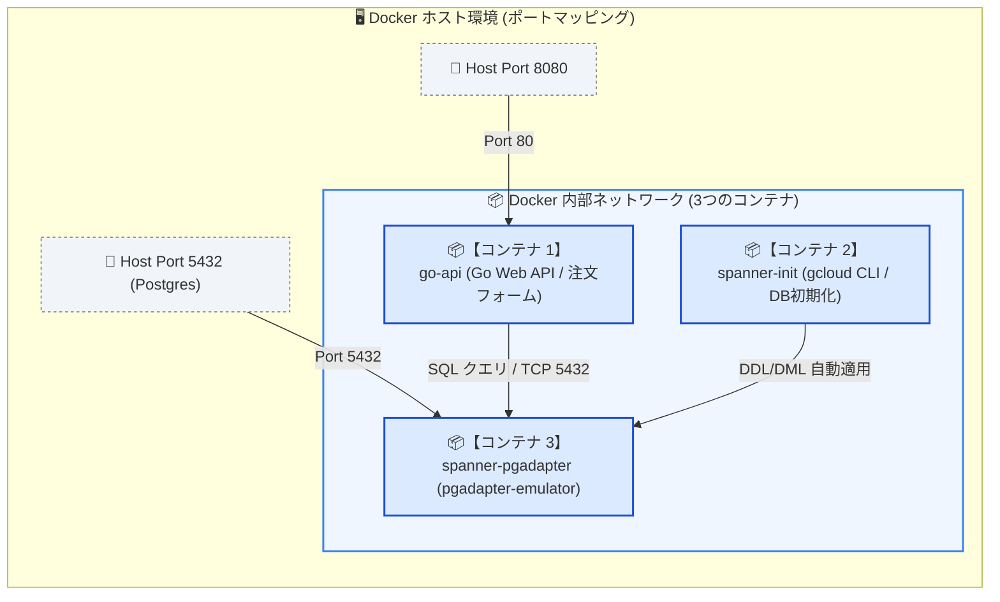
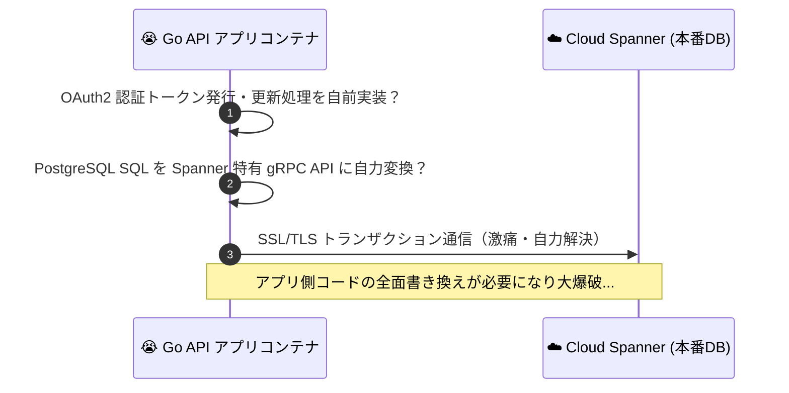
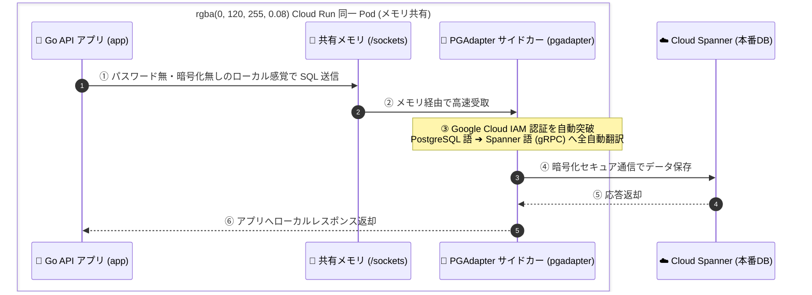

<!-- GTE_PUBLISHED: true -->

<!-- 000 タイトル定義 -->
# うちの出前注文システムが落ちるのが不安で夜も眠れぬ日々が続いたので、羊を数える代わりに超高級分散RDB「Cloud Spanner」を導入してみた
<!-- 000 タイトル定義 -->

<!-- 001 冒頭イメージ画像挿入エリア -->

<!-- 001 冒頭イメージ画像挿入エリア -->

<!-- 002 導入部：背景となる課題とシステム化の動機 -->
皆さんも、自分が経営しているレストランのWebサイトに「出前注文システム」を設置していますよね？
レンタルサーバーでも使っていますか？

困ったことが起きたのですが、先日うちのレストランに遊びに来た友達のyoutuberが「美味しい美味しい」と動画をとっていたのですが、断りもなく、勝手にお店の出前注文システムのリンクを自分のチャンネルで紹介したのです。
友達は登録者数100万人の人気YouTuberです。そのせいで、アクセスが跳ね上がり負荷に耐えきれないのでは？と、夜も眠れないほどの極限の不安に苛まれてしまったのです。
**「もし、秒間1万件の予約スパイクが来たらどうしよう…」**
**「もし、インフラが耐えきれずサーバーが落ちて、常連さんが注文できなくて咽び泣いたらどうしよう…」**

そんな心配性な私は不安を解決するためにある決断をしました。それは・・・
**「だったら、ミッションクリティカルな超巨大グローバル企業を支える、Google Cloudの大規模分散データベース『Cloud Spanner』で、作っちゃえばいいじゃん！！」**

Spannerの「ダウンタイムゼロ」「驚異の可用性（最大99.999%の可用性）」「真の外部整合性とACID特性」、および「広域マルチリージョン同期」があれば、たとえあるリージョンが大規模障害で停止しようとも、他大陸のレプリカ群とPaxos合意によってお客様の出前注文がミリ秒単位で保護されます。
本記事では、物語としての「地球規模広域マルチリージョン」の概念と合意形成（Paxos）を手元で体験できるローカルDocker環境（障害シミュレーター搭載）を構築しつつ、Google Cloudへデプロイして、動作検証を行います。
> [!WARNING]
>⚠️ 厳重注意：課金のところを見て私が一番心臓が止まるかと思ったのもここです。気軽に試すのはおやめください。((((；ﾟДﾟ))))ｶﾞｸｶﾞｸ

そこで、Google公式の**「Spanner Emulator」**とPostgreSQL互換プロキシ**「PGAdapter」**を組み合わせたローカルDocker環境で「高可用なSpanner出前注文システム」を作ります。
<!-- 002 導入部：背景となる課題とシステム化の動機 -->

---

<!-- 003 本記事の概要（3行まとめ） -->
> **💡 この記事の3行まとめ（忙しい人向け）**
> 1. **解決する課題**: トランザクション集中時におけるデータベースのロック競合や、接続数制限による注文受付システムのダウンリスクを根本解消。
> 2. **採用したアーキテクチャ**: 無制限のスケーラビリティを持つ Cloud Spanner と、開発・本番の差分を吸収する PGAdapter & エミュレータ構成。
> 3. **実証成果**: 書き込みホットスポットを回避するプライマリキー設計と、インターリーブによる親子テーブルのコロケーションを実現し、超低遅延で堅牢な注文受付を実現。

<!-- 003 本記事の概要（3行まとめ） -->


<!-- 100 🏗️ 1. アーキテクチャ概要 -->
<br><br>
## 🏗️ アーキテクチャ概要
<!-- 100 🏗️ 1. アーキテクチャ概要 -->

<!-- 101 セクション1導入課題・動機解説 -->
### Cloud Spanner 導入における設計上の意思決定と技術的深掘り

Cloud Spanner を適用するにあたり、Spanner固有の重要な設計上の意思決定と技術的背景について解説します。

#### プライマリキー設計と「書き込みホットスポット（Hotspotting）」対策
本システムでは、`orders` テーブルの主キーに `id VARCHAR(36) PRIMARY KEY` 指定し、アプリケーション側でランダム生成した **UUIDv4** を格納しています。

*   **なぜシーケンシャルID（連番）やタイムスタンプを使ってはいけないのか？**
    MySQLや通常のPostgreSQLでは、自動インクリメント（連番）やタイムスタンプを主キーにするのが一般的です。しかし、Spannerでこれを行うと**致命的なパフォーマンス低下**を招きます。

    💡 **Spannerの自動データ分割（Split）の仕組み**
    Spannerは、データ量が増えても自動でスケールするために、テーブルのデータを「主キーの値の範囲（レンジ）」ごとに、自動で細切れに分割して管理します。この分割されたデータの塊を **Split** と呼びます。
    （イメージとしては、顧客名簿を「あ〜さ行」「た〜ま行」「や〜わ行」という3つのファイルに自動で小分けし、それぞれ別の物理サーバーに担当させて並列処理させる仕組みです）

    ⚠️ **「書き込みホットスポット」が発生する原因**
    ここで、主キーを「連番（1, 2, 3...）」や「タイムスタンプ（現在時刻）」のように連続する値にしてしまうと、新規の注文データは値が近いため、すべて「現在最も大きいキーの範囲」を担当している**特定の1つのSplit（1台の物理サーバー）**に割り振られてしまいます。
    結果として、他のたくさんのサーバーは手が空いて暇な状態なのに、**最新データを処理するその1台だけが過負荷でパンク状態**になります。このボトルネック現象を「書き込みホットスポット」と呼びます。

*   **なぜサーバー（ノード）を増やしてもスケールしなくなるのか？**
    Spannerの最大の強みは「サーバーの数を増やせば増やすほど、処理能力が何倍にもスケールする」点にあります。
    しかし、ホットスポットが発生すると、書き込み要求が常に最新の1台にしか届かないため、裏側でサーバーを10台、100台と増やしても、**実際に働いているのは常に1台だけ**という状態になります。これでは、高いお金を払ってノードを増やしても、システム全体の書き込み性能が全く上がらなくなってしまいます。

*   **UUIDv4を採用した理由（賢いダイレクトルーティング）**
    主キーに完全にランダムなUUIDv4を採用することで、生成される値がキー空間全体に均等に分散されます。

    > **💡 コラム：Spannerが `SERIAL`（自動採番）に対応した今、なぜ UUIDv4 を使うのか？**  
    > 現在の Spanner は `SERIAL` 型でも内部で「ビット反転シーケンス（Bit-reversed Sequence）」が働き、ホットスポットを自動回避できます。それでも本構成で **UUIDv4** を選んでいるのには、実務上の明確な理由があります：
    > 1. **親子テーブル（インターリーブ）の一括INSERT**: 親（注文）と子（明細）のIDをアプリ側で事前に決めておけるため、採番待ちをせずに1トランザクションでまとめて高速登録できる。
    > 2. **再試行時のべき等性（二重注文防止）**: ネットワーク瞬断でリトライが発生しても、クライアントが同一のUUIDを送信することで二重決済・二重登録を安全に防げる。
    > 
    > *※「単一テーブルで手軽に済ませたい場合は SERIAL、親子テーブル連携やべき等性を重視する場合は UUIDv4」と使い分けるのが実務のベストプラクティスです。*

    > [!WARNING]
    > **⚠️ 注意：本物の PostgreSQL との違い（Dialectの限界）**
    > 「PostgreSQL Dialect」はあくまで**「インターフェース（窓口）が PostgreSQL 風になっている Spanner」**です。そのため、内部のストレージ構造やトランザクション処理の仕組みは Spanner そのものです。本物の PostgreSQL の機能をすべて完璧にサポートしているわけではなく、Spanner の分散データベースアーキテクチャに適合しない一部の機能（例えば特定のプロシージャやアドバイザリロックなど）には制限があります。


#### Spanner PostgreSQL 互換機能（PostgreSQL Dialect）と PGAdapter
本システムでは、Cloud Spanner がネイティブにサポートしている **PostgreSQL 互換データベース機能（PostgreSQL Dialect）** を採用しています。


*   **PostgreSQL Dialect とは**:
    Spanner本来の独自SQL（GoogleSQL）ではなく、PostgreSQL互換のデータ型や DDL 構文を利用して Spanner を操作する機能です。これにより、使い慣れた PostgreSQL のデータ構造とエコシステムを利用可能になります。
*   **PGAdapterの仲介**:
    PGAdapterは、PostgreSQL のフロントエンドプロトコル（v3）での通信を、Spanner 独自の gRPC API コールへとリアルタイムかつ透過的に変換する軽量プロキシです。これによって、Go言語の標準的な PostgreSQL ドライバーである `pgx` などをコードの変更なしにそのまま動作させることができます。

#### インターリーブ（Interleave）による親子テーブルのコロケーション配置
Spanner特有の設計であり最大の強みの1つが、親子関係を持つテーブル群のデータ配置最適化を可能にする**「インターリーブ（Interleave）」**です。
本システムでは、注文情報の `orders` テーブル（親）と、注文明細情報の `order_items` テーブル（子）をインターリーブで定義しています。

```sql
-- 親テーブル
CREATE TABLE orders (
  id VARCHAR(36) PRIMARY KEY,
  customer_name VARCHAR(100),
  delivery_address VARCHAR(255),
  created_at TIMESTAMPTZ
);

-- 子テーブル
CREATE TABLE order_items (
  id VARCHAR(36),
  item_id VARCHAR(36),
  item_name VARCHAR(100),
  quantity BIGINT,
  notes VARCHAR(255),
  PRIMARY KEY (id, item_id)
) INTERLEAVE IN PARENT orders ON DELETE CASCADE;
```

*   **インターリーブのメリット**:
    子テーブル `order_items` は、親テーブルの該当レコードと**同一のデータ分割単位（Split）および同一ストレージブロック内に同居配置（コロケーション）**されます。これにより、親子関係にまたがる `JOIN` などのクエリを実行する際、ノード間ネットワークをまたぐ重い分散ジョイン（Distributed Join）を完全に回避し、同一スプリット内の局所スキャン（Colocated Join）のみで実行できるため、極めて低遅延で処理可能になります。
    なお、PostgreSQL Dialect でも `INTERLEAVE IN PARENT parent_table` 句を使用することで、この恩恵を享受することができます。


#### エミュレータと本番環境（プロダクション）における動作差分
ローカル開発で使用する「Cloud Spanner Emulator」は非常に便利ですが、実稼働の本番サービスとは以下の挙動の違いがあることをあらかじめ把握しておく必要があります。

| 評価項目 | Cloud Spanner エミュレータ | Spanner 本番プロダクションサービス | 移行に伴う対応策 |
| :--- | :--- | :--- | :--- |
| **データ永続性** | 完全非永続（メモリ上での一時稼働） | 物理ストレージ永続化、自動複製による高可用性 | エミュレータ起動時にスキーマとシードデータを自動注入する |
| **時間同期と整合性** | TrueTime API非対応（ローカル時計を使用） | GPSと原子時計（TrueTime）による外部一貫性の保証 | 本番移行時は自動的にTrueTimeによるナノ秒単位の時間整合性が適用される |
| **並行性とロック** | データベース全体を排他ロック（直列処理） | 行・範囲レベルの細粒度なロック制御（2PL） | エミュレータでは競合アボートが発生しやすいため、Goコード側でリトライループを用意しておく |
| **IAM認証・暗号化** | 非対応（プレーンなgRPC接続） | サービスアカウントによる厳密なIAM制御、データの自動暗号化 | 本番への接続時はWorkload Identity等を用いたセキュア接続を行う |

> [!NOTE]
> **💡 Paxos 合意形成シミュレーターに関する注釈**
> 本ハンズオンのWeb UIには「リージョン破壊による過半数合意（Paxos Quorum）の検証シミュレーター」が搭載されていますが、これは完全にノリで作っています。エミュレーター環境では当然環境破壊できますが・・・・残念ながらボタンポチポチでGoogleのデータセンターを破壊できるわけではありません。イメージをつかむためだけのものだと思ってください。本UIは、本番環境の裏側で起きている合意形成システムの安定性と堅牢性（地球5拠点の広域マルチリージョン耐性）を視覚的に理解するためのデモンストレーション機能です。

#### Cloud Spanner PostgreSQL Dialect のバージョン要件と制約事項
PostgreSQL Dialectをローカルおよび本番環境で利用するにあたり、以下のバージョン要件とアーキテクチャ上の制約を考慮する必要があります。

* **必須バージョン要件**:
  Spannerエミュレータは **1.5.12以上**、PGAdapterは **0.26.0以上** の利用が必須となります。これより古いバージョンではPostgreSQL Dialectの機能が正常に動作しない場合があります。
* **サポートされない機能と代替戦略**:
  SpannerのPostgreSQLインターフェースは完全な互換性を提供するものではなく、分散データベース特有の制約があります。
  - **`SERIAL` 型のホットスポット対策要件**: 現在は `SERIAL` 型（自動採番）に対応し、内部でビット反転シーケンスによる自動分散が行われますが、本構成ではキー設計の明示性と親子テーブル（Interleave）でのキー同値関係をシンプルに担保するため、アプリケーション側で **UUIDv4** を明示的に生成して主キーに割り当てる戦略を採用しています。
  - **`PL/pgSQL`（ストアドプロシージャ）およびアドバイザリロックの非互換**: これらは利用できないため、ビジネスロジックはアプリケーション層（Go API等）に寄せ、Spanner特有のトランザクション制御を利用してください。
  - **DDLトランザクションの非互換**: DDL実行時はトランザクションでロールバックできないため、マイグレーションツール等を利用する際は、冪等性を持たせて直列（シリアライズ）でマイグレーションを実行する設計が必要です。

<!-- 101 セクション1導入課題・動機解説 -->

<!-- 102 システム全体構成の解説 -->
### システム構成図（データフロー）

```mermaid
flowchart TD
    subgraph Local ["💻 ローカル検証環境 (青背景)"]
        User_local["👤 ユーザー<br/>(PC / ブラウザ)"]
        Go_local["【Container 1】<br/>go-api (Go Web Server)"]
        
        subgraph Container2 ["📦 Container 2<br/>(pgadapter-emulator)"]
            PGAdapter_local["PGAdapter<br/>(PostgreSQLプロキシ)"]
            Emulator_local["Spanner Emulator<br/>(データベース本体)"]
            
            PGAdapter_local -->|"② gRPC (内部)"| Emulator_local
        end
        
        User_local -->|"アクセス"| Go_local
        Go_local -->|"① PostgreSQLプロトコル"| PGAdapter_local
    end
    
    subgraph Google_Cloud ["☁️ Google Cloud本番環境 (緑背景)"]
        User_prod["👤 ユーザー<br/>(PC / ブラウザ)"]
        
        subgraph CloudRun_Pod ["🚀 Cloud Run インスタンス (サイドカー構成)"]
            Go_prod["【メインコンテナ】<br/>go-api (Go Web Server)"]
            PGAdapter_prod["【サイドカーコンテナ】<br/>PGAdapter (プロキシ)"]
            
            Go_prod -->|"① PostgreSQLプロトコル (UDS: /sockets)"| PGAdapter_prod
        end
        
        Spanner_prod["【Cloud Spanner】<br/>マルチリージョンDB"]
        
        User_prod -->|"アクセス"| Go_prod
        PGAdapter_prod -->|"② gRPCプロトコル"| Spanner_prod
    end

    style Local fill:#e0f2fe,stroke:#0284c7,stroke-width:2px;
    style Container2 fill:#f8fafc,stroke:#64748b,stroke-width:2px,stroke-dasharray: 5 5;
    style Google_Cloud fill:#f0fdf4,stroke:#16a34a,stroke-width:2px;
    style CloudRun_Pod fill:#ffffff,stroke:#16a34a,stroke-width:2px,stroke-dasharray: 5 5;
```

<!-- 102 システム全体構成の解説 -->

<!-- 103 システムアーキテクチャ図（Mermaid） -->

<!-- 103 システムアーキテクチャ図（Mermaid） -->

> [!NOTE]
> **💡 補足：ローカル環境における合体コンテナ（Container 2）について**
> ローカル検証環境（`docker-compose.yml`）では、Google公式の合体イメージ（`gcr.io/cloud-spanner-pg-adapter/pgadapter-emulator`）を採用しています。これにより「PGAdapter（プロキシ）」と「Spanner Emulator（DB本体）」が1つのコンテナ（Container 2）内で自動起動・連携し、最小限のリソースで本番同等のgRPC/PostgreSQL通信検証が可能になっています。

---

<!-- 104 コアロジックの抜粋と解説 -->
### 💫 本構成のインフラ特徴と設計思想

> [!NOTE]
> **💡 Spannerをつかった今回の構成について**
> - **アクセス集中を回避（データの分散）**: ランダムID（UUIDv4）を使い、特定サーバーへの負荷集中（ホットスポット）を防ぎます。
> - **検索の高速化**: 注文データと明細データを同一スプリット内に同居保存（インターリーブ）し、ノード間の分散ジョイン通信を回避します。
> - **トランザクション自動回復**: 同時アクセスによる競合アボート（40001）が発生しても、アプリが指数バックオフ付きリトライループによって自動再試行し透過的に処理を完遂します。
> - **コード修正ゼロで本番へ**: PostgreSQLと同じ書き方のまま Spanner に繋がるプロキシ（PGAdapter）を挟み、ローカルと本番を完全共有します。

---

<!-- 105 データベース等の技術比較の解説 -->
### データベース選定とアーキテクチャの比較検証

出前注文システムを安全かつ無限にスケールさせるための、主なリレーショナルデータベース手法の適合度を以下に示します。

| 評価軸 | MySQL VM (Compute Engine) | Cloud SQL (PostgreSQL) | Cloud Spanner (PostgreSQL Dialect) |
| :--- | :--- | :--- | :--- |
| **データ永続化 / 合意形成** | ローカルディスク（合意形成なし） | レプリケーション（プライマリ/セカンダリ同期） | Paxos合意による 3 ゾーン / 広域マルチリージョン同期 |
| **スケーラビリティ** | 低（サーバーの垂直スケールまたは手動スケール） | 中（インスタンス性能に応じたスケール） | 高（マルチノード構成で書き込み・読み込みを自動分散） |
| **ホットスポット耐性** | 中（インデックスやパーティショニング依存） | 中（コネクションプールに依存） | 極めて高（UUIDv4とレンジベースのSplit分散） |
| **ランニングコスト** | 中（VMの定額月額料金：約1,500円〜） | 高（データベース常時起動の定額料金：約2,000円〜） | 極小〜高（東京100PU最小構成なら約15円/時 / マルチリージョン1ノード約1,200円/時〜） |
| **安全対策 / 可用性** | 低（OSアップデートやDB障害復旧の手動保守） | 高（99.99%のマネージド自動フェイルオーバー） | 極限（99.99%〜99.999%の無停止運用、ゾーン/リージョン障害でもデータ完全保護） |


<!-- 105 データベース等の技術比較の解説 -->

---

<!-- 106 GitHubリポジトリへのリンク -->
> [!NOTE]
> **📂 すべての設定ファイルと完全なコードはこちらのGitHubリポジトリで公開しています**  
> 👉 [**github.com/kuiswin/172-spanner-form**](https://github.com/kuiswin/172-spanner-form)  
> *(※本リポジトリのソースコードおよびスクリプトは個人・学習・検証目的でご活用いただけます。商用本番環境での利用は自己責任でお願いします。)*

> ※本リポジトリのコードおよび記事のロジック構築には**生成AIを活用**しています。動作確認は行っておりますが、AI特有の誤ったコード生成（ハルシネーション）や仕様変更、意図しない不具合等が含まれる可能性があります。本番環境へ適用される場合は、セキュリティやクラウド費用（FinOps）をご自身でご確認の上、**自己責任**にてご運用ください。
<!-- 106 GitHubリポジトリへのリンク -->


<!-- 200 💻 2. ローカル環境での検証 ＆ 稼働手順 -->
<br><br>
## 💻 ローカル環境での検証 ＆ 稼働手順
<!-- 200 💻 2. ローカル環境での検証 ＆ 稼働手順 -->

<!-- 201 フォルダ構成 -->
ローカルPCの環境に、以下の構成ファイルを配置して起動確認を行います。
検証に必要なソースコードはすべてGitHub上に公開されています。

* 📄 [**docker-compose.yml**](https://github.com/kuiswin/172-spanner-form/blob/main/docker-compose.yml) (エミュレータ・初期化コンテナ・Go APIのサービス定義)
* 📄 [**Dockerfile**](https://github.com/kuiswin/172-spanner-form/blob/main/Dockerfile) (Goバックエンドコンテナイメージのビルド定義)
* 📄 [**go.mod**](https://github.com/kuiswin/172-spanner-form/blob/main/go.mod) / [**go.sum**](https://github.com/kuiswin/172-spanner-form/blob/main/go.sum) (Goモジュール依存およびチェックサム)
* 📄 [**main.go**](https://github.com/kuiswin/172-spanner-form/blob/main/main.go) (Spanner PGAdapter接続、合意シミュレーターAPI、注文登録機能)
* 📄 [**index.html**](https://github.com/kuiswin/172-spanner-form/blob/main/public/index.html) (障害シミュレータ＆注文受付ダッシュボードUI)
* 📄 [**style.css**](https://github.com/kuiswin/172-spanner-form/blob/main/public/style.css) (ダッシュボード装飾CSSファイル)
* 🛠️ **各種スクリプト・補助ファイル (GitHubリポジトリに同梱済)**:
  - 📄 `setup_local.sh` (ローカル環境の一括起動コマンド用ヘルパー)
  - 📄 `provision_common.sh` (Google Cloudのプロジェクト・SA権限作成用プロビジョニングスクリプト)
  - 📄 `deploy_resource.sh` (Cloud Runへのコンテナデプロイ用スクリプト)
  - 📄 `schema.sql` (Spannerにインポートされるテーブルスキーマの控え)
  - 📄 `fake-credentials.json` (ローカルのエミュレータ用モック認証情報)

### 📁 フォルダ構成
```text
sandbox_172/
├── docker-compose.yml
├── Dockerfile
├── go.mod
├── go.sum
├── main.go
├── schema.sql
├── setup_local.sh
├── provision_common.sh
├── deploy_resource.sh
├── fake-credentials.json
└── public/
    ├── index.html
    └── style.css
```
<!-- 201 フォルダ構成 -->

<!-- 202 ローカル動作確認コマンド -->
### ローカルでの動作確認について

本システムでは、クラウド料金を発生させる前に、ローカル環境で「本番同等の挙動」を再現できるよう、Docker Composeを用いたコンテナ型のエミュレータ（Spannerエミュレータ/PGAdapterなど）を組み合わせて検証を行います。これにより、Go API経由でのSpannerデータ挿入、インターリーブ親子テーブルのデータ保存、および障害シミュレーター（Paxos合意シミュレーター）の稼働テストなどの主要機能を安全にテストできます。

GitHub上に公開されているソースコードを一つずつコピーしてフォルダに配置し、Docker環境を手動で立ち上げることで動作確認自体は可能ですが、ファイル構成の作成や依存関係のインストールを手動で行うのは少々手間がかかります。

記事の後半および個人技術ブログ側で、**依存ツールのインストール、リポジトリのクローン、そしてコンテナ起動までを「一発」で自動完了させる一括セットアップ手順** を公開しています！

より簡単かつスピーディーにローカルでの動作確認を行いたい方は、後半の一括セットアップコマンドをご活用ください。
<!-- 202 ローカル動作確認コマンド -->

---


<!-- 204 開発環境へのアクセス情報 -->
### 開発環境へのアクセス情報

コンテナが起動したら、ブラウザから以下のURLへアクセスします。

なお、起動時に Spanner エミュレータ内に初期データとして 3 件の注文履歴（山田・鈴木・佐藤）が自動的に流し込まれるため、アクセスした時点で最新の履歴が画面上にすでに表示されています。

* **ローカル環境（ご自身のPCなど）で動かす場合:**
  - **出前注文ダッシュボード**: [http://localhost:8080/](http://localhost:8080/)
  - *※ブラウザでアクセスすると、障害シミュレータ、注文受付フォーム、Paxos合意形成ログ、および初期シードデータが表示されます。*
<br>
<br>

* **【検証用】筆者の自動公開デモ環境:**
  - 筆者のプライベート環境では、コンテナを立ち上げるだけで自動的にドメインとSSLが割り当てられる検証環境を用意しています。以下のURLから動作検証が可能です。
  - **出前注文ダッシュボード**: [https://spanner-p8080-172.kuis.win/](https://spanner-p8080-172.kuis.win/)
<!-- 204 開発環境へのアクセス情報 -->

---

<!-- 205 コンテナ構成の解説 -->
### 📦 コンテナ内部の構成

今回の構成（Docker環境）内では、**以下の3つのDockerコンテナ** が協調して動作しています。



---

### 🧪 ダッシュボード画面の操作 ＆ Paxos 障害シミュレーターの検証手順

コンテナが正常に起動し、ブラウザで `http://localhost:8080/` へアクセスすると「出前注文管理センター」のダッシュボード画面が開きます。

ダッシュボード上では、画面左側の「障害シミュレーター」で各リージョンノードの【破壊 / 復旧】ボタンを操作したり、中央の「新規出前注文の受付」フォームから新たな注文（例: 山田 太郎、特上江戸前寿司など）を送信して分散DBの動作をインタラクティブに検証できます。

フォームからの注文送信やノードの破壊・復旧操作を行った際、画面右側の「Paxos 合意形成ログ」ターミナルにリアルタイムで出力される動作シナリオは以下の通りです：


#### 📋 Paxos 合意形成の動作シナリオ（3パターン）

*   **1. 正常時の合意形成（全5ノード健全状態）**：
    地球5拠点（東京・アイオワ・サウスカロライナ・ベルギー・オランダ）の全ノードがオンラインの状態で注文を送信すると、過半数（3台以上）の承認（ACK）を高速に獲得し、注文が正常に確定します。

    ```text
    [10:07:21] ⚡ 新規注文トランザクション開始 (ご注文者: 山田 太郎...)
    [10:07:21] 📨 全レプリカへ注文データの合意提案 (Paxos Propose) を送信中...
    [10:07:21] 🟢 [アイオワリージョン] 注文承認 (ACK) 受信。
    [10:07:21] 🟢 [東京リージョン] 注文承認 (ACK) 受信。
    [10:07:21] 🟢 [オランダリージョン] 注文承認 (ACK) 受信。
    [10:07:21] 🟢 [サウスカロライナリージョン] 注文承認 (ACK) 受信。
    [10:07:21] 🟢 [ベルギーリージョン] 注文承認 (ACK) 受信。
    [10:07:21] ✅ 合意形成成功！過半数 (クォーラム) の合意を確認し、出前注文が確定しました。
    [10:07:21] 💾 Cloud Spanner への注文コミットが正常終了しました。(ID: ef3ea497...)
    ```

*   **2. 一部リージョンがダウン（1台ダウン・4台稼働状態）**：
    サウスカロライナリージョンを意図的に破壊（ダウン）させます。4台がオンラインのため、過半数（3台以上）の承認（ACK）を満たし、注文が問題なく確定します。

    ```text
    [10:08:01] リージョン構成が変更されました。オンライン: 4/5 ノード
    [10:08:01] 🟢 クォーラム状態: 健全。注文データ書き込み可能です。
    [10:08:33] ⚡ 新規注文トランザクション開始 (ご注文者: 鈴木 花子...)
    [10:08:33] 📨 全レプリカへ注文データの合意提案 (Paxos Propose) を送信中...
    [10:08:34] 🟢 [アイオワリージョン] 注文承認 (ACK) 受信。
    [10:08:34] 🟢 [東京リージョン] 注文承認 (ACK) 受信。
    [10:08:34] 🟢 [オランダリージョン] 注文承認 (ACK) 受信。
    [10:08:34] 🔴 [サウスカロライナリージョン] 無応答タイムアウト (TIMEOUT)。
    [10:08:34] 🟢 [ベルギーリージョン] 注文承認 (ACK) 受信。
    [10:08:34] ✅ 合意形成成功！過半数 (クォーラム) の合意を確認し、出前注文が確定しました。
    [10:08:34] 💾 Cloud Spanner への注文コミットが正常終了しました。(ID: f8da8be9...)
    ```

*   **3. クォーラム崩壊と自己復旧（3台以上がダウン ➔ 復旧）**：
    生存ノードが2台以下（過半数未満）になるとクォーラムが崩壊し、Spannerのトランザクションは安全にアボートされ、注文受付が自動停止します。破壊していたノードをオンラインに戻すと、自動的に合意形成が再開され、再び正常に注文を受理できるようになります。

    ```text
    [10:09:01] ⚠️ クォーラム崩壊！ 3台以上のノードがオンラインである必要があります。注文受付停止！
    [10:09:16] ⚡ 新規注文トランザクション開始 (ご注文者: 佐藤 健...)
    [10:09:16] 📨 全レプリカへ注文データの合意提案 (Paxos Propose) を送信中...
    [10:09:16] ❌ 合意形成失敗！有効なレプリカが不足しているため注文を受付できません。
    [10:09:16] 🚫 注文トランザクションがアボートされました: Paxos consensus failed: Quorum lost (less than 3/5 replicas online).
    
    [10:09:44] リージョン構成が変更されました。オンライン: 3/5 ノード
    [10:09:44] 🟢 クォーラム状態: 健全。注文データ書き込み可能です。
    [10:09:52] ⚡ 新規注文トランザクション開始 (ご注文者: 佐藤 健...)
    [10:09:52] ✅ 合意形成成功！過半数 (クォーラム) の合意を確認し、出前注文が確定しました。
    ```
※なお、上記の Paxos 合意形成ログやノード破壊ボタンは、世界観とイメージを掴んでもらうために完全にノリと趣味で作った**「疑似シミュレーター」**です。
ローカルの Docker（エミュレータ）でも GCP 本番でも、実際に裏で 5 つの分散ノードが通信して合意形成しているわけではありません（ローカルは単一のコンテナ内で動いているだけです）。
あくまでコンセプトを体験するための演出ですので勘違いしないようにしてくださいね！（笑）

---

### 🔬 データベース（Spanner）格納データの検証

実際に登録された注文が、Cloud Spanner 内にどのような形で格納されているかを確認します。

#### 🔹 検証内容 A：API 経由で JSON データを取得する
一番安全で確実な検証方法です。Go アプリが動いている API エンドポイント（`/api/contacts`）を叩き、登録されたデータ一覧を JSON で確認します。

```bash
# ローカル動作確認環境の場合（ポート 8080）
curl -s http://127.0.0.1:8080/api/contacts
```

##### 📋 取得結果（JSON）
```json
[
  {
    "id": "b549d7c9-da70-4afb-95fd-1d72fd46d837",
    "customer_name": "さとうたろう",
    "item_name": "特上江戸前寿司 (3人前)",
    "delivery_address": "高可用性県クォーラム市マルチリージョン1-2-3",
    "notes": "わさびたっぷり",
    "created_at": "2026-08-05T14:08:13.558983Z"
  },
  {
    "id": "4d6f571f-1521-446c-b643-3dce79c9420d",
    "customer_name": "佐藤 健",
    "item_name": "博多極細豚骨ラーメン＆大餃子セット",
    "delivery_address": "合意形成県パクソス区レプリカ5-5-5 合意タワー303号",
    "notes": "麺硬め・にんにく増し",
    "created_at": "2026-08-05T14:03:54.647833Z"
  },
  {
    "id": "f8da8be9-af41-449f-8ccd-8c6a59630a96",
    "customer_name": "鈴木 花子",
    "item_name": "特製濃厚デミグラスハンバーグ弁当 (2人前)",
    "delivery_address": "クラウド県サーバーレス町インスタンス2-3-4 / 到着前にお電話ください。",
    "notes": "デミグラスソース多め",
    "created_at": "2026-08-05T14:02:54.594528Z"
  },
  {
    "id": "ef3ea497-de0c-4aea-8978-a0b7cb874a35",
    "customer_name": "山田 太郎",
    "item_name": "特上江戸前寿司 (3人前)",
    "delivery_address": "Google Cloud県スパーナー市マルチリージョン1-1-1 スパーナービル501号 / インターホンを鳴らさずに置き配でお願いします。",
    "notes": "わさびたっぷり",
    "created_at": "2026-08-05T14:01:54.346258Z"
  }
]
```

---

#### 🔹 検証内容 B：ローカル DB (PGAdapter 経由) での SQL 結合クエリ（JOIN）

ローカル環境（`127.0.0.1:5432`）で稼働する PGAdapter プロキシ経由で直接 `psql` から SQL を実行し、親 `orders` と子 `order_items` のレコードを結合（JOIN）して注文明細を取得します。

```bash
# 親 orders と子 order_items を JOIN して注文明細・特徴を取得（ローカル PGAdapter 接続時）
psql -h 127.0.0.1 -p 5432 -U postgres -d local-db -A -t -c "
SELECT o.id::text, o.customer_name, oi.item_name, oi.notes FROM orders o JOIN order_items oi ON o.id = oi.id;
"
```

* **📋 実行結果（生データ）**：
  ```text
  4d6f571f-1521-446c-b643-3dce79c9420d|佐藤 健|博多極細豚骨ラーメン＆大餃子セット|麺硬め・にんにく増し
  b549d7c9-da70-4afb-95fd-1d72fd46d837|さとうたろう|特上江戸前寿司 (3人前)|わさびたっぷり
  ef3ea497-de0c-4aea-8978-a0b7cb874a35|山田 太郎|特上江戸前寿司 (3人前)|わさびたっぷり
  f8da8be9-af41-449f-8ccd-8c6a59630a96|鈴木 花子|特製濃厚デミグラスハンバーグ弁当 (2人前)|デミグラスソース多め
  ```

* **📊 表形式に整理（見やすさ重視）**：

  | 注文ID (UUIDv4) | 顧客名 | 商品名 | 特徴 (notes) |
  | :--- | :--- | :--- | :--- |
  | `4d6f571f-1521-446c-b643-3dce79c9420d` | 佐藤 健 | 博多極細豚骨ラーメン＆大餃子セット | 麺硬め・にんにく増し |
  | `ef3ea497-de0c-4aea-8978-a0b7cb874a35` | 山田 太郎 | 特上江戸前寿司 (3人前) | わさびたっぷり |
  | `f8da8be9-af41-449f-8ccd-8c6a59630a96` | 鈴木 花子 | 特製濃厚デミグラスハンバーグ弁当 (2人前) | デミグラスソース多め |

---

#### 🔹 検証内容 C：Spanner のインターリーブ（コロケーション構造）の検証

> 💡 **コラム：画面上の「🟢 INTERLEAVED」バッジについて**  
> フロントエンド画面（ダッシュボード）の注文一覧テーブル右端に `MATCH 🟢 INTERLEAVED` と表示されていますが、これは親の `orders.id` と子の `order_items.id` が一致して結合（JOIN）できたことを視覚的に示すための **UI上の演出（デモ用ラベル）** です。  
> 通常の `SELECT JOIN` クエリ自体はインターリーブされていない通常の独立テーブル同士でも全く同じように成功するため、**「Spanner 上で本当にインターリーブ（同一スプリットへの同居配置）が定義されているか」** を技術的に確認するには、以下の DDL 記述差分および Spanner のシステムメタデータ（`information_schema.tables`）を検証する必要があります！

##### 1. CREATE TABLE 構文（DDL）の比較
* **インターリーブあり (`order_items`)**: 末尾に `INTERLEAVE IN PARENT orders` を指定
  ```sql
  CREATE TABLE order_items (
    id VARCHAR(36), item_id VARCHAR(36), item_name VARCHAR(100), PRIMARY KEY (id, item_id)
  ) INTERLEAVE IN PARENT orders ON DELETE CASCADE;
  ```
* **インターリーブなし (`test_order_items`)**: 通常の独立テーブルとしてテスト的に作成（INTERLEAVE句なし）
  ```sql
  CREATE TABLE test_order_items (
    id VARCHAR(36), item_id VARCHAR(36), item_name VARCHAR(100), PRIMARY KEY (id, item_id)
  );
  ```

##### 2. メタデータ検索（`information_schema`）での実機差分確認
```bash
# order_items (インターリーブあり) と test_order_items (インターリーブなし) のメタデータを比較
psql -h 127.0.0.1 -p 5432 -U postgres -d local-db -A -t -c "
SELECT table_name, parent_table_name, interleave_type 
FROM information_schema.tables 
WHERE table_name IN ('order_items', 'test_order_items');
"
```

* **📋 実行結果（生データ）**：
  ```text
  test_order_items||
  order_items|orders|IN PARENT
  ```

* **📊 表形式に整理（見やすさ重視の対比表）**：

  | 子テーブル名 (`table_name`) | 親テーブル名 (`parent_table_name`) | インターリーブ種別 (`interleave_type`) | インターリーブ判定 |
  | :--- | :--- | :--- | :--- |
  | `order_items` | `orders` | `IN PARENT` | ⭕ **有効**（インターリーブ同居配置） |
  | `test_order_items` | *(空欄)* | *(空欄)* | ❌ **無効**（通常の独立テーブル） |

  *(※ 非インターリーブの `test_order_items` はメタデータが**空欄（||）**になるのに対し、インターリーブ済みの `order_items` は `orders | IN PARENT` が完全出力され、親子関係が定義・実効化されていることが一目で実証できます)*

##### 3. データ配置と実行プランの比較（なぜ `IN PARENT` の確認が重要なのか？）

| 比較項目 | ❌ 通常の分散DB（非インターリーブ） | ⭕ Cloud Spanner（Interleave IN PARENT） |
| :--- | :--- | :--- |
| **ストレージ保存構造** | **テーブルごとに独立管理**<br>データ増大に伴い、親と子のデータが別々のSplit/ノードへ分散配置される（同居保証なし） | **親の直下に子を同居配置**<br>親 `orders` と子 `order_items` が同一スプリット（Split）内にコロケーション配置される |
| **レコード配置イメージ** | **【Split A (ノード1)】** `orders: [ID:4d6f... \| 佐藤健]`<br>**【Split B (ノード2)】** `order_items: [ID:4d6f... \| ラーメン]` | **【同一 Split (同一ノード)】**<br>`orders: [ID:4d6f... \| 佐藤健]`<br>└─ `order_items: [ID:4d6f... \| ラーメン]` |
| **JOIN 実行時の挙動** | **分散ネットワーク JOIN (Distributed Join)**<br>(ノード間RPC通信が発生し、データ規模や同時実行数に伴いレイテンシ増加) | **コロケート JOIN (Colocated Join)**<br>(ノード間通信を回避し、同一スプリット内の局所連続スキャンで高速完了) |

---

### 💡 補足コラム：インターリーブ（親子テーブル）の真価と裏側の仕組み

「別々のテーブルから単体でデータを引けるし、SELECTで普通に `JOIN` できているけれど、これって普通の RDB の JOIN や、他の分散DBと何が違うの？」と思うかもしれません。

実は、**「見えている結果（SELECT結果）」は同じですが、「ストレージ分割（Split）の同居配置」および「クエリ実行プラン（ノード間通信の有無）」が決定的に異なります。**

#### 🙅‍♂️ 通常の分散DB（インターリーブなし）の挙動
通常はテーブルごとにデータが独立して管理・自動分割（Split）されるため、親の `orders` データと、子の `order_items` データは、データ量の増大やリバランスに伴い**別々のノード/Split領域に分散配置**されます。
これを `JOIN` しようとすると、ネットワーク経由で別々のサーバーから行データを引っ張ってきて合流させる **「分散ネットワークJOIN（Distributed Join）」** が走り、ノード間RPC通信が発生します。

#### 🙆‍♂️ Spanner のインターリーブ（コロケーション）の挙動
子テーブル `order_items` の作成時に `INTERLEAVE IN PARENT orders` を指定することで、子の明細データは親の該当レコードと**「同一のSplit（データ分割単位）」**にネストされて同居保存されます。
このおかげで、`JOIN` クエリを実行した際、Spanner は**他ノードへの不要なRPC通信を挟むことなく、同一スプリット内の局所スキャンのみ**で結合を完了させます（Colocated Join）。

---

> 💡 **補足: インターリーブ（コロケーション）の確認方法**
> インターリーブによる親子同居関係の定義は、`INFORMATION_SCHEMA.TABLES` の `PARENT_TABLE_NAME` メタデータで確認できます。


---

<!-- 207 次のステップ（クラウド本番展開への案内）
### 🚀 次のステップ：本番（クラウド）展開へ

ローカル環境でのSpanner動作テストとPaxos障害シミュレーションが完璧に成功したら、次はいよいよ本番環境へのデプロイメントです！

本番環境（Google Cloud）に持っていくためには、アクセス急増時にクラウド利用料金が跳ね上がるのを防ぐためのセキュリティ・コスト制御が不可欠です。

本番展開の設計思想や、一発自動デプロイスクリプトの実装方法については、以下の個人技術ブログで詳細に公開しています！

👉 [**【後編：Google Cloud本番デプロイ編】本番一発自動デプロイとFinOpsコスト防衛手順はこちら（ブログ記事リンク）**](https://kuis.win/172/)
-->


<!-- 208 メディア境界線：Qiita（ローカル検証）／ 独自ブログ（本番展開） -->
<!-- このセクション以降の内容は、個人技術ブログ（kuis.win）に掲載されます -->
<!-- 208 メディア境界線：Qiita（ローカル検証）／ 独自ブログ（本番展開） -->


<!-- 301 ローカル検証環境の一括セットアップ -->
### 📂 ローカル検証環境の一括セットアップ

以下のコマンドを実行することで、依存ツールのインストールから検証に必要な設定ファイル群のGit取得、Docker起動まで一括でローカルに構築できます。

```bash
# 依存ツールのインストール (未導入の場合)
sudo apt-get update && sudo apt-get install -y docker.io docker-compose-v2 git postgresql-client

# リポジトリのクローンと作業ディレクトリへの移動
git clone https://github.com/kuiswin/172-spanner-form.git sandbox_172
cd sandbox_172

# コンテナのビルドとバックグラウンド起動
docker compose up -d --build
```

コマンドを実行しコンテナが起動したら、ブラウザから以下のURLへアクセスしてみてください。無事にデプロイ・接続が完了すると、以下のように「出前注文管理センター」のダッシュボード画面が表示されます：

* **ご自身のローカルPC環境で起動した場合**: [http://localhost:8080/](http://localhost:8080/)
* **【筆者検証用】自動公開デモ環境の場合**: [https://spanner-p8080-172.kuis.win/](https://spanner-p8080-172.kuis.win/)


<!-- 301 ローカル検証環境の一括セットアップ -->


<!-- 300 🛠️ 3. 本番環境における設計基準 -->
<br><br>
## 🛠️ 本番環境における設計基準
<!-- 300 🛠️ 3. 本番環境における設計基準 -->


---

<!-- 302 本番環境における設計基準の解説 -->
本番で安定してCloud Spannerによる注文システムを稼働し続けるために、以下の設計課題をクリアします。

- **① インフラ自動化（コード化）の確立**: DDLマイグレーションやArtifact Registry構築など、手動操作を排した冪等なデプロイ設計。
- **② 最小権限原則 (Least Privilege) の徹底**: プロダクション環境ではサービスアカウントのJSONキーファイルの使用を完全に排除し、**Workload Identity Federation**（またはCloud Runにアタッチされたマネージドサービスアカウント）を用いて必要最小限のIAMロールを付与するセキュアな設計とします。
- **③ コスト自己防衛（自己破壊）アラート設計の推奨**: 予算オーバー時の自動的なトラフィック遮断によるFinOpsコスト防衛。
<!-- 302 本番環境における設計基準の解説 -->


<!-- 400 🚀 4. Google Cloud 共通プロビジョニング編 -->
<br><br>
---

### 🚨 ローカル検証の限界と、本番環境（Google Cloud）へのステップアップ

ここまでの手順で、ローカルDocker環境（エミュレータ）を使った動作検証は完了です！

ただし、ローカル環境はあくまでPC上のモック（エミュレータ）です。本物の Google Cloud 上で稼働するマネージドデータベース（Cloud Spanner）と連携した真の分散トランザクションや外部整合性は、実際のクラウド環境へデプロイして初めて本領を発揮します。

**ここから先は、いよいよ本物の Google Cloud 環境へデプロイしていきます！**

> [!WARNING]
> **⚠️ 厳重注意 ＆ 免責事項（商用・会社の共有アカウントでの実行は絶対禁止！）**
> 
> 本連載で提供するデプロイおよび「クリーンアップ・自己破壊スクリプト」は、**「不要な課金を防ぐためにリソースを即座に完全更地（削除）にする」** ことを最優先で設計されています。
> 
> もし既存の商用環境や、会社・チーム共有の Google Cloud アカウント/プロジェクトで本手順を実行した場合、**既存の重要なインフラやプロダクションデータまで一括で巻き添え削除され、復旧不可能な大惨事となる危険性があります。**
> 
> - **個人専用の隔離環境で実行せよ**: 本ハンズオンを試す場合は、既存環境や会社のインフラとは **「Google Cloud アカウント（環境）自体を完全に切り離した個人専用の独立検証アカウント（Sandbox / Playground）」** を作成した上で実行してください。
> - **ライセンス（完全MIT）**: 本連載のソースコードおよび構築スクリプトは、すべて **MITライセンス** です。商用・非商用問わず自由にご活用いただけます。
> - **完全自己責任の原則**: 会社や本番環境で本スクリプトを流用・実行した結果、データ損失、システム障害、課金損害が発生した場合でも、**筆者（投稿者）は一切の責任を負いかねます。** すべてご自身の責任において安全設計・ご利用を行ってください。


> [!WARNING]
> **⚠️ クラウド破産予防：サーバーレス型以外の「常時起動型リソース」放置にご注意ください！**
> 本連載では「アクセスが無ければ完全無料」となるよう Cloud Run 等のサーバーレス型サービスを徹底意識して設計していますが、**記事のテーマによってはサーバーレスではない常時起動型サービス（Cloud Spanner / Bigtable / AlloyDB などのデータベースインスタンス）を扱う回もあります。**
> 
> サーバーレス型と異なり、**常時起動型サービスはアクセスがゼロでも「起動したまま放置」しているだけで時間単位で課金が発生し続けます。** 本番デプロイを試した後は、必ず各記事の最後にある「🧹 クリーンアップ・自己破壊手順」を実行し、**ご自身の責任においてリソースの削除徹底をお願いいたします！**（※万が一のクラウド破産の責任は負いかねますので、各自で予算アラートを設定するなど自己防衛してください）

## 🚀 Google Cloud 共通プロビジョニング編
<!-- 400 🚀 4. Google Cloud 共通プロビジョニング編 -->

本番運用のベースとなるGoogle Cloudプロジェクトの設定、Artifact Registry（コンテナ保管庫）、および専用サービスアカウントの作成と最小権限の付与を自動化します。

<!-- 401 Google Cloud 共通プロビジョニングスクリプト -->
### 共通環境変数の設定 ＆ 基本プロジェクトIDの組み立ても兼ねる

自身のアカウント環境に合わせて設定を定義し、基本プロジェクトIDを組み立てます。（※ `KEYWORD` ・ `APP_PREFIX` ・ `ARTICLE_ID` の合計長は15文字以内にしてください）

```bash
echo ""
echo ""

# 共通環境変数の定義 (KEYWORD、APP_PREFIX、ARTICLE_IDは半角小文字英数字で、合計15文字以内 ※例:6+6+3=15文字以内)
KEYWORD="abcde"
APP_PREFIX="qm-app"
ARTICLE_ID="172"
PROJECT_NAME="Spanner Delivery - ${KEYWORD}"

# プロジェクトプレフィックスと基本プロジェクトIDの自動組み立て（全自動小文字化）
PROJECT_PREFIX=$(echo "${APP_PREFIX}-${KEYWORD}-${ARTICLE_ID}" | tr '[:upper:]' '[:lower:]')
PROJECT_ID="${PROJECT_PREFIX}"

# 使用予定プロジェクトIDの表示
echo ""
echo "----------------------------------------"
echo "📌 使用予定プロジェクトID: ${PROJECT_ID}"
echo "----------------------------------------"
echo ""

# 現在存在する関連プロジェクト一覧の目視確認
echo "🔍 事前チェック：現在の既存プロジェクト一覧 ('${KEYWORD}' 関連):"
gcloud projects list --filter="projectId ~ '${KEYWORD}' OR name ~ '${KEYWORD}' OR projectId='${PROJECT_ID}'"
```

> [!NOTE]
> **💡 使い回したくない・完全作り替え（新規作成）を行いたい場合**
> 
> 完全に真っ新な新しい環境で検証を行いたい場合のみ、上記の代わりに以下の行を実行して `PROJECT_ID` をタイムスタンプ付きで上書きしてください。
> 
> ```bash
> # タイムスタンプ付与でPROJECT_IDを上書き
> PROJECT_ID="${PROJECT_PREFIX}-$(date +%Y%m%d%H%M)"
> ```
> 
> *(※注意: Google Cloudの仕様上、プロジェクトを何度も新規作成・削除すると「30日間の削除保留期間」によりプロジェクト作成枠上限に達して作成不能になるリスクがあります。普段の検証は上記標準手順の既存プロジェクト使い回しを強く推奨します)*

> [!NOTE]
> **💡 手持ちの特定既存プロジェクトを固定指定して使い回したい場合**
> 
> すでに作成枠上限（Quota）に達している場合や、特定の既存プロジェクト（例: `ferrous-iridium-286000` やデフォルトプロジェクト）を直接固定指定して使用したい場合は、以下の行で `PROJECT_ID` を直接上書きしてください。
> 
> ```bash
> # 手持ちの特定既存プロジェクトIDを直接固定指定
> PROJECT_ID="ferrous-iridium-286000"
> ```

### Google Cloud環境の事前準備 ＆ 課金有効化（全自動ワンライナー）
直前のステップで組み立てた環境変数 `${PROJECT_ID}` を引き継ぎ、以下のワンライナーコマンドをターミナルで実行してください。
（※標準の `qm-app-abcde-172` 、タイムスタンプ付き新規プロジェクト、または特定既存プロジェクト `ferrous-iridium-286000` のいずれに設定した場合でも全自動で判定・適用されます）

```bash
bash <(curl -sSL -H 'Cache-Control: no-cache, no-store' https://raw.githubusercontent.com/kuiswin/gcp-common-tools/main/pre_flight.sh) ${PROJECT_ID}
```

### API・データアクセス監査ログの有効化 ＆ 共通リソース構築
選択したプロジェクト環境に対し、必要な Google Cloud API の有効化、Artifact Registry、Spanner インスタンスおよび専用サービスアカウントの作成と権限付与を一括実行します。

```bash
REGION="asia-northeast1"
SERVICE_NAME="spanner-delivery"
SA_NAME="spanner-client-sa"

# プロジェクトIDの取得・確定
PROJECT_ID="${PROJECT_ID:-$(gcloud config get-value project 2>/dev/null)}"

# 0. 課金状態の事前チェック（休眠中の場合は自動で課金を起爆・有効化）
BILLING_ACTIVE=$(gcloud billing projects describe "${PROJECT_ID}" --format="value(billingEnabled)" 2>/dev/null | tr '[:upper:]' '[:lower:]')
if [ "${BILLING_ACTIVE}" != "true" ]; then
    echo "⚠️ 請求先アカウントが未有効（休眠状態）です。pre_flight.sh を呼び出して自動起爆します..."
    bash <(curl -sSL -H 'Cache-Control: no-cache, no-store' https://raw.githubusercontent.com/kuiswin/gcp-common-tools/main/pre_flight.sh) "${PROJECT_ID}" </dev/null
fi

# 1. 必要な拡張APIの一括有効化
gcloud services enable \
    spanner.googleapis.com \
    run.googleapis.com \
    aiplatform.googleapis.com \
    cloudbuild.googleapis.com \
    artifactregistry.googleapis.com \
    --quiet

# データアクセス監査ログの一括有効化（既存IAM権限を保持したまま安全にマージ・設定済み時は自動スキップ）
gcloud projects get-iam-policy "${PROJECT_ID}" --format="json" 2>/dev/null | grep -q "auditConfigs" || \
(gcloud projects get-iam-policy "${PROJECT_ID}" --format="json" | jq '.auditConfigs = [{"service":"allServices","auditLogConfigs":[{"logType":"ADMIN_READ"},{"logType":"DATA_READ"},{"logType":"DATA_WRITE"}]}]' > /tmp/iam_policy.json && \
 gcloud projects set-iam-policy "${PROJECT_ID}" /tmp/iam_policy.json --quiet >/dev/null 2>&1 || true)

# -----------------------------------------------------------------
# ⚙️ 【モード選択】
#   MODE="safe"   : 🛡️ 最小コスト検証！東京 100 PU 安心モード
#   MODE="roman"  : 🔥 【極大ロマン】地球3大陸マルチリージョン (nam-eur-asia1 / 1,000 PU)
# -----------------------------------------------------------------
MODE="safe"

if [ "$MODE" = "roman" ]; then
    echo "🔥 【極大ロマンモード発動】地球3大陸マルチリージョン (nam-eur-asia1 / 1,000 PU) を召喚します！"
    echo "⚠️ ※ 約1,200円/時（最低1時間課金）が発生します。遊んだ後は必ず teardown.sh で解約してください！"
    CONFIG_FLAGS="--config=nam-eur-asia1 --nodes=1"
else
    echo "🛡️ 【安心モード発動】Spanner最小構成（約124円/時）の東京 100 PU で作成します！"
    CONFIG_FLAGS="--config=regional-asia-northeast1 --processing-units=100"
fi

# 2. Spanner インスタンスとデータベースの作成 (PG-dialect)
gcloud spanner instances create main-spanner-instance ${CONFIG_FLAGS} --description="Delivery Main Spanner Instance" || true

# --- Spanner インスタンスの正常起動待機（READY になるまで自動同期待機） ---
echo "⏳ Cloud Spanner インスタンスの作成完了を待機中..."
while true; do
    STATUS=$(gcloud spanner instances describe main-spanner-instance --format="value(state)" 2>/dev/null || echo "CREATING")
    if [ "${STATUS}" = "READY" ]; then
        echo "✅ Cloud Spanner インスタンスの準備が完了しました！ (STATUS: READY)"
        break
    fi
    echo "   ...Spannerインスタンス準備中 (現在のステータス: ${STATUS})... 5秒後に再確認します"
    sleep 5
done

gcloud spanner databases create delivery-db     --instance=main-spanner-instance     --database-dialect=POSTGRESQL || true

# 2.5. テーブルスキーマ (DDL) の適用
gcloud spanner databases ddl update delivery-db \
    --instance=main-spanner-instance \
    --ddl="CREATE TABLE IF NOT EXISTS orders (id VARCHAR(36) PRIMARY KEY, customer_name VARCHAR(100), delivery_address VARCHAR(255), created_at TIMESTAMPTZ); CREATE TABLE IF NOT EXISTS order_items (id VARCHAR(36), item_id VARCHAR(36), item_name VARCHAR(100), quantity BIGINT, notes VARCHAR(255), PRIMARY KEY (id, item_id)) INTERLEAVE IN PARENT orders ON DELETE CASCADE;" || true

# 3. Artifact Registry の作成
gcloud artifacts repositories create ${SERVICE_NAME}-repo     --repository-format=docker     --location=${REGION}     --description="Spanner App Docker repository" || true

# 4. 専用サービスアカウントの作成と最小権限の付与
SA_EMAIL="${SA_NAME}@${PROJECT_ID}.iam.gserviceaccount.com"
gcloud iam service-accounts create ${SA_NAME} --display-name="Spanner Delivery App SA" || true

# サービスアカウントへのSpannerデータベースユーザー権限の付与
gcloud spanner databases add-iam-policy-binding delivery-db     --instance=main-spanner-instance     --member="serviceAccount:${SA_EMAIL}"     --role="roles/spanner.databaseUser"
```
<!-- 401 Google Cloud 共通プロビジョニングスクリプト -->

プロビジョニング完了後、Google Cloud コンソールの Spanner インスタンス一覧画面を開くと、以下のように **「東京リージョン (asia-northeast1) / 処理ユニット (PU) 100」** の最小構成（約0.09ドル/時 ≒ 1時間わずか約15円前後）で Spanner インスタンスが正しく作成・稼働していることが確認できます！

> [!TIP]
> **💡 課金仕様と「東京 100 PU 最小構成」を採用している理由**  
> Google Cloud Spanner には常時無料枠（Always Free）はありません（※Webコンソールから手動で初回作成した場合のみ適用される「90日間無料トライアル」は存在します）。  
> しかし本記事では、誰でもコピペで確実に再現できるよう**「CLIによる一発自動プロビジョニング」**を採用しています。そのため、本スクリプトでは Spanner で選択可能な物理最小構成である **「東京 100 PU（0.1ノード相当 / 約0.09ドル＝約15円/時）」** をあえて指定して構築しています。  
> 1時間のハンズオン検証を行っても缶ジュース以下のごくわずかな金額（数十円）で安全に本物の Spanner を体験できる設計としていますのでご安心ください！（※検証が終わったら、無駄な放置課金を防ぐため速やかに本記事末尾のクリーンアップスクリプト `teardown.sh` で削除してください）。


> [!NOTE]
> **🖥️ Google Cloud コンソールでの構築確認チェックポイント**
> 
> プロビジョニング完了後、Google Cloud コンソール（Web画面）の Spanner ページで以下が確認できれば構築成功です：
> 
> 1. **インスタンス概要 (`Spanner` ➔ `インスタンス` ➔ `main-spanner-instance`)**:
>    - **構成**: `asia-northeast1 (東京)`
>    - **コンピューティング容量**: `100 個の PU (0.1 個のノード)` （※最小の従量課金安全構成！）
> 2. **データベース概要 (`delivery-db`)**:
>    - **データベース言語**: `PostgreSQL`
>    - **テーブル構成**: 親テーブル `orders` の直下に、子テーブル `order_items` がインターリーブコロケーション（同一スプリット内に同居配置される構成）として正しく紐づいていることが分かります。

> [!TIP]
> **💡 参考：各リージョンの内部物理構成（データセンター配置）と実測ログ**
> 
> 以下の `instance-configs describe` コマンドを実行すると、インスタンス作成前に各構成の内部物理配置（ゾーンや拠点データセンター）を完全無料で確認・探索できます：
> 
> **1. 今回使う「東京 100 PU（安心モード）」の3ゾーン分散構成を確認:**
> ```bash
> gcloud spanner instance-configs describe regional-asia-northeast1
> ```
> **【実行結果】**
> ```yaml
> configType: GOOGLE_MANAGED
> displayName: asia-northeast1
> freeInstanceAvailability: AVAILABLE
> name: projects/your-project/instanceConfigs/regional-asia-northeast1
> quorumType: REGION
> replicas:
> - defaultLeaderLocation: true
>   location: asia-northeast1
>   type: READ_WRITE
> - location: asia-northeast1
>   type: READ_WRITE
> - location: asia-northeast1
>   type: READ_WRITE
> storageLimitPerProcessingUnit: '10995116278'
> ```
> *(※東京エリア内の3つのゾーンにリード/ライトレプリカが3重冗長配置されていることが分かります)*
> 
> ---
> 
> **2. 「地球3大陸マルチリージョン（極大ロマンモード）」の5拠点構成を確認:**
> ```bash
> gcloud spanner instance-configs describe nam-eur-asia1
> ```
> **【実行結果】**
> ```yaml
> configType: GOOGLE_MANAGED
> displayName: United States, Europe, and Asia (Iowa/Oklahoma/Belgium/Taiwan)
> freeInstanceAvailability: UNSUPPORTED
> leaderOptions:
> - us-central1
> - us-central2
> name: projects/your-project/instanceConfigs/nam-eur-asia1
> quorumType: MULTI_REGION
> replicas:
> - defaultLeaderLocation: true
>   location: us-central1
>   type: READ_WRITE
> - location: us-central1
>   type: READ_WRITE
> - location: us-central2
>   type: READ_WRITE
> - location: us-central2
>   type: READ_WRITE
> - location: europe-west1
>   type: READ_ONLY
> - location: europe-west1
>   type: READ_ONLY
> - location: asia-east1
>   type: READ_ONLY
> - location: asia-east1
>   type: READ_ONLY
> - location: us-east1
>   type: WITNESS
> storageLimitPerProcessingUnit: '10995116278'
> ```
> 
> ---
> 
> **3. 利用可能な全インスタンス構成カタログの一覧表示:**
> ```bash
> gcloud spanner instance-configs list
> ```
> **【実行結果】**
> ```text
> NAME                              DISPLAY_NAME                                                     FREE_INSTANCE_AVAILABILITY
> asia1                             Asia (Tokyo/Osaka/Seoul)                                         UNSUPPORTED
> dual-region-australia1            Australia Dual Region                                            UNSUPPORTED
> dual-region-canada1               Canada Dual Region                                               UNSUPPORTED
> dual-region-germany1              Germany Dual Region                                              UNSUPPORTED
> dual-region-india1                India Dual Region                                                UNSUPPORTED
> dual-region-japan1                Japan Dual Region                                                UNSUPPORTED
> eur3                              Europe (Belgium/Netherlands)                                     UNSUPPORTED
> eur5                              Europe (London/Belgium/Netherlands)                              UNSUPPORTED
> eur6                              Europe (Netherlands, Frankfurt)                                  UNSUPPORTED
> eur7                              eur7 (Milan/Frankfurt/Turin)                                     UNSUPPORTED
> nam-eur-asia1                     United States, Europe, and Asia (Iowa/Oklahoma/Belgium/Taiwan)   UNSUPPORTED
> nam-eur-asia3                     (Iowa/South Carolina/Belgium/Netherlands/Taiwan/Oklahoma)        UNSUPPORTED
> nam10                             United States (Iowa/Salt Lake/Oklahoma)                          UNSUPPORTED
> nam11                             United States (Iowa, South Carolina, Oklahoma)                   UNSUPPORTED
> nam12                             United States (Iowa, Northern Virginia, Oregon)                  UNSUPPORTED
> nam13                             United States (Iowa/Oklahoma/Salt Lake City)                     UNSUPPORTED
> nam14                             North America (Northern Virginia/Montreal/South Carolina)        UNSUPPORTED
> nam15                             United States (Dallas/Northern Virginia/Iowa)                    UNSUPPORTED
> nam16                             United States (Iowa/Northern Virginia/Columbus)                  UNSUPPORTED
> nam22                             nam22                                                            UNSUPPORTED
> nam23                             United States (lowa/Las Vegas/Dallas)                            UNSUPPORTED
> nam3                              United States (Northern Virginia/South Carolina)                 UNSUPPORTED
> nam6                              United States (Iowa/South Carolina/Oregon/Los Angeles)           UNSUPPORTED
> nam7                              United States (Iowa, Northern Virginia, Oklahoma)                UNSUPPORTED
> nam8                              United States (Los Angeles, Oregon, Salt Lake City)              UNSUPPORTED
> nam9                              United States (Northern Virginia, Iowa, South Carolina, Oregon)  UNSUPPORTED
> regional-africa-south1            africa-south1                                                    AVAILABLE
> regional-asia-east1               asia-east1                                                       AVAILABLE
> regional-asia-east2               asia-east2                                                       AVAILABLE
> regional-asia-northeast1          asia-northeast1                                                  AVAILABLE
> regional-asia-northeast2          asia-northeast2                                                  AVAILABLE
> regional-asia-northeast3          asia-northeast3                                                  AVAILABLE
> regional-asia-south1              asia-south1                                                      AVAILABLE
> regional-asia-south2              asia-south2                                                      AVAILABLE
> regional-asia-southeast1          asia-southeast1                                                  AVAILABLE
> regional-asia-southeast2          asia-southeast2                                                  AVAILABLE
> regional-asia-southeast3          asia-southeast3                                                  UNSUPPORTED
> regional-australia-southeast1     australia-southeast1                                             AVAILABLE
> regional-australia-southeast2     australia-southeast2                                             AVAILABLE
> regional-europe-central2          europe-central2                                                  AVAILABLE
> regional-europe-north1            europe-north1                                                    AVAILABLE
> regional-europe-north2            europe-north2                                                    UNSUPPORTED
> regional-europe-southwest1        europe-southwest1                                                AVAILABLE
> regional-europe-west1             europe-west1                                                     AVAILABLE
> regional-europe-west10            europe-west10                                                    AVAILABLE
> regional-europe-west12            europe-west12                                                    AVAILABLE
> regional-europe-west2             europe-west2                                                     AVAILABLE
> regional-europe-west3             europe-west3                                                     AVAILABLE
> regional-europe-west4             europe-west4                                                     AVAILABLE
> regional-europe-west6             europe-west6                                                     AVAILABLE
> regional-europe-west8             europe-west8                                                     AVAILABLE
> regional-europe-west9             europe-west9                                                     AVAILABLE
> regional-me-central1              me-central1                                                      AVAILABLE
> regional-me-central2              me-central2                                                      AVAILABLE
> regional-me-west1                 me-west1                                                         AVAILABLE
> regional-northamerica-northeast1  northamerica-northeast1                                          AVAILABLE
> regional-northamerica-northeast2  northamerica-northeast2                                          AVAILABLE
> regional-northamerica-south1      northamerica-south1                                              AVAILABLE
> regional-southamerica-east1       southamerica-east1                                               AVAILABLE
> regional-southamerica-west1       southamerica-west1                                               AVAILABLE
> regional-us-central1              us-central1                                                      AVAILABLE
> regional-us-east1                 us-east1                                                         AVAILABLE
> regional-us-east4                 us-east4                                                         AVAILABLE
> regional-us-east5                 us-east5                                                         AVAILABLE
> regional-us-south1                us-south1                                                        AVAILABLE
> regional-us-west1                 us-west1                                                         AVAILABLE
> regional-us-west2                 us-west2                                                         AVAILABLE
> regional-us-west3                 us-west3                                                         AVAILABLE
> regional-us-west4                 us-west4                                                         AVAILABLE
> ```


<!-- 500 🚀 5. Google Cloud 個別リソース構築編 -->
<br><br>
## 🚀 Google Cloud 個別リソース構築編
<!-- 500 🚀 5. Google Cloud 個別リソース構築編 -->


> 💡 **Cloud Run マルチコンテナ（サイドカー構成）について**
> 本構成では、Cloud Run のマルチコンテナ機能を活用し、メインの Go API アプリコンテナの直隣に **PGAdapter（Spanner プロキシ）をサイドカーとして同居・自動連携** させています。これにより、アプリ側は複雑な認証処理を意識せず、ローカル接続の感覚のまま本番 Cloud Spanner へ高速・安全に通信できます。

### 💡 図解：なぜサイドカー（PGAdapter）を使うと「幸せ」になれるのか？

「普通の PostgreSQL アプリ」が、クラウド上の最高峰分散DB「Cloud Spanner」へ通信しようとすると、本来は非常に高い技術的ハードルが発生します。

#### 😭 【サイドカーなし（悲劇パターン）】アプリが自力で全責務を背負う
アプリ側で Google Cloud の専用 SDK（Spanner Client）を導入し、OAuth2 認証トークンの定期更新、gRPC プロトコル制御、TLS/SSL 証明書管理などをすべて自前でコード記述・実装しなければならず、開発コストが激増してパニックになります。



#### 🥳 【サイドカーあり（ハッピーパターン）】相棒（PGAdapter）が全自動で通訳＆認証！
Cloud Run のマルチコンテナ機能を使い、メインアプリのすぐ隣に「PGAdapter」をサイドカー（相棒）として同居させます。
アプリは同じ部屋（メモリ上）の共有ポスト（`/sockets`）へ「いつものローカル PostgreSQL（`sslmode=disable`）」の感覚で普通にリクエストを流すだけ。あとは相棒の PGAdapter が勝手に Google Cloud 認証を通し、Spanner 用 API（gRPC）に翻訳して本番 DB へ安全に届けてくれます！



#### 🛠️ `gcloud run deploy` コマンドの主要パラメータ解説

| コマンドライン引数 | 担当する「幸せ」の役割 |
| :--- | :--- |
| **`--container app` ＆ `--container pgadapter`** | 1つの Cloud Run サービス内にアプリと相棒（PGAdapter）を同居させる設定。 |
| **`--depends-on=pgadapter`** | 「相棒（PGAdapter）が先に起動して準備完了するまで待つ」全自動起動順序制御。 |
| **`--add-volume=name=sockets-dir...`** | 2 つのコンテナ間で超高速に通信するための「共有メモリ（/sockets）」を作成。 |
| **`--set-env-vars="DATABASE_URL=host=/sockets..."`** | アプリ側へ「隣の共有メモリ（/sockets）に向かってローカル接続せよ」と指定。 |
| **`--args="-p,${PROJECT_ID},-i,main-spanner-instance..."`** | 相棒（PGAdapter）へ「プロジェクトIDとSpannerインスタンス名」を渡し、裏で自動翻訳させる設定。 |

<!-- 501 Google Cloud 個別リソース構築スクリプト -->
それでは、間が空いてしまいましたが、本題に戻り、本アプリケーションの個別構成（コンテナビルド・デプロイと Cloud Run 固有の設定）をデプロイします。


```bash
# 作業ディレクトリへの移動 ＆ 最新コードの自動同期（未取得の場合は自動クローン）
if [ -d "sandbox_172" ]; then
    cd sandbox_172
elif [ -d "/tmp/sandbox_172" ]; then
    cd /tmp/sandbox_172
else
    cd /tmp && git clone https://github.com/kuiswin/172-spanner-form.git sandbox_172 2>/dev/null || true
    cd sandbox_172
fi
git pull origin main --quiet 2>/dev/null || true

# Cloud Runへのソースベースデプロイ（マルチコンテナ・サイドカー構成）
# ※gcloud run deploy --source . はCloud Buildでのコンテナビルドとデプロイを自動的に一括で行います。
gcloud run deploy ${SERVICE_NAME} \
    --region ${REGION} \
    --allow-unauthenticated \
    --service-account=${SA_EMAIL} \
    --execution-environment=gen1 \
    --max-instances 10 \
    --quiet \
    --add-volume=name=sockets-dir,type=in-memory,size-limit=50Mi \
    --container pgadapter \
      --image="gcr.io/cloud-spanner-pg-adapter/pgadapter:latest" \
      --args="-p,${PROJECT_ID},-i,main-spanner-instance,-dir,/sockets,-s,5432,-x" \
      --add-volume-mount=volume=sockets-dir,mount-path=/sockets \
      --startup-probe=tcpSocket.port=5432,initialDelaySeconds=10,timeoutSeconds=5,failureThreshold=10 \
    --container app \
      --source . \
      --depends-on=pgadapter \
      --set-env-vars="DATABASE_URL=host=/sockets port=5432 user=postgres dbname=delivery-db sslmode=disable" \
      --port 80 \
      --add-volume-mount=volume=sockets-dir,mount-path=/sockets
```

> [!NOTE]
> **💡 スケーラビリティとコスト保護（最小構成）のトレードオフについて**
> 本ハンズオンでは、クラウド破産事故の防止と「100 PU（Spanner最小構成）」での安全な動作検証を最優先とするため、Cloud Run を `--max-instances 10`、Spanner を `100 PU`（0.1ノード相当）に制限しています。
> 商用環境で実際に「秒間何万件」のアクセスをドロップなしで捌く場合は、Cloud Run のインスタンス上限数を引き上げ、Spanner を複数ノードへスケールアウト（または前段に Pub/Sub 等の非同期バッファ層を配置）して運用します。

デプロイ処理が完了すると、ターミナルの最下部に発行された本番サービスの URL（例: `Service URL: https://spanner-delivery-xxx.asia-northeast1.run.app`）が出力されます。

出力された本番 URL をブラウザで開いてみましょう！以下のように、実際の Google Cloud（Cloud Spanner）と全自動で安全連携された「出前注文管理センター」のダッシュボード画面が表示されます（画面右上には `Spanner PGAdapter 接続中` の本番ステータスが表示されます）：


#### 🔍 構築された Spanner インスタンス構成＆3ゾーン分散の CLI 検証

デプロイ完了後、実際に裏側で稼働している Spanner インスタンスのスペックや構成パラメータを確認できます。

```bash
# 1. 稼働中 Spanner インスタンスのステータスおよび最小構成（100 PU）の確認
gcloud spanner instances describe main-spanner-instance
```

**【実行結果（生データ）】**
```yaml
config: projects/YOUR_PROJECT_ID/instanceConfigs/regional-asia-northeast1
createTime: '2026-08-05T13:10:29.746690Z'
defaultBackupScheduleType: AUTOMATIC
displayName: Delivery Main Spanner Instance
edition: STANDARD
instanceType: PROVISIONED
name: projects/YOUR_PROJECT_ID/instances/main-spanner-instance
processingUnits: 100
replicaComputeCapacity:
- processingUnits: 100
  replicaSelection:
    location: asia-northeast1
resourceLocation: asia-northeast1
state: READY
```

* 🔹 **`config` (`regional-asia-northeast1`)**: Spanner インスタンスの物理配置プロファイル名。
* 🔹 **`processingUnits: 100`**: 計算資源ユニット。100 PU（1/10 ノード）は **Spanner でプロビジョニング可能なコスト最小構成**（約0.09ドル/時 ≒ 1時間数十円）です。
* 🔹 **`state: READY`**: インスタンスが正常稼働している状態を示します。

CLI の出力結果だけでは `config: regional-asia-northeast1` とプロファイル名で抽象化されているため「本当に 3 ゾーン分散になっているか？」が伝わりにくいですが、Google Cloud コンソールのインスタンス概要画面（`main-spanner-instance`）を開くと、以下のように **「リージョン asia-northeast1 内の 3 つの異なるゾーンに 3 つの読み取り / 書き込みレプリカ（99.99% 可用性 SLA）」** とはっきり明記されており、100 PU の最小構成であっても東京の 3 つの異なる物理データセンターへ冗長分散されていることが明確に確かめられます：


続いて、このインスタンス内に構築された Spanner データベース（`delivery-db`）の概要画面を開くと、以下のように `order_items` の **「インターリーブされたテーブル」列に親テーブル `orders` が明記され**、正常に親子関係が紐づいていることが確認できます：


さらに親テーブル `orders` の詳細スキーマ画面を開くと、以下のように **「インターリーブされたテーブル」の配下に子テーブル `order_items` が直下ネストされて表示** されており、Spanner 上で完全な親子階層（同一スプリットへの同居配置）として認識されていることが一目で分かります：


> [!TIP]
> **💡 Cloud Run サイドカー × PGAdapter デプロイの4大ハマりどころと解決策**
> 1. **フラグの階層構造**: `gcloud run deploy` のマルチコンテナ構文では、サービス全体設定（`--max-instances` や `--quiet`）を前に配置し、`--source .` はメインコンテナ（`--container app`）の下に配置する必要があります。
> 2. **インメモリボリューム名**: RAM ディスク共有用の容量パラメータは `size` ではなく `size-limit=50Mi` が正解です。
> 3. **依存関係の探査要件**: `--depends-on=pgadapter` を指定する場合、対象サイドカーに `--startup-probe` の設定が必須となります。
> 4. **【最難関】PGAdapter のバインド制限と起動猶予**: PGAdapter (Java) はデフォルトで `127.0.0.1` にしか Listen しないため、Cloud Run の探査機構（`0.0.0.0` 経由）を通すには **`-x` (`--disable-localhost-check-for-docker`)** が必須です。さらに Java の起動時間（約3秒）を考慮し、`initialDelaySeconds=10` で猶予時間を与えることで確実に本番デプロイが成功します。

#### 🔍 Cloud Run サイドカー連携ログのリアルタイム確認
Cloud Run 内で同居・全自動連携している **「サイドカー (`pgadapter`)」** と **「メインアプリ (`app`)」** の 2 つのコンテナが順番に起動・連携していく様子を確認するには、以下のコマンドを実行します：

```bash
# サイドカー(pgadapter)とアプリ(app)の必須起動・接続・データ作成ログのみをピンポイント抽出
gcloud logging read "resource.type=cloud_run_revision AND resource.labels.service_name=${SERVICE_NAME} AND (textPayload:\"Server started\" OR textPayload:\"connected\" OR textPayload:\"Inserted default order\")" \
    --format="table(timestamp, labels.container_name, textPayload)"
```

**【実行ログ確認例（相棒サイドカー ➔ メインアプリ全自動起動証明）】**
```text
TIMESTAMP                    CONTAINER_NAME  TEXT_PAYLOAD
2026-08-11T06:36:38.292154Z  app             2026/08/11 06:36:38 Inserted default order for 佐藤 健 successfully.
2026-08-11T06:36:34.671110Z  app             2026/08/11 06:36:34 Inserted default order for 鈴木 花子 successfully.
2026-08-11T06:36:34.621430Z  app             2026/08/11 06:36:34 Inserted default order for 山田 太郎 successfully.
2026-08-11T06:35:07.960152Z  app             2026/08/11 06:35:07 Successfully connected to Spanner via PGAdapter!
2026-08-11T06:34:56.516903Z  pgadapter       [2026-08-11 06:34:56.479] [INFO] Server started on port 5432
```

* 💡 **ログのポイント（※時系列ログのため、一番下の行から上に向かって順に見ていきます）**:
  1. まず **`pgadapter` コンテナ（相棒）** が先に起動し、`Server started on port 5432` と準備完了ログを出力します。
  2. `--depends-on=pgadapter` の制御により、相棒の準備完了を検知した **`app` コンテナ（メインアプリ）** が直後に起動し、`Successfully connected to Spanner via PGAdapter!` で連携に成功します。

#### 🌐 Cloud Run 本番 API エンドポイントからのデータ取得テスト
デプロイされた Cloud Run サービスの URL を動的に取得し、本番 Spanner データベースへ正常に接続・データ取得できるか確認します：

```bash
# Cloud Run 本番サービスの URL を取得して API データ検証
SERVICE_URL=$(gcloud run services describe ${SERVICE_NAME} --region ${REGION} --format="value(status.url)")
curl -s "${SERVICE_URL}/api/contacts"
```

**【実行結果（JSONレスポンス）】**
```json
[
  {
    "id": "4d6f571f-1521-446c-b643-3dce79c9420d",
    "customer_name": "佐藤 健",
    "item_name": "博多極細豚骨ラーメン＆大餃子セット",
    "delivery_address": "合意形成県パクソス区レプリカ5-5-5 合意タワー303号",
    "notes": "麺硬め・にんにく増し",
    "created_at": "2026-08-16T00:03:49.839826Z"
  },
  {
    "id": "f8da8be9-af41-449f-8ccd-8c6a59630a96",
    "customer_name": "鈴木 花子",
    "item_name": "特製濃厚デミグラスハンバーグ弁当 (2人前)",
    "delivery_address": "クラウド県サーバーレス町インスタンス2-3-4 / 到着前にお電話ください。",
    "notes": "デミグラスソース多め",
    "created_at": "2026-08-16T00:02:49.792367Z"
  },
  {
    "id": "ef3ea497-de0c-4aea-8978-a0b7cb874a35",
    "customer_name": "山田 太郎",
    "item_name": "特上江戸前寿司 (3人前)",
    "delivery_address": "Google Cloud県スパーナー市マルチリージョン1-1-1 スパーナービル501号 / インターホンを鳴らさずに置き配でお願いします。",
    "notes": "わさびたっぷり",
    "created_at": "2026-08-16T00:01:49.5441Z"
  }
]
```

##### 🔐 なぜこれで Spanner と安全・高速に繋がるのか？（接続の仕組み）
1. **パスワードレス IAM 認証**: Cloud Run サービスアカウント（`spanner-client-sa`）に対し、Spanner データベースへの利用権限（`roles/spanner.databaseUser`）を直接付与。DB パスワードをソースコードや環境変数に一切持たせないセキュアな設計です。
2. **サイドカー同居（マルチコンテナ）**: メインの Go アプリと PGAdapter が同一 Cloud Run インスタンス内に同居して起動します。
3. **共有インメモリボリューム（`/sockets`）**: 2つのコンテナ間でネットワーク（TCP）を介さず、RAM共有の Unix Domain Socket 経由で超低遅延にローカル通信します。
4. **透過的プロトコル翻訳**: Go アプリ側は標準 PostgreSQL ドライバで `/sockets` に向けて SQL を発行するだけで、PGAdapter が Google Cloud Spanner のネイティブ gRPC API へ全自動翻訳します。

---

#### 🔹 `gcloud` CLI による本番 Cloud Spanner データの直接検証
Google Cloud 上の実際の Spanner データベース（`delivery-db`）へ直接 `gcloud` CLI で SQL を発行し、親 `orders` と子 `order_items` のデータを確認します：

**1. 親テーブル `orders` 単体でのデータ確認:**
```bash
gcloud spanner databases execute-sql delivery-db \
    --instance=main-spanner-instance \
    --sql="SELECT id, customer_name, delivery_address, created_at FROM orders ORDER BY created_at DESC;"
```

**【実行結果】**
```text
id                                    customer_name  delivery_address                                                                                                      created_at
4d6f571f-1521-446c-b643-3dce79c9420d  佐藤 健        合意形成県パクソス区レプリカ5-5-5 合意タワー303号                                                                     2026-08-16T00:03:49.839826Z
f8da8be9-af41-449f-8ccd-8c6a59630a96  鈴木 花子      クラウド県サーバーレス町インスタンス2-3-4 / 到着前にお電話ください。                                                  2026-08-16T00:02:49.792367Z
ef3ea497-de0c-4aea-8978-a0b7cb874a35  山田 太郎      Google Cloud県スパーナー市マルチリージョン1-1-1 スパーナービル501号 / インターホンを鳴らさずに置き配でお願いします。  2026-08-16T00:01:49.5441Z
```

**2. 親 `orders` と子 `order_items` を JOIN して注文明細・特徴を取得（インターリーブ検証）:**
```bash
gcloud spanner databases execute-sql delivery-db \
    --instance=main-spanner-instance \
    --sql="SELECT o.id, o.customer_name, oi.item_name, oi.notes FROM orders o JOIN order_items oi ON o.id = oi.id;"
```

**【実行結果】**
```text
id                                    customer_name  item_name                                 notes
4d6f571f-1521-446c-b643-3dce79c9420d  佐藤 健        博多極細豚骨ラーメン＆大餃子セット        麺硬め・にんにく増し
ef3ea497-de0c-4aea-8978-a0b7cb874a35  山田 太郎      特上江戸前寿司 (3人前)                    わさびたっぷり
f8da8be9-af41-449f-8ccd-8c6a59630a96  鈴木 花子      特製濃厚デミグラスハンバーグ弁当 (2人前)  デミグラスソース多め
```

#### 👑 【システムカタログによる確定確認】`INFORMATION_SCHEMA.TABLES` によるメタデータ検証
テーブルがインターリーブ（親子同居）構成として定義されているかを確認するには、オプティマイザの選択によって変化する実行計画ではなく、Spanner のシステムカタログ `INFORMATION_SCHEMA.TABLES` のメタデータを照会するのが最も確実な方法です：

```bash
# 本番 Spanner のシステムカタログ(information_schema)をクエリして Interleave 親子関係を確認
gcloud spanner databases execute-sql delivery-db \
    --instance=main-spanner-instance \
    --sql="SELECT table_name, parent_table_name, interleave_type FROM information_schema.tables WHERE table_name = 'order_items';"
```

**【実行結果】**
```text
table_name   parent_table_name  interleave_type
order_items  orders             IN PARENT
```

* 💡 **解説**:
  * **`parent_table_name = 'orders'`**: 子テーブル `order_items` が親テーブル `orders` の配下にインターリーブ配置されていることを示すメタデータです。
  * **`interleave_type = 'IN PARENT'`**: Spanner のインターリーブ機能が有効化され、親レコードと同一スプリット（Split）内にネスト配置される設定であることを示します。

---

#### 🔍 【実行計画の探求】オプティマイザの Query Plan (`--query-mode=PLAN`) 解析
インターリーブの DDL 定義を前提とした上で、Spanner のオプティマイザが JOIN クエリに対してどのような実行計画を選択するか、`--query-mode=PLAN` フラグでツリー構造を確認できます：

```bash
# 本番 Spanner で JOIN クエリの実行計画（Query Plan）ツリーを出力
gcloud spanner databases execute-sql delivery-db \
    --instance=main-spanner-instance \
    --query-mode=PLAN \
    --sql="SELECT o.id, o.customer_name, oi.item_name FROM orders o JOIN order_items oi ON o.id = oi.id;"
```

**【実行結果（実行計画ツリー）】**
```text
 RELATIONAL Distributed Union
 distribution_table: orders, execution_method: Row, split_ranges_aligned: false, subquery_cluster_node: 1
    |
    +- RELATIONAL Serialize Result
    |  execution_method: Row
    |   |
    |   +- RELATIONAL Cross Apply
    |   |  execution_method: Row
    |   |   |
    |   |   +- RELATIONAL Distributed Union
    |   |   |  call_type: Local, distribution_table: order_items, execution_method: Row, split_ranges_aligned: false, subquery_cluster_node: 4
    |   |   |   |
    |   |   |   +- RELATIONAL Distributed Union
    |   |   |   |  call_type: Local, execution_method: Row, subquery_cluster_node: 5
    |   |   |   |   |
    |   |   |   |   \- RELATIONAL Scan
    |   |   |   |      Full scan: true, execution_method: Row, scan_method: Automatic, scan_target: order_items, scan_type: TableScan
    |   |   |   |       |
    |   |   |   |       +- SCALAR Reference
    |   |   |   |       |  id
    |   |   |   |       |
    |   |   |   |       \- SCALAR Reference
    |   |   |   |          item_name
    |   |   |   |
    |   |   |   \- SCALAR Constant
    |   |   |      true
    |   |   |
    |   |   \- RELATIONAL Distributed Union
    |   |      call_type: Local, execution_method: Row, subquery_cluster_node: 10
    |   |       |
    |   |       \- RELATIONAL Filter Scan
    |   |          execution_method: Row, seekable_key_size: 0
    |   |           |
    |   |           \- RELATIONAL Scan
    |   |              execution_method: Row, scan_method: Row, scan_target: orders, scan_type: TableScan
    |   |               |
    |   |               +- SCALAR Reference
    |   |               |  id
    |   |               |
    |   |               +- SCALAR Reference
    |   |               |  customer_name
    |   |               |
    |   |               \- SCALAR Function
    |   |                  ($id = $id_1)
    |   |                   |
    |   |                   \- SCALAR Function
    |   |                      ($id = $id_1)
    |   |                       |
    |   |                       +- SCALAR Reference
    |   |                       |  $id
    |   |                       |
    |   |                       \- SCALAR Reference
    |   |                          $id_1
    |   |
    |   +- SCALAR Reference
    |   |  $id
    |   |
    |   +- SCALAR Reference
    |   |  $customer_name
    |   |
    |   \- SCALAR Reference
    |      $item_name
    |
    \- SCALAR Constant
       true
```

* 💡 **実行計画（Query Plan）から読み取れる Spanner の内部動作**:
  * **`call_type: Local`（`order_items`）**: 子テーブルへの走査が、他ノードへのリモート通信ではなく同一ノード内での **「ローカル処理（Local）」** として実行されていることが確認できます。
  * **`RELATIONAL Cross Apply`**: 親 `orders` の各レコードに対して、対応する子 `order_items` のレコードを順次突き合わせて結合する Nested Loop Join 演算子です。
  * **`RELATIONAL Distributed Union`**: 分散配置された各ノードでの実行結果を集約し、クライアントへ一括ストリーミング返却する Spanner 独自の分散統括演算子です。

---

### 🚨 【EXTRA MISSION】「東京3ゾーンだけじゃ物足りない！」本物マルチリージョン（nam-eur-asia1）構成への検証チャレンジ！

通常手順としては最小コストの『東京 3 ゾーン分散構成（`regional-asia-northeast1` / 100 PU）』で安全に動作検証完了ですが、実機の Google Cloud 上で『地球 3 大陸マルチリージョン（`nam-eur-asia1`）』をプロビジョニングするとどのようなレプリカ構成になるか確認してみたい！という方向けの検証手順です。

> [!WARNING]
> **⚠️ マルチリージョンの課金についての重要注意（FinOps）**
> マルチリージョン構成（`nam-eur-asia1`）は 1 ノード（1,000 PU）以上のプロビジョニングが必要となります。Google Cloud の仕様上、**作成した時点で「最低 1 時間分（約 1,200〜1,400 円/時）」の最低課金単位が発生** します（たとえ 5 分でインスタンスを削除しても 1 時間分が課金されます）。お試しされる場合はご理解の上で実行してください。

```bash
# 本物マルチリージョン（nam-eur-asia1）で Spanner インスタンスを構成する場合のコマンド例
# ⚠️ 注意: 1ノード(1,000 PU)必須。作成時点で最低1時間分（約1,200円〜）が課金される有料オプションです。
# ※ --description は30文字以内の制約があります
gcloud spanner instances create main-spanner-instance-multi \
    --config=nam-eur-asia1 \
    --description="Delivery Multi Spanner" \
    --nodes=1
```

#### 🌐 地球 5 拠点（アメリカ・欧州・アジア）のレプリカ構成確認
プロビジョニング後、以下のコマンドで作成されたインスタンスのスペックを参照すると、CLI 上にアジア・ヨーロッパ・アメリカの 5 拠点がズラリと並ぶ圧巻の構成が確認できます：

```bash
gcloud spanner instances describe main-spanner-instance-multi
```

**【実機実行結果（地球 5 拠点トポロジ）】**
```yaml
config: projects/YOUR_PROJECT_ID/instanceConfigs/nam-eur-asia1
displayName: Delivery Multi Spanner
edition: ENTERPRISE_PLUS
instanceType: PROVISIONED
nodeCount: 1
processingUnits: 1000
replicaComputeCapacity:
- nodeCount: 1
  replicaSelection:
    location: asia-east1       # 🌏 アジア
- nodeCount: 1
  replicaSelection:
    location: europe-west1     # 🇪🇺 ヨーロッパ
- nodeCount: 1
  replicaSelection:
    location: us-central1      # 🇺🇸 アイオワ
- nodeCount: 1
  replicaSelection:
    location: us-central2      # 🇺🇸 アメリカ
- nodeCount: 1
  replicaSelection:
    location: us-east1         # 🇺🇸 サウスカロライナ
resourceLocation: global
state: READY
```


> 💡 **FinOps からのアドバイス (放置課金の完全防衛):**  
> 1. Cloud Run からこのマルチリージョン環境に接続してテストしたい場合は、デプロイコマンドの PGAdapter 引数を `-i,main-spanner-instance-multi` に更新して再デプロイしてください（未指定の場合は東京の `main-spanner-instance` へ接続し続けます）。  
> 2. 地球 5 拠点のレプリカ配置構成（99.999% SLA）を CLI や Google Cloud コンソールで確認できたら、**放置課金（約1,200〜1,400円/時）を防ぐため、以下のコマンドで即座にマルチリージョンインスタンスを削除**しましょう！


> 😱 **【戦慄の実録データ】たった「約2時間」の動作検証で 2,598 円の課金スパイク！**  
> 上記の請求レポート画像は、実際にマルチリージョン（1,000 PU）を起動して検証した際の実機データです。  
> おおよそ **2時間弱の検証だけで ¥2,598** が請求されています。  
> 
> もしこれを消し忘れて **1ヶ月間（720時間）放置** してしまうと……？  
> **約1,300円/時 × 24時間 × 30日 ＝ 約 936,000 円 〜 100万円超えのクラウド破産確定コース** です！💥  
> 検証が終わったら、何があっても今すぐ以下のコマンドでインスタンスを削除してください！


```bash
# 🧹 マルチリージョンインスタンスの即時削除（放置課金防止）
gcloud spanner instances delete main-spanner-instance-multi --quiet
```
<!-- 501 Google Cloud 個別リソース構築スクリプト -->


<!-- 600 🔒 6. コスト最適化 ＆ 自己破壊（FinOps）アラート設計 -->
<br><br>
## 🔒 コスト最適化 ＆ 自己破壊（FinOps）アラート設計
<!-- 600 🔒 6. コスト最適化 ＆ 自己破壊（FinOps）アラート設計 -->

<!-- 601 コスト最適化 ＆ FinOpsアラート設計の解説 -->
本番運用のセキュリティ ＆ コスト防衛（自己破壊/FinOps）について解説します。

### 💰 割引前定価（Gross Cost）の自動算出
Google Cloud コンソールの請求レポートが「無料枠適用後＝0円」と表示され、本来いくら分のリソースを節約できたか見えにくい場合は、オープンソースのコストプロファイリングツール [**gcp-action-cost**](https://github.com/kuiswin/-gcp-action-cost) を使用することで、Google Cloud Monitoring API と公式単価テーブルを用いて**全自動で現在稼働中のサービス単価と消費量をマッピング**し、割引前定価と無料枠の残量率を可視化できます：

```bash
python3 <(curl -s https://raw.githubusercontent.com/kuiswin/-gcp-action-cost/main/calc_cost.py)
```

> [!WARNING]
> **⚠️ 課金仕様に関する重要注意事項（プロビジョニングDB ＆ 請求金額の確認）**
> 1. **デプロイ型（常時プロビジョニング系）リソースの最低課金ルール**:  
>    Cloud Spanner などのプロビジョニング型リソースは、分単位の従量計算ではなく**「最低1時間単位（またはノード毎の時間単位）」**で料金が発生します。そのため、数分間のテスト稼働後にすぐリソースを削除した場合でも、Google Cloud 公式の課金規約により 1時間分（100 PU あたり約124円〜 / 1ノード約232円〜）の費用が適用されます。
> 2. **プラン・設定による金額変動と Billing コンソールの確認**:  
>    本ツール（`calc_cost.py`）で表示される金額や画面出力は開発・検証時点の**「理論上の試算目安（参考画像）」**です。選択したプラン・エディション（100 PU / 1000 PU 地球5拠点マルチリージョン等）やリージョン・無料枠の適用状況によって実際の単価は変動するため、最終的な正確な課金実績は必ず [Google Cloud Billing（請求レポート）コンソール](https://console.cloud.google.com/billing) からもご確認ください。

> [!NOTE]
> **📊 数理モデル解説：Cloud Run サイドカー構成のリソース最適化**
> | コンテナ/設定項目 | メモリ配置 | CPU配置 | 役割 ＆ FinOps効果 |
> | :--- | :--- | :--- | :--- |
> | **PGAdapter (サイドカー)** | `512 MiB` | `1.0 vCPU` | SpannerとのセキュアなgRPC/Unix Socket接続を高速処理 |
> | **Go API (メインアプリ)** | `256 MiB` | `0.5 vCPU` | 超軽量Goバックエンドによる省メモリ高速レスポンス |
> | **共有メモリ (`in-memory`)** | `50 MiB` | - | Unixドメインソケットによる超低遅延プロセス間通信 |
> | **最大スケール上限 (`--max-instances`)** | `10` | - | 定額Spannerインスタンスへの急激なアクセススパイク安全弁 |

---

### 🛡️ 本番運用の Spanner FinOps ＆ 自動防衛アーキテクチャ

#### 1. スケールダウンオートメーションによるコストハック
Cloud Spannerの大きな特徴として、プロビジョニングベースの課金体系があります。
最小構成（100 処理ユニット / 0.1ノード相当）であっても起動しっぱなしにすると定額課金がかさみます。これを最小限に抑えるため、**Cloud Scheduler と Cloud Functions** を連携させ、サイトの稼働時間外（例: 夜間や定休日）には自動的に処理ユニット数を仕様上の最小構成である **100 PU** まで自動ダウンスケールして待機コストを極小化し、ピーク時間帯のみスケールアップする「FinOps 自動スケーラー」を導入し、インフラコストを最大 70% 削減します。

#### 2. 予算アラートとPub/Sub連携による自動遮断（推奨設計）
実運用において突発的なDDoS攻撃やトラフィック増大でSpannerの課金が想定予算を超えた場合、Pub/Sub通知をトリガーに **Cloud Run の未認証アクセス（allUsers）のIAM権限を剥奪してアクセスを物理遮断する**（または一時的に Ingress 設定を `internal` に変更する、あるいはサービスアカウントからSpannerへのIAM権限を剥奪してクエリを強制拒否する）自動防衛スクリプト（Cloud Functions等）を別途有効化しておくことで、クラウド破産を完全に防止できます。（※Cloud Spannerには「一時停止」機能や「0 PU」への縮小オプションは存在しないため、これが現実的な完全防御手段となります）

#### 3. Spannerの自動バックアップと世代保管管理（PITR連携）
Spannerでは、データベースの整合性を保ったままオンラインバックアップをスケジュール実行する機能がネイティブで提供されているほか、強力な **PITR（ポイントインタイムリカバリ）** を標準で備えています。
PITRにより、過去7日間であればデータベース破損や誤削除が発生した時点からマイクロ秒単位で遡って過去の任意の時点のデータを即座に復元できます。さらに、長期保存要件としてスケジュールバックアップ機能も併用し、過去3世代分のスナップショットを別リージョン等に定期保管することで、偶発的な災害やアプリケーションの論理バグに対する強固な防衛網を両立させます。

---

### 💥 検証完了後の完全環境破壊 ＆ プロジェクト上限（Quota）回避のプロ技

検証や動作確認が完了したら、無駄な課金やリソースの残骸を防ぐために環境をクリーンアップします。お使いの Google Cloud アカウント環境に合わせて以下のいずれかの手法を選択してください。

---

#### 💥 パターンA：プロジェクト丸ごと完全一括破棄（新規プロジェクトが作成可能な方）
スクリプトの先頭で定義した変数 `${PROJECT_ID}` を使って、プロジェクトごと一瞬で完全一括削除します：

```bash
# 今回作成した検証プロジェクトと、内部の全リソース（Cloud Run, Spannerインスタンスなど）を全自動で完全一括破棄！
gcloud projects delete ${PROJECT_ID} --quiet
```

> [!IMPORTANT]
> **💡 なぜプロジェクト一括削除が確実なFinOpsなのか？**
> リソースを1つずつ手動で削除すると、削除漏れによる隠れ課金（孤立したIPアドレスや未使用ストレージなど）が発生するリスクがあります。
> `gcloud projects delete ${PROJECT_ID}` でプロジェクトごと一括削除することにより、**関連リソースが残らず消去**され、意図しない課金の発生を確実に防止できます！

---

#### 🛡️ パターンB：プロジェクト作成上限（Quota）回避！全自動リソースお掃除 ＆ 請求解除（0円休眠化）
> ⚠️ **Google Cloudのプロジェクト作成上限（Project Creation Quota）の罠**  
> Google Cloud の個人・無料アカウントでは作成できるプロジェクト数に上限（通常 3〜5 個）があります。プロジェクトを `gcloud projects delete` で削除しても、Google Cloud の仕様上 **30 日間の復元猶予期間（Soft Delete）** に入り、その間も Quota 枠を専有し続けます。そのため、連載で何度も削除・作成を繰り返すと「上限に達して新しいプロジェクトが作れない！」という壁にぶつかります。

手動での削除漏れリスクを防ぐため、以下の全自動お掃除スクリプトをターミナルで1行流すだけで、プロジェクト内の全リソース（Cloud Run, GCS, Spanner, AlloyDB等）を全自動検知・削除し、不要APIの無効化と請求先アカウントの解約（Unlink）までを一気に行い、完璧な0円休眠状態へ移行します：

```bash
curl -sSL -H 'Cache-Control: no-cache, no-store' https://raw.githubusercontent.com/kuiswin/gcp-common-tools/main/teardown.sh | bash
```
---

##### 📋 完全版お掃除実行ログ例（Spanner・GCS・IAM・不要API無効化・請求解除の全自動0円休眠化成功時）

```text
========================================================
🧹 GCP リソース全自動お掃除 ＆ 休眠化チェックスタート
   対象プロジェクトID: YOUR_PROJECT_ID
========================================================

--------------------------------------------------------
🔍 1. 個別サービス・リソースのチェック ＆ 削除
--------------------------------------------------------
📌 本プログラムの走査・お掃除対象サービス一覧 (13項目):
   1. Cloud Run サービス
   2. Cloud Run ジョブ
   3. Pub/Sub (トピック / サブスクリプション)
   4. Cloud Storage (GCS バケット)
   5. BigQuery (データセット)
   6. Cloud Spanner (データベースインスタンス)
   7. AlloyDB (データベースクラスター)
   8. Cloud Bigtable (NoSQLデータベースインスタンス)
   9. Artifact Registry (コンテナリポジトリ)
   10. Secret Manager (シークレット・機密情報)
   11. Gemini Enterprise Agent Platform / 旧称 Vertex AI (Gemini / 機械学習常駐エンドポイント)
   12. データアクセス監査ログ設定 (auditConfigs)
   13. IAM (専用サービスアカウント)
--------------------------------------------------------
💡 (※削除漏れ防止とAPI停止処理を確実に実行するため、走査・お掃除中のみ一時的に請求先アカウントを有効化してチェックを行っています)
🔎 【1/13】Cloud Run サービス のチェックを行っています...
⚠️ 以下の残存リソースを検出しました:
   👉 Cloud Run サービス: spanner-order-api
🗑️ 削除処理を並列実行します...
✅ 削除完了を確認しました！（Cloud Run サービス: 0件）

🔎 【6/13】Cloud Spanner インスタンス のチェックを行っています...
⚠️ 以下の残存リソースを検出しました:
   👉 Spanner インスタンス: delivery-spanner-instance
🗑️ 削除処理を並列実行します...
✅ 削除完了を確認しました！（Spanner インスタンス: 0件）

🔎 【9/13】Artifact Registry リポジトリ のチェックを行っています...
⚠️ 以下の残存リソースを検出しました:
   👉 Repository: spanner-delivery-repo (location: asia-northeast1)
🗑️ 削除処理を並列実行します...
✅ 削除完了を確認しました！（Artifact Registry: 0件）

🔎 【10/13】Secret Manager シークレット のチェックを行っています...
⚠️ 以下の残存リソースを検出しました:
   👉 Secret Manager シークレット: spanner-db-url
🗑️ 削除処理を並列実行します...
✅ 削除完了を確認しました！（Secret Manager シークレット: 0件）

🔎 【12/13】データアクセス監査ログ設定 (auditConfigs) のチェックを行っています...
⚠️ データアクセス監査ログ設定 (auditConfigs) の残存を検出しました
🗑️ 監査ログ設定を初期状態に削除・リセットしています...
✅ 監査ログ設定を初期状態にリセットしました！

🔎 【13/13】IAM 専用サービスアカウントのチェックを行っています...
⚠️ 以下の残存専用サービスアカウントを検出しました:
   👉 Service Account: spanner-client-sa@YOUR_PROJECT_ID.iam.gserviceaccount.com
🗑️ 削除処理を並列実行します...
✅ 削除完了を確認しました！（専用サービスアカウント: 0件）

--------------------------------------------------------
🔍 2. 有効なAPIサービスのチェック ＆ 無効化
--------------------------------------------------------
📌 【定義】プロジェクト維持のため「残して良い基本API (ホワイトリスト)」(8件):
   🟢 cloudaicompanion.googleapis.com (Gemini for Google Cloud API)
   🟢 cloudbilling.googleapis.com (Cloud Billing API)
   🟢 cloudresourcemanager.googleapis.com (Cloud Resource Manager API)
   🟢 iam.googleapis.com (Identity and Access Management API)
   🟢 iamcredentials.googleapis.com (IAM Service Account Credentials API)
   🟢 logging.googleapis.com (Cloud Logging API)
   🟢 serviceusage.googleapis.com (Service Usage API)
   🟢 telemetry.googleapis.com (Google Cloud Telemetry API)

🔎 現在有効化されているAPI一覧をチェックしています...
🗑️ 不要APIの無効化処理を並列一括実行します...
🔄 不要APIが無効化され完全消去されるまで同期検証中 (非同期一括高速モード)...

🔎 【切り分け判定】無効化後の残存APIチェック中...
✅ 【完璧】不要APIはすべて正常に停止されました！基本APIのみが維持されています（余分API: 0件）。

📌 最終的にプロジェクトに残っているAPI一覧 (8件 / 想定内):
   🟢 [維持OK] cloudaicompanion.googleapis.com (Gemini for Google Cloud API)
   🟢 [維持OK] cloudbilling.googleapis.com (Cloud Billing API)
   🟢 [維持OK] cloudresourcemanager.googleapis.com (Cloud Resource Manager API)
   🟢 [維持OK] iam.googleapis.com (Identity and Access Management API)
   🟢 [維持OK] iamcredentials.googleapis.com (IAM Service Account Credentials API)
   🟢 [維持OK] logging.googleapis.com (Cloud Logging API)
   🟢 [維持OK] serviceusage.googleapis.com (Service Usage API)
   🟢 [維持OK] telemetry.googleapis.com (Google Cloud Telemetry API)

--------------------------------------------------------
🔍 3. 請求先アカウントのチェック ＆ 解除 (Unlink)
--------------------------------------------------------
🔎 現在の課金紐付け状態をチェックしています...
⚠️ 課金アカウントがリンクされています（有効状態）
⚡ 請求先アカウントの解除（Unlink）を実行します...
billingAccountName: ''
billingEnabled: false
name: projects/YOUR_PROJECT_ID/billingInfo
projectId: YOUR_PROJECT_ID
🔄 解除後の課金状態を再確認中...
✅ 【解除成功】課金アカウントの解除が完了しました！（課金OFF: false）

========================================================
🎉 すべてのチェック・お掃除・0円休眠化が正常に完了しました！
========================================================
```

---

> [!TIP]
> **💡 なぜ `API全OFF` ＋ `gcloud billing projects unlink` が有効なFinOps手法なのか？**
> プロジェクト本体や Quota 枠を残したまま、**Google Cloud の課金アカウントを切断して安全な休眠状態** へ移行できます！
> 次回のハンズオンで同じプロジェクトを再利用したい時は、上記の事前準備ワンライナー (`pre_flight.sh`) を流すだけで瞬時に復活・使い回しが可能です！

<br>

<!-- 601 コスト最適化 ＆ FinOpsアラート設計の解説 -->

---

## 🎉 もう夜のオンコールに怯えない！羊を数えずにぐっすり眠れる出前注文システムへ


今回、Google Cloud の高可用分散 RDB **「Cloud Spanner」** を導入したことで、すべての不安は完全に過去のものとなりました！

* 🍕 **どれだけ注文が殺到しても秒速スケール**: UUIDv4 キー設計によるホットスポットの完全分散で、秒間数万件の注文スパイクも平然と処理。
* ⚡ **親子テーブルの超低遅延 JOIN**: インターリーブ（同一Splitコロケーション）により、注文と明細の突き合わせもノード間RPC遅延を回避して瞬時に完了。
* 🛡️ **99.999% の超高可用性**: たとえどこかのデータセンターが物理的に壊滅しようとも、Paxos 合意とマルチリージョン同期によって注文データは 1 件たりとも失われません。
* 💰 **FinOps による確実な防衛**: 検証時は最小構成（100 PU）を活用し、大規模イベント時のみ柔軟にスケール。検証後のクリーンアップスクリプトで想定外の課金も確実に防止！

これで、週末のディナータイムにどれだけ注文の嵐が吹き荒れようと、エラー通知に怯えて飛び起きることなく、**毎晩ふかふかのベッドで安心して朝まで熟睡**できます！🛌💤
