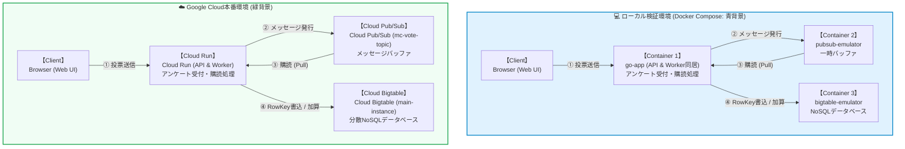
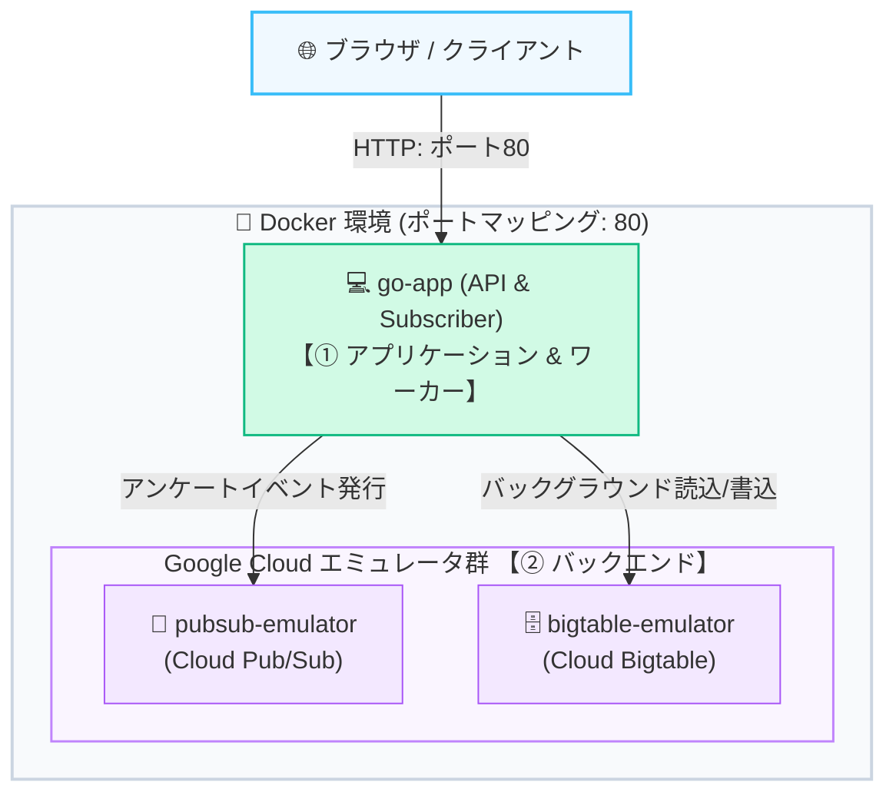

<!-- GTE_PUBLISHED: true -->

<!-- 000 タイトル定義 -->
# アンケート集計システムの構築のため、秒間数万件のアクセスを華麗に捌くならBigtableしかないよね？
<!-- 000 タイトル定義 -->

<!-- 001 冒頭イメージ画像挿入エリア -->

<!-- 001 冒頭イメージ画像挿入エリア -->

<!-- 002 導入部：背景となる課題とシステム化の動機 -->
今日も私のマイクラサーバーにはお客さんが遊びに来てくれません。今夜も寂しさで枕を濡らします。
しかし昨晩、私は夢の中で、たくさんの住人でにぎわっている夢を見たのです。これはきっと正夢に違いありません。
もし、そんな私のサーバーで、仮にプレイヤーに「アンケート」を採ってみたときに、基盤がぜい弱で落ちてしまうことがあっては、またさみしいサーバーに戻ってしまいます。
そんなことなど絶対にあってはなりません。もしもの時に備え、世界の裏側からポチポチされても、びくともしない堅牢なネザライトフルエンチャントの盾ばりの鉄壁のガードを考えてみたいと思います。
それならば・・・。
**「私のサーバーに数万人のプレイヤーが同時にログインして、秒間1万リクエストのアンケート送信スパイクが来たらどうしよう…？」**
**「投票トランザクションの書き込みバーストでデータベースがボトルネックになり、サーバーのTPS（Tick Per Second）が低下してラグが発生したらどうしよう…？」**

こんな不安とはおさらばだと、私は決断しました！
**「だったら、世界の何億ユーザーのビッグデータをリアルタイム並行処理している、Google Cloudの大規模分散NoSQL『Cloud Bigtable』で作ってしまえばいいじゃん！」** と。

Bigtableの「ミリ秒未満の超低遅延書き込み」「リニアな水平スケーリング」、そしてPub/Subの「一時バッファによる非同期デカップリング」があれば、どれだけ何万人ものプレイヤーが狂ったようにアンケート回答ボタンを連打しようとも、すべての回答ログを時系列で完璧に受け止めることができます。

ただ、いきなり本物のCloud BigtableインスタンスをGoogle Cloud上で常時起動するのは、コスト面（起動しているだけで月額約65,000円（$400）以上の基本料金が発生するブルジョアNoSQL）で個人の財布が瞬く間に破産します。

そこでまずは、Google公式の**「Bigtable Emulator」**と**「Pub/Sub Emulator」**をDocker環境で組み合わせ、**クラウド利用料ゼロのローカル環境**で「高負荷に強くラグらない堅牢なマイクラアンケート集計システム」を構築・検証する手順を公開します。

> [!IMPORTANT]
> **⚠️ 既存のマイクラ用投票プラグイン等との関係について**
> 本記事で構築する集計システムは、独自のWeb UIとAPI（Go言語）を介して投票を受け付ける独自のWebアプリケーションデモです。マインクラフトのサーバー管理において一般的に使われている投票連携プラグイン（**Votifier**、**NuVotifier** など）や、既存のアンケートプラグイン等とは一切関係がありません。インゲームと完全に連携させたい場合は、別途Go言語のAPIサーバーをプラグインから叩くなどのカスタム実装が必要となります。あくまでイベント駆動型データ集計基盤の技術デモとしてご参照ください。
<!-- 002 導入部：背景となる課題とシステム化の動機 -->

---

<!-- 003 本記事の概要（3行まとめ） -->
> **💡 この記事の3行まとめ（忙しい人向け）**
> 1. **解決する課題**: 1秒間に数万件のアンケート投票が集中する過酷な負荷環境における、従来型RDBのスケール限界と書き込み競合を解決。
> 2. **採用したアーキテクチャ**: 高いスループットを誇る分散 NoSQL である Cloud Bigtable と、メッセージバッファリングおよび行キーを動的に生成する Pub/Sub ＋ 非同期ワーカー。
> 3. **実証成果**: 行キーのソルト化によるホットスポットの完全回避、および Pub/Sub とエミュレータを利用した非同期処理パイプラインの検証と、本番に向けたアトミック集計（ReadModifyWrite）を利用したアーキテクチャ設計。

<!-- 003 本記事の概要（3行まとめ） -->


<!-- 100 🏗️ 1. アーキテクチャ概要 -->
<br><br>
## 🏗️ アーキテクチャ概要
<!-- 100 🏗️ 1. アーキテクチャ概要 -->

<!-- 101 セクション1導入課題・動機解説 -->
### 高頻度メッセージを支える分散NoSQLとメッセージング設計

マインクラフトのマルチサーバーなどのゲームシステムにおいて、プレイヤー全員から同時に回答を収集するアンケートや投票システムは、一時的に非常に高頻度な書き込みアクセスを発生させます。一般的なリレーショナルデータベース（RDB）に直接同期書き込みを行うと、データベースのブロッキングが原因でゲーム本体のメインスレッド（TPS：Tick Per Second）に影響を及ぼし、ラグを発生させる恐れがあります。

この課題に対するアプローチとして、書き込み処理を非同期化するメッセージキュー（**Cloud Pub/Sub**）と、ミリ秒未満の圧倒的な書き込み性能を誇る分散NoSQLデータベース（**Cloud Bigtable**）を組み合わせたイベント駆動型アーキテクチャが有効です。本記事では、この構成の設計要件を整理し、ローカル開発環境で動作検証を容易にするためにエミュレータ群を用いた構成手順を解説します。
<!-- 101 セクション1導入課題・動機解説 -->

<!-- 102 システム全体構成の解説 -->
### システム構成図（データフロー）


<!-- 102 システム全体構成の解説 -->

<!-- 103 システムアーキテクチャ図（Mermaid） -->



<!-- 103 システムアーキテクチャ図（Mermaid） -->

> ※ローカル検証および Cloud Run では、リソース効率と運用のシンプル化のため、1つの Go プロセス内で Goroutine を用いて「API受付」と「Pub/Sub サブスクライバー（Worker）」を並行稼働させています。

---

<!-- 104 コアロジックの抜粋と解説 -->
### 💫 本構成のインフラ特徴と設計思想

> [!NOTE]
> **💡 Bigtableの構成について**
> - **キー空間の分散（ソルト化）**: 行キーの先頭にランダムなプレフィックス（`00#`〜`49#`）を付与してキー空間を50個の論理シャードへ分散し、特定タブレットへのアクセス集中（ホットスポット）を防ぎます（※50台の物理サーバーを意味するものではありません）。
> - **直近ログの効率的取得（逆転タイムスタンプ）**: 逆転タイムスタンプ（`MaxInt64 - timestamp`）を行キーに組み込むことで、最新データをキー順の先頭に集め、標準的な前方レンジスキャンで最新順のログを効率よく取得できるようにします。
> - **高速アトミック集計（ReadModifyWrite）**: 単一行に対して `ApplyReadModifyWrite` でアトミックにリアルタイム加算集計を行います（※特定キーへの極端なアクセス集中による行ロック/Row Lock競合を防ぐため、大容量環境ではカウンターキー自体をソルト化して分散保持します）。
> - **スパイクトレランスと高い拡張性**: 突発的なアクセススパイクを Pub/Sub で安全に吸収・バッファリングし、Bigtable へ非同期で書き込むことで、高負荷に強い堅牢なシステムを実現します。
> - **ダッシュボード用の一覧集約**: 本ハンズオンの簡易ダッシュボードでは、ソルト分散されたシャードから最新データを一覧表示するために全件スキャン（`InfiniteRange`）を行いメモリ上でソート集約しています（※実務の大規模運用では、キー範囲指定スキャンや BigQuery / Dataflow を用いた集計パイプラインを構築するのがベストプラクティスです）。
<!-- 104 コアロジックの抜粋と解説 -->

---

<!-- 105 データベース等の技術比較の解説 -->
### データベース選定とアーキテクチャの比較検証

高負荷アンケート回答をリアルタイムかつ低遅延で集計するための、データベースごとの適合度を以下に示します。

| 評価軸 | Cloud Bigtable (本構成) | Cloud Firestore (Native Mode) | Google BigQuery |
| :--- | :--- | :--- | :--- |
| **基本データモデル** | ワイドコラム NoSQL | ドキュメント指向 NoSQL | カラムナ型データウェアハウス |
| **スケーラビリティ** | ノード追加による線形なスケールアウト | 自動スケールアウト（単一ドキュメント制限あり） | ペタバイト規模の自動スケール（OLAP最適化） |
| **書込レイテンシ** | 1桁ミリ秒の超低レイテンシ | 数十〜数百ミリ秒 | 数百ミリ秒〜数秒（バッチ/ストリーミング） |
| **単一キー書込制限** | 単一行集中はボトルネックになり得る（適切なRow Key設計が必要） | 単一ドキュメントへの高頻度更新は競合ボトルネックになり得る | 行単位の即時更新不可（追記型ストリーミング） |
| **リアルタイム集計** | クライアント側または Dataflow での集計が必要 | リアルタイムリスナー対応（高QPSには不適） | クエリによるバッチ集計（準リアルタイム） |


<!-- 105 データベース等の技術比較の解説 -->

---

<!-- 106 GitHubリポジトリへのリンク -->
:::note info
📂 すべての設定ファイルと完全なコードはこちらのGitHubリポジトリで公開しています

👉 [**github.com/kuiswin/173-minecraft-vote**](https://github.com/kuiswin/173-minecraft-vote)
*(※本リポジトリのソースコードおよびスクリプトは個人・学習・検証目的でご活用いただけます。商用本番環境での利用は自己責任でお願いします。)*
:::

> ※本リポジトリのコードおよび記事のロジック構築には**生成AIを活用**しています。動作確認は行っておりますが、AI特有の誤ったコード生成（ハルシネーション）や仕様変更、意図しない不具合等が含まれる可能性があります。本番環境へ適用される場合は、セキュリティやクラウド費用（FinOps）をご自身でご確認の上、**自己責任**にてご運用ください。
<!-- 106 GitHubリポジトリへのリンク -->


<!-- 200 💻 2. ローカル環境での検証 ＆ 稼働手順 -->
<br><br>
## 💻 ローカル環境での検証 ＆ 稼働手順
<!-- 200 💻 2. ローカル環境での検証 ＆ 稼働手順 -->

<!-- 201 フォルダ構成 -->
ローカルPCの環境に、以下の構成ファイルを配置して起動確認を行います。
検証に必要なソースコードはすべてGitHub上に公開されています。

* 📄 [**docker-compose.yml**](https://github.com/kuiswin/173-minecraft-vote/blob/main/docker-compose.yml) (各種エミュレータとGo APIの起動構成定義)
* 📄 [**Dockerfile**](https://github.com/kuiswin/173-minecraft-vote/blob/main/go-app/Dockerfile) (Goアプリ起動用コンテナビルド定義)
* 📄 [**go.mod**](https://github.com/kuiswin/173-minecraft-vote/blob/main/go-app/go.mod) / [**go.sum**](https://github.com/kuiswin/173-minecraft-vote/blob/main/go-app/go.sum) (Goモジュール依存定義およびチェックサム)
* 📄 [**main.go**](https://github.com/kuiswin/173-minecraft-vote/blob/main/go-app/main.go) (アンケートAPI・Pub/Subサブスクライバ・Bigtable書込Goコード)
* 📄 [**index.html**](https://github.com/kuiswin/173-minecraft-vote/blob/main/go-app/public/index.html) (投票ボタンおよび統計可視化Web UI)
* 📄 [**app.js**](https://github.com/kuiswin/173-minecraft-vote/blob/main/go-app/public/app.js) (投票API呼び出しとリアルタイム集計JS)
* 📄 [**style.css**](https://github.com/kuiswin/173-minecraft-vote/blob/main/go-app/public/style.css) (グラスモーフィズムデザイン装飾CSS)

### 📁 フォルダ構成
```text
sandbox_173/
├── docker-compose.yml
└── go-app/
    ├── Dockerfile
    ├── go.mod
    ├── go.sum
    ├── main.go
    └── public/
        ├── app.js
        ├── index.html
        └── style.css
```
<!-- 201 フォルダ構成 -->

<!-- 202 ローカル動作確認コマンド -->
### ローカルでの動作確認について

本システムでは、ローカル環境で「本番と同じ挙動」を再現できるよう、Docker Composeを用いたコンテナ型のエミュレータ（Bigtableエミュレータなど）を組み合わせて検証を行います。

GitHub上に公開されているソースコードを一つずつコピーしてフォルダに配置し、Docker環境を手動で立ち上げることで動作確認自体は可能ですが、ファイル構成の作成や依存関係のインストール、環境変数のマッピング設定を手動で行うのは少々手間がかかります。

より簡単かつスピーディーにローカルでの動作確認を行いたい方は、記事の後半で紹介する私の個人ブログをご参照ください。

<!-- 202 ローカル動作確認コマンド -->

---

---

<!-- 204 開発環境へのアクセス情報 -->
### 開発環境へのアクセス情報

コンテナが起動したら、ブラウザから以下のURLへアクセスします。

#### 🔹 ローカル環境（ご自身のPCなど）で動かす場合

* **アンケート収集 Web UI**: [http://localhost/](http://localhost/)
  *(※ブラウザでアクセスすると、綺麗なグラスモーフィズムデザインの画面で集計バーがリアルタイムに更新され、最新ログとしてBigtableからスキャンされたキーが生データで確認できます)*


* **CLIでのデータベース生データ確認（検証用）**:  
  ブラウザを使わず、ターミナルから以下のコマンドをコピペして実行するだけで、コンテナにプリインポートされた `cbt` ツールを通じてBigtableの生データを直接スキャン・表示できます。

```bash
# 作業ディレクトリへの移動（未移動時のみ自動移動）
[ -d "sandbox_173" ] && cd sandbox_173

# cbt ツールによる Bigtable 生データ（直近5件）のスキャン
docker compose exec go-app cbt read votes_timeseries count=5
```

**【出力結果例（cbt CLI での生データ確認）】**

```text
----------------------------------------
"08#vote#7436527695834724826#Player_Steve"
  "stats:item"                             @ 2026/08/16-01:39:01.038000
    "Gold"
  "stats:timestamp"                        @ 2026/08/16-01:39:01.038000
    "2026-08-16T01:39:01Z"
  "stats:username"                         @ 2026/08/16-01:39:01.038000
    "Player_Steve"

----------------------------------------
"34#vote#7436527697330360716#Player_Steve"
  "stats:item"                             @ 2026/08/16-01:38:59.634000
    "Diamond"
  "stats:timestamp"                        @ 2026/08/16-01:38:59.634000
    "2026-08-16T01:38:59Z"
  "stats:username"                         @ 2026/08/16-01:38:59.634000
    "Player_Steve"

```

> **💡 読み取れる技術的ポイント**
> - 各行の先頭キー（`08#...` や `34#...`）を見ると、先頭の2桁シャードID（ソルト）によって書き込みデータがキー空間全体へ均等分散されていることが確認できます。
> - `agg#item#Diamond` 行には、`stats:count` として Bigtable の `ReadModifyWrite`（アトミックインクリメント）によるリアルタイム集計カウンター（8バイトバイナリ値）が正しく加算・記録されています。

<br>

#### 🔹 【検証用】筆者の自動公開デモ環境

筆者のプライベート環境では、コンテナを立ち上げるだけで自動的にドメインとSSLが割り当てられる検証環境を用意しています。以下のURLから動作検証が可能です。

* **アンケート収集 Web UI**: [https://mc-p80-173.kuis.win/](https://mc-p80-173.kuis.win/)
<!-- 204 開発環境へのアクセス情報 -->

---

<!-- 205 コンテナ構成の解説 -->
### 📦 コンテナ内部の構成

今回の構成（Docker環境）内では、以下の3つのDockerコンテナが協調して動作しています。



1. **`bigtable-emulator` 【公式イメージ / 無改造】**:
   - **イメージ**: `gcr.io/google.com/cloudsdktool/google-cloud-cli:emulators`
   - **役割**: Google公式の Cloud Bigtable エミュレータ本体。ローカルPCで Bigtable API の挙動をシミュレートし、ポート 8089 を公開します。
2. **`pubsub-emulator` 【公式イメージ / 無改造】**:
   - **イメージ**: `gcr.io/google.com/cloudsdktool/google-cloud-cli:emulators`
   - **役割**: Google公式の Cloud Pub/Sub エミュレータ本体。メッセージキューのパブリッシュ/サブスクライブ処理をシミュレートし、ポート 8085 を公開します。
3. **`go-app` 【独自開発 / アプリ・ワーカー一体型】**:
   - **イメージ**: `Dockerfile` よりローカルビルド
   - **役割**: Go言語で書かれたバックエンドアプリケーション。ブラウザからアンケート送信を受け取る REST API （ポート 80）と、Pub/Subから回答データをバックグラウンド購読（Subscribe）してBigtableへソルトと逆転タイムスタンプをキーに書き込む非同期ワーカーの両方を司ります。
<!-- 205 コンテナ構成の解説 -->


---

#### 💡 コラム：なぜ面倒な「ソルト」と「逆転タイムスタンプ」を組み合わせるのか？

時系列のデータを保存する際、なぜ普通に `vote#<現在の時刻>` として保存せず、わざわざ先頭にランダムな数（ソルト）を置き、さらに時刻を引き算して逆転させているのでしょうか？
これには、分散データベースである Cloud Bigtable の物理的な仕組みが関係しています。

##### なぜ「逆転タイムスタンプ」にするのか？
Bigtableは、書き込まれた時間順ではなく、**「行キー（RowKey）の小さい順（辞書順）」** に自動でデータを並べ替えて保存します。

*   **正順（普通の時間）で保存した場合**:
    時間は経つほど大きくなるため、最新データは自動的に「一番下（末尾）」に並べ替えられます。
    Bigtable には「逆順読み取り（リバーススキャン）」機能も備わっていますが、内部ストレージ（SSTable）がブロック単位で正順に管理されているため、範囲の先頭から自然に読み進める**前方スキャン（正順スキャン）**は極めて効率的なアクセスパターンです。
*   **逆転（最大値 − 現在時間）で保存した場合**:
    時間が経つほど数値が小さくなるため、最新データが自動的に「一番上（先頭）」に並びます。
    これなら、先頭（`00#vote#`）から読み始めて、**「上から50枚だけ取って、その場でストップ！」** することができるため、範囲の先頭から最新ログを素早く取得できます。

> **📖 バインダーとクリップボードの例え**
> *   **正順（普通の時間）**: ルーズリーフに日記を書き、時系列順を守るために**「新しいページは必ず一番最後（末尾）に追加しなければならない」**という絶対ルールがあるバインダーです（これ以外の場所に挟むと時系列順が崩壊するため、末尾への追加がシステムから強制されます）。そのため、「直近3日の日記を見せて」と言われたら、バインダーの最初のページから順に何百枚もめくって、一番後ろにある最新ページまでたどり着く必要があります。
> *   **逆転タイムスタンプ**: クリップボードに日記を書き、**「常に一番上に新しい紙を重ねていく」** スタイルです。「直近3日の日記を見せて」と言われたら、めくることなく一番上の3枚を取るだけで終わります。

###### じゃあ、なぜそれを「先頭」に置いてはいけないのか？（ソルトの役割）
「それなら逆転タイムスタンプを先頭に置いて `9223372019640187807#vote#User` にすればいいじゃないか」と思いますよね。

先頭にランダムな数 `00#`〜`49#` を置く（ソルト化）ことで、同じ瞬間の1万件のデータが**50個の論理シャード（タブレット / Tablet）に綺麗に分散**されます。Bigtable はこれらのタブレットをクラスタ内のノードへ動的に割り当てて負荷を分散するため、単一のキー範囲への集中（ホットスポット）を回避できます。

「書き込み負荷を論理シャード全体へ分散させつつ（ソルト）」、「最新ログを自然な前方スキャンで取り出す（逆転タイムスタンプ）」という、NoSQLの性能を引き出すための定番の組み合わせなのです。

> 💡 **補足：行キーに `vote#` のネームスペースを挟む設計的理由**
> 単一のアンケート機能であれば `00#<逆転タイムスタンプ>` でも動作しますが、本設計であえて `00#vote#<逆転タイムスタンプ>` と `vote#` を固定文字列として挟んでいるのは、将来的に同じ Bigtable テーブル内にマイクラの「チャットログ（`chat#`）」や「ログイン履歴（`login#`）」などを同居させるマルチテナント・マルチログ設計を見据えたネームスペース（分割識別子）です。

###### 【重要】ソルトがランダムなら、読み取り時にどのシャードをスキャンすればいいか分からないのでは？

「書き込み時に `00`〜`49` のランダムなシャードIDを先頭に付与して分散させるのは分かった。でも、データを読み取るときはどのシャードIDを指定すればいいの？ アプリ側は `02` なのか `49` なのか分からないのでは？」

この疑問は、分散データベース設計における最大の「ツボ」です。

分散データベースにおけるソルト化されたデータの読み取りには、以下の2つのアプローチがあります：

1. **ハンズオン向けシンプル実装（本コードの方式）**:
   * 小規模な検証環境では、Bigtable から一定件数のレコードを取得し、アプリケーションのメモリ上でタイムスタンプ順にソートして最新データを抽出します。
2. **商用大規模環境向け並列マルチスキャン（Scatter-Gather パターン）**:
   * 本番の大規模システムでは、Goの並行処理（Goroutine等）を活用して `00#vote#` 〜 `49#vote#` の各プレフィックス範囲に対して同時に並列スキャンリクエストを送信（**Scatter**）し、各シャードから取得した最新件数をメモリ上で合流・ソート（**Gather**）して全体の最新データを集約する **「Scatter-Gather パターン」** を適用することで、全テーブルのフルスキャンを回避して効率的な集約を行います。

「書き込み時は論理シャードへ綺麗に分散（ソルト）」し、「大規模読み取り時は並列スキャンで集約（Scatter-Gather）」することで、超大規模データでも安定したレイテンシを維持できるのが NoSQL 設計の真骨頂です。

###### 💡 発展コラム：172番の記事（Spanner）におけるホットスポット回避との違い

前回の記事（[172：Spanner編](https://qiita.com/kuiswin/items/172)）を読まれた方は、「あれ？Spannerでも書き込みホットスポットの回避について説明していなかったっけ？」と気づかれたかもしれません。

その通りです！「データを複数の物理ノードに並列分散させて負荷集中を避ける」という根本的な物理課題は、Spanner（NewSQL）でもBigtable（NoSQL）でも全く同じです。しかし、その**解決アプローチ（データベースとアプリケーションの役割分担）**には、両者の設計思想の違いが明確に現れています。

| 項目 | 🛠️ Spanner（172番の記事） | 📦 Bigtable（173番の記事） |
| :--- | :--- | :--- |
| **データの分散方法** | **UUIDv4** を主キーに使う、または自動でビットを反転させる（`SERIAL`） | 行キーの先頭に手動で **シャードID（`00#`〜`49#`）** を付与する（ソルト化） |
| **時系列での検索方法** | 普通にSQLで `ORDER BY timestamp DESC` と書くだけ | 行キーの後半に **逆転タイムスタンプ** を埋め込む |
| **裏側の合流処理（マージ）** | **Spannerが自動で** 全ノードから並列で吸い上げてマージしてくれる | **Goアプリが手動で** 50本の並列クエリを投げてマージするコードを書く |

*   **Spanner（高級な分散SQL）**:
    高性能なクエリエンジン（SQL実行部）を内蔵しているため、アプリ側は「キーをランダム（UUID）にして分散させる」ことだけ意識すれば、データの時系列ソートや並列集計は**Spannerが裏で全部勝手にやってくれます**。
*   **Bigtable（低レイヤで極限までシンプルなNoSQL）**:
    余計な機能を削ぎ落として「超低遅延・超低コスト・超大量書き込み」に特化しているため、Spannerのように自動でマージしてくれる賢いSQLエンジンがありません。そのため、今回の記事のように**「ソルト＋逆転タイムスタンプ」を自前でキーに設計し、アプリ側で並列スキャンしてマージするコードを書く**必要があります。

「SpannerはDB側で賢く解決し、Bigtableはアプリ側で汗をかいて超高速化する」というこのアプローチの違いを知ると、各データベースのキャラクターが際立って非常に面白いですね！

---

<!-- 301 ローカル検証環境の一括セットアップ -->
### 📂 ローカル検証環境の一括セットアップ

以下のコマンドを実行することで、依存ツールのインストールから検証に必要な設定ファイル群のGit取得、Docker起動まで一括でローカルに構築できます。

```bash
# 依存ツールのインストール (未導入の場合)
sudo apt-get update && sudo apt-get install -y docker.io docker-compose-v2 git

# リポジトリのクローンと作業ディレクトリへの移動
git clone https://github.com/kuiswin/173-minecraft-vote.git sandbox_173
cd sandbox_173

# コンテナのビルドとバックグラウンド起動
docker compose up -d --build
```

> [!NOTE]
> ⏳ **初回イメージダウンロードの所要時間について（約1分〜2分）**  
> 初回起動時は、Google公式エミュレータ（`cloudsdktool/google-cloud-cli:emulators` 約450MB）のダウンロードとGoコンテナのビルドが行われます。ネットワーク環境によってはダウンロードに **約1〜2分程度** かかります。
> 画面上でプログレスバーが止まっているように見えても、裏側で巨大なエミュレータイメージの展開（Pulling）が進行していますので、そのまま完了をお待ちください。


コンテナの起動開始後、以下のコマンドを実行してGoアプリのログを監視し、各種初期化処理が完了するのを待ちます（初回起動時はエミュレータのウォームアップに約1分ほどかかる場合があります）。

```bash
# 起動状況のログ監視（正常起動を確認したら Ctrl + C で抜けてください）
docker compose logs -f go-app
```

**正常起動時のログ出力例:**
```text
Starting Minecraft Vote service. Project: local-project, Instance: minecraft-instance
Creating Pub/Sub topic: minecraft-votes
Creating Pub/Sub subscription: minecraft-votes-sub
Creating Bigtable table: votes_timeseries
Creating Column Family: stats
Worker: Starting subscriber for minecraft-votes-sub
```

<!-- 301 ローカル検証環境の一括セットアップ -->

<!-- 207 次のステップ（クラウド本番展開への案内）
### 🚀 次のステップ：本番（クラウド）展開へ

ローカル環境での時系列データ非同期処理テストが完璧に成功したら、次はいよいよ本番環境へのデプロイメントです！

本番環境（Google Cloud）に持っていくためには、アクセス急増時にクラウド利用料金が跳ね上がるのを防ぐためのセキュリティ・コスト制御が不可欠です。

本番展開の設計思想や、一発自動デプロイスクリプトの実装方法については、以下の個人技術ブログで詳細に公開しています！

👉 [**【後編：Google Cloud本番デプロイ編】本番一発自動デプロイとFinOpsコスト防衛手順はこちら（ブログ記事リンク）**](https://kuis.win/173/)
-->


<!-- 208 メディア境界線：Qiita（ローカル検証）／ 独自ブログ（本番展開） -->
<!-- このセクション以降の内容は、個人技術ブログ（kuis.win）に掲載されます -->
<!-- 208 メディア境界線：Qiita（ローカル検証）／ 独自ブログ（本番展開） -->


---

<!-- 300 🧪 3. 負荷試験の準備と本番設計基準 -->
<br><br>
## 🧪 負荷試験の準備と本番設計基準
<!-- 300 🧪 3. 負荷試験の準備と本番設計基準 -->

---

<!-- 302 本番環境における設計基準の解説 -->
本番で安定してNoSQLによる投票システムを稼働し続けるために、以下の設計課題をクリアします。

- **① インフラ自動化の確立**: BigtableインスタンスやPub/Subトピックなど、必要なすべてのリソース構築手順のコード化。
- **② 行キー設計によるホットスポット回避**: ソルト化（Salting）や反転タイムスタンプを利用した、負荷集中を防ぐキー設計。
- **③ スケーリング戦略とトラフィック暖機運転**: 急激なアクセス集中に備えたプロアクティブなスケーリング（最小ノード数設定）とウォームアップ。
<!-- 302 本番環境における設計基準の解説 -->


<!-- 400 🚀 4. Google Cloud 共通プロビジョニング編 -->
<br><br>
---

### 🚨 ローカル検証の限界と、本番環境（Google Cloud）へのステップアップ

ここまでの手順で、ローカルDocker環境（エミュレータ）を使った動作検証は完了です！

ただし、ローカル環境はあくまでPC上のモック（エミュレータ）です。本物の Google Cloud API（Gemini Enterprise Agent Platform (旧称 Vertex AI)でのAI画像生成や翻訳API、本物のクラウドマネージドデータベース等）と連携した完全な動作は、実際のクラウド環境へデプロイして初めて本領を発揮します。

**ここから先は、いよいよ本物の Google Cloud 環境へデプロイしていきます！**

> [!WARNING]
> **⚠️ 厳重注意 ＆ 免責事項（商用・会社の共有アカウントでの実行は絶対禁止！）**
> 
> 本連載で提供するデプロイおよび「クリーンアップ・自己破壊スクリプト」は、**「不要な課金を防ぐためにリソースを即座に完全更地（削除）にする」** ことを最優先で設計されています。
> 
> もし既存の商用環境や、会社・チーム共有の Google Cloud アカウント/プロジェクトで本手順を実行した場合、**既存の重要なインフラやプロダクションデータまで一括で巻き添え削除され、復旧不可能な大惨事となる危険性があります。**
> 
> - **個人専用の隔離環境で実行せよ**: 本ハンズオンを試す場合は、既存環境や会社のインフラとは **「Google Cloud アカウント（環境）自体を完全に切り離した個人専用の独立検証アカウント（Sandbox / Playground）」** を作成した上で実行してください。
> - **ライセンス（完全MIT）**: 本連載のソースコードおよび構築スクリプトは、すべて **MITライセンス** です。商用・非商用問わず自由にご活用いただけます。
> - **完全自己責任の原則**: 会社や本番環境で本スクリプトを流用・実行した結果、データ損失、システム障害、課金損害が発生した場合でも、**筆者（投稿者）は一切の責任を負いかねます。** すべてご自身の責任において安全設計・ご利用を行ってください。


> [!WARNING]
> **⚠️ クラウド破産予防：サーバーレス型以外の「常時起動型リソース」放置にご注意ください！**
> 本連載では「アクセスが無ければ完全無料」となるよう Cloud Run 等のサーバーレス型サービスを徹底意識して設計していますが、**記事のテーマによってはサーバーレスではない常時起動型サービス（Cloud Spanner / Bigtable / AlloyDB などのデータベースインスタンス）を扱う回もあります。**
> 
> サーバーレス型と異なり、**常時起動型サービスはアクセスがゼロでも「起動したまま放置」しているだけで時間単位で課金が発生し続けます。** 本番デプロイを試した後は、必ず各記事の最後にある「🧹 クリーンアップ・自己破壊手順」を実行し、**ご自身の責任においてリソースの削除徹底をお願いいたします！**（※万が一のクラウド破産の責任は負いかねますので、各自で予算アラートを設定するなど自己防衛してください）

## 🚀 Google Cloud 共通プロビジョニング編
<!-- 400 🚀 4. Google Cloud 共通プロビジョニング編 -->

本番運用のベースとなるGoogle Cloudプロジェクトの設定、Artifact Registry（コンテナ保管庫）、および専用サービスアカウントの作成と最小権限の付与を自動化します。

<!-- 401 Google Cloud 共通プロビジョニングスクリプト -->
### 共通環境変数の設定 ＆ 基本プロジェクトIDの組み立ても兼ねる

自身のアカウント環境に合わせて設定を定義し、基本プロジェクトIDを組み立てます。（※ `KEYWORD` ・ `APP_PREFIX` ・ `ARTICLE_ID` の合計長は15文字以内にしてください）

```bash
echo ""
echo ""

# 共通環境変数の定義 (KEYWORD、APP_PREFIX、ARTICLE_IDは半角小文字英数字で、合計15文字以内 ※例:6+6+3=15文字以内)
KEYWORD="abcde"
APP_PREFIX="qm-app"
ARTICLE_ID="173"
PROJECT_NAME="Bigtable Vote - ${KEYWORD}"

# プロジェクトプレフィックスと基本プロジェクトIDの自動組み立て（全自動小文字化）
PROJECT_PREFIX=$(echo "${APP_PREFIX}-${KEYWORD}-${ARTICLE_ID}" | tr '[:upper:]' '[:lower:]')
PROJECT_ID="${PROJECT_PREFIX}"

# 使用予定プロジェクトIDの表示
echo ""
echo "----------------------------------------"
echo "📌 使用予定プロジェクトID: ${PROJECT_ID}"
echo "----------------------------------------"
echo ""

# 現在存在する関連プロジェクト一覧の目視確認
echo "🔍 事前チェック：現在の既存プロジェクト一覧 ('${KEYWORD}' 関連):"
gcloud projects list --filter="projectId ~ '${KEYWORD}' OR name ~ '${KEYWORD}' OR projectId='${PROJECT_ID}'"
```

> [!NOTE]
> **💡 使い回したくない・完全作り替え（新規作成）を行いたい場合**
> 
> 完全に真っ新な新しい環境で検証を行いたい場合のみ、上記の代わりに以下の行を実行して `PROJECT_ID` をタイムスタンプ付きで上書きしてください。
> 
> ```bash
> # タイムスタンプ付与でPROJECT_IDを上書き
> PROJECT_ID="${PROJECT_PREFIX}-$(date +%Y%m%d%H%M)"
> ```
> 
> *(※注意: Google Cloudの仕様上、プロジェクトを何度も新規作成・削除すると「30日間の削除保留期間」によりプロジェクト作成枠上限に達して作成不能になるリスクがあります。普段の検証は上記標準手順の既存プロジェクト使い回しを強く推奨します)*

> [!NOTE]
> **💡 手持ちの特定既存プロジェクトを固定指定して使い回したい場合**
> 
> すでに作成枠上限（Quota）に達している場合や、特定の既存プロジェクト（例: `ferrous-iridium-286000` やデフォルトプロジェクト）を直接固定指定して使用したい場合は、以下の行で `PROJECT_ID` を直接上書きしてください。
> 
> ```bash
> # 手持ちの特定既存プロジェクトIDを直接固定指定
> PROJECT_ID="ferrous-iridium-286000"
> ```

### Google Cloud環境の事前準備 ＆ 課金有効化（全自動ワンライナー）
直前のステップで組み立てた環境変数 `${PROJECT_ID}` を引き継ぎ、以下のワンライナーコマンドをターミナルで実行してください。
（※標準の `qm-app-abcde-173` 、タイムスタンプ付き新規プロジェクト、または特定既存プロジェクト `ferrous-iridium-286000` のいずれに設定した場合でも全自動で判定・適用されます）

```bash
bash <(curl -sSL -H 'Cache-Control: no-cache, no-store' https://raw.githubusercontent.com/kuiswin/gcp-common-tools/main/pre_flight.sh) ${PROJECT_ID}
```

### API・データアクセス監査ログの有効化 ＆ 共通リソース構築
選択したプロジェクト環境に対し、必要な Google Cloud API の有効化、Artifact Registry、Bigtable インスタンスおよび専用サービスアカウントの作成と権限付与を一括実行します。

```bash
REGION="asia-northeast1"
SERVICE_NAME="mc-vote-system"
SA_NAME="mc-vote-sa"

# プロジェクトIDの取得・確定
PROJECT_ID="${PROJECT_ID:-$(gcloud config get-value project 2>/dev/null)}"

# 0. 課金状態の事前チェック（休眠中の場合は自動で課金を起爆・有効化）
BILLING_ACTIVE=$(gcloud billing projects describe "${PROJECT_ID}" --format="value(billingEnabled)" 2>/dev/null | tr '[:upper:]' '[:lower:]')
if [ "${BILLING_ACTIVE}" != "true" ]; then
    echo "⚠️ 請求先アカウントが未有効（休眠状態）です。pre_flight.sh を呼び出して自動起爆します..."
    bash <(curl -sSL -H 'Cache-Control: no-cache, no-store' https://raw.githubusercontent.com/kuiswin/gcp-common-tools/main/pre_flight.sh) "${PROJECT_ID}" </dev/null
fi

# 1. 必要な拡張APIの一括有効化 (--quiet で対話プロンプトを自動スキップ)
gcloud services enable \
    bigtable.googleapis.com \
    bigtableadmin.googleapis.com \
    pubsub.googleapis.com \
    run.googleapis.com \
    cloudbuild.googleapis.com \
    artifactregistry.googleapis.com \
    monitoring.googleapis.com \
    logging.googleapis.com \
    --quiet

# データアクセス監査ログの一括有効化（既存IAM権限を保持したまま安全にマージ・設定済み時は自動スキップ）
gcloud projects get-iam-policy "${PROJECT_ID}" --format="json" 2>/dev/null | grep -q "auditConfigs" || \
(gcloud projects get-iam-policy "${PROJECT_ID}" --format="json" | jq '.auditConfigs = [{"service":"allServices","auditLogConfigs":[{"logType":"ADMIN_READ"},{"logType":"DATA_READ"},{"logType":"DATA_WRITE"}]}]' > /tmp/iam_policy.json && \
 gcloud projects set-iam-policy "${PROJECT_ID}" /tmp/iam_policy.json --quiet >/dev/null 2>&1 || true)

# 2. BigtableインスタンスおよびPub/Subリソースの作成（存在チェック付き完全べき等作成）
gcloud bigtable instances describe main-instance &>/dev/null || \
gcloud bigtable instances create main-instance \
    --display-name="Main Instance" \
    --cluster-config=id=main-cluster,zone=${REGION}-a,nodes=1 \
    --cluster-storage-type=SSD \
    --quiet

# --- Bigtable インスタンスの正常起動待機（READY になるまで自動同期待機） ---
echo "⏳ Cloud Bigtable インスタンスの作成完了を待機中..."
while true; do
    STATUS=$(gcloud bigtable instances describe main-instance --format="value(state)" 2>/dev/null || echo "CREATING")
    if [ "${STATUS}" = "READY" ]; then
        echo "✅ Cloud Bigtable インスタンスの準備が完了しました！ (STATUS: READY)"
        break
    fi
    echo "   ...Bigtableインスタンス準備中 (現在のステータス: ${STATUS})... 5秒後に再確認します"
    sleep 5
done

# 3. Bigtable テーブル・カラムファミリーの作成
gcloud bigtable tables describe votes_timeseries --instance=main-instance &>/dev/null || \
gcloud bigtable tables create votes_timeseries \
    --instance=main-instance \
    --column-families="stats,raw:maxage=5d" \
    --quiet

gcloud pubsub topics describe mc-vote-topic &>/dev/null || \
gcloud pubsub topics create mc-vote-topic --quiet

gcloud pubsub subscriptions describe mc-vote-sub &>/dev/null || \
gcloud pubsub subscriptions create mc-vote-sub --topic=mc-vote-topic --quiet

# 4. Artifact Registry の作成
gcloud artifacts repositories describe ${SERVICE_NAME}-repo --location=${REGION} &>/dev/null || \
gcloud artifacts repositories create ${SERVICE_NAME}-repo \
    --repository-format=docker \
    --location=${REGION} \
    --description="Minecraft vote App Docker repository" \
    --quiet

# 5. 専用サービスアカウントの作成と最小権限の付与
SA_EMAIL="${SA_NAME}@${PROJECT_ID}.iam.gserviceaccount.com"
gcloud iam service-accounts describe ${SA_EMAIL} &>/dev/null || \
gcloud iam service-accounts create ${SA_NAME} --display-name="Minecraft Vote Consumer SA" --quiet

# Bigtable/PubSub等の必要ポリシー付与
gcloud projects add-iam-policy-binding ${PROJECT_ID} \
    --member="serviceAccount:${SA_EMAIL}" \
    --role="roles/bigtable.user" \
    --quiet

gcloud projects add-iam-policy-binding ${PROJECT_ID} \
    --member="serviceAccount:${SA_EMAIL}" \
    --role="roles/pubsub.subscriber" \
    --quiet

gcloud projects add-iam-policy-binding ${PROJECT_ID} \
    --member="serviceAccount:${SA_EMAIL}" \
    --role="roles/pubsub.publisher" \
    --quiet

gcloud projects add-iam-policy-binding ${PROJECT_ID} \
    --member="serviceAccount:${SA_EMAIL}" \
    --role="roles/pubsub.viewer" \
    --quiet
```

**【出力結果例】**
```text
Creating bigtable instance main-instance...done.
Created table [votes_timeseries].
Created topic [projects/ferrous-iridium-286000/topics/mc-vote-topic].
Created subscription [projects/ferrous-iridium-286000/subscriptions/mc-vote-sub].
Created repository [mc-vote-system-repo].
Created service account [mc-vote-sa].
Updated IAM policy for project [ferrous-iridium-286000].
```
<!-- 401 Google Cloud 共通プロビジョニングスクリプト -->


<!-- 500 🚀 5. Google Cloud 個別リソース構築編 -->
<br><br>
## 🚀 Google Cloud 個別リソース構築編
<!-- 500 🚀 5. Google Cloud 個別リソース構築編 -->

<!-- 501 Google Cloud 個別リソース構築スクリプト -->
本アプリケーションの個別構成（コンテナビルド・デプロイと Cloud Run 固有の設定）をデプロイします。

```bash
# 作業ディレクトリへの移動 ＆ 最新コードの自動同期（未取得の場合は自動クローン）
if [ -d "sandbox_173" ]; then
    cd sandbox_173
elif [ -d "/tmp/sandbox_173" ]; then
    cd /tmp/sandbox_173
else
    cd /tmp && git clone https://github.com/kuiswin/173-minecraft-vote.git sandbox_173 2>/dev/null || true
    cd sandbox_173
fi
git pull origin main --quiet 2>/dev/null || true
cd go-app

REGION="${REGION:-asia-northeast1}"
SERVICE_NAME="${SERVICE_NAME:-mc-vote-system}"
SA_NAME="${SA_NAME:-mc-vote-sa}"
SA_EMAIL="${SA_EMAIL:-${SA_NAME}@${PROJECT_ID:-$(gcloud config get-value project 2>/dev/null)}.iam.gserviceaccount.com}"

# 1. Cloud Runへのソースベース・デプロイ (Cloud Build連携による一発デプロイ)
gcloud run deploy ${SERVICE_NAME} \
    --source . \
    --platform managed \
    --region ${REGION} \
    --allow-unauthenticated \
    --service-account=${SA_EMAIL} \
    --set-env-vars="GCP_PROJECT_ID=${PROJECT_ID},BIGTABLE_INSTANCE_ID=main-instance,PUBSUB_TOPIC_ID=mc-vote-topic,PUBSUB_SUB_ID=mc-vote-sub" \
    --concurrency 1 \
    --cpu 0.08 \
    --execution-environment gen1 \
    --memory 256Mi \
    --max-instances 5 \
    --quiet
```

> [!NOTE]
> ⏳ **コンテナビルドの所要時間について（約3分〜5分）**  
> ソースコードからのコンテナビルド ＆ デプロイ（Cloud Build）には、**約 3分〜5分程度** かかります。ターミナルに `Done.` および `Service URL:` が出力されるまでそのまま画面を閉じずにお待ちください。

### 📱 デプロイ完了後のアンケートポータル画面 (Minecraft Survey Portal)

デプロイ後に発行された `SERVICE_URL` をブラウザで開くと、以下のリアルタイムアンケート集計画面が表示されます：


#### 🔍 Cloud Run ＆ Bigtable 書き込みログのリアルタイム確認
デプロイ後、Cloud Run コンテナによる Bigtable への非同期書き込み・集計ログを確認するには、以下のコマンドを実行します：

```bash
# Bigtable 書き込み・投票イベントログの監視
gcloud logging read "resource.type=cloud_run_revision AND resource.labels.service_name=${SERVICE_NAME} AND textPayload:*" \
    --limit=20 \
    --format="table(timestamp, textPayload)"
```

**【実行ログ確認例（Bigtable 書き込み成功時）】**

```text
TIMESTAMP                    TEXT_PAYLOAD
2026-08-16T02:19:04.041842Z  2026/08/16 02:19:04 Worker: Successfully saved vote key 36#vote#7436525293312245750#Player_Steve to Bigtable.
2026-08-16T02:19:04.020174Z  2026/08/16 02:19:04 Worker: Received vote message: {"username":"Player_Steve","item":"Diamond","timestamp":"2026-08-16T02:19:03.542530057Z"}
2026-08-16T02:19:04.010803Z  2026/08/16 02:19:04 Worker: Successfully saved vote key 18#vote#7436525293988439414#Player_Steve to Bigtable.
2026-08-16T02:19:03.587983Z  2026/08/16 02:19:03 API: Published vote from Player_Steve for Diamond
2026-08-16T02:19:02.920287Z  2026/08/16 02:19:02 API: Published vote from Player_Steve for Emerald
2026-08-16T02:19:02.899597Z  2026/08/16 02:19:02 Worker: Received vote message: {"username":"Player_Steve","item":"Emerald","timestamp":"2026-08-16T02:19:02.866336393Z"}
2026-08-16T02:19:02.820350Z  2026/08/16 02:19:02 Worker: Successfully saved vote key 44#vote#7436525294519994224#Player_Steve to Bigtable.
2026-08-16T02:19:02.670975Z  2026/08/16 02:19:02 Worker: Received vote message: {"username":"Player_Steve","item":"Gold","timestamp":"2026-08-16T02:19:02.334781583Z"}
2026-08-16T02:19:02.420394Z  2026/08/16 02:19:02 Worker: Successfully saved vote key 10#vote#7436525295134906966#Player_Steve to Bigtable.
2026-08-16T02:19:02.420257Z  2026/08/16 02:19:02 API: Published vote from Player_Steve for Gold
2026-08-16T02:19:02.320394Z  2026/08/16 02:19:02 Worker: Received vote message: {"username":"Player_Steve","item":"Netherite","timestamp":"2026-08-16T02:19:01.719868841Z"}
2026-08-16T02:19:01.769073Z  2026/08/16 02:19:01 API: Published vote from Player_Steve for Netherite
2026-08-16T02:18:54.301681Z  2026/08/16 02:18:54 Worker: Successfully saved vote key 22#vote#7436525303934749400#Player_Steve to Bigtable.
2026-08-16T02:18:53.420348Z  2026/08/16 02:18:53 Worker: Received vote message: {"username":"Player_Steve","item":"Diamond","timestamp":"2026-08-16T02:18:52.920026407Z"}
2026-08-16T02:18:52.974730Z  2026/08/16 02:18:52 API: Published vote from Player_Steve for Diamond
2026-08-16T02:17:59.040389Z  Default STARTUP TCP probe succeeded after 1 attempt for container "mc-vote-system-1" on port 8080.
2026-08-16T02:17:59.039835Z  2026/08/16 02:17:59 Worker: Starting subscriber for mc-vote-sub
2026-08-16T02:17:59.038536Z  2026/08/16 02:17:59 Web server starting on port 8080...
2026-08-16T02:17:59.022415Z  2026/08/16 02:17:59 Starting Minecraft Vote service. Project: ferrous-iridium-286000, Instance: main-instance
2026-08-16T02:17:58.831192Z  Starting new instance. Reason: AUTOSCALING - Instance started due to configured scaling factors (e.g. CPU utilization, request throughput, etc.) or no existing capacity for current traffic.
```

#### 🗄️ Bigtable 保存生データの直接確認（2つの確認方法）

Bigtable に保存された時系列データ（シャードソルト付き行キーやアンケート回答）は、以下の2通りの方法で直接確認できます。

##### ① Webコンソール（Bigtable Studio）で確認
Google Cloud コンソールの [Bigtable Studio](https://console.cloud.google.com/bigtable) を開くと、SQLライクなクエリでテーブル（`votes_timeseries`）に書き込まれた生データがGUI上で視覚的に確認できます：


##### ② Cloud Run API エンドポイント（CLI / JSON）で確認
ターミナルから Cloud Run の `/api/votes` エンドポイントを叩くことで、Bigtable から並列スキャンされた最新データを JSON 形式で素早く取得・確認できます：

```bash
# Cloud Run 経由での Bigtable 最新50件スキャン結果取得
SERVICE_URL=$(gcloud run services describe ${SERVICE_NAME} --platform managed --region ${REGION} --format="value(status.url)")
curl -s "${SERVICE_URL}/api/votes" | jq .
```

**【実行結果例】**

```json
[
  {
    "username": "Player_Steve",
    "item": "Diamond",
    "timestamp": "2026-08-16T02:19:03Z",
    "row_key": "36#vote#7436525293312245750#Player_Steve"
  },
  {
    "username": "Player_Steve",
    "item": "Emerald",
    "timestamp": "2026-08-16T02:19:02Z",
    "row_key": "18#vote#7436525293988439414#Player_Steve"
  },
  {
    "username": "Player_Steve",
    "item": "Gold",
    "timestamp": "2026-08-16T02:19:02Z",
    "row_key": "44#vote#7436525294519994224#Player_Steve"
  },
  {
    "username": "Player_Steve",
    "item": "Netherite",
    "timestamp": "2026-08-16T02:19:01Z",
    "row_key": "10#vote#7436525295134906966#Player_Steve"
  },
  {
    "username": "Player_Steve",
    "item": "Diamond",
    "timestamp": "2026-08-16T02:18:52Z",
    "row_key": "22#vote#7436525303934749400#Player_Steve"
  }
]
```
<!-- 501 Google Cloud 個別リソース構築スクリプト -->


<!-- 600 🔒 6. コスト最適化 ＆ 自己破壊（FinOps）アラート設計 -->
<br><br>
## 🔒 コスト最適化 ＆ 自己破壊（FinOps）アラート設計
<!-- 600 🔒 6. コスト最適化 ＆ 自己破壊（FinOps）アラート設計 -->

### 💰 割引前定価（Gross Cost）の自動算出とリアルタイムコスト計測
Google Cloud コンソールの請求レポートが「無料枠適用後＝0円」と表示され、本来いくら分のリソースを節約できたか見えにくい場合は、オープンソースのコストプロファイリングツール [**gcp-action-cost**](https://github.com/kuiswin/-gcp-action-cost) を使用することで、Google Cloud Monitoring API と公式単価テーブルを用いて**全自動で現在稼働中のサービス単価と消費量をマッピング**し、割引前定価と無料枠の残量率を可視化できます：

```bash
python3 <(curl -s https://raw.githubusercontent.com/kuiswin/-gcp-action-cost/main/calc_cost.py)
```

> [!WARNING]
> **⚠️ 課金仕様に関する重要注意事項（プロビジョニングDB ＆ 請求金額の確認）**
> 1. **デプロイ型（常時プロビジョニング系）リソースの課金仕様**:  
>    Cloud Bigtable などのプロビジョニング型リソースは、ノード起動中に時間単価ベース（秒単位按分）で課金が発生します。本ハンズオンでは1時間以内の検証完了を想定しているため、プロファイリング試算ツール（`calc_cost.py`）では安全側の試算枠として **1ノード・1時間分（約124円〜）** を最大消費目安として算出しています。
> 2. **プラン・設定による金額変動と Billing コンソールの確認**:  
>    本ツール（`calc_cost.py`）で表示される金額や画面出力は開発・検証時点の**「理論上の試算目安（参考画像）」**です。選択したノード数やストレージタイプ（SSD/HDD）、リージョン・無料枠の適用状況によって実際の単価は変動するため、最終的な正確な課金実績は必ず [Google Cloud Billing（請求レポート）コンソール](https://console.cloud.google.com/billing) からもご確認ください。


> **⏱️ コスト計算の前提（1時間以内完了の立て付け）**
> Bigtable 等のノード型プロビジョニングリソースは、起動したタイミングの稼働状態を基にプロファイリングされる仕様となっています。
> 本ハンズオンは、リソース構築からWeb画面テスト・環境破棄（クリーンアップ）まで**「1時間以内」で完結する前提**で構成されているため、ツール出力の【直近 1時間】枠に表示される **約124円（1ノード時間）** が、本ハンズオン全体を通して消費される定価費用の総額目安（上限）となります！

> [!IMPORTANT]
> **🔥 Webコンソールでは隠される「プロビジョニングDB時間課金の真実」をCLIで完全に解剖する**
> Cloud Bigtable はノード起動直後から 1時間あたり約124円（1ノードあたり）のプロビジョニング料金が発生します。`calc_cost.py` を実行することで、Google Cloud の請求レポート（無料枠や集約表示）では見えにくいプロビジョニングDBの実稼働コスト（直近5分〜24時間枠）が即座に浮き彫りになり、消し忘れによる月額約8.9万円の想定外課金を未然に防ぐことができます。


> **📊 数理モデル解説：Cloud Run 極限チューニング (`--cpu 0.08` / `--memory 256Mi`)**
> | 設定項目 | Cloud Run デフォルト | 本構成の極限チューニング | チューニングの狙い ＆ FinOps効果 |
> | :--- | :--- | :--- | :--- |
> | **CPU割り当て (`--cpu`)** | `1.0 vCPU` | **`0.08 vCPU`** (最小値) | 無料枠 180,000 vCPU秒/月 を最大 **625時間/月** に引き延ばし |
> | **メモリ容量 (`--memory`)** | `512 MiB` | **`256 MiB`** (0.25 GiB) | 無料枠 360,000 GiB秒/月 を最大 **400時間/月** に引き延ばし |
> | **同時実行数 (`--concurrency`)** | `80` | **`1`** | 0.08 vCPUでのスレッド競合とOOMを物理防止 |
> | **最大スケール上限 (`run.googleapis.com/maxScale`)** | `100` | **`5`** | 秒間数万アクセスの集計負荷時の最大消費保護 |
> 
> **💡 なぜハンズオン検証ではあえて「極小リソース」に絞るのか？**  
> - **アクセスが無い前提での 0円・コスト最優先**: 本ハンズオンは個人による動作検証・学習用であり、外部からの継続的なアクセスが無い前提のため、Cloud Run の Always Free 無料枠を最大限に活かして維持費をほぼ0円に抑える極小構成としています。  
> - **Pub/Sub 非同期バッファの真価を実証**: コンテナ側のリソースを極限（0.08 vCPU / 最大5インスタンス）まで絞り込んでも、手前の Cloud Pub/Sub がリクエストを安全に滞留・バッファリングするため、**データ欠損（ロスト）ゼロで1件ずつ確実に Bigtable へ直列書き込みが行われる** という「イベント駆動型アーキテクチャの堅牢性」を体感できます。  
> 
> **🚀 本番運用に向けたサイジングとチューニングの考え方**  
> 本番サービスで秒間数万件規模のトラフィックを安定して捌くには、一律の設定ではなく**実際のアクセス規模・許容レイテンシ・コスト要件の状況を見ながら柔軟にチューニング**していく必要があります：  
> - **コンテナスペックの強化**: リクエスト負荷に応じて `--cpu 1〜2`、`--memory 1Gi〜2Gi`（第2世代 `gen2`）へ引き上げ  
> - **多重度の最適化**: `--concurrency 80` など、Go の Goroutine 並行処理性能をフルに引き出す多重度へ調整  
> - **スケーリング上限の解放**: トラフィック量に合わせて `--max-instances` を引き上げ、急激なスパイクを自動水平分散  
> - **データパイプラインの拡張**: さらに大規模な集計・分析ログには Cloud Dataflow（Apache Beam）等によるストリーミング処理を導入  

### 💥 検証完了後の完全環境破壊 ＆ プロジェクト上限（Quota）回避のプロ技

検証や動作確認が完了したら、無駄な課金やリソースの残骸を防ぐために環境をクリーンアップします。お使いの Google Cloud アカウント環境に合わせて以下のいずれかの手法を選択してください。

---

#### 💥 パターンA：プロジェクト丸ごと完全一括破棄（新規プロジェクトが作成可能な方）
スクリプトの先頭で定義した変数 `${PROJECT_ID}` を使って、プロジェクトごと一瞬で完全一括削除します：

```bash
# 今回作成した検証プロジェクトと、内部の全リソース（Cloud Run, Bigtable, Pub/Subなど）を全自動で完全一括破棄！
gcloud projects delete ${PROJECT_ID} --quiet
```

> [!IMPORTANT]
> **💡 なぜプロジェクト一括削除が確実なFinOpsなのか？**
> リソースを1つずつ手動で削除すると、削除漏れによる隠れ課金（孤立したIPアドレスや未使用ストレージなど）が発生するリスクがあります。
> `gcloud projects delete ${PROJECT_ID}` でプロジェクトごと一括削除することにより、**関連リソースが残らず消去**され、意図しない課金の発生を確実に防止できます！

---

#### 🛡️ パターンB：プロジェクト作成上限（Quota）回避！全自動リソースお掃除 ＆ 請求解除（0円休眠化）
> ⚠️ **Google Cloudのプロジェクト作成上限（Project Creation Quota）の罠**  
> Google Cloud の個人・無料アカウントでは作成できるプロジェクト数に上限（通常 3〜5 個）があります。プロジェクトを `gcloud projects delete` で削除しても、Google Cloud の仕様上 **30 日間の復元猶予期間（Soft Delete）** に入り、その間も Quota 枠を専有し続けます。そのため、連載で何度も削除・作成を繰り返すと「上限に達して新しいプロジェクトが作れない！」という壁にぶつかります。

手動での削除漏れリスクを防ぐため、以下の全自動お掃除スクリプトをターミナルで1行流すだけで、プロジェクト内の全リソース（Cloud Run, GCS, Bigtable, Pub/Sub等）を全自動検知・削除し、不要APIの無効化と請求先アカウントの解約（Unlink）までを一気に行い、完璧な0円休眠状態へ移行します：

```bash
curl -sSL -H 'Cache-Control: no-cache, no-store' https://raw.githubusercontent.com/kuiswin/gcp-common-tools/main/teardown.sh | bash
```

##### 📋 完全版お掃除実行ログ例（Bigtable・Pub/Sub・Cloud Run・Artifact Registry・IAM・不要API無効化・請求解除の全自動0円休眠化成功時）

```text
========================================================
🧹 GCP リソース全自動お掃除 ＆ 休眠化チェックスタート
   対象プロジェクトID: YOUR_PROJECT_ID
========================================================

--------------------------------------------------------
🔍 1. 個別サービス・リソースのチェック ＆ 削除
--------------------------------------------------------
📌 本プログラムの走査・お掃除対象サービス一覧 (13項目):
   1. Cloud Run サービス
   2. Cloud Run ジョブ
   3. Pub/Sub (トピック / サブスクリプション)
   4. Cloud Storage (GCS バケット)
   5. BigQuery (データセット)
   6. Cloud Spanner (データベースインスタンス)
   7. AlloyDB (データベースクラスター)
   8. Cloud Bigtable (NoSQLデータベースインスタンス)
   9. Artifact Registry (コンテナリポジトリ)
   10. Secret Manager (シークレット・機密情報)
   11. Gemini Enterprise Agent Platform / 旧称 Vertex AI (Gemini / 機械学習常駐エンドポイント)
   12. データアクセス監査ログ設定 (auditConfigs)
   13. IAM (専用サービスアカウント)
--------------------------------------------------------
💡 (※削除漏れ防止とAPI停止処理を確実に実行するため、走査・お掃除中のみ一時的に請求先アカウントを有効化してチェックを行っています)
🔎 【1/13】Cloud Run サービス のチェックを行っています...
⚠️ 以下の残存リソースを検出しました:
   👉 Cloud Run サービス: mc-vote-system
🗑️ 削除処理を並列実行します...
✅ 削除完了を確認しました！（Cloud Run サービス: 0件）

🔎 【3/13】Pub/Sub (トピック・サブスクリプション) のチェックを行っています...
⚠️ 以下の残存リソースを検出しました:
   👉 Subscription: projects/YOUR_PROJECT_ID/subscriptions/mc-vote-sub
   👉 Topic: projects/YOUR_PROJECT_ID/topics/mc-vote-topic
🗑️ 削除処理を並列実行します...
✅ 削除完了を確認しました！（Pub/Sub: 0件）

🔎 【8/13】Cloud Bigtable インスタンス のチェックを行っています...
⚠️ 以下の残存リソースを検出しました:
   👉 Bigtable インスタンス: main-instance
🗑️ 削除処理を並列実行します...
✅ 削除完了を確認しました！（Bigtable インスタンス: 0件）

🔎 【9/13】Artifact Registry リポジトリ のチェックを行っています...
⚠️ 以下の残存リソースを検出しました:
   👉 Repository: mc-vote-system-repo (location: asia-northeast1)
🗑️ 削除処理を並列実行します...
✅ 削除完了を確認しました！（Artifact Registry: 0件）

🔎 【12/13】データアクセス監査ログ設定 (auditConfigs) のチェックを行っています...
⚠️ データアクセス監査ログ設定 (auditConfigs) の残存を検出しました
🗑️ 監査ログ設定を初期状態に削除・リセットしています...
✅ 監査ログ設定を初期状態にリセットしました！

🔎 【13/13】IAM 専用サービスアカウントのチェックを行っています...
⚠️ 以下の残存専用サービスアカウントを検出しました:
   👉 Service Account: mc-vote-sa@YOUR_PROJECT_ID.iam.gserviceaccount.com
🗑️ 削除処理を並列実行します...
✅ 削除完了を確認しました！（専用サービスアカウント: 0件）

--------------------------------------------------------
🔍 2. 有効なAPIサービスのチェック ＆ 無効化
--------------------------------------------------------
📌 【定義】プロジェクト維持のため「残して良い基本API (ホワイトリスト)」(7件):
   🟢 cloudaicompanion.googleapis.com (Gemini for Google Cloud API)
   🟢 cloudbilling.googleapis.com (Cloud Billing API)
   🟢 cloudresourcemanager.googleapis.com (Cloud Resource Manager API)
   🟢 iam.googleapis.com (Identity and Access Management API)
   🟢 iamcredentials.googleapis.com (IAM Service Account Credentials API)
   🟢 logging.googleapis.com (Cloud Logging API)
   🟢 serviceusage.googleapis.com (Service Usage API)

🔎 現在有効化されているAPI一覧をチェックしています...
🗑️ 不要APIの無効化処理を並列一括実行します...
🔄 不要APIが無効化され完全消去されるまで同期検証中 (非同期一括高速モード)...

🔎 【切り分け判定】無効化後の残存APIチェック中...
✅ 【完璧】不要APIはすべて正常に停止されました！基本APIのみが維持されています（余分API: 0件）。

📌 最終的にプロジェクトに残っているAPI一覧 (7件 / 想定内):
   🟢 [維持OK] cloudaicompanion.googleapis.com (Gemini for Google Cloud API)
   🟢 [維持OK] cloudbilling.googleapis.com (Cloud Billing API)
   🟢 [維持OK] cloudresourcemanager.googleapis.com (Cloud Resource Manager API)
   🟢 [維持OK] iam.googleapis.com (Identity and Access Management API)
   🟢 [維持OK] iamcredentials.googleapis.com (IAM Service Account Credentials API)
   🟢 [維持OK] logging.googleapis.com (Cloud Logging API)
   🟢 [維持OK] serviceusage.googleapis.com (Service Usage API)

--------------------------------------------------------
🔍 3. 請求先アカウントのチェック ＆ 解除 (Unlink)
--------------------------------------------------------
🔎 現在の課金紐付け状態をチェックしています...
⚠️ 課金アカウントがリンクされています（有効状態）
⚡ 請求先アカウントの解除（Unlink）を実行します...
billingAccountName: ''
billingEnabled: false
name: projects/YOUR_PROJECT_ID/billingInfo
projectId: YOUR_PROJECT_ID
🔄 解除後の課金状態を再確認中...
✅ 【解除成功】課金アカウントの解除が完了しました！（課金OFF: false）

========================================================
🎉 すべてのチェック・お掃除・0円休眠化が正常に完了しました！
========================================================
```

> [!TIP]
> **💡 なぜ `API全OFF` ＋ `gcloud billing projects unlink` が有効なのか？**
> プロジェクト本体や Quota 枠を残したまま、**追加課金が発生するリスクを大きく低減した無効化・休眠状態** へ移行できます！（※クラウド側の最低課金単位や最終請求反映の確認のため、念のため Billing コンソールも合わせてご確認ください）。
> 次回のハンズオンで同じプロジェクトを再利用したい時は、上記の事前準備ワンライナー (`pre_flight.sh`) を流すだけで瞬時に復活・使い回しが可能です！

<br>

---


## 🎉 TNTの爆発にも動じない！秒間数万の弾幕アクセスを華麗に捌く無敵のマイクラ投票ポータルへ

「推し鉱石アンケート」に、押し寄せるかもしれない秒間数万件の弾幕のような投票スパイクであっても、大規模分散 NoSQL **「Cloud Bigtable」** と **「Cloud Pub/Sub」** のコンビネーションの前には、どんなアクセス集中も安定して処理できるのです！

* 💎 **Pub/Sub による完璧な衝撃吸収**: 大量アクセスをキューで即座に受け止め、フロントエンドを 0.01 秒で即答解放。
* 🛡️ **ソルト（50シャード分散）によるホットスポット粉砕**: 連続書き込みをキー空間全体へ均等分散し、タブレットの過熱・詰まりを物理的に完全回避！
* ⚡ **逆転タイムスタンプの超低遅延スキャン**: 「最新50件」の取得を前頭スキャンで瞬時に完了させ、リアルタイム集計バーをピコピコ動的に更新。


これで、生配信中に視聴者全員が一斉に投票ボタンを連打しようとも、サーバーが TNT のように大爆発してチャット欄が大炎上する悪夢に怯える必要はもうありません。

**ネザライトフルエンチャントの盾を構え、ダイヤモンドのツルハシを片手に、今宵も心ゆくまでマイクラの世界へ旅立ちましょう！** ⛏️💎🛡️

