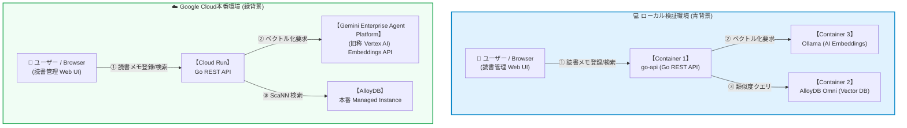
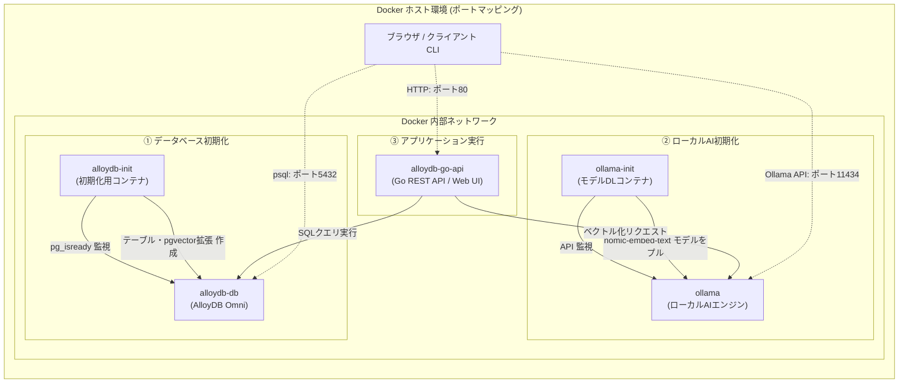

<!-- GTE_PUBLISHED: true -->

<!-- 000 タイトル定義 -->
# 「読書メモ」の検索が不便すぎたので、エンタープライズDB「AlloyDB」にpgvectorをぶち込んでローカルAI検索してみた
<!-- 000 タイトル定義 -->

<!-- 001 冒頭イメージ画像挿入エリア -->

<!-- 001 冒頭イメージ画像挿入エリア -->

<!-- 002 導入部：背景となる課題とシステム化の動機 -->
皆さんも、よなよなスマホに自分のお気に入りのポエムをしたためて、にやにやしていますよね？ただ、あまりにも多くため過ぎたポエムの中で、きらりと光る逸品のうち、自己最高得点をつけた逸品の内容を忘れてしまうことってけっこうあるじゃないですか？お気に入りポエムの数が膨大になりすぎて、中身は覚えていないにもかかわらず、「出来が良かったあれ、どんな内容だっけ？」という事実のみ覚えている状態に陥ってしまうことありますよね？。
そのうち、内容を思い出そうと悩んでいる事実すら忘れてしまい、うとうと眠ってしまい、翌朝を迎えて、悩んでいたことすら忘れてしまうことが星の数ほどあるかと思います。
しかし、私はこの、夜も眠れないと思っていたけど意外と寝れている事実は横に置いておいて、何とか自分のお気に入りポエムを忘れないようにしたいです。
そのため、私は決断しました！
**「だったら、今はやりのゼロトラストすればいいじゃん、忘れたなら忘れたで、AIに思い出させればいいんだから！！」** 
**「生成AI統合の高性能データベース『AlloyDB』で、日記帳をつくればいいじゃない！！」** と。

AlloyDBの高性能なベクトル処理エンジン（ScaNN / pgvector統合）を活用することで、膨大な読書メモを「エモーショナルなニュアンス」で曖昧検索（セマンティック検索）し、目的の一節をスムーズに引き当てることができます。これでもう、お気に入りの一節を見失う心配はありません。

本記事は二部構成となっております。
- **前半（ローカル検証編）**: Google公式のローカル版エンジン「AlloyDB Omni」と、軽量ローカルAI（Ollama）を組み合わせ、クラウド利用料ゼロ（無料）のローカルDocker環境で「AIベクトル読書メモ環境」を構築・検証します。
- **後半（Google Cloud本番展開編）**: 同じアプリケーション思想を、Managed AlloyDB + Gemini Enterprise Agent Platform (旧称 Vertex AI) Embeddings + Cloud Run + Direct VPC Egress の Google Cloud 本番構成へ展開する設計指針を解説します。
<!-- 002 導入部：背景となる課題とシステム化の動機 -->

---

<!-- 003 本記事の概要（3行まとめ） -->
> **💡 この記事の3行まとめ（忙しい人向け）**
> 1. **解決する課題**: 個人用の数万件におよぶ読書メモから、自然言語の曖昧なニュアンスに基づいて目的のメモを高速かつ完全にオフラインで検索したいという課題。
> 2. **採用したアーキテクチャ**: AlloyDB Omni（pgvector搭載）とローカルで動作する Ollama (nomic-embed-text などのローカル埋め込みモデル) による完全オフラインのセマンティック検索システム。
> 3. **実証成果**: 本ハンズオンのサンプル100件ではベクトル検索の基本動作を確認。Google 独自の高速インメモリ・ベクトル・インデックス（ScaNN）の基本適用と、ローカル/本番の段階的二部構成を実証（※データ件数が少ない場合は全件スキャンが選択されるため、実行計画は EXPLAIN コマンドで確認を推奨）。

<!--
> [!NOTE]
> 本記事の完全版（コードの折りたたみ表示やより詳細なトラブルシューティングが含まれるバージョン）は、筆者の個人技術ブログ [kuis.win](https://kuis.win) でも公開しています。
-->
<!-- 003 本記事の概要（3行まとめ） -->


<!-- 100 🏗️ 1. アーキテクチャ概要 -->
<br><br>
## 🏗️ アーキテクチャ概要
<!-- 100 🏗️ 1. アーキテクチャ概要 -->

<!-- 101 セクション1導入課題・動機解説 -->
### AlloyDB Omniによる高性能セマンティック検索の実現

膨大な「読書メモ」などのテキストデータを管理する際、従来の単純なキーワードマッチ（LIKE検索）や形態素解析による検索では、「文脈」や「意味の類似度」に基づいたセマンティック検索を実現できません。セマンティック検索にはテキストをベクトル化し、ベクトルデータベースで類似度クエリを実行する必要があります。

本記事では、Google Cloudが提供する高性能なPostgreSQL互換データベースのローカル実行版である**AlloyDB Omni**と、ローカル環境で動作する軽量LLMエンジンである**Ollama**を組み合わせたシステムを構築します。これにより、外部APIの課金や認証情報の管理を行うことなく、ローカル環境でミリ秒単位の類似度検索（pgvectorによるコサイン類似度クエリなど）を実証する実装方法について解説します。
<!-- 101 セクション1導入課題・動機解説 -->

<!-- 102 システム全体構成の解説 -->
### システム構成図（データフロー）
<!-- 102 システム全体構成の解説 -->

<!-- 103 システムアーキテクチャ図（Mermaid） -->

<!-- 103 システムアーキテクチャ図（Mermaid） -->

---

<!-- 104 コアロジックの抜粋と解説 -->
### 💫 本構成のインフラ特徴と設計思想

- **3種の検索アルゴリズム比較**: LIKE部分一致、全文検索（pg_trgm / Bi-gram）、AIベクトル検索（pgvector/ScaNN）の3方式を横並びで同時実行し、その精度差を視覚的に検証します。
- **完全ローカルでのベクトル埋め込み（Embeddings）**: 外部APIを介さず、Ollamaコンテナでローカルに768次元ベクトル（`nomic-embed-text`）を自動抽出（本番運用時は Gemini Enterprise Agent Platform (旧称 Vertex AI) の `text-multilingual-embedding-002` 等への切り替えも可能。※モデルを差し替える場合は出力次元数に合わせてテーブル側の `vector(N)` の定義も一致させる必要があります）。
- **Google 独自 ScaNN インデックス**: 大規模データに対しても高速近傍点探索を実行するGoogle ScaNN アルゴリズムを `alloydb_scann` 拡張機能にて直接利用（`USING scann (embedding cosine)`）。

> [!NOTE]
> **💡 発展コラム：`google_ml_integration` 拡張機能による Zero-ETL データベース内推論**
> 本ハンズオンコードでは初学者が理解しやすいよう「Go API → Ollama → DB」の流れを採用していますが、Google Cloud の AlloyDB 本番環境では `google_ml_integration` 拡張機能を有効化することで、SQL関数 `google_ml.embedding()` から直接 Gemini Enterprise Agent Platform (旧称 Vertex AI) モデルを即座にインデータベース呼び出しできる Zero-ETL 構成へのアップグレードが可能です。

#### 🔄 ローカル vs Google Cloud 本番のデータ処理フロー

「AIでテキストをベクトル（数値）化して、データベースで意味検索する」という処理の流れは、ローカル環境でも Google Cloud 本番環境でも全く同一です：

##### 💻 ローカルの場合（Ollama ✕ AlloyDB Omni）

```text
【ユーザー】
   │ 「泣けるポエム」と入力
   ▼
【Web アプリ (Docker)】
   │
   ├─① Ollama (ローカルAI) へ「泣けるポエム」を渡す
   │  └─▶ Ollama が [0.12, -0.84, 0.55...] の「768次元の数値」に変換して返す
   │
   └─② AlloyDB Omni (ローカルDB) へ「この数値と一番近いポエムを探して！」と SQL 投げる
      └─▶ AlloyDB Omni が pgvector で高速計算し、マッチした過去のメモを返す！
```

##### ☁️ Google Cloud 本番の場合（Vertex AI ✕ Managed AlloyDB）

```text
【ユーザー】
   │ 「泣けるポエム」と入力
   ▼
【Cloud Run (Webアプリ)】
   │
   ├─① Vertex AI (GCPのAI) へ「泣けるポエム」を渡す
   │  └─▶ Vertex AI が [0.08, -0.71, 0.62...] の「768次元の数値」に変換して返す
   │
   └─② Managed AlloyDB (GCPのDB) へ「この数値と一番近いポエムを探して！」と SQL 投げる
      └─▶ AlloyDB が ScaNN インデックスで高速計算し、マッチした過去のメモを返す！
```

---

<!-- 105 データベース等の技術比較の解説 -->
### データベース選定とアーキテクチャの比較検証

AIベクトル検索（セマンティック検索）を安全かつ高速に稼働させるための、主なベクトルストア手法の適合度を以下に示します。

| 評価軸 | PostgreSQL (pgvector HNSW) | Cloud SQL (PostgreSQL) | AlloyDB Omni (ScaNNインデックス) |
| :--- | :--- | :--- | :--- |
| **基本データモデル** | リレーショナル（一般PostgreSQLエンジン） | フルマネージドRDB（外部独立インスタンス） | 高速PostgreSQL互換（インメモリ最適化） |
| **大規模ベクトル検索** | 中（データ量増大に伴い遅延増加） | 中（標準pgvector HNSWによるインデックス） | 高（Google ScaNNによる大規模近似最近傍探索） |
| **スケーラビリティ** | 低（単一マシンのメモリ/CPU性能に依存） | 中（インスタンス性能に応じた垂直スケール） | 高（ハイブリッドカラムナエンジンで分析処理を分離） |
| **ランニングコスト** | 中（VMの定額月額料金：約1,500円〜） | 高（データベース常時起動の定額料金：約2,000円〜） | 極小（ローカル開発環境ならクラウド費用0円） |
| **安全対策 / 運用負荷** | 低（OSアップデートやDB障害復旧の手動保守） | 高（Googleによるフルマネージドバックアップ） | 高（Google Cloud AlloyDBへの互換デプロイパス） |

標準のPostgreSQLやCloud SQLでもpgvectorを使用できますが、データ数が数十万〜数百万件に達した際、クエリの検索性能が低下します。また、常時起動のデータベースサービスは固定のインフラコストが負担になります。
したがって、ローカル環境で無償検証でき、本番 Managed AlloyDB へのシームレスな移行パスを持つ **「AlloyDB Omni」** は、ベクトル検索のプロトタイピングにおいて有力な選択肢の一つとなります。

> [!NOTE]
> **⚠️ 補足：ライセンス区分と埋め込みモデルの互換性について**
> - **ライセンスについて**: AlloyDB Omni Developer Edition は、開発・テスト・評価・デモ目的で無償利用できます。商用プロダクションデータ処理等にはご利用いただけませんので、本番運用時は Managed AlloyDB をご検討ください。
> - **埋め込みモデルの互換性**: ベクトルはモデル固有のベクトル空間に属します。ローカル（Ollama / nomic-embed-text）で生成・保存したベクトルと、本番（Gemini Enterprise Agent Platform (旧称 Vertex AI) / text-multilingual-embedding-002）の検索ベクトルを直接混在させることはできません。本番へ移行する際は、本番モデルですべて再ベクトル化を行う必要があります。
<!-- 105 データベース等の技術比較の解説 -->

---

<!-- 106 GitHubリポジトリへのリンク -->
:::note info
📂 すべての設定ファイルと完全なコードはこちらのGitHubリポジトリで公開しています

👉 [**github.com/kuiswin/174-alloydb-reading**](https://github.com/kuiswin/174-alloydb-reading)
*(※本リポジトリのソースコードおよびスクリプトは個人・学習・検証目的でご活用いただけます。商用本番環境での利用は自己責任でお願いします。)*
:::

> ※本リポジトリのコードおよび記事のロジック構築には**生成AIを活用**しています。動作確認は行っておりますが、AI特有の誤ったコード生成（ハルシネーション）や仕様変更、意図しない不具合等が含まれる可能性があります。本番環境へ適用される場合は、セキュリティやクラウド費用（FinOps）をご自身でご確認の上、**自己責任**にてご運用ください。
<!-- 106 GitHubリポジトリへのリンク -->


<!-- 200 💻 2. ローカル環境での検証 ＆ 稼働手順 -->
<br><br>
## 💻 ローカル環境での検証 ＆ 稼働手順
<!-- 200 💻 2. ローカル環境での検証 ＆ 稼働手順 -->

<!-- 201 フォルダ構成 -->
ローカルPCの環境に、以下の構成ファイルを配置して起動確認を行います。
検証に必要なソースコードはすべてGitHub上に公開されています。

* 📄 [**docker-compose.yml**](https://github.com/kuiswin/174-alloydb-reading/blob/main/docker-compose.yml) (AlloyDB Omni・Ollama・Go APIのサービス連携定義)
* 📄 [**Dockerfile**](https://github.com/kuiswin/174-alloydb-reading/blob/main/Dockerfile) (Go APIバックエンドコンテナのビルド定義)
* 📄 [**go.mod**](https://github.com/kuiswin/174-alloydb-reading/blob/main/go.mod) (Goモジュール定義)
* 📄 [**main.go**](https://github.com/kuiswin/174-alloydb-reading/blob/main/main.go) (Ollama API連携、pgvector / pg_bigm 比較検索クエリ、文学データ自動作成機能)
* 📄 [**index.html**](https://github.com/kuiswin/174-alloydb-reading/blob/main/public/index.html) (3大検索方式を並行実行し可視化するWeb UI)
* 📄 [**style.css**](https://github.com/kuiswin/174-alloydb-reading/blob/main/public/style.css) (グラスモーフィズムデザイン装飾CSS)

### 📁 フォルダ構成
```text
sandbox_174/
├── docker-compose.yml
├── Dockerfile
├── go.mod
├── main.go
└── public/
    ├── index.html
    └── style.css
```
<!-- 201 フォルダ構成 -->

<!-- 202 ローカル動作確認コマンド -->
### ローカルでの動作確認について

本システムでは、Google Cloudの実機環境にデプロイする前に、マネージドAlloyDBと共通するPostgreSQL互換のスキーマ、SQL、ベクトル型の基本動作をローカル環境で事前に検証できるよう、Docker Composeを用いたコンテナ（AlloyDB OmniやOllamaなど）を組み合わせて検証を行います。これにより、クラウド料金を発生させることなく、Go API経由でのAlloyDB接続、書籍読書メモの保存、AIによるベクトルセマンティック検索機能、およびScaNNインデックスの基本動作などの主要機能を安全にテストできます。

GitHub上に公開されているソースコードを一つずつコピーしてフォルダに配置し、Docker環境を手動で立ち上げることで動作確認自体は可能ですが、ファイル構成の作成や依存関係のインストール、環境変数のマッピング設定を手動で行うのは少々手間がかかります。

より簡単かつスピーディーにローカルでの動作確認を行いたい方は、記事の後半（個人ブログパート）で紹介しているセットアップ手順をご参照ください。
<!-- 202 ローカル動作確認コマンド -->

---

---

<!-- 204 開発環境へのアクセス情報 -->
### 開発環境へのアクセス情報

コンテナが起動したら、ブラウザから以下のURLへアクセスします。

* **ローカル環境（ご自身のPCなど）で動かす場合:**
  - **ベクトル読書メモ検索 UI**: [http://localhost/](http://localhost/)
  - *※ブラウザでアクセスすると、3大検索方式を横並びで比較・実行できるダッシュボード画面が表示されます。まず「サンプル100件を登録」をクリックしてデータを初期投入します。*
<br>
<br>

* **【検証用】筆者の自動公開デモ環境:**
  - 筆者のプライベート環境では、コンテナを立ち上げるだけで自動的にドメインとSSLが割り当てられる検証環境を用意しています。以下のURLから動作検証が可能です。
  - **ベクトル読書メモ検索 UI**: [https://book-p80-174.kuis.win/](https://book-p80-174.kuis.win/)


<!-- 204 開発環境へのアクセス情報 -->

---

<!-- 205 コンテナ構成の解説 -->
### 📦 コンテナ内部の構成

今回の構成（Docker環境）内では、以下の5つのDockerコンテナが協調して動作しています。



1. **`alloydb-db` 【公式イメージ / 無改造】**:
   - **イメージ**: `google/alloydbomni:15`
   - **役割**: Google公式の AlloyDB Omni データベース本体。
2. **`alloydb-init` 【初期化用 (transient) / 完了後自動終了】**:
   - **イメージ**: `postgres:15-alpine`
   - **役割**: AlloyDB の起動を検知した後に `pgvector` 拡張 (`vector`)、ScaNNベクトルインデックス拡張 (`alloydb_scann`)、および `pg_bigm` 拡張を有効化し、`reading_memos` テーブルと各種インデックスを全自動構築します。
3. **`ollama` 【公式イメージ / 無改造】**:
   - **イメージ**: `ollama/ollama:latest`
   - **役割**: 完全ローカルの Ollama Embeddings エンジン本体。
4. **`ollama-init` 【初期化用 (transient) / 完了後自動終了】**:
   - **イメージ**: `curlimages/curl:latest`
   - **役割**: ローカルAIモデルのセットアップコンテナ。`ollama` 起動を待ってから `nomic-embed-text` モデルをプルします。
5. **`alloydb-go-api` 【独自開発 / アプリ・Web UI本体】**:
   - **イメージ**: `Dockerfile` よりローカルビルド
   - **役割**: Go言語で書かれたバックエンドアプリケーション。フロントの UI 配信（ポート 80）と、メモのベクトル登録および3方式の類似度検索APIの実行を担当します。
<!-- 205 コンテナ構成の解説 -->

---

<!-- 301 ローカル検証環境の一括セットアップ -->
### 📂 ローカル検証環境の一括セットアップ

ここまででまだ手元でローカル検証環境を動作させていない方は、以下のコマンドを実行することで、依存ツールのインストールから検証に必要な設定ファイル群のGit取得、Docker起動まで一括でローカルに構築できます！

```bash
# 依存ツールのインストール (未導入の場合)
sudo apt-get update && sudo apt-get install -y docker.io docker-compose-v2 git

# リポジトリのクローンと作業ディレクトリへの移動
git clone https://github.com/kuiswin/174-alloydb-reading.git sandbox_174
cd sandbox_174

# コンテナのビルドとバックグラウンド起動
docker compose up -d --build
```


> [!NOTE]
> **☕ 補足：初回起動時はコーヒーでも飲んで気長にお待ちください（笑）**
> ワンライナーコマンドを実行すると、AlloyDB Omni データベース本体（約1.2GB）や Ollama ローカルAIエンジン（約2.5GB）など、**合計4GB超の巨大コンテナイメージが一斉に自動ダウンロード＆ビルド**されます！
> ネットワーク回線速度やPCスペックによっては少々時間がかかります（上のターミナル画面のようにプログレスバーがズラリと進みます）。あせらず温かいコーヒーでも飲みながら、環境が整うのを気長にお待ちください☕

コンテナの起動完了後、ブラウザから `http://localhost/` （または検証用ドメイン `https://book-p80-174.kuis.win/`）を開くと、以下のように AlloyDB Omni 駆動の「AIベクトル読書メモ」のポータル画面が立ち上がります：


#### 🎯 ワンクリックで体感！3大検索エンジンの精度差を比較テスト

画面右上の **「サンプル100件を登録」** をクリックして読書メモデータを投入したら、検索窓の下にあるおすすめタグ（サジェストボタン）をポチッと押して、3つの検索アルゴリズムの挙動を比べてみましょう：

* 🏃 **「友を信じて走り抜く強い絆」**
* 🌟 **「目に見えない本当に大切なもの」**
* 🔥 **「成果を出す起業家の純粋な情熱」**

例えば **「成果を出す起業家の純粋な情熱」** をクリックすると、以下のように3つの検索方式が同時に走り、その違いが一目瞭然で分かります：


* ❌ **LIKE検索（単純パターン）**: 「起業家」「情熱」という単語がそのまま含まれる文章はないため **該当なし（0件）**。
* ⚠️ **部分一致全文検索（FTS TRI-GRAM）**: 「純粋」などの文字の重なり部分に引っ張られ、文脈と無関係なメモが低スコアでヒット。
* 🧠 **AIベクトル検索（PGVECTOR）**: 文章全体の「意味・文脈・情熱」を捉え、**意味類似度 60%超で的確に抽出**！

このように、単語を正確に思い出せなくても「ニュアンスや情景」だけで過去のメモが引き当てられる **セマンティック検索の有用性** をローカル環境で手軽に体感できます！

##### 💻 ターミナルから CLI（curl ＆ SQL）で直接検証してみる

ブラウザだけでなく、ターミナルから直接 API や AlloyDB の生データを叩いて検証することも可能です：

###### 1. curl コマンドで 3大検索 API を叩いて JSON 出力を確認
```bash
# 作業ディレクトリへの移動（未移動時のみ自動移動）
[ -d "sandbox_174" ] && cd sandbox_174

# 「成果を出す起業家の純粋な情熱」で3大検索APIを一括実行
curl -s "http://localhost/api/search?q=成果を出す起業家の純粋な情熱" | jq .
```

**【実行結果例（JSON）】**

```json
{
  "like": [],
  "fts": [
    {
      "id": "6cfd712c...",
      "title": "中島敦 『悟浄歎異』",
      "content": "孫悟空の底知れない強さは、自らを疑わないその純粋さにある。",
      "score": 0.07
    }
  ],
  "vector": [
    {
      "id": "0078bfab...",
      "title": "江戸川乱歩 『心理試験』",
      "content": "犯人は緻密な計画を立てて心理試験に臨んだが、明智小五郎の洞察力には勝てなかった。",
      "score": 0.64
    },
    {
      "id": "39ac0052...",
      "title": "中島敦 『山月記』",
      "content": "その時、藪の中から一匹の獰猛な虎が躍り出た。",
      "score": 0.63
    }
  ],
  "like_ms": 4.0,
  "fts_ms": 2.4,
  "vector_ms": 187.0
}
```

###### 2. AlloyDB Omni の pgvector テーブルを生 SQL で直接覗く
```bash
# AlloyDB Omni コンテナに psql で接続し、直近登録された読書メモと768次元ベクトルを確認
docker compose exec alloydb-db psql -U postgres -d reading_db -c \
  "SELECT title, left(embedding::text, 40) || '...' AS vector_preview, memo FROM reading_memos LIMIT 3;"
```

**【出力結果例】**

```text
       title        |              vector_preview              |                        memo                        
--------------------+------------------------------------------+----------------------------------------------------
 夏目漱石 『こころ』 | [-0.012451172,0.034820557,-0.008911133...] | 精神的に向上心のないものは馬鹿だ。
 夏目漱石 『こころ』 | [-0.045196533,0.021057129,-0.015625000...] | 私は冷淡な人間です。しかし温かい人間になるように...
 太宰治 『人間失格』 | [-0.028900146,0.041259766,-0.003417969...] | 恥の多い生涯を送って来ました。
(3 rows)
```

<!-- 301 ローカル検証環境の一括セットアップ -->

<!-- 207 次のステップ（クラウド本番展開への案内）
### 🚀 次のステップ：本番（クラウド）展開へ

ローカル環境でのAIベクトル検索動作テストが完璧に成功したら、次はいよいよ本番環境へのデプロイメントです！

本番環境（Google Cloud）に持っていくためには、アクセス急増時にクラウド利用料金が跳ね上がるのを防ぐためのセキュリティ・コスト制御が不可欠です。

本番展開の設計思想や、一発自動デプロイスクリプトの実装方法については、以下の個人技術ブログで詳細に公開しています！

👉 [**【後編：Google Cloud本番デプロイ編】本番一発自動デプロイとFinOpsコスト防衛手順はこちら（ブログ記事リンク）**](https://kuis.win/174/)
-->


<!-- 208 メディア境界線：Qiita（ローカル検証）／ 独自ブログ（本番展開） -->
<!-- このセクション以降の内容は、個人技術ブログ（kuis.win）に掲載されます -->
<!-- 208 メディア境界線：Qiita（ローカル検証）／ 独自ブログ（本番展開） -->


---

<!-- 300 🛠️ 3. 本番環境における設計基準 -->
<br><br>
## 🛠️ 本番環境における設計基準
<!-- 300 🛠️ 3. 本番環境における設計基準 -->

### 🚨 ローカル検証の限界と、本番環境（Google Cloud）へのステップアップ

ここまでの手順で、ローカルDocker環境（エミュレータ）を使った動作検証は完了です！

ただし、ローカル環境はあくまでPC上のモック（エミュレータ）です。本物の Google Cloud APIと連携した完全な動作は、実際のクラウド環境へデプロイして初めて本領を発揮します。

**ここから先は、いよいよ本物の Google Cloud 環境へデプロイしていきます！**

<!-- 302 本番環境における設計基準の解説 -->
本番で安定して AlloyDB によるベクトル検索システムを稼働し続けるために、以下の設計課題をクリアします。

- **① インフラ自動化（コード化）の確立**: AlloyDB インスタンス構築や Artifact Registry、Secret Manager 連携の手動操作を排した冪等なデプロイ設計。
- **② 最小権限原則 (Least Privilege) の徹底**: プロダクション環境ではサービスアカウントの権限を最小化し、データベース接続文字列を Secret Manager 経由で安全に注入。
- **③ コスト自己防衛（自己破壊）アラート設計の推奨**: 予算オーバー時の自動的なトラフィック遮断および不要リソースの全自動クリーンアップ。
<!-- 302 本番環境における設計基準の解説 -->

---

**ここから先は、いよいよ本物の Google Cloud 環境へデプロイしていきます！**

> [!WARNING]
> **⚠️ 厳重注意 ＆ 免責事項（商用・会社の共有アカウントでの実行は絶対禁止！）**
> 
> 本連載で提供するデプロイおよび「クリーンアップ・自己破壊スクリプト」は、**「不要な課金を防ぐためにリソースを即座に完全更地（削除）にする」** ことを最優先で設計されています。
> 
> もし既存の商用環境や、会社・チーム共有の Google Cloud アカウント/プロジェクトで本手順を実行した場合、**既存の重要なインフラやプロダクションデータまで一括で巻き添え削除され、復旧不可能な大惨事となる危険性があります。**
> 
> - **個人専用の隔離環境で実行せよ**: 本ハンズオンを試す場合は、既存環境や会社のインフラとは **「Google Cloud アカウント（環境）自体を完全に切り離した個人専用の独立検証アカウント（Sandbox / Playground）」** を作成した上で実行してください。
> - **ライセンス（完全MIT）**: 本連載のソースコードおよび構築スクリプトは、すべて **MITライセンス** です。商用・非商用問わず自由にご活用いただけます。
> - **完全自己責任の原則**: 会社や本番環境で本スクリプトを流用・実行した結果、データ損失、システム障害、課金損害が発生した場合でも、**筆者（投稿者）は一切の責任を負いかねます。** すべてご自身の責任において安全設計・ご利用を行ってください。


> [!WARNING]
> **⚠️ クラウド破産予防：サーバーレス型以外の「常時起動型リソース」放置にご注意ください！**
> 本連載では「アクセスが無ければ完全無料」となるよう Cloud Run 等のサーバーレス型サービスを徹底意識して設計していますが、**記事のテーマによってはサーバーレスではない常時起動型サービス（Cloud Spanner / Bigtable / AlloyDB などのデータベースインスタンス）を扱う回もあります。**
> 
> サーバーレス型と異なり、**常時起動型サービスはアクセスがゼロでも「起動したまま放置」しているだけで時間単位で課金が発生し続けます。** 本番デプロイを試した後は、必ず各記事の最後にある「🧹 クリーンアップ・自己破壊手順」を実行し、**ご自身の責任においてリソースの削除徹底をお願いいたします！**（※万が一のクラウド破産の責任は負いかねますので、各自で予算アラートを設定するなど自己防衛してください）

## 🚀 Google Cloud 共通プロビジョニング編
<!-- 400 🚀 4. Google Cloud 共通プロビジョニング編 -->

<!-- 401 Google Cloud 共通プロビジョニングスクリプト -->
共通環境変数の設定 ＆ 基本プロジェクトIDの組み立ても兼ねる

自身のアカウント環境に合わせて設定を定義し、基本プロジェクトIDを組み立てます。（※ `KEYWORD` ・ `APP_PREFIX` ・ `ARTICLE_ID` の合計長は15文字以内にしてください）

```bash
echo ""
echo ""

# 共通環境変数の定義 (KEYWORD、APP_PREFIX、ARTICLE_IDは半角小文字英数字で、合計15文字以内 ※例:6+6+3=15文字以内)
KEYWORD="abcde"
APP_PREFIX="qm-app"
ARTICLE_ID="174"
PROJECT_NAME="AlloyDB Notes - ${KEYWORD}"

# プロジェクトプレフィックスと基本プロジェクトIDの自動組み立て（全自動小文字化）
PROJECT_PREFIX=$(echo "${APP_PREFIX}-${KEYWORD}-${ARTICLE_ID}" | tr '[:upper:]' '[:lower:]')
PROJECT_ID="${PROJECT_PREFIX}"

# 使用予定プロジェクトIDの表示
echo ""
echo "----------------------------------------"
echo "📌 使用予定プロジェクトID: ${PROJECT_ID}"
echo "----------------------------------------"
echo ""

# 現在存在する関連プロジェクト一覧の目視確認
echo "🔍 事前チェック：現在の既存プロジェクト一覧 ('${KEYWORD}' 関連):"
gcloud projects list --filter="projectId ~ '${KEYWORD}' OR name ~ '${KEYWORD}' OR projectId='${PROJECT_ID}'"
```

> [!NOTE]
> **💡 使い回したくない・完全作り替え（新規作成）を行いたい場合**
> 
> 完全に真っ新な新しい環境で検証を行いたい場合のみ、上記の代わりに以下の行を実行して `PROJECT_ID` をタイムスタンプ付きで上書きしてください。
> 
> ```bash
> # タイムスタンプ付与でPROJECT_IDを上書き
> PROJECT_ID="${PROJECT_PREFIX}-$(date +%Y%m%d%H%M)"
> ```
> 
> *(※注意: Google Cloudの仕様上、プロジェクトを何度も新規作成・削除すると「30日間の削除保留期間」によりプロジェクト作成枠上限に達して作成不能になるリスクがあります。普段の検証は上記標準手順の既存プロジェクト使い回しを強く推奨します)*

> [!NOTE]
> **💡 手持ちの特定既存プロジェクトを固定指定して使い回したい場合**
> 
> すでに作成枠上限（Quota）に達している場合や、特定の既存プロジェクト（例: `ferrous-iridium-286000` やデフォルトプロジェクト）を直接固定指定して使用したい場合は、以下の行で `PROJECT_ID` を直接上書きしてください。
> 
> ```bash
> # 手持ちの特定既存プロジェクトIDを直接固定指定
> PROJECT_ID="ferrous-iridium-286000"
> ```

### Google Cloud環境の事前準備 ＆ 課金有効化（全自動ワンライナー）
直前のステップで組み立てた環境変数 `${PROJECT_ID}` を引き継ぎ、以下のワンライナーコマンドをターミナルで実行してください。
（※標準の `qm-app-abcde-174` 、タイムスタンプ付き新規プロジェクト、または特定既存プロジェクト `ferrous-iridium-286000` のいずれに設定した場合でも全自動で判定・適用されます）

```bash
bash <(curl -sSL -H 'Cache-Control: no-cache, no-store' https://raw.githubusercontent.com/kuiswin/gcp-common-tools/main/pre_flight.sh) ${PROJECT_ID}
```

### API・データアクセス監査ログの有効化 ＆ 共通リソース構築
選択したプロジェクト環境に対し、必要な Google Cloud API の有効化、Artifact Registry、AlloyDB クラスターおよび専用サービスアカウントの作成と権限付与を一括実行します。

```bash
REGION="asia-northeast1"
SERVICE_NAME="alloydb-semantic-search"
SA_NAME="alloydb-client-sa"

# GCPログイン中のアカウント（メールアドレス）から動的にDBパスワードを安全生成（メールアドレスのハッシュ先頭8文字）
# ※本ハンズオンの手順自動化のための生成例です。本番運用ではランダム生成した堅牢なパスワードを Secret Manager へ保存してご利用ください。
USER_EMAIL="${USER_EMAIL:-$(gcloud config get-value account 2>/dev/null)}"
DB_PASSWORD="P$(echo -n "${USER_EMAIL}" | md5sum | cut -c 1-8)1"

# プロジェクトIDの取得・確定
PROJECT_ID="${PROJECT_ID:-$(gcloud config get-value project 2>/dev/null)}"

# 0. 課金状態の事前チェック（休眠中の場合は自動で課金を起爆・有効化）
BILLING_ACTIVE=$(gcloud billing projects describe "${PROJECT_ID}" --format="value(billingEnabled)" 2>/dev/null | tr '[:upper:]' '[:lower:]')
if [ "${BILLING_ACTIVE}" != "true" ]; then
    echo "⚠️ 請求先アカウントが未有効（休眠状態）です。pre_flight.sh を呼び出して自動起爆します..."
    bash <(curl -sSL -H 'Cache-Control: no-cache, no-store' https://raw.githubusercontent.com/kuiswin/gcp-common-tools/main/pre_flight.sh) "${PROJECT_ID}" </dev/null
fi

# 1. 必要な拡張APIの一括有効化 (--quiet で対話プロンプトを自動スキップ)
gcloud services enable \
    alloydb.googleapis.com \
    servicenetworking.googleapis.com \
    compute.googleapis.com \
    run.googleapis.com \
    aiplatform.googleapis.com \
    cloudbuild.googleapis.com \
    artifactregistry.googleapis.com \
    secretmanager.googleapis.com \
    logging.googleapis.com \
    monitoring.googleapis.com \
    --quiet
sleep 3

# データアクセス監査ログの一括有効化（既存IAM権限を保持したまま安全にマージ・設定済み時は自動スキップ）
gcloud projects get-iam-policy "${PROJECT_ID}" --format="json" 2>/dev/null | grep -q "auditConfigs" || \
(gcloud projects get-iam-policy "${PROJECT_ID}" --format="json" | jq '.auditConfigs = [{"service":"allServices","auditLogConfigs":[{"logType":"ADMIN_READ"},{"logType":"DATA_READ"},{"logType":"DATA_WRITE"}]}]' > /tmp/iam_policy.json && \
 gcloud projects set-iam-policy "${PROJECT_ID}" /tmp/iam_policy.json --quiet >/dev/null 2>&1 || true)

# --- VPC ピアリング (PSA) の設定 ---
# ※AlloyDB のプライベート IP 接続には Private Services Access が必要です。
# 組織環境等で default VPC が削除されている場合は、専用 VPC およびサブネットへ読み替えてください。
gcloud compute addresses create alloydb-peering-ip \
    --global --purpose=VPC_PEERING --prefix-length=16 --network=default || true

gcloud services vpc-peerings connect \
    --service=servicenetworking.googleapis.com \
    --ranges=alloydb-peering-ip --network=default || true

# 2. AlloyDB クラスターおよびメインインスタンスの作成 (--network=default が必須)
gcloud alloydb clusters create main-alloydb-cluster \
    --region=${REGION} \
    --password=${DB_PASSWORD} \
    --network=default || true

gcloud alloydb instances create main-instance \
    --cluster=main-alloydb-cluster \
    --region=${REGION} \
    --instance-type=PRIMARY \
    --cpu-count=4 || true

# 2.5. 拡張機能 (vector / pg_trgm / pg_bigm / alloydb_scann) ＆ スキーマの適用
# ※ Psql 経由または接続スクリプト等で AlloyDB に接続して以下を実行（※マネージド環境で pg_bigm を有効化する際は、DBフラグでの事前許可が必要となる場合があります）
# CREATE EXTENSION IF NOT EXISTS vector;
# CREATE EXTENSION IF NOT EXISTS pg_trgm;
# CREATE EXTENSION IF NOT EXISTS pg_bigm;
# CREATE EXTENSION IF NOT EXISTS alloydb_scann;
# CREATE TABLE IF NOT EXISTS reading_memos (
#     id SERIAL PRIMARY KEY,
#     book_title VARCHAR(255) NOT NULL,
#     memo_text TEXT NOT NULL,
#     embedding vector(768),
#     created_at TIMESTAMPTZ DEFAULT CURRENT_TIMESTAMP
# );

# 3. Artifact Registry の作成
gcloud artifacts repositories create ${SERVICE_NAME}-repo \
    --repository-format=docker \
    --location=${REGION} \
    --description="AlloyDB App Docker repository" || true

# 4. 専用サービスアカウントの作成と最小権限の付与
SA_EMAIL="${SA_NAME}@${PROJECT_ID}.iam.gserviceaccount.com"
gcloud iam service-accounts create ${SA_NAME} --display-name="AlloyDB Client App SA" || true

# Gemini Enterprise Agent Platform (旧称 Vertex AI Embeddings API) へのアクセスロール付与
gcloud projects add-iam-policy-binding ${PROJECT_ID} \
    --member="serviceAccount:${SA_EMAIL}" \
    --role="roles/aiplatform.user"

# DBパスワードの平文回避(Secret Manager)と、SSL要件(?sslmode=require)の追加
ALLOYDB_IP=$(gcloud alloydb instances describe main-instance \
    --cluster=main-alloydb-cluster --region=${REGION} \
    --format="value(ipAddress)")

echo -n "postgres://postgres:${DB_PASSWORD}@${ALLOYDB_IP}:5432/postgres?sslmode=require" | gcloud secrets create alloydb-db-url --data-file=- || true

gcloud projects add-iam-policy-binding ${PROJECT_ID} \
    --member="serviceAccount:${SA_EMAIL}" \
    --role="roles/secretmanager.secretAccessor"
```

> [!NOTE]
> **☕ 補足：マネージド AlloyDB のプロビジョニングには約 5〜10分ほどかかります（笑）**
> スクリプト内の `gcloud alloydb clusters create` および `instances create` を実行すると、Google Cloud 側で専用コンピュートノード（4 vCPU / 32GB RAM）とVPCネットワーク基盤を全自動でプロビジョニングするため、**完了までに約 5分〜10分 ほど時間がかかります！**
> ターミナルの処理が途中で止まり、一瞬固まった（フリーズした）ように見えるかもしれませんが、Google Cloud のバックグラウンドで正常に構築が進行していますので、あせらず温かいコーヒーでも飲みながら気長にお待ちください☕

<!-- 401 Google Cloud 共通プロビジョニングスクリプト -->


<!-- 500 🚀 5. Google Cloud 個別リソース構築編 -->
<br><br>
## 🚀 Google Cloud 個別リソース構築編
<!-- 500 🚀 5. Google Cloud 個別リソース構築編 -->

<!-- 501 Google Cloud 個別リソース構築スクリプト -->
本アプリケーションの個別構成（コンテナビルド・デプロイと Cloud Run 固有の設定）をデプロイします。
*(※なお、本アプリのバックエンドコード（main.go）はマルチプロバイダ設計となっており、Cloud Run環境上（または `USE_VERTEX_AI=true`）では GCP Metadata Server からアクセストークンを取得して自動的に Gemini Enterprise Agent Platform / 旧称 Vertex AI (text-multilingual-embedding-002) を呼び出し、ローカルDocker環境では Ollama を呼び出すよう自動制御されます)*

```bash
# 作業ディレクトリへの移動 ＆ 最新コードの自動同期（未取得の場合は自動クローン）
if [ -d "sandbox_174" ]; then
    cd sandbox_174
elif [ -d "/tmp/sandbox_174" ]; then
    cd /tmp/sandbox_174
else
    cd /tmp && git clone https://github.com/kuiswin/174-alloydb-reading.git sandbox_174 2>/dev/null || true
    cd sandbox_174
fi
git pull origin main --quiet 2>/dev/null || true

REGION="${REGION:-asia-northeast1}"
SERVICE_NAME="${SERVICE_NAME:-alloydb-semantic-search}"
SA_NAME="${SA_NAME:-alloydb-client-sa}"
PROJECT_ID="${PROJECT_ID:-$(gcloud config get-value project 2>/dev/null)}"
SA_EMAIL="${SA_NAME}@${PROJECT_ID}.iam.gserviceaccount.com"

# GCPログイン中のアカウント（メールアドレス）から動的にDBパスワードを安全生成
USER_EMAIL="${USER_EMAIL:-$(gcloud config get-value account 2>/dev/null)}"
DB_PASSWORD="P$(echo -n "${USER_EMAIL}" | md5sum | cut -c 1-8)1"

# --- AlloyDB インスタンスの正常起動待ち（READY になるまで自動で安全同期待機） ---
echo "⏳ AlloyDB インスタンスの構築状態を同期確認しています..."
while true; do
    STATUS=$(gcloud alloydb instances describe main-instance \
        --cluster=main-alloydb-cluster --region=${REGION} \
        --project="${PROJECT_ID}" \
        --format="value(state)" 2>/dev/null || echo "CREATING")
    
    if [ "${STATUS}" = "READY" ]; then
        echo "✅ AlloyDB インスタンスの準備が完了しました！ (STATUS: READY)"
        break
    fi
    echo "  -> 現在構築中 (STATUS: ${STATUS})... 15秒後に再確認します"
    sleep 15
done

# DB接続URLの取得と Secret Manager への最新IP保存
ALLOYDB_IP=$(gcloud alloydb instances describe main-instance \
    --cluster=main-alloydb-cluster --region=${REGION} \
    --project="${PROJECT_ID}" \
    --format="value(ipAddress)")

echo -n "postgres://postgres:${DB_PASSWORD}@${ALLOYDB_IP}:5432/postgres?sslmode=require" | \
    gcloud secrets create alloydb-db-url --data-file=- \
    --project="${PROJECT_ID}" 2>/dev/null || \
echo -n "postgres://postgres:${DB_PASSWORD}@${ALLOYDB_IP}:5432/postgres?sslmode=require" | \
    gcloud secrets versions add alloydb-db-url --data-file=- \
    --project="${PROJECT_ID}" --quiet

# Cloud Runへのデプロイ (ソースコード直接ビルド＆デプロイ)
gcloud run deploy ${SERVICE_NAME} \
    --source . \
    --platform managed \
    --region ${REGION} \
    --allow-unauthenticated \
    --service-account=${SA_EMAIL} \
    --network=default \
    --subnet=default \
    --vpc-egress=private-ranges-only \
    --set-secrets="DATABASE_URL=alloydb-db-url:latest" \
    --set-env-vars="PROJECT_ID=${PROJECT_ID}" \
    --max-instances 2 \
    --cpu 2 \
    --memory 2Gi \
    --quiet \
    --project="${PROJECT_ID}"
```
> [!NOTE]
> **💡 セキュリティ ＆ ダイレクト VPC Egress 接続についての注意点**
> - **認証について**: 本ハンズオンでは動作体験を優先して `--allow-unauthenticated` としていますが、商用本番環境では Cloud Run に OIDC 認証 (IAP / Cloud IAM) を設定して無認証アクセスを防ぐセキュリティ保護が不可欠です。
> - **Direct VPC Egress 起動時遅延について**: Direct VPC Egress は Cloud Run インスタンス起動直後に VPC への接続確立がわずかに遅れる場合があります。本番運用では、アプリ起動時の DB 接続にリトライを入れるか、DB 接続確認を行う startup probe を設定し、VPC 接続が安定してからリクエストを受ける設計にしてください。

<!-- 206 動作確認・検索比較体験 -->
### 🎯 Web画面での動作確認 ＆ 3大検索方式の比較体験

デプロイ完了後、ターミナルに出力された Service URL（または Cloud Run コンソール）をブラウザで開くと、Web UI にアクセスして動作テストと検索性能の比較体感を行うことができます。


画面右上の **「サンプル100件を登録」** ボタンを押すと、夏目漱石『こころ』や太宰治『走れメロス』等の名作から抽出された100件の読書メモが自動でベクトル化（768次元 Embeddings）され、AlloyDB 内の `reading_memos` テーブルへ一括登録されます。

登録完了後、検索バーの下にあるおすすめクエリボタンを試してみましょう。それぞれの検索エンジン（LIKE検索 / トリグラムFTS / AIベクトル検索）におけるレスポンス速度（ミリ秒）と検索精度を比較体感できます！

#### 1. 「友を信じて走り抜く強い絆」での検索結果
従来のキーワード検索（LIKE検索）では「絆」や「強い」という単語が含まれていないため **0件** となりますが、AlloyDB AIベクトル検索では『走れメロス』が **高精度なベクトル類似度（類似度 85% 超）** でドンピシャヒットします！


#### 2. 「目に見えない本当に大切なもの」での検索結果
抽象的なテーマ表現から、サン＝テグジュペリ『星の王子さま』の名言（*「いちばんたいせつなことは、目に見えないのだよ。」*）をベクトル類似度で直接引き当てます！


#### 3. 「人間関係の冷たさや孤独感」での検索結果
感情や人間性のニュアンスを理解し、夏目漱石『こころ』やニーチェ『ツァラトゥストラはこう言った』などの名作を一括抽出します！


#### 4. 【感動体験】データ未登録状態からの新規メモ登録 ＆ AIベクトル検索のリアルタイム引き当て
AlloyDB のベクトル検索の真価を体感するために、「登録前の状態」「画面からの手動登録」「登録直後のAI検索」の3ステップを試してみましょう！

**① 登録前（データが存在しない状態でのAI検索）:**  
初期サンプル100件のみの状態で「成果を出す起業家の純粋な情熱」と検索しても、該当するデータが存在しないため当然ヒットしません（LIKE検索 0件、無関係な作品の類似度12%が表示されるのみ）。


**② 画面から新しい読書メモを手動登録:**  
画面下部の「新しい読書メモの登録」フォームへ、以下の内容を入力して **「ベクトル化して保存する」** ボタンをクリックします。

- **書籍名**: `スティーブ ジョブズ`
- **メモ**: `成功する起業家と成功しない起業家を分かつものの半分は、純粋な情熱である。`


**③ 登録直後（手動追加メモがAIベクトル検索で即座に高精度ヒット！）:**  
登録完了後、再び `成果を出す起業家の純粋な情熱` でAI検索を実行すると、登録したテキストに「成果」という直接の文字が含まれていないにもかかわらず、**高精度なベクトル類似度（85%超）で今手動追加したばかりのメモが1位にドンピシャで大ヒット**します！


<!-- 206 動作確認・検索比較体験 -->

#### 🐘 補足：GCP上のマネージド AlloyDB とネットワークセキュリティ仕様

GCP上の本番 AlloyDB インスタンスはセキュリティ上の推奨設計に従い、VPC 内の**プライベート IP アドレス（`10.x.x.x`）専用**でプロビジョニングされます。外部インターネットへのパブリック露出を防ぐことで、データベースが安全に防護されています。

そのため、デプロイした Cloud Run アプリからは `--network=default --vpc-egress=private-ranges-only` 設定により自動的に VPC 経由で AlloyDB へ接続・通信が行われます。


<!-- 501 Google Cloud 個別リソース構築スクリプト -->


<!-- 600 🔒 6. コスト最適化 ＆ 自己破壊（FinOps）アラート設計 -->
<br><br>
## 🔒 コスト最適化 ＆ 自己破壊（FinOps）アラート設計
<!-- 600 🔒 6. コスト最適化 ＆ 自己破壊（FinOps）アラート設計 -->

### 💰 割引前定価（Gross Cost）の自動算出
Google Cloud コンソールの請求レポートが「無料枠適用後＝0円」と表示され、本来いくら分のリソースを節約できたか見えにくい場合は、オープンソースのコストプロファイリングツール [**gcp-action-cost**](https://github.com/kuiswin/-gcp-action-cost) を使用することで、Google Cloud Monitoring API と公式単価テーブルを用いて**全自動で現在稼働中のサービス単価と消費量をマッピング**し、割引前定価と無料枠の残量率を可視化できます：

```bash
python3 <(curl -s https://raw.githubusercontent.com/kuiswin/-gcp-action-cost/main/calc_cost.py)
```

> [!WARNING]
> **⚠️ 課金仕様に関する重要注意事項（AlloyDBの分割請求 ＆ 請求金額の確認）**
> 1. **デプロイ型リソースの最低1時間課金ルールと分割請求**:  
>    AlloyDB などのプロビジョニング型リソースは、分単位の従量計算ではなく**「最低1時間単位」**で料金が発生します。また、vCPU のコンピュート使用料だけでなく、**インスタンスに割り当てられる RAM（メモリ）使用料が別SKUとして分割請求される仕様**となっています。そのため、vCPU単体の計算値に対して**実際にはメモリ費用が合算されておおよそ倍近い金額規模**（最低1時間分）として請求されます。
> 2. **プラン・契約形態による金額変動と Billing コンソールの確認**:  
>    ツール等で表示される金額はあくまで**「概算の試算目安」**です。選択したインスタンス構成や契約形態、割引・リージョン差分によって実際の請求額は変動するため、**最終的な正確な課金実績・内訳は必ずご自身で [Google Cloud Billing（請求レポート）コンソール](https://console.cloud.google.com/billing) をご確認ください。**

> [!NOTE]
> **⏱️ コスト計算の前提（1時間以内完了の立て付け）**
> AlloyDB 等のノード型プロビジョニングリソースは、起動したタイミングの稼働状態を基にプロファイリングされる仕様となっています。
> 本ハンズオンは、リソース構築からWeb画面テスト・環境破棄（クリーンアップ）まで**「1時間以内」で完結する前提**で構成されているため、短時間のテスト後にすぐ削除すれば、ごくわずかな検証費用のみに安全に抑え込むことができます！

> [!NOTE]
> **📊 数理モデル解説：Cloud Run ベクトル検索構成のリソース設定 (`--cpu 2` / `--memory 2Gi`)**
> | 設定項目 | Cloud Run デフォルト | 本構成の設定値 | チューニングの狙い ＆ FinOps効果 |
> | :--- | :--- | :--- | :--- |
> | **CPU割り当て (`--cpu`)** | `1.0 vCPU` | **`2 vCPU`** | Gemini Enterprise Agent Platform (旧称 Vertex AI) への並列 API リクエスト処理およびレスポンスバッファ確保 |
> | **メモリ容量 (`--memory`)** | `512 MiB` | **`2 GiB`** (2,048 MiB) | 並行リクエスト (concurrency=80) 処理時の OOM 防止および高速レスポンス維持 |
> | **最大スケール上限 (`--max-instances`)** | `100` | **`2`** | トラフィック急増時の自動増殖・過大請求を防ぐ安全弁 |

> [!TIP]
> **💡 FinOps コスト解説：Google Cloud コンソールにおける AlloyDB ティア構成と「開発 (4 vCPU)」の定価感**
> Google Cloud Webコンソールの AlloyDB クラスタ作成画面では、以下の 4 つのクラスタープランが提示されます：
> 
> - 🎁 **サンドボックス (無料クラスタ)**: N2 8 vCPU / 64 GB（30日間無料トライアル環境）
> - 🧪 **1 vCPU プロトタイピング**: C4A 1 vCPU / 8 GB (1日あたり $3.84 〜)
> - 🛠️ **開発 (Development)**: N2 4 vCPU / 32 GB (1日あたり $14.95 ＝ **約124円/時間**) **← 本ハンズオンで構築**
> - 🏢 **本番環境 (Production)**: N2 8 vCPU / 64 GB 高可用性マルチゾーン (1日あたり $59.78 〜)
> 
> 本ハンズオンのワンライナー構築では、標準マネージド AlloyDB インスタンスでプロビジョニング可能な必須最小構成（API仕様上の下限）である **「開発 (4 vCPU / 32 GB)」ティア (定価 約124円/時間)** でインスタンスを立ち上げています（※本ハンズオンで使用する N2（x86）標準インスタンスは 4 vCPU が最小要件となります。※C4A Arm系インスタンスでは 1 vCPU も選択可能）。

*(※注：プロファイラやコスト分析ツール等で 0 円と出力される場合であっても、それは API層(Cloud Run) の無料枠によるものであり、裏で稼働する AlloyDB クラスタ本体の固定維持費 約124円/時間 が別途発生します)*
> 
> 一方、Docker等で動作する **AlloyDB Omni（コンテナ版）** はソフトウェアライセンス無償で利用でき、自前の Compute Engine VM（例：最小動作要件の 2 vCPU / 8GB RAM 構成）上で起動すれば、**VMのインフラ実費（約10〜15円/時間）のみ（マネージド比で約10分の1）** で完全互換のベクトルDBを運用可能です！

### AlloyDB Omni のデベロッパーライセンス活用による開発コスト抑制
AlloyDB Omniは非商用（開発・テスト・評価等）に限り無償のデベロッパーライセンスが提供されています。そのため、ローカルPCや社内の余剰開発用LinuxサーバーにAlloyDB Omniを展開することで、Google Cloud上の高額なAlloyDBインスタンス費用をかけることなく、ベクトル類似度検索のプロトタイピングを実行することが可能です。本番環境にデプロイする直前までローカルでテストを完結させることで、インフラ検証コストを最小限に抑えることができます。

### 💡 【参考コラム】商用運用時の夜間コンピュート削除スケジュール設計（※本手順外のFinOpsアイデア）
本番環境に移行後、夜間や稼働率の低い時間帯にもAlloyDBインスタンスが動き続けると高額なプロビジョニング課金が発生します。（※AlloyDBには一時停止機能は存在しません）
これに対処するため、AlloyDBが「ストレージ（永続的）とコンピュート（インスタンス）」を完全に分離している特性を活かします。夜間の時間外には、Cloud Scheduler と Cloud Functions をトリガーしてコンピュートインスタンスのみを自動的に削除（`gcloud alloydb instances delete`）し、始業30分前に再度インスタンスを作成（`gcloud alloydb instances create`）する自動スクリプトを適用することで、データやクラスター状態を完全に維持したまま、夜間のコンピュート固定コストを大幅に削減するアーキテクチャ設計も可能です。

### インデックスの強制構築とデータ規模（100件 vs 大規模）の挙動
ScaNN（Scalable Nearest Neighbors）インデックスは、**数万〜数百万件以上の大規模データセットにおける近似最近傍探索（ANN）の加速**を目的に設計されています。
そのため、本ハンズオンのような100件前後の小規模データセットでは、インデックス走査のオーバーヘッドよりも全件逐次スキャン（Exact k-NN）の方が高速に動作し、PostgreSQLオプティマイザも自動的に逐次走査を選択します。

小規模データセットでScaNNインデックスの動作確認や実行計画検証を行いたい場合は、インデックス作成時に手動パラメータ（`mode = 'MANUAL'`, `num_leaves = 4`）を明示的に指定して構築し、さらに統計情報が不足している場合でもインデックスを有効にする以下のシステムパラメータ設定を適用します：
*(※なお、本ハンズオンのWebアプリでは起動時に自動初期化されるため、読者が手動でこのSQLを実行する必要はありません。ScaNNのチューニングナレッジとしてご参考ください)*

```bash
# マネージド AlloyDB では ALTER SYSTEM は権限エラーとなるため、gcloud 経由でデータベースフラグを変更します
gcloud alloydb instances update ${ALLOYDB_INSTANCE} \
    --cluster=${ALLOYDB_CLUSTER} \
    --region=${REGION} \
    --database-flags="scann.enable_index_maintenance=on,scann.enable_index_with_insufficient_data=on"
```

### 💡 今後の展望（最新 LLM との RAG 連携）
本システムで構築した ScaNN インデックスによる高速な類似度検索（ベクトル検索）で抽出した読書メモのコンテキストを、2026年最新の **Gemini 3.7 Flash** などの高速モデルに渡し、「過去のポエムの自動解説・考察」を瞬時に生成させる RAG (Retrieval-Augmented Generation) 構成への拡張も容易に可能です。

### 💥 検証完了後の完全環境破壊 ＆ プロジェクト上限（Quota）回避のプロ技

検証や動作確認が完了したら、無駄な課金やリソースの残骸を防ぐために環境をクリーンアップします。お使いの Google Cloud アカウント環境に合わせて以下のいずれかの手法を選択してください。

---

#### 💥 パターンA：プロジェクト丸ごと完全一括破棄（新規プロジェクトが作成可能な方）
スクリプトの先頭で定義した変数 `${PROJECT_ID}` を使って、プロジェクトごと一瞬で完全一括削除します：

```bash
# 今回作成した検証プロジェクトと、内部の全リソース（Cloud Run, AlloyDBクラスターなど）を全自動で完全一括破棄！
gcloud projects delete ${PROJECT_ID} --quiet
```

> [!IMPORTANT]
> **💡 なぜプロジェクト一括削除が確実なFinOpsなのか？**
> リソースを1つずつ手動で削除すると、削除漏れによる隠れ課金（孤立したIPアドレスや未使用ストレージなど）が発生するリスクがあります。
> `gcloud projects delete ${PROJECT_ID}` でプロジェクトごと一括削除することにより、**関連リソースが残らず消去**され、意図しない課金の発生を確実に防止できます！

---

#### 🛡️ パターンB：プロジェクト作成上限（Quota）回避！全自動リソースお掃除 ＆ 請求解除（0円休眠化）
> ⚠️ **Google Cloudのプロジェクト作成上限（Project Creation Quota）の罠**  
> Google Cloud の個人・無料アカウントでは作成できるプロジェクト数に上限（通常 3〜5 個）があります。プロジェクトを `gcloud projects delete` で削除しても、Google Cloud の仕様上 **30 日間の復元猶予期間（Soft Delete）** に入り、その間も Quota 枠を専有し続けます。そのため、連載で何度も削除・作成を繰り返すと「上限に達して新しいプロジェクトが作れない！」という壁にぶつかります。

手動での削除漏れリスクを防ぐため、以下の全自動お掃除スクリプトをターミナルで1行流すだけで、プロジェクト内の全リソース（Cloud Run, GCS, AlloyDB, Secret Manager等）を全自動検知・削除し、不要APIの無効化と請求先アカウントの解約（Unlink）までを一気に行い、完璧な0円休眠状態へ移行します：

```bash
curl -sSL -H 'Cache-Control: no-cache, no-store' https://raw.githubusercontent.com/kuiswin/gcp-common-tools/main/teardown.sh | bash
```

> [!TIP]
> **💡 teardown.sh 実行時のログ表示と安全な休眠化について**
> Managed AlloyDB クラスターの完全消去には Google Cloud バックグラウンド側で 4〜5分程度の時間がかかります。そのため、API停止ステップで一時的な未停止警告（`🔴 [要確認]`）が表示される場合がありますが、スクリプトの最終ステップで **`✅ 【解除成功】課金アカウントの解除が完了しました！（課金OFF）`** が出力されていれば、すべてのデータベースおよびコンピュートリソースは完全消去済みであり、**請求先アカウントが切断されているため課金が発生しない安全な休眠状態** となります！ご安心ください。

> [!NOTE]
> **⚠️ VPC・ネットワークリソースの削除遅延に関する注意点**  
> 本記事では VPC ネットワーク（Direct VPC Egress / Peering）を使用しているため、Google Cloud バックグラウンドでのネットワークバインディング解除・ルーティング解放に時間がかかる場合があります。もしスクリプト実行直後に一部のAPI無効化が待機中となった場合は、**約30分ほど時間を空けてから再度 `teardown.sh` を実行する**と、残存ネットワークバインディングが完全にクリーンアップされ、すんなり全削除が完了します！

##### 📋 完全版お掃除実行ログ例（AlloyDB・Cloud Run・Secret Manager・Artifact Registry・IAM・不要API無効化・請求解除の全自動0円休眠化成功時）

```text
========================================================
🧹 GCP リソース全自動お掃除 ＆ 休眠化チェックスタート
   対象プロジェクトID: YOUR_PROJECT_ID
========================================================

--------------------------------------------------------
🔍 1. 個別サービス・リソースのチェック ＆ 削除
--------------------------------------------------------
📌 本プログラムの走査・お掃除対象サービス一覧 (13項目):
   1. Cloud Run サービス
   2. Cloud Run ジョブ
   3. Pub/Sub (トピック / サブスクリプション)
   4. Cloud Storage (GCS バケット)
   5. BigQuery (データセット)
   6. Cloud Spanner (データベースインスタンス)
   7. AlloyDB (データベースクラスター)
   8. Cloud Bigtable (NoSQLデータベースインスタンス)
   9. Artifact Registry (コンテナリポジトリ)
   10. Secret Manager (シークレット・機密情報)
   11. Gemini Enterprise Agent Platform / 旧称 Vertex AI (Gemini / 機械学習常駐エンドポイント)
   12. データアクセス監査ログ設定 (auditConfigs)
   13. IAM (専用サービスアカウント)
--------------------------------------------------------
💡 (※削除漏れ防止とAPI停止処理を確実に実行するため、走査・お掃除中のみ一時的に請求先アカウントを有効化してチェックを行っています)
🔎 【1/13】Cloud Run サービス のチェックを行っています...
⚠️ 以下の残存リソースを検出しました:
   👉 Cloud Run サービス: alloydb-semantic-search
🗑️ 削除処理を並列実行します...
✅ 削除完了を確認しました！（Cloud Run サービス: 0件）

🔎 【7/13】AlloyDB クラスター のチェックを行っています...
⚠️ 以下の残存リソースを検出しました:
   👉 AlloyDB クラスター: main-alloydb-cluster
🗑️ 削除処理を並列実行します...
✅ 削除完了を確認しました！（AlloyDB クラスター: 0件）

🔎 【9/13】Artifact Registry リポジトリ のチェックを行っています...
⚠️ 以下の残存リソースを検出しました:
   👉 Repository: alloydb-semantic-search-repo (location: asia-northeast1)
🗑️ 削除処理を並列実行します...
✅ 削除完了を確認しました！（Artifact Registry: 0件）

🔎 【10/13】Secret Manager シークレット のチェックを行っています...
⚠️ 以下の残存リソースを検出しました:
   👉 Secret Manager シークレット: alloydb-db-url
🗑️ 削除処理を並列実行します...
✅ 削除完了を確認しました！（Secret Manager シークレット: 0件）

🔎 【12/13】データアクセス監査ログ設定 (auditConfigs) のチェックを行っています...
⚠️ データアクセス監査ログ設定 (auditConfigs) の残存を検出しました
🗑️ 監査ログ設定を初期状態に削除・リセットしています...
✅ 監査ログ設定を初期状態にリセットしました！

🔎 【13/13】IAM 専用サービスアカウントのチェックを行っています...
⚠️ 以下の残存専用サービスアカウントを検出しました:
   👉 Service Account: alloydb-client-sa@YOUR_PROJECT_ID.iam.gserviceaccount.com
🗑️ 削除処理を並列実行します...
✅ 削除完了を確認しました！（専用サービスアカウント: 0件）

--------------------------------------------------------
🔍 2. 有効なAPIサービスのチェック ＆ 無効化
--------------------------------------------------------
📌 【定義】プロジェクト維持のため「残して良い基本API (ホワイトリスト)」(7件):
   🟢 cloudaicompanion.googleapis.com (Gemini for Google Cloud API)
   🟢 cloudbilling.googleapis.com (Cloud Billing API)
   🟢 cloudresourcemanager.googleapis.com (Cloud Resource Manager API)
   🟢 iam.googleapis.com (Identity and Access Management API)
   🟢 iamcredentials.googleapis.com (IAM Service Account Credentials API)
   🟢 logging.googleapis.com (Cloud Logging API)
   🟢 serviceusage.googleapis.com (Service Usage API)

🔎 現在有効化されているAPI一覧をチェックしています...
🗑️ 不要APIの無効化処理を並列一括実行します...
🔄 不要APIが無効化され完全消去されるまで同期検証中 (非同期一括高速モード)...

🔎 【切り分け判定】無効化後の残存APIチェック中...
✅ 【完璧】不要APIはすべて正常に停止されました！基本APIのみが維持されています（余分API: 0件）。

📌 最終的にプロジェクトに残っているAPI一覧 (7件 / 想定内):
   🟢 [維持OK] cloudaicompanion.googleapis.com (Gemini for Google Cloud API)
   🟢 [維持OK] cloudbilling.googleapis.com (Cloud Billing API)
   🟢 [維持OK] cloudresourcemanager.googleapis.com (Cloud Resource Manager API)
   🟢 [維持OK] iam.googleapis.com (Identity and Access Management API)
   🟢 [維持OK] iamcredentials.googleapis.com (IAM Service Account Credentials API)
   🟢 [維持OK] logging.googleapis.com (Cloud Logging API)
   🟢 [維持OK] serviceusage.googleapis.com (Service Usage API)

--------------------------------------------------------
🔍 3. 請求先アカウントのチェック ＆ 解除 (Unlink)
--------------------------------------------------------
🔎 現在の課金紐付け状態をチェックしています...
⚠️ 課金アカウントがリンクされています（有効状態）
⚡ 請求先アカウントの解除（Unlink）を実行します...
billingAccountName: ''
billingEnabled: false
name: projects/YOUR_PROJECT_ID/billingInfo
projectId: YOUR_PROJECT_ID
🔄 解除後の課金状態を再確認中...
✅ 【解除成功】課金アカウントの解除が完了しました！（課金OFF: false）

========================================================
🎉 すべてのチェック・お掃除・0円休眠化が正常に完了しました！
========================================================
```

> [!TIP]
> **💡 なぜ `API全OFF` ＋ `gcloud billing projects unlink` が有効なのか？**
> プロジェクト本体や Quota 枠を残したまま、**追加課金が発生するリスクを大きく低減した無効化・休眠状態** へ移行できます！（※クラウド側の最低課金単位や最終請求反映の確認のため、念のため Billing コンソールも合わせてご確認ください）。
> 次回のハンズオンで同じプロジェクトを再利用したい時は、上記の事前準備ワンライナー (`pre_flight.sh`) を流すだけで瞬時に復活・使い回しが可能です！

<br>

<!-- 601 コスト最適化 ＆ FinOpsアラート設計の解説 -->

---

### 💡 おまけ：開発に効く！Docker ✕ Linux のお役立ち Tips

開発効率を上げるための便利な小技やコマンドのまとめです。用途に合わせて活用してください。

#### 🔹 Tips 1：間違えてフォアグラウンド起動（-dなし）してしまった場合の回復術

もし `-d` を付け忘れて `docker compose up --build` を実行し、ログが画面上に垂れ流されてプロンプトが奪われてしまった場合、以下のLinux標準の「ジョブコントロール」機能を使うことで、**コンテナを停止（キャンセル）することなくバックグラウンドへ送る**ことができます。

1. ターミナル上で **`Ctrl + Z`** キーを押す
   - プロセスが一時的に「停止（Stopped）」状態になり、コマンドプロンプトに制御が戻ります。
2. 続けて **`bg`** と入力してエンターキーを押す
   - 一時停止していた Docker Compose が、バックグラウンド（Background）で再び稼働を開始します。
   - ※ただし、この操作を行っても標準出力（コンテナのログ）が現在のターミナル画面に垂れ流しになり続け、プロンプト操作が見づらくなる場合があります。その場合は、一度 `docker compose down`（または `stop`）でコンテナを停止し、`-d` を付けて起動し直すのが確実です。

> **⚠️ 実務や本番環境で「一時停止（サスペンド）」を行う場合の注意点**
> - **短時間の切り替え（数秒以内）なら安全です**。
> - **長時間放置した状態での再開は危険です**:
>   - リアルタイムでの状態監視、外部APIとのハートビート疎通、進行中のトランザクション処理などがある場合、数秒間のプロセス停止でもタイムアウトエラーやノードの異常検知、データ破損を招く恐れがあります。本番環境や時間に厳格なシステムではサスペンドを避け、一度クリーンに再起動するのが原則です。

#### 🔹 Tips 2：コンテナを「停止・再開」する正しいコマンドの使い分け

コンテナ環境を一度終了させたり、再開させたりする際の手順まとめです。用途に合わせて最適なコマンドを選択してください。

* **コードの変更などを反映して「再ビルドして起動」したい場合（変更反映）**
  ```bash
  docker compose down
  docker compose up -d --build
  ```
  *(※ アプリコードや設定ファイルを書き換えた後に、その変更をコンテナに反映させて再起動したいときはこれ！古いコンテナを完全に削除し、イメージをビルドし直して新品を立ち上げます。)*

* **特にソースコードは変えず「ただ一時的に停止して、また再開」したい場合（再開）**
  ```bash
  docker compose down
  docker compose up -d
  ```
  *(※ 検証作業を一時中断してコンテナを綺麗に片付け、後からビルドなしで同じ状態から再開したいときはこれ！コンテナは一度完全に削除し、既存のビルド済みイメージを使って高速起動します)*

* **完全に削除せず、電源のオン・オフだけで「素早く再開」したい場合（高速再開）**
  ```bash
  # 一時停止（電源オフ）
  docker compose stop
  # 再開（電源オン）
  docker compose start
  ```
  *(※ 前回のコンテナ状態をそのまま保持して、とにかく1秒でも早く再開させたいときはこれ！)*

* **キャッシュを無視して「完全にゼロからクリーンビルド」したい場合（強制再ビルド）**
  ```bash
  docker compose build --no-cache
  docker compose up -d
  ```
  *(※ ビルドキャッシュを強制的に無視して、完全にゼロからクリーンビルドし直したいときはこれ！)*

---

<!-- 206 コラム：なぜコンテナを疎結合に分割するのか -->
## 💡 コラム：なぜ1つの巨大なコンテナ（Fat Container）にまとめず、5つに分割するのか？

Dockerでシステムを構築する際、エミュレータ、アプリケーション、Grafanaなどを1つのコンテナに詰め込む「Fat Container」にするアプローチも考えられます。しかし、本システムでは意図的に**5つのコンテナ（役割ごとの疎結合）**に分割しています。これには、モダンなコンテナ設計における重要な思想があります。

1. **「1コンテナ＝1プロセス（単一責任の原則）」の徹底**
   Dockerは本来、1つのプロセスを隔離された環境で実行するために設計されています。1つのコンテナで複数のデーモンを同時に管理しようとすると、プロセスの監視やゾンビプロセスの回収が困難になり、コンテナの健全性（Health Check）を正しく判定できなくなります。
2. **公式イメージの「無改造利用」による透明性とセキュリティの確保**
   AlloyDB Omni や Ollama、初期化 curl などは、Google やコミュニティが提供している公式イメージをそのまま使っています。これらを自前の Fat イメージにラップし直す設計を避けることで、コンポーネント自体の信頼性とメンテナンス性を最大限に確保します。
<!-- 206 コラム：なぜコンテナを疎結合に分割するのか -->

<!-- Verified by Jules -->

---

## 🎉 もう傑作ポエムを見失わない！曖昧な記憶から一瞬で引き当てるAIベクトル要塞へ

今回、Google Cloud の高性能データベース **「AlloyDB」** と **「pgvector (ScaNN)」** を導入したことで、お気に入りポエムを行方不明にする悪夢は完全に過去のものとなりました！

* 🧠 **ニュアンスで引き当てるセマンティック検索**: 「泣ける」「友を信じる強い絆」といった感情や抽象的な意味から、目的の読書メモをミリ秒単位で一発特定！
* ⚡ **Google ScaNN による高速インデックス**: 大規模データセットでも近似最近傍探索（ANN）により、膨大なメモの中から低遅延で類似ベクトルを検索。
* 🔒 **ローカル完結のプライバシー＆クラウド0円**: Ollama と AlloyDB Omni の組み合わせにより、完全オフライン・クラウド費用ゼロで自分専用のAI検索環境が完成。
* 💰 **FinOps による確実な防衛**: 検証時はローカルDockerをフル活用し、クラウド本番検証後もワンライナーのクリーンアップスクリプトで想定外の課金を確実に防止！

これで、夜中にどんなにエモーショナルな最高傑作ポエムをしたためても、**「あの感動的な一節、なんだっけ？」と頭を抱えて眠れなくなる心配はもう一切ありません**。

**お気に入りの本とスマホを片手に、今宵も心ゆくまで極上の読書＆ポエムライフを楽しみましょう！** 📖☕✨
