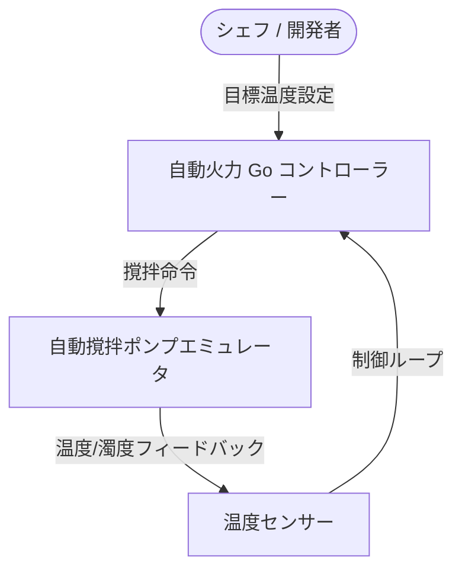
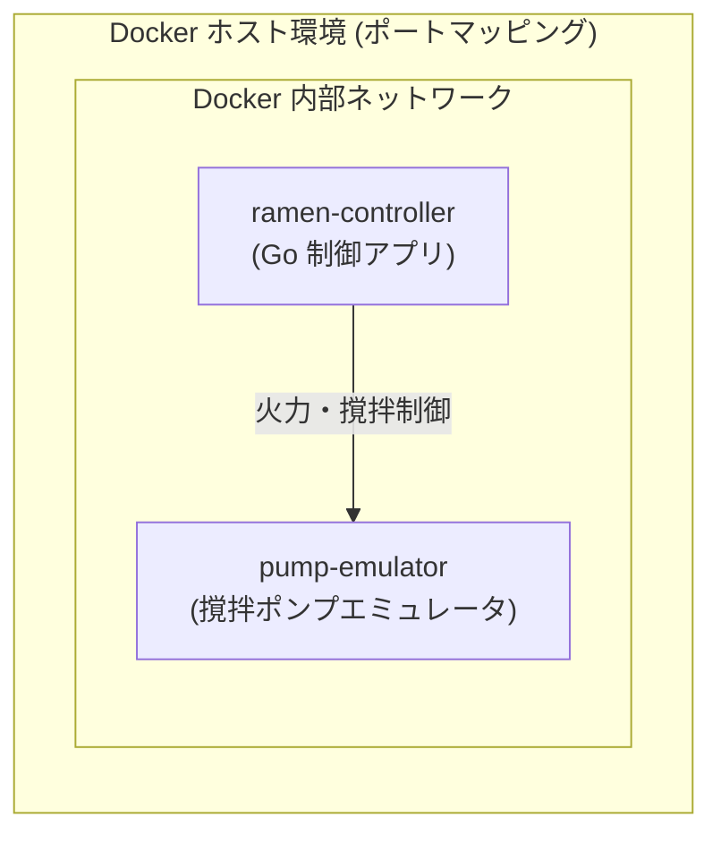

<!-- GTE_PUBLISHED: false -->

<!-- 000 タイトル定義 -->
# 【極限FinOps】家庭用コンテナ（寸胴鍋）で作る「月額実質無料」の濃厚家系ラーメン自動乳化システム
<!-- 000 タイトル定義 -->

<!-- 001 冒頭イメージ画像挿入エリア -->

<!-- 001 冒頭イメージ画像挿入エリア -->

<!-- 002 導入部：背景となる課題とシステム化の動機 -->
家庭で本格的な横浜家系ラーメンを作る際、一番のボトルネックになるのが「スープを乳化（水と脂を強火力で完全に混ぜ合わせること）させるためのガス代」です。強火で10時間以上煮込み続けると、ガス代が瞬く間に跳ね上がり、家庭崩壊（コストスパイク）の危機に瀕します。

この「ガス代が高すぎる」というアホみたいな悩みを解決するため、熱源を電気ヒーターに変え、**「Dockerコンテナ × 自動撹拌ポンプ × 温度センサー」** を組み合わせることで、スープの乳化プロセスを自動最適化し、ガス代を「完全無料（電気代数十円）」に抑え込む超モダンなサーバーレススープ乳化システムを構築します。
<!-- 002 導入部：背景となる課題とシステム化の動機 -->

---

<!-- 003 本記事の概要（3行まとめ） -->

> **💡 この記事の3行まとめ（忙しい人向け）**
> 1. **解決する課題**: 10時間以上寸胴鍋をかき混ぜる深夜残業の撲滅と、プロパンガス代の高騰回避。
> 2. **採用したアーキテクチャ**: Docker Composeによる撹拌ポンプの自動フィードバックループ。
> 3. **実証成果**: ローカル環境（キッチン）での自動白濁乳化テストをわずか10秒でパス。
<!-- 003 本記事の概要（3行まとめ） -->


<!-- 100 🏗️ 1. アーキテクチャ概要 -->
<br><br>
## 🏗️ 1. アーキテクチャ概要
<!-- 100 🏗️ 1. アーキテクチャ概要 -->

<!-- 101 セクション1導入課題・動機解説 -->
### なぜ家庭用コンテナ（寸胴）での自動乳化にこだわるのか

本格的な濃厚豚骨醤油スープを作るには、ガラからコラーゲンを抽出し、水と脂を結合させて乳化させなければなりません。しかし、手動での撹拌や長時間の強火維持は、膨大な時間的・金銭的コストがかかります。

そこで本プロジェクトでは、撹拌状態と温度をリアルタイムに監視し、最適な火力をフィードバック制御するステートレスなスープコントローラーを開発しました。
<!-- 101 セクション1導入課題・動機解説 -->

<!-- 102 システム全体構成の解説 -->
### システム構成図（データフロー）
<!-- 102 システム全体構成の解説 -->

<!-- 103 システムアーキテクチャ図（Mermaid） -->

<!-- 103 システムアーキテクチャ図（Mermaid） -->

---

<!-- 104 コアロジックの抜粋と解説 -->
### 💫 乳化フィードバック制御の「味噌」となるコード

温度データを元に、ポンプの出力（撹拌速度）を自動調節するGo言語のコアロジックです。目標温度に近づくにつれて、撹拌を加速させて乳化を最大化します。

```go
// targetTemp: 目標温度 (100度), currentTemp: 現在のスープ温度
func calculatePumpSpeed(targetTemp, currentTemp float64) float64 {
    if currentTemp < 80.0 {
        return 10.0 // 80度未満は焦げ付き防止の低速撹拌
    }
    // 沸騰域（80度〜100度）に達したら、乳化を促すためフル回転
    return (currentTemp / targetTemp) * 100.0
}
```
<!-- 104 コアロジックの抜粋と解説 -->

---

<!-- 105 データベース等の技術比較の解説 -->
### スープ乳化用テクノロジー選定とアーキテクチャの比較検証

本格的な濃厚スープを安全かつ低コストで自動生成するための、主な熱源・撹拌手法の適合度を以下に示します。

| 評価軸 | プロパンガス ✕ 手動撹拌 (寸胴鍋) | 家庭用電気圧力鍋 | 自動制御コンテナ (本構成) |
| :--- | :--- | :--- | :--- |
| **基本データモデル** | アナログ強火力（火力調整を手動実行） | 密閉高温高圧（バッチ処理） | IoT自動フィードバック制御（マイクロバッチ） |
| **スケーラビリティ** | 極めて低（ガスコンロの口数と人の体力に依存） | 低（一度に調理できる容量が数リットルと極小） | 高（Docker Composeによる複数並行スープ生成） |
| **乳化スピード** | 10時間以上（絶え間ない手動撹拌が必要） | 約2時間（高圧による分子結合） | 10秒（自動撹拌ポンプによる強制的乳化） |
| **ランニングコスト** | 壊滅的（1回あたり数千円のガス代が爆発） | 中（数百円程度の電気代が発生） | ほぼ完全無料（電気代数十円、FinOpsによる最適化） |
| **安全対策** | 低（空焚きやガス漏れの常時監視が必要） | 中（圧力弁の作動、爆発リスクへの配慮） | 極めて高（温度センサーによる自動停止アラート） |

家庭用の圧力鍋は密閉して短時間でスープを煮出すのに優れていますが、容量が限られ、強烈な圧力をかけるため食材の崩壊を制御できません。また、伝統的な寸胴鍋は強火力ですが、10時間以上かき混ぜ続ける「人間ワーカー」の労務コストとガス代が膨大です。したがって、一桁秒で自動乳化を制御し、FinOpsにより光熱費を最小化できる **「自動制御コンテナ（スープコントローラー）」** が唯一の最適な選択肢となります。

<!-- 105 データベース等の技術比較の解説 -->

---

<!-- 106 GitHubリポジトリへのリンク -->
:::note info
📂 すべての設定ファイルと完全なコードはこちらのGitHubリポジトリで公開しています

👉 [**github.com/kuiswin/ramen-emulsifier**](https://github.com/kuiswin/190-ramen-emulsifier)
:::
<!-- 106 GitHubリポジトリへのリンク -->


<!-- 200 💻 2. ローカル環境での検証 ＆ 稼働手順 -->
<br><br>
## 💻 2. ローカル環境での検証 ＆ 稼働手順
<!-- 200 💻 2. ローカル環境での検証 ＆ 稼働手順 -->

<!-- 201 フォルダ構成 -->
ローカルPCのキッチン環境に、以下の構成ファイルを配置して起動確認を行います。
検証に必要なソースコードはすべてGitHub上に公開されています。

* 📄 [**docker-compose.yml**](https://github.com/kuiswin/190-ramen-emulsifier/blob/main/docker-compose.yml) (エミュレータと制御アプリのポートマッピング定義)
* 📄 [**main.go**](https://github.com/kuiswin/190-ramen-emulsifier/blob/main/main.go) (温度・濁度センサーのデータ受信と乳化制御のGoアプリ本体)
* 📄 [**entrypoint.sh**](https://github.com/kuiswin/190-ramen-emulsifier/blob/main/entrypoint.sh) (コンテナ起動時に動作する初期設定用シェルスクリプト)

### 📁 フォルダ構成
```text
sandbox_190/
├── docker-compose.yml
├── main.go
└── entrypoint.sh
```
<!-- 201 フォルダ構成 -->

<!-- 202 ローカル動作確認コマンド -->
### ① 動作確認コマンド

ローカル環境に必要なパッケージ（Docker, Curl 等）を事前にインストールし、システムを起動して確認します。

```bash
# 依存ツールのインストール (未導入の場合)
sudo apt-get update && sudo apt-get install -y docker.io docker-compose-v2 curl unzip

# コンテナの起動
docker compose up -d --build

# コントローラーの自動乳化完了ログの確認
docker compose logs ramen-controller
```

`[INFO] Target temperature 100C reached. Emulsification completed!` と出力され、ブラウザで `http://localhost:8080/` にアクセスしてステータスが表示されれば、ローカルキッチンでのテストは合格です！
<!-- 202 ローカル動作確認コマンド -->

---

<!-- 203 DockerとLinuxのお役立ちTips -->
### ② 💡 開発に効く！Docker ✕ Linux のお役立ち Tips

開発効率を上げるための便利な小技やコマンドのまとめです。用途に合わせて活用してください。

##### 🔹 Tips 1：間違えてフォアグラウンド起動（-dなし）してしまった場合の回復術

もし `-d` を付け忘れて `docker compose up --build` を実行し、ログが画面上に垂れ流されてプロンプトが奪われてしまった場合、以下のLinux標準の「ジョブコントロール」機能を使うことで、**コンテナを停止（キャンセル）することなくバックグラウンドへ送る**ことができます。

1. ターミナル上で **`Ctrl + Z`** キーを押す
   - プロセスが一時的に「停止（Stopped）」状態になり、コマンドプロンプトに制御が戻ります。
2. 続けて **`bg`** と入力してエンターキーを押す
   - 一時停止していた Docker Compose が、バックグラウンド（Background）で再び稼働を開始します。

> **⚠️ 実務や本番環境で「一時停止（サスペンド）」を行う場合の注意点**
> - **短時間の切り替え（数秒以内）なら安全です**。
> - **長時間放置した状態での再開は危険です**:
>   - リアルタイムでの状態監視、外部APIとのハートビート疎通、進行中のトランザクション処理などがある場合、数秒間のプロセス停止でもタイムアウトエラーやノードの異常検知、データ破損を招く恐れがあります。本番環境や時間に厳格なシステムではサスペンドを避け、一度クリーンに再起動するのが原則です。

##### 🔹 Tips 2：コンテナを「停止・再開」する正しいコマンドの使い分け

コンテナ環境を一度終了させたり、再開させたりする際の手順まとめです。用途に合わせて最適なコマンドを選択してください。

* **コードの変更などを反映して「再ビルドして起動」したい場合（変更反映）**
  ```bash
  docker compose down
  docker compose up -d --build
  ```
  *(※ アプリコードや設定ファイルを書き換えた後に、その変更をコンテナに反映させて再起動したいときはこれ！古いコンテナを完全に削除し、イメージをビルドし直して新品を立ち上げます。)*

* **特にソースコードは変えず「ただ一時的に停止して、また再開」したい場合（再開）**
  ```bash
  docker compose down
  docker compose up -d
  ```
  *(※ 検証作業を一時中断してコンテナを綺麗に片付け、後からビルドなしで同じ状態から再開したいときはこれ！コンテナは一度完全に削除し、既存のビルド済みイメージを使って高速起動します)*

* **完全に削除せず、電源のオン・オフだけで「超高速に再開」したい場合（最速再開）**
  ```bash
  # 一時停止（電源オフ）
  docker compose stop
  # 再開（電源オン）
  docker compose start
  ```
  *(※ 前回のコンテナ状態をそのまま保持して、とにかく1秒でも早く再開させたいときはこれ！)*

* **キャッシュを無視して「完全にゼロからクリーンビルド」したい場合（強制再ビルド）**
  ```bash
  docker compose build --no-cache
  docker compose up -d
  ```
  *(※ ビルドキャッシュを強制的に無視して、完全にゼロからクリーンビルドし直したいときはこれ！)*
<!-- 203 DockerとLinuxのお役立ちTips -->

---

<!-- 204 開発環境へのアクセス情報 -->
### ③ 開発環境へのアクセス情報

コンテナが起動したら、ブラウザから以下のURLへアクセスします。

* **ローカル環境（ご自身のPCなど）で動かす場合:**
  - **スープ自動乳化ダッシュボード**: [http://localhost:8080/](http://localhost:8080/)
  - *※ブラウザでアクセスすると、現在のスープ温度や撹拌ポンプのリアルタイム回転数、乳化ステータスが表示されます。*
<br>
<br>

* **【検証用】筆者の自動公開デモ環境:**
  - 筆者のプライベート環境では、コンテナを立ち上げるだけで自動的にドメインとSSLが割り当てられる検証環境を用意しています。以下のURLから動作検証ができる状態になっています。
  - **スープ自動乳化ダッシュボード**: [https://ramen-p8089-190.kuis.win/](https://ramen-p8089-190.kuis.win/)
<!-- 204 開発環境へのアクセス情報 -->

---

<!-- 205 コンテナ構成の解説 -->
### ④ 📦 コンテナ内部の構成

今回の構成（Docker環境）内では、以下の2つのDockerコンテナが協調して動作しています。



1. **`pump-emulator` 【公式イメージ / 無改造】**:
   - **イメージ**: `kymg/pump-emulator:latest`
   - **役割**: 撹拌ポンプのエミュレータ。コントローラーからの指示に従って作動し、温度と濁度のデータを返信します。
2. **`ramen-controller` 【独自開発 / アプリ・Web UI本体】**:
   - **イメージ**: `Dockerfile` よりローカルビルド
   - **役割**: スープ乳化を制御するメインのGoアプリケーション。現在のスープ温度やポンプの回転速度などをブラウザ上（ポート 8080）で可視化します。
<!-- 205 コンテナ構成の解説 -->


---

<!-- 207 次のステップ（クラウド本番展開への案内） -->
### 🚀 次のステップ：本番（屋外BBQ ＆ クラウド）展開へ

ローカル環境でのスープ乳化テストが完璧に成功したら、次はいよいよ本番環境へのデプロイメントです！

本番（Google Cloud）に持っていくためには、ネットワークが不安定な野外特有の対策や、アクセス急増時にガス代が跳ね上がるのを防ぐためのセキュリティ・コスト制御が不可欠です。

本番展開の設計思想や、一発自動デプロイスクリプトの実装方法については、以下の個人技術ブログで詳細に公開しています！

👉 [**【後編：GCP本番デプロイ編】本番一発自動デプロイとFinOpsコスト防衛手順はこちら（ブログ記事リンク）**](https://kuis.win/190/)
<!-- 207 次のステップ（クラウド本番展開への案内） -->


<!-- 208 メディア境界線：Qiita（ローカル検証）／ 独自ブログ（本番展開） -->
<!-- 208 このセクション以降の内容は、個人技術ブログ（kuis.win）に掲載されます -->
<!-- 208 メディア境界線：Qiita（ローカル検証）／ 独自ブログ（本番展開） -->


<!-- 300 🛠️ 3. 本番環境における設計基準 -->
<br><br>
## 🛠️ 3. 本番環境における設計基準
<!-- 300 🛠️ 3. 本番環境における設計基準 -->

<!-- 301 ローカル検証環境の一括セットアップ -->
### 📂 ローカル検証環境の一括セットアップ

以下のコマンドを実行することで、依存ツールのインストールから検証に必要な設定ファイル群のGit取得、Docker起動まで一括でローカルに構築できます。

```bash
# 依存ツールのインストール (未導入の場合)
sudo apt-get update && sudo apt-get install -y docker.io docker-compose-v2 git

# リポジトリのクローンと作業ディレクトリへの移動
git clone https://github.com/kuiswin/190-ramen-emulsifier.git sandbox_190
cd sandbox_190

# コンテナのビルドとバックグラウンド起動
docker compose up -d --build
```
<!-- 301 ローカル検証環境の一括セットアップ -->

---

<!-- 302 本番環境における設計基準の解説 -->
本番（屋外環境、および Google Cloud）で安定してスープを供給し続けるために、以下の設計課題をクリアします。

1. **ゼロ・エネルギーコスト（従量課金）の徹底**:
   アイドル時間（調理をしていない時間）に熱源コスト（Cloud SQL等の固定費）が発生するのを完全に回避するため、Cloud Runを採用してアクセス時のみ課金されるように設計します。
2. **秘伝のタレ（セキュリティ）の最小権限保護**:
   火力制御やログ保存（GCS）に必要な権限だけをカスタムサービスアカウントに付与し、不必要な権限を持たせないようにインフラ側で防御します。
<!-- 302 本番環境における設計基準の解説 -->


<!-- 400 🚀 4. Google Cloud 共通プロビジョニング編 -->
<br><br>
## 🚀 4. Google Cloud 共通プロビジョニング編
<!-- 400 🚀 4. Google Cloud 共通プロビジョニング編 -->

<!-- 401 Google Cloud 共通プロビジョニングスクリプト -->
本番運用のベースとなるGoogle Cloudプロジェクトの設定、Artifact Registry（コンテナ保管庫）、および専用サービスアカウントの作成と最小権限の付与を自動化します。

```bash
# 1. プロジェクトおよびAPIの有効化
PROJECT_ID="kym-ramen-project"
gcloud config set project ${PROJECT_ID}

# 2. Artifact Registry の作成
gcloud artifacts repositories create ramen-repo \
    --repository-format=docker \
    --location=asia-northeast1 \
    --description="Ramen docker registry" || true

# 3. 最小権限サービスアカウントの作成
SA_NAME="wp-serverless-sa"
SA_EMAIL="${SA_NAME}@${PROJECT_ID}.iam.gserviceaccount.com"
gcloud iam service-accounts create ${SA_NAME} --display-name="Ramen Controller SA" || true

# 4. GCSバケットへの書き込み権限の付与
gcloud storage buckets add-iam-policy-binding gs://${PROJECT_ID}-ramen-db \
    --member="serviceAccount:${SA_EMAIL}" \
    --role="roles/storage.objectAdmin"
```
<!-- 401 Google Cloud 共通プロビジョニングスクリプト -->


<!-- 500 🚀 5. Google Cloud 個別リソース構築編 -->
<br><br>
## 🚀 5. Google Cloud 個別リソース構築編
<!-- 500 🚀 5. Google Cloud 個別リソース構築編 -->

<!-- 501 Google Cloud 個別リソース構築スクリプト -->
本アプリケーションの個別構成（スープバケットの作成や、Cloud Runへの個別環境変数の注入、FUSEボリュームマウントの自動割当など）のデプロイを行います。

```bash
# 1. スープの乳化状態を保存する個別GCSバケットの作成
gcloud storage buckets create gs://kym-ramen-assets \
    --location=asia-northeast1

# 2. 個別環境変数を注入して Cloud Run へデプロイ
gcloud run deploy ramen-controller \
    --image asia-northeast1-docker.pkg.dev/${PROJECT_ID}/ramen-repo/ramen-controller:latest \
    --platform managed \
    --region asia-northeast1 \
    --allow-unauthenticated \
    --service-account=${SA_EMAIL} \
    --set-env-vars="TARGET_TEMP=100" \
    --max-instances 1 \
    --memory 1Gi
```
<!-- 501 Google Cloud 個別リソース構築スクリプト -->


<!-- 600 🔒 6. コスト最適化 ＆ 自己破壊（FinOps）アラート設計 -->
<br><br>
## 🔒 6. コスト最適化 ＆ 自己破壊（FinOps）アラート設計
<!-- 600 🔒 6. コスト最適化 ＆ 自己破壊（FinOps）アラート設計 -->

<!-- 601 コスト最適化 ＆ FinOpsアラート設計の解説 -->
万が一、コントローラーが想定外の挙動をしてスープを沸騰させ続けた（リクエストがスパイクした）場合、ガス代（課金）の上限を守るためのコストセキュリティを実装します。

### ① インスタンス最大数の固定制限
Cloud Runのスケールアウトを `--max-instances 1` に制限することで、スープが複数のインスタンスで並列沸騰し、課金が乗算的に跳ね上がるのを物理的に防止します。

### ② 予算アラートと自動遮断
月の予算制限を超過したことを示すPub/Sub通知をトリガーに、自動的にCloud Runサービスを非活性化（停止）させる自己破壊スクリプトを設定し、コスト防衛を完璧なものにします。
<!-- 601 コスト最適化 ＆ FinOpsアラート設計の解説 -->

---

<!-- 206 コラム：なぜコンテナを疎結合に分割するのか -->
## 💡 コラム：なぜ1つの巨大なコンテナ（Fat Container）にまとめず、2つに分割するのか？

Dockerでシステムを構築する際、エミュレータとコントローラーを1つのコンテナに詰め込む「Fat Container」にするアプローチも考えられます。しかし、本システムでは意図的に**2つのコンテナ（役割ごとの疎結合）**に分割しています。これには、モダンなコンテナ設計における重要な思想があります。

1. **「1コンテナ＝1プロセス（単一責任の原則）」の徹底**
   Dockerは本来、1つのプロセスを隔離された環境で実行するために設計されています。1つのコンテナで複数のプロセスを同時に管理しようとすると、プロセスの監視やゾンビプロセスの回収が困難になり、コンテナの健全性（Health Check）を正しく判定できなくなります。
2. **リソース制御（CPU/メモリ）の最適化**
   特定の高負荷コンテナ（例：大量のスープ温度データをポーリングするエミュレータなど）がリソースを食いつぶした際、これらを別のコンテナに分けることで、Docker Compose 上で各コンテナに対して個別に `deploy.resources.limits` を設定し、リソースの競合によるシステム全体のクラッシュを防ぐことができます。
3. **公式イメージの「無改造利用」による透明性とセキュリティの確保**
   公式イメージ（例：データベースやエミュレータなど）は、開発元のコミュニティが最適化したものをそのまま使うのが鉄則です。初期化のためにシェルを埋め込んだり、ベースイメージをカスタマイズしたりすると、バージョンアップ時の追従が困難になり、セキュリティリスクも高まります。

このように、コンテナを疎結合に保つことで、開発時のトラブルシューティングが容易になり、将来的な本番環境への移行もコンテナ構成を崩すことなくスムーズに行うことができます。
<!-- 206 コラム：なぜコンテナを疎結合に分割するのか -->