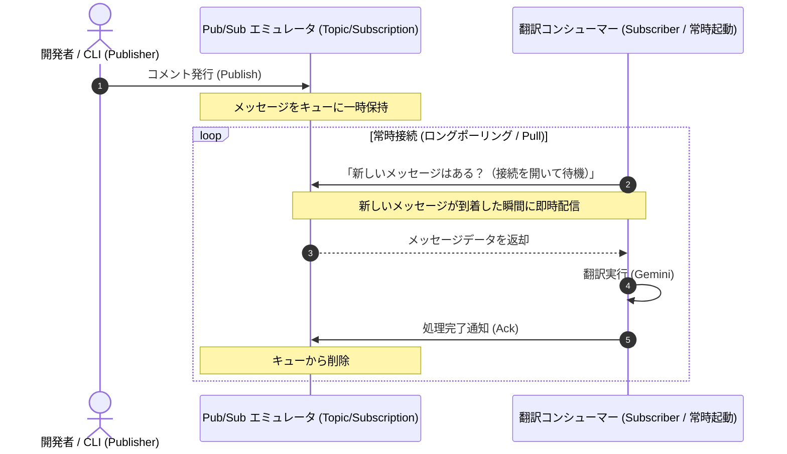
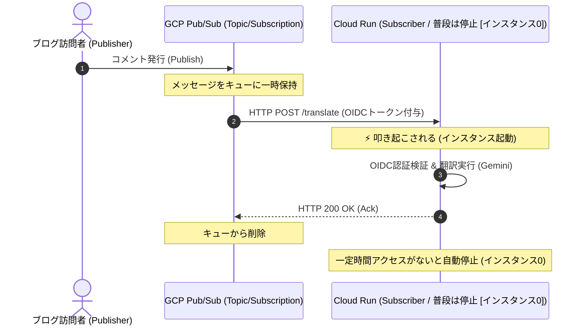

<!-- GTE_PUBLISHED: false -->

<!-- 000 タイトル定義 -->
# まれに届くスパムコメントを自動翻訳したい！Docker × Pub/Sub で無駄に頑丈な翻訳パイプラインを作る
<!-- 000 タイトル定義 -->

<!-- 001 冒頭イメージ画像挿入エリア -->

<!-- 001 冒頭イメージ画像挿入エリア -->

<!-- 002 導入部：背景となる課題とシステム化の動機 -->
私が運営するポエムブログにたまにコメントが届きます。多くの場合よくわからないSEOや●●買いませんか？ドメイン売りませんか？といった内容がほとんどなのですが、その中に、私のポエムを買いたいと、熱狂的なファンからの連絡が混じってしまう可能性も捨てきれません。そのため、取りこぼすことなく翻訳を行い、いつでも私のポエムを世界中に発信する準備を怠ることなく、備えたいと思います。
※今回はブログ連携ではなく、仕組み部分のみの実装です。
<!-- 002 導入部：背景となる課題とシステム化の動機 -->

---

<!-- 003 本記事の概要（3行まとめ） -->

> **💡 この記事の3行まとめ（忙しい人向け）**
> 1. **解決する課題**: 外部API呼び出しを含むコメント翻訳機能の同期実行による、レスポンス遅延やスパム集中時のサーバーダウンリスクを解決。
> 2. **採用したアーキテクチャ**: Google Cloud Pub/Sub と Docker エミュレータを用いた非同期・イベント駆動型の安全な翻訳メッセージングパイプライン。
> 3. **実証成果**: 大量のコメント要求時もバックプレッシャーによりコンシューマーを保護し、システム全体の耐障害性とスケーラビリティを飛躍的に向上。

<!-- 003 本記事の概要（3行まとめ） -->


<!-- 100 🏗️ 1. アーキテクチャ概要 -->
<br><br>
## 🏗️ 1. アーキテクチャ概要
<!-- 100 🏗️ 1. アーキテクチャ概要 -->

<!-- 101 セクション1導入課題・動機解説 -->
### イベント駆動型非同期AI翻訳パイプラインの意義

API呼び出しを含む時間のかかる処理（翻訳処理など）を、ユーザーのリクエストを受け付けるWebサーバー（フロントエンド）内で直接、処理をロックしてしまうため、このような実装は避けるべきです。理由は、外部APIの応答が遅延した瞬間に、Webサーバーのスレッドやプロセスが専有され、システム全体のダウンタイムを招くからです。

このようにならないよう、メッセージブローカーを仲介させることで **「時間的デカップリング（時間的疎結合）」** を行います。メッセージのパブリッシュ（送信）とサブスクライブ（受信・処理）を完全に非同期化することで、仮に後続の翻訳処理コンシューマーが停止していても、ユーザーへのレスポンスは即時完了し、メッセージはキューに安全にバッファリングされます。
<!-- 101 セクション1導入課題・動機解説 -->

<!-- 102 システム全体構成の解説 -->
### システム構成図（データフロー）

```mermaid
flowchart TD
    subgraph Local ["💻 Docker Compose（ローカル環境 ） [青]"]
        subgraph Local_Left [" "]
            User_local["👥 開発者 / ブラウザ"]
        end
        style Local_Left fill:none,stroke:none
        
        subgraph Local_Right [" "]
            subgraph Consumer_local ["【Container 1】 consumer (Node.js App)"]
                UI_local["💻 ダッシュボード UI (送信用)"]
                Worker_local["⚙️ 翻訳ワーカー (受取用)"]
            end
            PubSub_local["【Container 2】 pubsub-emulator (ポスト)"]
            Vertex_local["【外部SaaS】 Vertex AI (Gemini)"]
        end
        style Local_Right fill:none,stroke:none
        
        User_local -->|"① アクセス・送信"| UI_local
        UI_local -->|"② メッセージ発行 (Publish)"| PubSub_local
        PubSub_local <-.->|"③ Pullメッセージ取得"| Worker_local
        Worker_local -.->|"④ 翻訳要求"| Vertex_local
        Vertex_local -.->|"MOC返信 (疑似翻訳)"| Worker_local
    end
    
    subgraph GCP ["☁️ Google Cloud本番環境 [緑]"]
        subgraph GCP_Left [" "]
            User_prod["👥 ブログ訪問者 / ブラウザ"]
        end
        style GCP_Left fill:none,stroke:none
        
        subgraph GCP_Right [" "]
            subgraph Consumer_prod ["【Cloud Run】 翻訳サービス (完全サーバーレス)"]
                UI_prod["💻 ダッシュボード UI (送信用)"]
                Worker_prod["⚙️ 翻訳ワーカー (受取用)"]
            end
            PubSub_prod["【Cloud Pub/Sub】 メッセージキュー (ポスト)"]
            Vertex_prod["【Vertex AI】 Gemini 3.7"]
        end
        style GCP_Right fill:none,stroke:none
        
        User_prod -->|"① コメント投稿"| UI_prod
        UI_prod -->|"② メッセージ発行 (Publish)"| PubSub_prod
        PubSub_prod -->|"③ Push Webhook配信"| Worker_prod
        Worker_prod -->|"④ 翻訳要求"| Vertex_prod
        Vertex_prod -->|"⑤ 翻訳結果の返却"| Worker_prod
    end

    style Local fill:#e0f2fe,stroke:#0284c7,stroke-width:2px;
    style GCP fill:#f0fdf4,stroke:#16a34a,stroke-width:2px;
```

<!-- 102 システム全体構成の解説 -->

<!-- 103 システムアーキテクチャ図（Mermaid） -->

<!-- 103 システムアーキテクチャ図（Mermaid） -->

---

<!-- 104 コアロジックの抜粋と解説 -->
### 💫 本構成のインフラ特徴と設計思想

- **秘密鍵の漏洩リスクが完全ゼロ**: 環境変数 `PUBSUB_EMULATOR_HOST` を指定するだけで SDK がローカルエミュレータを自動認識するため、サービスアカウントの秘密鍵をローカルに落とす必要が一切ありません。
- **双方向の自動言語判定**: 入力されたテキストの言語を判定し、英語なら日本語へ、日本語なら英語へ双方向に自動翻訳するインテリジェントな翻訳ロジックを搭載。
- **物理キューの可視化ダッシュボード**: キューへのメッセージ滞留状況やスロットリング（処理遅延）、一時停止時のメッセージ保持（`nack` 制御）を視覚的にリアルタイム監視できるダッシュボードを自作。
  * **💡 `ack` と `nack` とは？**
    * **`ack` (Acknowledgement / 承認)**: 処理成功時に「キューからメッセージを削除して良い」と伝えるサイン。
    * **`nack` (Negative Acknowledgement / 応答拒否)**: 処理失敗や一時停止時に「メッセージをキュー（Step 2）へ差し戻して再配送を求める」サイン。
  * **🔒 `nack` 制御による「一時停止時のメッセージ保持」**
    * ワーカーを一時停止させる際、受信したメッセージにあえて `nack` を返して Pub/Sub 側の物理キューに安全に返却（保持）させることで、メンテや障害時のメッセージ消失を防ぎます。
  * **🎨 ダッシュボードで可視化する意義**
    * 「一時停止時に処理中だったメッセージが即座に物理キュー（Step 2）へ戻り、滞留件数が増える」という非同期ならではのデータ保護の動きをリアルタイムに目視できるため、障害耐性が設計通り機能しているかを一発で検証できます。
**▼ イメージ図**

:::
<!-- 104 コアロジックの抜粋と解説 -->

---

<!-- 105 データベース等の技術比較の解説 -->
### 非同期AI翻訳パイプライン用テクノロジー選定とアーキテクチャの比較検証

自動翻訳システムを安全かつ低コストで稼働させるための、主なメッセージング・非同期処理手法の適合度を以下に示します。

| 評価軸 | 同期API呼び出し (直列実行) | 自作メモリ内キュー (単一プロセス) | Pub/Sub + Cloud Run (本構成) |
| :--- | :--- | :--- | :--- |
| **基本データモデル** | HTTP同期リクエスト/レスポンス | メモリ内データバッファ（Koa/Expressメモリ） | 完全管理イベントメッセージング（Pub/Sub） |
| **スケーラビリティ** | 極めて低（API応答を待機するため接続が即時詰まる） | 低（単一VMのメモリ限界に依存、水平スケーリング不可） | 極めて高（Pub/Subから複数コンシューマーへ動的配信） |
| **データ永続化 / キュー保証**| なし（呼び出し側のエラーでデータは即時消失） | 一時的（プロセス再起動やクラッシュでキューが全滅） | 高（Pub/Sub内で最大7日間のメッセージ永続化・再試行） |
| **耐障害性 / 疎結合度** | 低（翻訳APIのダウンがメインシステムに直接波及） | 中（他プロセスへの波及はないが、自身が単一障害点） | 極めて高（メッセージバッファにより後続の障害時もデータ保護） |
| **ランニングコスト** | 0円（別途熱源コスト不要だがスロットリング損失大） | 中（常時起動VMの定額月額料金：約1,500円〜） | 極小（定額固定費0円、Pub/SubとCloud Runの無料枠内） |

同期API呼び出しやメモリ内キューは、一時的なアクセススパイクや翻訳APIの障害により、システム全体のダウンタイムやメッセージ消失を引き起こします。また、常時起動のメッセージブローカーは定額の固定費が発生します。
したがって、メッセージをPub/Subで緩衝させ、イベント駆動でCloud Runを従量課金起動する **「Pub/Sub + Cloud Run（本構成）」** が最も可用性とコスト効率に優れた選択肢となります。
<!-- 105 データベース等の技術比較の解説 -->

---

<!-- 106 GitHubリポジトリへのリンク -->
:::note info
📂 すべての設定ファイルと完全なコードはこちらのGitHubリポジトリで公開しています

👉 [**github.com/kuiswin/171-pubsub-pipeline**](https://github.com/kuiswin/171-pubsub-pipeline)
:::
<!-- 106 GitHubリポジトリへのリンク -->


<!-- 200 💻 2. ローカル環境での検証 ＆ 稼働手順 -->
<br><br>
## 💻 2. ローカル環境での検証 ＆ 稼働手順
<!-- 200 💻 2. ローカル環境での検証 ＆ 稼働手順 -->

<!-- 201 フォルダ構成 -->
ローカルPCの環境に、以下の構成ファイルを配置して起動確認を行います。
検証に必要なソースコードはすべてGitHub上に公開されています。

* 📄 [**docker-compose.yml**](https://github.com/kuiswin/171-pubsub-pipeline/blob/main/docker-compose.yml) (エミュレータと翻訳コンシューマーコンテナの定義)
* 📄 [**package.json**](https://github.com/kuiswin/171-pubsub-pipeline/blob/main/consumer/package.json) (Node.js依存ライブラリ定義)
* 📄 [**index.js**](https://github.com/kuiswin/171-pubsub-pipeline/blob/main/consumer/index.js) (Pub/Subのポーリング、ダッシュボード配信、翻訳ロジック)
* 📄 [**Dockerfile**](https://github.com/kuiswin/171-pubsub-pipeline/blob/main/consumer/Dockerfile) (翻訳コンシューマー起動用コンテナビルド定義)
* 📄 [**dashboard.html**](https://github.com/kuiswin/171-pubsub-pipeline/blob/main/consumer/dashboard.html) (メッセージ送受信・滞留キュー可視化WebUI)

### 📁 フォルダ構成
```text
sandbox_171/
├── docker-compose.yml
└── consumer/
    ├── Dockerfile
    ├── dashboard.html
    ├── index.js
    └── package.json
```
<!-- 201 フォルダ構成 -->

<!-- 202 ローカル動作確認コマンド -->
### ① ローカルでの動作確認について

本システムでは、Google Cloudの実機環境にデプロイする前に、ローカル環境で「本番とほぼ同等の挙動」を再現できるよう、Docker Composeを用いたコンテナ型のエミュレータ（Pub/Subエミュレータなど）を組み合わせて検証を行います。これにより、クラウド料金を発生させることなく、Node.js API経由でのPub/Subメッセージのパブリッシュ、サブスクリプション購読、Geminiによる自動翻訳、およびダッシュボード表示などの主要機能を安全にテストできます。

GitHub上に公開されているソースコードを一つずつコピーしてフォルダに配置し、Docker環境を手動で立ち上げることで動作確認自体は可能ですが、ファイル構成の作成や依存関係のインストール、環境変数のマッピング設定を手動で行うのは少々手間（不便）がかかります。

のちに照会する私の技術ブログで、**これらの依存パッケージのインストール、リポジトリのクローン、そしてローカル環境でのコンテナ起動までを「一発」で自動完了させる、超便利なワンライナーコマンドと自動セットアップ手順**を公開しています！

より簡単かつスピーディーにローカルでの動作確認を行いたい方は、ぜひ以下のリンクから私の個人ブログをご参照ください。
<!-- 202 ローカル動作確認コマンド -->

---

<!-- 203 DockerとLinuxのお役立ちTips -->
### ② 💡 開発に効く！Docker ✕ Linux のお役立ち Tips

開発効率を上げるための便利な小技やコマンドのまとめです。用途に合わせて活用してください。

##### 🔹 Tips 1：間違えてフォアグラウンド起動（-dなし）してしまった場合の回復術

もし `-d` を付け忘れて `docker compose up --build` を実行し、ログが画面上に垂れ流されてプロンプトが奪われてしまった場合、以下のLinux標準の「ジョブコントロール」機能を使うことで、**コンテナを停止（キャンセル）することなくバックグラウンドへ送る**ことができます。

1. ターミナル上で **`Ctrl + Z`** キーを押す
   - プロセスが一時的に「停止（Stopped）」状態になり、コマンドプロンプトに制御が戻ります。
2. 続けて **`bg`** と入力してエンターキーを押す
   - 一時停止していた Docker Compose が、バックグラウンド（Background）で再び稼働を開始します。

> **⚠️ 実務や本番環境で「一時停止（サスペンド）」を行う場合の注意点**
> - **短時間の切り替え（数秒以内）なら安全です**。
> - **長時間放置した状態での再開は危険です**:
>   - リアルタイムでの状態監視、外部APIとのハートビート疎通、進行中のトランザクション処理などがある場合、数秒間のプロセス停止でもタイムアウトエラーやノードの異常検知、データ破損を招く恐れがあります。本番環境や時間に厳格なシステムではサスペンドを避け、一度クリーンに再起動するのが原則です。

##### 🔹 Tips 2：コンテナを「停止・再開」する正しいコマンドの使い分け

コンテナ環境を一度終了させたり、再開させたりする際の手順まとめです。用途に合わせて最適なコマンドを選択してください。

* **コードの変更などを反映して「再ビルドして起動」したい場合（変更反映）**
  ```bash
  docker compose down
  docker compose up -d --build
  ```
  *(※ アプリコードや設定ファイルを書き換えた後に、その変更をコンテナに反映させて再起動したいときはこれ！古いコンテナを完全に削除し、イメージをビルドし直して新品を立ち上げます。)*

* **特にソースコードは変えず「ただ一時的に停止して、また再開」したい場合（再開）**
  ```bash
  docker compose down
  docker compose up -d
  ```
  *(※ 検証作業を一時中断してコンテナを綺麗に片付け、後からビルドなしで同じ状態から再開したいときはこれ！コンテナは一度完全に削除し、既存のビルド済みイメージを使って高速起動します)*

* **完全に削除せず、電源のオン・オフだけで「超高速に再開」したい場合（最速再開）**
  ```bash
  # 一時停止（電源オフ）
  docker compose stop
  # 再開（電源オン）
  docker compose start
  ```
  *(※ 前回のコンテナ状態をそのまま保持して、とにかく1秒でも早く再開させたいときはこれ！)*

* **キャッシュを無視して「完全にゼロからクリーンビルド」したい場合（強制再ビルド）**
  ```bash
  docker compose build --no-cache
  docker compose up -d
  ```
  *(※ ビルドキャッシュを強制的に無視して、完全にゼロからクリーンビルドし直したいときはこれ！)*
<!-- 203 DockerとLinuxのお役立ちTips -->

---

<!-- 204 開発環境へのアクセス情報 -->
### ③ 開発環境へのアクセス情報

コンテナが起動したら、ブラウザから以下のURLへアクセスします。

* **ローカル環境（ご自身のPCなど）で動かす場合:**
  - **AI自動翻訳ダッシュボード**: [http://localhost:8086/](http://localhost:8086/)
  - *※ブラウザでアクセスすると、トピック送受信ステータスや翻訳結果がリアルタイムで一覧表示されるダッシュボード画面が表示されます。*
<br>
<br>

* **【検証用】筆者の自動公開デモ環境:**
  - 筆者のプライベート環境では、コンテナを立ち上げるだけで自動的にドメインとSSLが割り当てられる検証環境を用意しています。以下のURLから動作検証が可能です。
  - **AI自動翻訳ダッシュボード**: [https://translate-p8086-171.kuis.win/](https://translate-p8086-171.kuis.win/)
<!-- 204 開発環境へのアクセス情報 -->

---

<!-- 205 コンテナ構成の解説 -->
### ④ 📦 コンテナ内部の構成

今回の構成（Docker環境）内では、以下の3つのDockerコンテナが協調して動作しています。


1. **`pubsub-emulator` 【公式イメージ / 無改造】**:
   - **イメージ**: `gcr.io/google.com/cloudsdktool/google-cloud-cli:emulators`
   - **役割**: Google Cloud SDKのPub/Subエミュレータ。ローカルでPub/Subメッセージのルーティングを行います。
2. **`pubsub-init` 【初期化用 (transient) / 完了後自動終了】**:
   - **イメージ**: `gcr.io/google.com/cloudsdktool/google-cloud-cli:emulators`
   - **役割**: エミュレータの起動を待ち、必要なトピック (`verify-topic`) とサブスクリプション (`verify-sub`) を自動で事前作成して終了するセットアップコンテナ。
3. **`consumer` 【独自開発 / アプリ・Web UI本体】**:
   - **イメージ**: `Dockerfile` よりローカルビルド
   - **役割**: メッセージを受信して自動双方向翻訳を実行し、可視化 Web ダッシュボードを提供するNode.jsアプリケーション本体（ポート 8080、ホスト側マッピング 8086）。
<!-- 205 コンテナ構成の解説 -->

##### 💡 Pub/Subの基本概念：手紙の郵送システムで例えると
Pub/Sub（Publish / Subscribe）の仕組みは、手紙の郵送システムに例えると非常にイメージしやすくなります。

* **Publisher（パブリッシャー / 差出人）** 【ブラウザ / クライアント CLI】
  - 手紙（メッセージ）を書いて送る人です。
* **Topic（トピック / 郵便ポスト）** 【`pubsub-emulator` 内に作成】
  - 手紙の宛先となる場所です。
* **Subscription（サブスクリプション / 配達方法）** 【`pubsub-emulator` 内に作成】
  - 届いた手紙を、誰にどうやって届けるかという「配送ルール（ルート）」です。
* **Subscriber（サブスクライバー / 受取人）** 【`consumer`】
  - 最終的に手紙を受け取り、翻訳などの処理を行う人です。

> **⚠️ 開発環境と本番環境での「手紙の受け渡し方（矢印の向き）」の違い**
> 上記の図は **ローカル開発（Docker）** の構成を表しています。ローカルでは **Pull（引っ張り）型** の配送ルールを採用しているため、受取人（`consumer`）が自らポスト（`pubsub-emulator`）へ「手紙が来てないか？」と聞きにいきます。そのため、矢印は `Consumer --> PubSub` となっています。
> 
> これが **本番（GCP）** になると、**Push（送りつけ）型** に切り替わります。この場合、ポスト（Pub/Sub）が自動で受取人（Cloud Run）の玄関まで手紙を届けにいく（HTTP POST リクエストを送りつける）ため、データの流れる向き（矢印）は `PubSub --> Cloud Run` と逆方向になります。

<!-- 206 コラム：なぜコンテナを疎結合に分割するのか -->
##### 💡 コラム：なぜ1つの巨大なコンテナ（Fat Container）にまとめず、3つに分割するのか？

Dockerでシステムを構築する際、エミュレータと初期化処理、コンシューマーを1つのコンテナに詰め込む「Fat Container」にするアプローチも考えられます。しかし、本システムでは意図的に**3つのコンテナ（役割ごとの疎結合）**に分割しています。これには、モダンなコンテナ設計における重要な思想があります。

1. **「1コンテナ＝1プロセス（単一責任の原則）」の徹底**
   Dockerは本来、1つのプロセスを隔離された環境で実行するために設計されています。1つのコンテナで複数のプロセスを同時に管理しようとすると、プロセスの監視やゾンビプロセスの回収が困難になり、コンテナの健全性（Health Check）を正しく判定できなくなります。
2. **リソース制御（CPU/メモリ）の最適化**
   メッセージブローカー（エミュレータ）とコンシューマー（アプリケーション）を分けることで、Docker Compose 上で各コンテナに対して個別に `deploy.resources.limits` を設定し、リソースの競合によるシステム全体のクラッシュを防ぐことができます。
3. **公式イメージの「無改造利用」による透明性とセキュリティの確保**
   公式イメージ（例：Google Cloud CLIのエミュレータ）は、開発元のコミュニティが最適化したものをそのまま使うのが鉄則です。初期化のためにシェルを埋め込んだり、ベースイメージをカスタマイズしたりすると、バージョンアップ時の追従が困難になり、セキュリティリスクも高まります。
4. **「冪等（べきとう）な初期化処理」の分離（Init Container パターン）**
   トピックやサブスクリプションの作成といった「起動時に1回だけ実行したい処理」をアプリケーションやブローカーの起動スクリプトに混ぜるのではなく、独立した軽量コンテナ (`pubsub-init`) として切り出しています。これらは**冪等（繰り返し実行しても同じ結果になる）**に作られており、必要なセットアップが完了すると即座に正常終了（Status 0でExit）します。
<!-- 206 コラム：なぜコンテナを疎結合に分割するのか -->

---

<!-- 207 次のステップ（クラウド本番展開への案内） -->
### 🚀 次のステップ：試験環境と本番環境に展開

ローカル環境での動作準備が完了させて、本番環境にもデプロイメントを実施させます。

設計思想や、一発自動デプロイスクリプトの実装方法については、記事の後半で紹介する個人ブログ側で公開していますのでアクセスしてみてください！

👉 [**【後編：Google Cloud本番デプロイ編】本番一発自動デプロイとFinOpsコスト防衛手順はこちら（ブログ記事リンク）**](https://kuis.win/171/)
<!-- 207 次のステップ（クラウド本番展開への案内） -->


<!-- 208 メディア境界線：Qiita（ローカル検証）／ 独自ブログ（本番展開） -->
<!-- このセクション以降の内容は、個人技術ブログ（kuis.win）に掲載されます -->
<!-- 208 メディア境界線：Qiita（ローカル検証）／ 独自ブログ（本番展開） -->


<!-- 300 🧪 3. 物理キューの挙動検証（ローカルディープダイブ） -->
<br><br>
## 🧪 3. 物理キューの挙動検証（ローカルディープダイブ）
<!-- 300 🧪 3. 物理キューの挙動検証（ローカルディープダイブ） -->

<!-- 301 ローカル検証環境の一括セットアップ -->
### 📂 ローカル検証環境の一括セットアップ

以下のコマンドを実行することで、依存ツールのインストールから検証に必要な設定ファイル群のGit取得、Docker起動まで一括でローカルに構築できます。

```bash
# 依存ツールのインストール (未導入の場合)
sudo apt-get update && sudo apt-get install -y docker.io docker-compose-v2 git

# リポジトリのクローンと作業ディレクトリへの移動
git clone https://github.com/kuiswin/171-pubsub-pipeline.git sandbox_171
cd sandbox_171

# コンテナのビルドとバックグラウンド起動
docker compose up -d --build
```
<!-- 301 ローカル検証環境の一括セットアップ -->

---

<!-- 302 物理キューの挙動検証の解説 -->
ローカル環境で Pub/Sub キューの物理的な挙動やバックプレッシャーの仕組みをディープに検証します。

### 🧪 物理キューの滞留とバックプレッシャーの動作検証
このダッシュボードには、時間的デカップリングの物理的挙動をテストするための「一時停止」機能と「遅延スライダー（スロットリング）」機能が備わっています。

1. **メッセージ送信と一時停止**:
   - 画面上の「一時停止」ボタンを押します。これにより、コンシューマーの Pub/Sub 購読リスナーがクローズされます。
   - その後、ダッシュボードの「テンプレートからランダム生成」ボタンを数回クリックするか、テキストフォームに文字を入力して「送信」を押します。送信されたメッセージはコンシューマーが受け取らないため、メッセージは **Pub/Sub エミュレータ内に完全に滞留** します（滞留中のバッファ数が増加します）。
2. **CLI からの物理キュー確認**:
   - 実際に Pub/Sub エミュレータ内にメッセージが滞留しているかを、ターミナルから以下の API を直接叩いて確認できます。
     ```bash
     curl -s -X POST -H "Content-Type: application/json" -d '{"maxMessages": 10, "returnImmediately": true}' http://localhost:8085/v1/projects/local-project/subscriptions/verify-sub:pull
     ```
     **▼ 実際の実行結果（レスポンスJSON）の例**
     ```json
     {
       "receivedMessages": [
         {
           "ackId": "projects/local-project/subscriptions/verify-sub:49",
           "message": {
             "data": "eyJpZCI6MTAwNywidGV4dCI6IkNsb3VkIFJ1biBpcyBhIG1hbmFnZWQgY29tcHV0ZSBwbGF0Zm9ybSB0aGF0IGVuYWJsZXMgeW91IHRvIHJ1biBjb250YWluZXJzIHRoYXQgYXJlIGRlcGxveWFibGUgb24gR29vZ2xlIENsb3VkLiIsInRpbWVzdGFtcCI6IjIwMjYtMDctMTlUMjE6MTM6MjcuMDIxWiJ9",
             "messageId": "35",
             "publishTime": "2026-07-19T21:13:27.037Z"
           }
         },
         {
           "ackId": "projects/local-project/subscriptions/verify-sub:50",
           "message": {
             "data": "eyJpZCI6MTAwOCwidGV4dCI6IkNsb3VkIFN0b3JhZ2UgaXMgYSBnbG9iYWwsIHNlY3VyZSwgYW5kIHNjYWxhYmxlIG9iamVjdCBzdG9yZSBmb3IgdW5zdHJ1Y3R1cmVkIGRhdGEgc3VjaCBhcyBpbWFnZXMsIHZpZGVvcywgYW5kIGJhY2t1cHMuIiwidGltZXN0YW1wIjoiMjAyNi0wNy0xOVQyMToxMzoyOC4wNzRaIn0=",
             "messageId": "36",
             "publishTime": "2026-07-19T21:13:28.091Z"
           }
         },
         {
           "ackId": "projects/local-project/subscriptions/verify-sub:51",
           "message": {
             "data": "eyJpZCI6MTAwOSwidGV4dCI6Ikdvb2dsZSBDbG91ZCBTcGFubmVyIGlzIGEgZnVsbHkgbWFuYWdlZCwgbWlzc2lvbi1jcml0aWNhbCByZWxhdGlvbmFsIGRhdGFiYXNlIHNlcnZpY2UgdGhhdCBwcm92aWRlcyB0cmFuc2FjdGlvbmFsIGNvbnNpc3RlbmN5IGF0IGdsb2JhbCBzY2FsZS4iLCJ0aW1lc3RhbXAiOiIyMDI2LTA3LTE5VDIxOjEzOjkuMTI5WiJ9",
             "messageId": "37",
             "publishTime": "2026-07-19T21:13:29.147Z"
           }
         }
       ]
     }
     ```
     ※ `data` 属性値は Base64 エンコードされたメッセージのペイロード（JSON）です。
   - レスポンスとして、エミュレータがメッセージを保持していることを表す生の JSON データを直接確認できます。
3. **コンシューマーの再開**:
   - 画面上の「再開」ボタンを押します。
   - 購読が再開された瞬間、エミュレータ内に滞留していたメッセージ群が自動で吸い出され、順次並列処理（翻訳）されて画面にダダダッと流れます。
 4. **本番環境（Google Cloud）での検証注意点**:
    - 本番の Cloud Pub/Sub に対しても、同じように REST API の `:pull` エンドポイントを叩いてメッセージを確認することは**技術的に可能**です。
    - ただし、本番でテストする場合には以下の2点に注意してください。
      - **① 認証トークンの付与が必要**：
        Google Cloud API へのアクセスには当然セキュリティ認証が必要です。ヘッダーに OAuth2 アクセストークンを載せてリクエストを投げる必要があります。
        ```bash
        curl -s -X POST \
          -H "Authorization: Bearer \$(gcloud auth print-access-token)" \
          -H "Content-Type: application/json" \
          -d '{"maxMessages": 10, "returnImmediately": true}' \
          https://pubsub.googleapis.com/v1/projects/YOUR_PROJECT_ID/subscriptions/YOUR_SUB_NAME:pull
        ```
      - **② 本番は Push 配信（Webhook型）のため、通常はキューに滞留しない**：
        本番環境では Cloud Run に対する「Push（押し付け）型」のサブスクリプションを組むため、メッセージが送信された瞬間に自動で Cloud Run に転送され、処理が成功すると即時に消去（Ack）されます。そのため、普通にコマンドを叩いても空のデータ（`{}`）しか返ってきません。
        もし本番環境でもキューが溜まる様子をこの API で確認したい場合は、一時的にサブスクリプション設定を `Push` から `Pull` に切り替えるか、宛先の Cloud Run を一時停止させてエラー（502等）を吐かせ、Pub/Sub 側に強制的にメッセージを滞留させる仕掛けが必要になります。

この実験により、後続のアプリケーションが一時的にメンテナンスや障害で停止していても、Pub/Subが緩衝材（バッファ）として機能し、データを1件も損失することなく安全にアクセスを乗り越えられる「時間的疎結合（時間的デカップリング）」が完璧に実証されます！

---


<!-- 302 物理キューの挙動検証の解説 -->


<!-- 400 🚀 4. Google Cloud 共通プロビジョニング編 -->
<br><br>
## 🚀 4. Google Cloud 共通プロビジョニング編
<!-- 400 🚀 4. Google Cloud 共通プロビジョニング編 -->

<!-- 401 Google Cloud 共通プロビジョニングスクリプト -->
本番運用のベースとなるGoogle Cloudプロジェクトの設定、Artifact Registry（コンテナ保管庫）、および専用サービスアカウントの作成と最小権限の付与を自動化します。

```bash
# 1. プロジェクトおよびAPIの有効化
PROJECT_ID="your-google-cloud-project-id"
REGION="asia-northeast1"
SERVICE_NAME="translate-pipeline"
TOPIC_NAME="translate-topic"
SUBSCRIPTION_NAME="translate-sub"

gcloud config set project ${PROJECT_ID}

# 2. Pub/Sub トピックとサブスクリプションの作成
gcloud pubsub topics create ${TOPIC_NAME} || true
gcloud pubsub subscriptions create ${SUBSCRIPTION_NAME} --topic=${TOPIC_NAME} || true

# 3. Artifact Registry の作成
gcloud artifacts repositories create ${SERVICE_NAME}-repo \
    --repository-format=docker \
    --location=${REGION} \
    --description="Translate service docker repository" || true

# 4. 専用サービスアカウントの作成と最小権限の付与
SA_NAME="translate-sa"
SA_EMAIL="${SA_NAME}@${PROJECT_ID}.iam.gserviceaccount.com"
gcloud iam service-accounts create ${SA_NAME} --display-name="Translate Consumer SA" || true

# 各種ポリシー・ロールの付与 (Vertex AI 使用権限)
gcloud projects add-iam-policy-binding ${PROJECT_ID} \
    --member="serviceAccount:${SA_EMAIL}" \
    --role="roles/aiplatform.user"

# Cloud Run 起動元ロールの付与
gcloud projects add-iam-policy-binding ${PROJECT_ID} \
    --member="serviceAccount:${SA_EMAIL}" \
    --role="roles/run.invoker"

# Pub/Sub サービスエージェントへの Token Creator ロールの付与
PROJECT_NUMBER=$(gcloud projects describe ${PROJECT_ID} --format="value(projectNumber)")
gcloud projects add-iam-policy-binding ${PROJECT_ID} \
    --member="serviceAccount:service-${PROJECT_NUMBER}@gcp-sa-pubsub.iam.gserviceaccount.com" \
    --role="roles/iam.serviceAccountTokenCreator"
```
<!-- 401 Google Cloud 共通プロビジョニングスクリプト -->


<!-- 500 🚀 5. Google Cloud 個別リソース構築編 -->
<br><br>
## 🚀 5. Google Cloud 個別リソース構築編
<!-- 500 🚀 5. Google Cloud 個別リソース構築編 -->

<!-- 501 Google Cloud 個別リソース構築スクリプト -->
本アプリケーションの個別構成（コンテナビルド・デプロイと Cloud Run 固有の設定）をデプロイします。

```bash
# Cloud Runへのデプロイ (ソースコード直接ビルド＆デプロイ / タイムアウトをack-deadline以下の300sに設定しRetry Stormを防止)
gcloud run deploy ${SERVICE_NAME} \
    --source . \
    --platform managed \
    --region ${REGION} \
    --no-allow-unauthenticated \
    --service-account=${SA_EMAIL} \
    --set-env-vars="LLM_PROVIDER=gemini,GEMINI_MODEL=gemini-3.7-flash" \
    --max-instances 3 \
    --timeout 300s \
    --memory 1Gi

# 3. Cloud Run デプロイ後に、サブスクリプションをPush型（Webhook）に更新 (Ack Deadline 600s > Timeout 300s でRetry Stormを数理防衛)
SERVICE_URL=$(gcloud run services describe ${SERVICE_NAME} --region ${REGION} --format 'value(status.url)')

gcloud pubsub subscriptions update ${SUBSCRIPTION_NAME} \
    --push-endpoint="${SERVICE_URL}/translate" \
    --push-auth-service-account=${SA_EMAIL} \
    --push-auth-token-audience="${SERVICE_URL}" \
    --ack-deadline=600
```

> **💡 Cloud Run への Push 認証における Audience (aud) の罠**
> エンドポイントにパス（`/translate`）を含める場合、Pub/Sub が自動生成する OIDC トークンの Audience（宛先）と、Cloud Run が期待するルート URL にズレが生じます。これを放置すると、Cloud RunのIAMプロキシに 401 Unauthorized エラーで弾かれ、無限リトライ（Retry Storm）が発生します。これを防ぐため、必ず `--push-auth-token-audience="${SERVICE_URL}"` を明示的に指定し、Audience をルート URL に矯正してください。

> **🛡️ Push型メッセージングにおけるインフラ駆動バックプレッシャーの仕組み**
> 本システムでは Cloud Run の最大インスタンス数を `--max-instances 3` に制限しています。スパムコメントの急激なバースト発生時、3台のインスタンスおよび各同時実行数のキャパシティを超過すると、Google Front End (GFE) が HTTP `429 Too Many Requests` または `503 Service Unavailable` を自動返却します。Pub/Sub の Push 配信はこれを検知すると、未処理メッセージを自前で保持（バッファリング）しつつ、配信レートに自動で指数バックオフ（Exponential Backoff）をかけて速度を調整（バックプレッシャー）します。これにより、後続のコンシューマーや Vertex AI API クォータの破綻を防いでいます。

> **💡 公式SDKを避け、あえて REST API を `fetch` で叩いている理由**
> Node.js で Vertex AI を呼び出す場合、通常は公式の `@google-cloud/vertexai` SDK を使用します。しかし、本システムではコンテナイメージを極限まで軽量化し、サーバーレス環境（Cloud Run）で最も重要となる**「コンテナ起動速度」を最速化**するため、あえて公式 SDK を含めず標準の `fetch` で直接 Vertex AI の REST API エンドポイントを叩いています。これにより依存パッケージを最小限に抑え、コンテナの起動オーバーヘッドをミリ秒単位で削減しています。

> **⚠️ 注意：Push型配信におけるべき等性（Idempotency）の確保**
> Cloud Pub/Sub の Push 配信は「少なくとも1回（at-least-once）の配信」を保証するため、ネットワークの一時的な瞬断などでサーバーが Ack（処理完了通知）を返せなかった場合、同じメッセージが重複して送信される可能性があります。これに対処するため、受信側のアプリケーション（Cloud Run）では `messageId` をキーとした Redis や Firestore による「処理済みIDの記録（重複排除テーブル）」を実装し、既に処理済みのメッセージであれば即座に 200 OK を返して無視する「べき等な処理」の実装が必須となります。

> **🔄 ローカル（Pull）と本番（Push）のハイブリッド処理モデル**
> このコンシューマープログラムは、開発環境と本番環境で異なるPub/Subメッセージ受信モデルを自動判別します。
> * **ローカル（エミュレータ環境）**: `isLocal` が真の場合、`startConsumer()` により Pull 型（イベントをポーリングして購読する常駐ワーカー）で動作し、高速なデバッグと可視化を可能にします。
> * **本番環境（Cloud Run）**: `isLocal` が偽の場合、無駄なバックグラウンドポーリングによるCPUリソースの浪費（およびCloud Runでの受信凍結）を防ぐため、Pull リスナーを起動しません。代わりに、Pub/Subの Push サブスクリプションから `POST /translate` エンドポイントへ送信されるプッシュ通知を待機するステートレスな構成として動作し、Cloud Run のゼロスケール（完全従量課金）のメリットを最大化します。

##### 💻 ローカル開発環境のデータフロー（Pullモデル）
ローカル環境では、コンシューマーが主体となって定期的にエミュレータへ新しいメッセージを問い合わせる「引っ張り（Pull）」方式をとります。ネットワーク設定が不要で、デモ画面から「受信の一時停止」などの制御が簡単に行えるデバッグ優先の構成です。



##### ☁️ 本番環境のデータフロー（Pushモデル）
本番環境では、GCPのPub/Subが主体となって、メッセージ受信時にCloud Runの特定のURL（`/translate`）を強制的に呼び出す「送りつけ（Push）」方式をとります。普段はサーバーを完全に停止（インスタンス数0）させてコストを浮かせ、リクエストが来た時だけ叩き起こすFinOps優先の構成です。


<!-- 501 Google Cloud 個別リソース構築スクリプト -->


<!-- 600 🔒 6. コスト最適化 ＆ 自己破壊（FinOps）アラート設計 -->
<br><br>
## 🔒 6. コスト最適化 ＆ 自己破壊（FinOps）アラート設計
<!-- 600 🔒 6. コスト最適化 ＆ 自己破壊（FinOps）アラート設計 -->

<!-- 601 コスト最適化 ＆ FinOpsアラート設計の解説 -->
本番運用のセキュリティ ＆ コスト防衛（自己破壊/FinOps）について解説します。

### ① インスタンス最大数の制限
自動スケーリングの上限を小さく抑えることで、急激なアクセス時もリソース使用量の上限を物理的に制限します。`--max-instances 3` などを指定してデプロイします。

### ② プッシュサブスクリプションにおける認証（OIDCトークン）とSSL/TLSの強制
本番環境では、Cloud Runへのアクセスを「未認証のアクセスを許可しない（`--no-allow-unauthenticated`）」に設定して保護するのが大原則です。この場合、以下の設定を本番構成に追加する必要があります。
1. Pub/Subサブスクリプションの配信タイプに「プッシュ（Push）」を指定し、Cloud Runが払い出すセキュアなHTTPSエンドポイント（`https://[SERVICE_NAME]-[HASH]-an.a.run.app/translate`）を設定します。
2. サブスクリプション構成内に「認証を有効にする」のオプションを適用し、あらかじめ作成した本番用サービスアカウントを関連付けます。
3. このサービスアカウントに対し、配信先となるCloud Runサービスの「Cloud Run 起動元（`roles/run.invoker`）」ロールを付与します。
4. Pub/Sub のシステムサービスアカウント（`service-[PROJECT_NUMBER]@gcp-sa-pubsub.iam.gserviceaccount.com`）に対して、「Service Account Token Creator（`roles/iam.serviceAccountTokenCreator`）」ロールを付与し、Pub/SubがOIDCトークンを生成できるようにします。
これにより、Pub/Subがメッセージ送信時に自動的にOIDC（OpenID Connect）トークンを生成し、Cloud Run側で認証を安全にパスさせることが可能になります。

### ③ 常時起動型アーキテクチャに対するサーバーレスの費用対効果（コスト比較）
本システムにおいて、常時稼働型の仮想マシン（Compute Engine e2-micro、月額約 7.00ドルと仮定）と、今回のサーバーレス構成（Cloud Run + Pub/Sub）で、年間のスパム（翻訳処理）件数ごとに年間コストがどう変動するかを試算・比較しました。

#### 📊 スパム件数ごとの年間コスト比較

| 年間のスパム件数 | 💻 常時稼働 (Compute Engine) | ☁️ サーバーレス (本構成) | コストの内訳・状況 |
| :--- | :--- | :--- | :--- |
| **1 件 / 年** | 84.00 USD | **0.00 USD** | インフラ、AI APIともに毎月の完全無料枠内に収まります。 |
| **10 件 / 年** | 84.00 USD | **0.00 USD** | 同上。 |
| **100 件 / 年** | 84.00 USD | **0.00 USD** | 同上。 |
| **1,000 件 / 年** | 84.00 USD | **約 0.04 USD** (約 6円) | インフラは無料枠内ですが、Gemini APIの従量利用料が極微量に発生します。 |
| **10,000 件 / 年** | 84.00 USD | **約 0.38 USD** (約 60円) | GCEはスパイク時にクラッシュするリスク大。サーバーレスなら年間60円で安全に処理。 |

#### 💡 決定的な違いは「瞬間的なスパイク攻撃（DDoS）」への耐久性
年10,000件のスパムは、平均すれば「1時間に約1件」程度であり、平時であれば e2-micro（共有vCPU/メモリ1GB）でも余裕で処理できます。
しかし、実際のスパムボットによる攻撃は均等には来ず、**「1分間に1,000件」のように一瞬で集中して押し寄せます。**

- **常時稼働 (Compute Engine e2-micro) の場合**：
  貧弱な単一リソースであるため、アクセスが集中した瞬間にNode.jsのメモリ不足（Out of Memory）やCPU 100%に達し、**Webシステムごとサーバーが完全にクラッシュ（ダウン）**します。
- **サーバーレス (Cloud Run ＋ Pub/Sub) の場合**：
  どれだけ急激なスパイクが来ても、まず **Pub/Sub がすべてのアクセスを一時的に引き受け（バッファリング）**、Cloud Run が許容されたインスタンス制限内で安全に順番に処理を消化します。そのため、**設定次第ですが、攻撃が来てもシステムがダウンすることはありません。**

サーバーレスは、単なる「究極の省コスト」であるだけでなく、**「個人開発規模の料金で、大企業レベルの耐DDoS・耐障害性を手に入れる手段」** でもあります。

### 🌍 個人開発から大規模商用パイプラインへのスケーラビリティ
本記事で解説した「Pub/Sub ＋ Cloud Run ＋ Gemini」の組み合わせは、個人ブログのスパム対応という極小のユースケース（年間1件）を起点としていますが、インフラのアーキテクチャ自体は**エンタープライズ規模の超高トラフィック環境にもそのままスケールアウト可能**です。
例えば、グローバルEコマースサイトで発生する「毎秒数千〜数万件の多言語カスタマーレビュー」をリアルタイムに翻訳・感情分析（Sentiment Analysis）し、ダッシュボードやデータウェアハウス（BigQueryなど）へ流し込むパイプラインに、この構成を全くそのまま適用できます。その際、Cloud Runの最小インスタンス数や最大インスタンス数、および同時実行数（Concurrency）を動的に増やすだけで、アプリコードの改修なしに対応可能です。


<!-- 601 コスト最適化 ＆ FinOpsアラート設計の解説 -->
